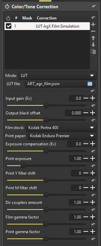

# Spectral film simulations in ART with *agx-emulsion*
*(contributed by Leopoldo Saggin)*

Recently *[arctic](https://discuss.pixls.us/u/arctic/summary)* released [***agx-emulsion***](https://github.com/andreavolpato/agx-emulsion), a physics-based simulation of color film photography processing.

[*agriggio*](https://discuss.pixls.us/u/agriggio) decided to extend **[ART](https://art.pixls.us/)** and make possible to *integrate agx-emulsion* as an additional type of **3dLUT**, similarly in concept to what is already possible with *CTL scripts*.

Here, we describe the *installation of agx-emulsion* and its *integration in ART* using **Microsoft Windows** so you can play with it, in case you are interested.

**A.** ***agx-emulsion* installation**

I was successfully to install ***agx-emulsion*** under *MS Windows*, by using [***uv***](https://github.com/astral-sh/uv).
The agx-emulsion module which I used was dated **2025-03-08**.
Please note that a previous version dated **2025-02-07** gave me *many problems* both trying to install with **uv** and a *venv* **Python**, while I did not tested *conda*.
1. Run *powershell* (as admin)
2. Inside its shell, give the following command, which you only need to execute the **first time**:  
   `powershell -ExecutionPolicy ByPass -c "irm https://astral.sh/uv/install.ps1 | iex"`
3. This way **uv** (and *uvx*) are installed in a new subdirectory of the "active" user which is:
   `C:\users\%username%\.local\bin`
   ***N.B***: Please check that command for the **uv/uvx** installation have added the directory:
   `C:\users\%username%\.local\bin`
   to the ***%username%*** *environment path*.
4. Download the ***agx-emulsion*** python module from its site, ie:
[https://github.com/andreavolpato/agx-emulsion/](https://github.com/andreavolpato/agx-emulsion/archive/refs/tags/v0.1.0-alpha.zip)
5. Move to the folder where you downloaded and *unzip/untar* it.
6. Suppose you have expanded **agx-emulsion.zip** to:
   `D:\Workspace\agx-emulsion`
7. Run a *cmd* shell (not necessarily *as admin*), move inside to the directory of the project and run **uv** to install all the requirements for *agx-emulsion*. For example:
 ```
   C:\Users\%username%\> D:
   D:\> cd Workspace\agx-emulsion
   D:\Workspace\agx-emulsion\> uv run --python 3.11 --with-requirements requirements.txt --no-project --with-editable .
```

 Please note the "**dot**" at the end of the command line which means: "*here, in this directory*".
   ***N.B.***: The execution of this command will take some time because it needs to cache all the dependencies. Luckly, you need to execute it only once!
	 
8. Now you need to test if your installation is correct. So, if you're already inside the directory:
		`D:\\Workspace\\agx-emulsion`
   use the following command to launch **agx-emulsion** *from inside* that directory:   
```
   D:\Workspace\agx-emulsion\> uv run --python 3.11 --with-requirements requirements.txt --no-project --with-editable . agx_emulsion/gui/main.py
```
	 
9. For running the above command in a more general way, if we let's assume the *agx-emulsion* is located in:
   `D:\Workspace\agx-emulsion`
   (as previously reported), then you can use the following command: 

 ```
[wherever_you_are]\> uv run --python 3.11 --with-requirements D:\Workspace\agx-emulsion\requirements.txt --no-project --with-editable D:\Workspace\agx-emulsion agx_emulsion/gui/main.py
```

**B.** ***agx-emulsion integration in ART***
1. Install *agx-emulsion* as reported above, checking it could run correctly following the given instructions. 
   In particular make sure that you can run the **GUI** from the terminal.
2. Download from:
   <https://github.com/artpixls/ART/tree/master/tools/extlut>
   the scripts ***agx_emulsion_mklut.py*** and ***ART_agx_film.json*** which are the "links" between agx-emulsion and ART as provided by *agriggio*.
3. Save both of them *in the same directory*.
4. Open with a text editor the file **ART_agx_film.json** and edit its  **line 12** to point to the *Python interpreter* you used to install ***agx-emulsion***.
5. The default content of line 12, as provided in the script by *agriggio* is: 
   `"command" : "python3 agx_emulsion_mklut.py --server",`
6. If you used **uv** and you installed **agx-emulsion** in:
   `D:\Workspace\agx-emulsion`   
   **(as reported in the example above), then you need to substitute the original line with the **following one**:   

```
   "command\" : "c:\\users\\<username>\\.local\\bin\\uv.exe run --python 3.11 --with-requirements d:\\Workspace\\agx-emulsion\\requirements.txt --no-project --with-editable d:\\Workspace\\agx-emulsion agx_emulsion_mklut.py --server",
 ```

Please also note the presence of a "**comma**" at the end of the line!

7. Now you can load **ART_agx_film.json** as a **LUT** inside the  **ART** "*Color/Tone Correction*" tool.
8. If you want a more permanent integration (and also a better positioning of the tool in the *ART pipeline*), you can set the directory where you put those two files as the "**CLUT directory**" in ART preferences.
9. For example if you put the scripts into:
`C:\Users\%username%\AppData\Local\ART\FilmSimulation`
    than you can specify the *Film Simulation* directory* *in:
   *Preferences > Image Processing > Directories > CLUT directory*		
10. At this point you can test if everything works. Open an image in ART.
11. Activate the "*Color/Tone Correction*" tool and, from its *Mode* dropdown menu select **LUT** (note that default mode is generally *Standard* or *Perceptual*)
12. The program will ask for a *LUT file*.
13. Select *ART_agx_film.json.*
14. At this point a large set of parameters appears, as reported in the image below, and you can play and choose the film simulation you wish to simulate etc\...



**Disclaimer**

All the information provided on this document is provided on an "*as-is*" basis and you agree that you use such information entirely at *your own risk*.
I give *no warranty* and accepts *no responsibility or liability for the accuracy or the completeness of the information contained in this document*. Under no circumstances I will be held responsible or liable in any way for any claims, damages, losses, expenses, costs or liabilities whatsoever (including, without limitation, any direct or indirect damages for loss of profits, business interruption or loss of information) resulting or arising directly or indirectly from your use of or inability to use this document.

Leopoldo Saggin aka **Topoldo**
[leopoldo.saggin@yahoo.com](mailto:leopoldo.saggin@yahoo.com)

Version 0.1 **15/3/2025**
