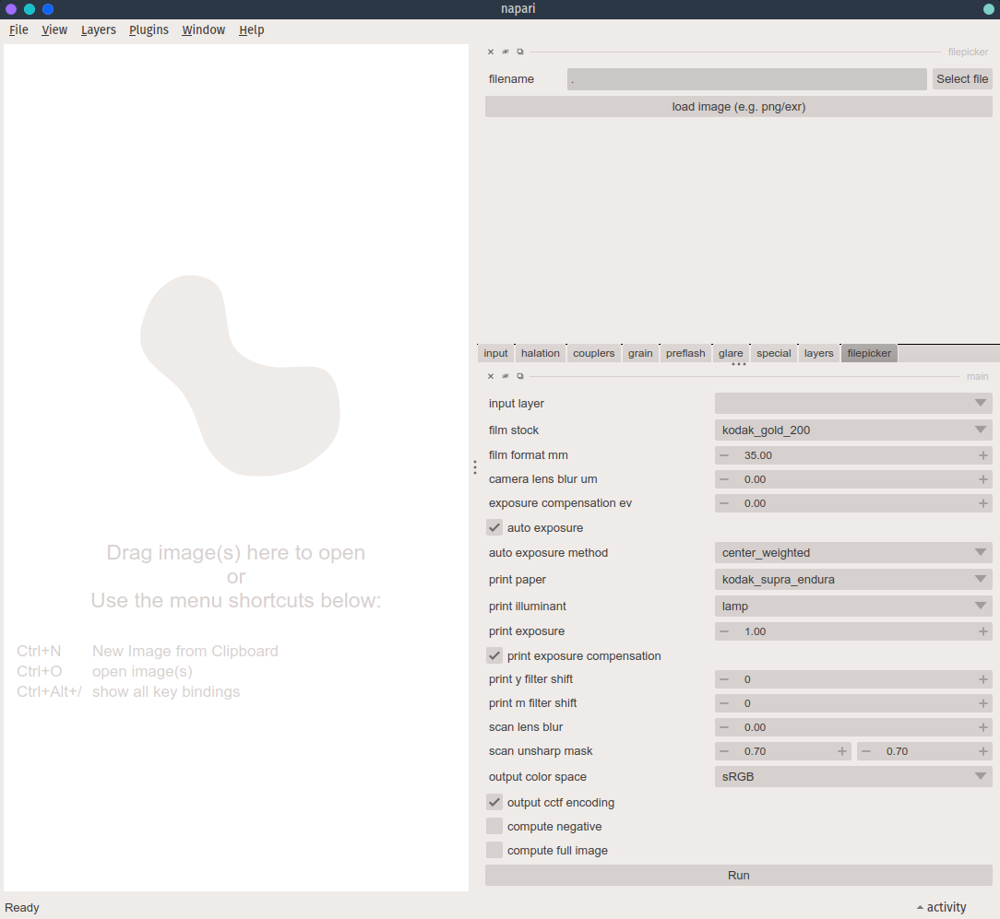
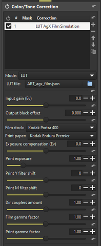

# Spectral film simulations in ART with *agx-emulsion*

*(contributed by Leopoldo Saggin and Sébastien Guyader)*

Recently [*arctic*](https://discuss.pixls.us/u/arctic/summary) released [***agx-emulsion***](https://github.com/andreavolpato/agx-emulsion), a physics-based simulation of color film photography processing.

[Alberto Griggio](https://discuss.pixls.us/u/agriggio) decided to extend [**ART**](https://art.pixls.us/) and make possible to integrate *agx-emulsion* as an additional type of **3D LUT**, similarly in concept to what is already possible with *CTL scripts*.

Here, we describe the *installation of agx-emulsion* and its *integration in ART* using **Microsoft Windows, MacOS** and **Linux** so you can play with it, in case you are interested.

Since *agx-emulsion* is written in Python, it requires a Python interpreter to be installed on your system. While the plain old *virtualenv* from [pypi.org](https://pypi.org/project/virtualenv/) can be used to control the Python version and virtual environments, this documentation will focus the use of *Miniconda* as a Python manager, as it is both light and cross-platform.

## Installing *Miniconda*

To install *Miniconda*, follow the instructions provided on the [Anaconda website](https://www.anaconda.com/docs/getting-started/miniconda/install) for the three main operating systems (Windows, MacOS and Linux). It is best to install *Miniconda* from the command line, so it gets installed for the local user (it doesn't require administrator permissions and is the most robust type of installation). This way *Miniconda* will be installed in a new sub-directory of the active user by default: `C:\%userprofile%\miniconda3` on Windows, `~/miniconda3` on MacOS and Linux.

> If you followed the instructions, after closing the shell terminal you should see `(base)` in the new command line prompt. This tells you that you’re in your *base* conda environment.

## Installing and preparing *agx-emulsion* and required Python packages

### **Dowloading the *agx-emulsion*** **code**

If you have *git* installed on your operating system, you can clone the *agx-emulsion* repository:

``` bash
git clone https://github.com/andreavolpato/agx-emulsion.git
```

Otherwise you can manually download a zip/tarball snapshot of *agx-emulsion* from its [github repository](https://github.com/andreavolpato/agx-emulsion/), and extract its content to `/path/to/local/agx-emulsion`.

### Preparing and installing *agx-emulsion*

It is recommended to install *agx-emulsion* in a virtual environment. This is achieved by typing:

``` bash
conda create -n agx-emulsion python=3.11
conda activate agx-emulsion
```

> You should see `(agx-emulsion)` in the command line prompt. This tells you that you’re now in the *agx-emulsion* conda environment.

Now install the *agx-emulsion* package:

``` bash
cd /path/to/local/agx-emulsion
pip install -e .
```

And launch the GUI:

``` bash
agx-emulsion
```

If everything went well, a window should pop up and you can experiment with *agx-emulsion*. For instance, you can load the provided test image (located in `/path/to/local/agx-emulsion/img/test`) or any image of your choice and play with the film and print emulsions to ensure the module works.



### *agx-emulsion* integration in ART

Integration of *agx-emulsion* in ART has started since [commit 22fe47d](https://github.com/artpixls/ART/commit/22fe47d2a4b5f72c7895ddd0cf7cfddaaabf3cfe) and is available since [release 1.25.3](https://github.com/artpixls/ART/releases/tag/1.25.3).

In order to use the module in ART, you need to download 2 support files (***agx_emulsion_mklut.py*** and ***ART_agx_film.json)*** from <https://github.com/artpixls/ART/tree/master/tools/extlut> and to save them *both in the same directory* of your choice. **It is crucial that both files reside in the same directory**.

***Note:*** the most convenient place to save both files is the 3D LUT directory declared in ART's **Preferences \> Image Processing \> Directories \> CLUT directory**.

***ART_agx_film.json*** is a configuration file which sets the command to run the Python script ***agx_emulsion_mklut.py***. By default the command is:

``` json
    "command" : "python3 agx_emulsion_mklut.py --server",
```

Since this command will likely vary according to your operating system and Python install environment, you need to open it with a text editor and edit **line 12** to point to the *Python interpreter* you used to install *agx-emulsion*.

If you followed the instructions above to install *uv* and Python 3.11, you will need to update this command with:

(for Windows:)

``` json
    "command" : "C:\\users\\<username>\\miniconda3\\envs\\agx-emulsion\\bin\\python3.11.exe agx_emulsion_mklut.py --server",
```

(for Linux and MacOS:)

``` json
    "command" : "/home/<username>/miniconda3/envs/agx-emulsion/bin/python3.11 agx_emulsion_mklut.py --server",
```

and save the file. Please also note the presence of a "**comma**" at the end of the line!

Now when you start ART you should be able to load ***ART_agx_film.json*** as a **LUT** from the "*Color/Tone Correction*" tool in the "Local editing" tab, or from the "*Film Simulation*" tool in the "Special Effects" tab.

At this point you can test if everything works:

1.  Open an image in ART
2.  Activate the "*Color/Tone Correction*" tool and, from its "*Mode"* dropdown menu select **LUT** (note that default mode is generally *Standard* or *Perceptual*)
3.  The program will ask for a *LUT file*
4.  Select ***ART_agx_film.json***
5.  At this point a large set of parameters appears, as reported in the image below, and you can play and choose the film simulation you wish to simulate etc...



### Updating *agx-emulsion*

In order to keep both the ***agx-emulsion*** Python code base and its support in ART up to date:

1.  update your local *agx-emulsion* repo (though *git* or by extracting a zip/tarball) and refer to the agx-emulsion installation section above to re-install it (don't forget to do this step in the *agx-emulsion* conda environment)
2.  download the ***agx_emulsion_mklut.py*** and ***ART_agx_film.json*** files from <https://github.com/artpixls/ART/tree/master/tools/extlut> again, and replace the existing files in ART's **CLUT directory** with the new ones.

**Disclaimer**

All the information provided on this document is provided on an "*as-is*" basis and you agree that you use such information entirely at *your own risk*. We give *no warranty* and accept *no responsibility or liability for the accuracy or the completeness of the information contained in this document*. Under no circumstances will we be held responsible or liable in any way for any claims, damages, losses, expenses, costs or liabilities whatsoever (including, without limitation, any direct or indirect damages for loss of profits, business interruption or loss of information) resulting or arising directly or indirectly from your use of or inability to use this document.

Leopoldo Saggin aka [**Topoldo**](https://discuss.pixls.us/u/Topoldo) and [Sébastien Guyader](https://discuss.pixls.us/u/sguyader)

Version 0.3 **2025-04-01**
