<!--  -->

# The ART Book

*Contributed by Peter Bereczky*

## Tartalomjegyzék

[Jogi információk](#00)  
[Források](#01)  
[Ajánlás](#02)  
[1\. Bevezetés](#1)  
[2\. Alapismeretek](#2)  
&nbsp;&nbsp;&nbsp;[2\.1 A nyers (raw) fájl](#21)  
&nbsp;&nbsp;&nbsp;[2\.2 Színrekonstrukció](#22)  
&nbsp;&nbsp;&nbsp;[2\.3 Nyers fekete szint, nyers fehér szint](#23)  
&nbsp;&nbsp;&nbsp;[2\.4 Színkezelés, színrendszerek](#24)  
&nbsp;&nbsp;&nbsp;&nbsp;&nbsp;&nbsp;[2\.4\.1 Kétféle keretrendszer](#241)  
&nbsp;&nbsp;&nbsp;&nbsp;&nbsp;&nbsp;[2\.4\.2 A CIE XYZ 1931 színrendszer](#242)  
&nbsp;&nbsp;&nbsp;&nbsp;&nbsp;&nbsp;[2\.4\.3 RGB színrendszer](#243)  
&nbsp;&nbsp;&nbsp;&nbsp;&nbsp;&nbsp;[2\.4\.4 CYMK színrendszer](#244)  
&nbsp;&nbsp;&nbsp;&nbsp;&nbsp;&nbsp;[2\.4\.5 HSV színrendszer](#245)  
&nbsp;&nbsp;&nbsp;&nbsp;&nbsp;&nbsp;[2\.4\.6 LCH színrendszer](#246)  
&nbsp;&nbsp;&nbsp;&nbsp;&nbsp;&nbsp;[2\.4\.7 CIELAB vagy L\*a\*b\*](#247)  
&nbsp;&nbsp;&nbsp;&nbsp;&nbsp;&nbsp;[2\.4\.8 Színezet, színkör, színárnyalat](#248)  
&nbsp;&nbsp;&nbsp;&nbsp;&nbsp;&nbsp;[2\.4\.9 Színek leírásakor, módosításakor használt fogalmak](#249)  
&nbsp;&nbsp;&nbsp;[2\.5 Árnyalatok (tónusok)](#25)  
&nbsp;&nbsp;&nbsp;[2\.6 Dinamikatartomány (árnyalatterjedelem)](#26)  
&nbsp;&nbsp;&nbsp;[2\.7 Átlátszatlanság](#27)  
&nbsp;&nbsp;&nbsp;[2\.8 Tollazat](#28)  
&nbsp;&nbsp;&nbsp;[2\.9 Wavelet dekompozíció](#29)  
&nbsp;&nbsp;&nbsp;[2\.10 Élesítési eljárások](#210)  
&nbsp;&nbsp;&nbsp;[2\.11 Zajos képek](#211)  
&nbsp;&nbsp;&nbsp;[2\.12 Műtermékek a képen](#212)  
&nbsp;&nbsp;&nbsp;[2\.13 A mid.tif kép](#213)  
&nbsp;&nbsp;&nbsp;[2\.14 Ajánlott számítógép-konfiguráció](#214)  
&nbsp;&nbsp;&nbsp;[2\.15 Milyen monitort használjunk?](#215)  
&nbsp;&nbsp;&nbsp;[2\.16 Hogyan juthatunk objektívprofilokhoz és fényképezőgép-profilokhoz?](#216)  
[3\. Az ART nyersfájl-feldolgozó program](#3)  
&nbsp;&nbsp;&nbsp;[3\.1 Áttekintés](#31)  
&nbsp;&nbsp;&nbsp;[3\.2 Az ART weboldala](#32)  
&nbsp;&nbsp;&nbsp;[3\.3 Az ART telepítése](#33)  
&nbsp;&nbsp;&nbsp;[3\.4 Roncsolásmentes feldolgozás](#34)  
&nbsp;&nbsp;&nbsp;[3\.5 Kísérőfájlok](#35)  
&nbsp;&nbsp;&nbsp;[3\.6 Az ART csővezetéke](#36)  
&nbsp;&nbsp;&nbsp;[3\.7 Az ART három alapvető nézete](#37)  
&nbsp;&nbsp;&nbsp;[3\.8 Állományböngésző](#38)  
&nbsp;&nbsp;&nbsp;&nbsp;&nbsp;&nbsp;[3\.8\.1 Az Állományböngésző felhasználói felülete](#381)  
&nbsp;&nbsp;&nbsp;&nbsp;&nbsp;&nbsp;[3\.8\.2 Bélyegképek](#382)  
&nbsp;&nbsp;&nbsp;&nbsp;&nbsp;&nbsp;[3\.8\.3 Bélyegképek frissítése](#383)  
&nbsp;&nbsp;&nbsp;&nbsp;&nbsp;&nbsp;[3\.8\.4 Helyi menü](#384)  
&nbsp;&nbsp;&nbsp;&nbsp;&nbsp;&nbsp;[3\.8\.5 Feldolgozásiprofil-műveletek](#385)  
&nbsp;&nbsp;&nbsp;&nbsp;&nbsp;&nbsp;[3\.8\.6 Munkamenetek](#386)  
&nbsp;&nbsp;&nbsp;[3\.9 Vizsgálat](#39)  
&nbsp;&nbsp;&nbsp;[3\.10 Szerkesztő](#310)  
&nbsp;&nbsp;&nbsp;&nbsp;&nbsp;&nbsp;[3\.10\.1 Előnézet](#3101)  
&nbsp;&nbsp;&nbsp;&nbsp;&nbsp;&nbsp;[3\.10\.2 Navigátor](#3102)  
&nbsp;&nbsp;&nbsp;&nbsp;&nbsp;&nbsp;[3\.10\.3 Felső eszköztár](#3103)  
&nbsp;&nbsp;&nbsp;&nbsp;&nbsp;&nbsp;[3\.10\.4 Hisztogram](#3104)  
&nbsp;&nbsp;&nbsp;&nbsp;&nbsp;&nbsp;&nbsp;&nbsp;&nbsp;[3\.10\.4\.1 Hisztogram](#31041)  
&nbsp;&nbsp;&nbsp;&nbsp;&nbsp;&nbsp;&nbsp;&nbsp;&nbsp;[3\.10\.4\.2 A kép és hisztogramja](#31042)  
&nbsp;&nbsp;&nbsp;&nbsp;&nbsp;&nbsp;&nbsp;&nbsp;&nbsp;[3\.10\.4\.3 Az előnézet, a Navigátor és a Hisztogram együttműködése](#31043)  
&nbsp;&nbsp;&nbsp;&nbsp;&nbsp;&nbsp;&nbsp;&nbsp;&nbsp;[3\.10\.4\.4 A vágás okának megállapítása](#31044)  
&nbsp;&nbsp;&nbsp;&nbsp;&nbsp;&nbsp;&nbsp;&nbsp;&nbsp;[3\.10\.4\.5 Hullámforma diagram](#31045)  
&nbsp;&nbsp;&nbsp;&nbsp;&nbsp;&nbsp;&nbsp;&nbsp;&nbsp;[3\.10\.4\.6 Vektornézet diagramok](#31046)  
&nbsp;&nbsp;&nbsp;&nbsp;&nbsp;&nbsp;[3\.10\.5 Feldolgozási profilok panel](#3105)  
&nbsp;&nbsp;&nbsp;&nbsp;&nbsp;&nbsp;[3\.10\.6 Szerkesztőeszközök csoportjai](#3106)  
&nbsp;&nbsp;&nbsp;&nbsp;&nbsp;&nbsp;[3\.10\.7 Szerkesztőeszközök fejléce](#3107)  
&nbsp;&nbsp;&nbsp;&nbsp;&nbsp;&nbsp;[3\.10\.8 Előzmények](#3108)  
&nbsp;&nbsp;&nbsp;&nbsp;&nbsp;&nbsp;[3\.10\.9 Pillanatképek](#3109)  
&nbsp;&nbsp;&nbsp;&nbsp;&nbsp;&nbsp;[3\.10\.10 Filmszalag](#31010)  
&nbsp;&nbsp;&nbsp;&nbsp;&nbsp;&nbsp;[3\.10\.11 Alsó eszköztár](#31011)  
&nbsp;&nbsp;&nbsp;[3\.11 Feldolgozási sor](#311)  
&nbsp;&nbsp;&nbsp;[3\.12 Feldolgozási profilok](#312)  
&nbsp;&nbsp;&nbsp;[3\.13 Feldolgozási profilok készítése](#313)  
&nbsp;&nbsp;&nbsp;&nbsp;&nbsp;&nbsp;[3\.13\.1 Alapértelmezett feldolgozási profil készítése](#3131)  
&nbsp;&nbsp;&nbsp;&nbsp;&nbsp;&nbsp;[3\.13\.2 Képek átméretezése](#3132)  
&nbsp;&nbsp;&nbsp;&nbsp;&nbsp;&nbsp;[3\.13\.3 Képfájl mellé mentett feldolgozási profil alkalmazása](#3133)  
&nbsp;&nbsp;&nbsp;[3\.14 Csúszkák, görbeszerkesztők](#314)  
&nbsp;&nbsp;&nbsp;&nbsp;&nbsp;&nbsp;[3\.14\.1 Csúszkák](#3141)  
&nbsp;&nbsp;&nbsp;&nbsp;&nbsp;&nbsp;[3\.14\.2 Görbeszerkesztők](#3142)  
&nbsp;&nbsp;&nbsp;&nbsp;&nbsp;&nbsp;&nbsp;&nbsp;&nbsp;[3\.14\.2\.1 Tónusgörbe-szerkesztő](#31421)  
&nbsp;&nbsp;&nbsp;&nbsp;&nbsp;&nbsp;&nbsp;&nbsp;&nbsp;[3\.14\.2\.2 S-görbe](#31422)  
&nbsp;&nbsp;&nbsp;&nbsp;&nbsp;&nbsp;&nbsp;&nbsp;&nbsp;[3\.14\.2\.3 Kiegyenlítőgörbe-szerkesztő](#31423)  
&nbsp;&nbsp;&nbsp;&nbsp;&nbsp;&nbsp;&nbsp;&nbsp;&nbsp;[3\.14\.2\.4 Küszöbgörbe-szerkesztő](#31424)  
&nbsp;&nbsp;&nbsp;[3\.15 CTL szkriptek az ART-ban](#315)  
&nbsp;&nbsp;&nbsp;[3\.16 Az ART alapvető munkafolyamata](#316)  
&nbsp;&nbsp;&nbsp;[3\.17 A Szerkesztő nézet gyorsbillentyűi](#317)  
[4\. Az ART szerkesztőeszközei eszközcsoportok szerint](#4)  
&nbsp;&nbsp;&nbsp;[4\.1 Expozíció eszközcsoport](#41)  
&nbsp;&nbsp;&nbsp;&nbsp;&nbsp;&nbsp;[4\.1\.1 Expozíció](#411)  
&nbsp;&nbsp;&nbsp;&nbsp;&nbsp;&nbsp;&nbsp;&nbsp;&nbsp;[4\.1\.1\.1 Kiégett terület befedése színterjesztéssel](#4111)  
&nbsp;&nbsp;&nbsp;&nbsp;&nbsp;&nbsp;[4\.1\.2 Tónuskiegyenlítő](#412)  
&nbsp;&nbsp;&nbsp;&nbsp;&nbsp;&nbsp;[4\.1\.3 Tónusgörbék](#413)  
&nbsp;&nbsp;&nbsp;&nbsp;&nbsp;&nbsp;[4\.1\.4 Dinamikus tartomány tömörítése](#414)  
&nbsp;&nbsp;&nbsp;&nbsp;&nbsp;&nbsp;[4\.1\.5 Logaritmikus tónusleképezés](#415)  
&nbsp;&nbsp;&nbsp;[4\.2 Részletek eszközcsoport](#42)  
&nbsp;&nbsp;&nbsp;&nbsp;&nbsp;&nbsp;[4\.2\.1 Folt eltávolítása](#421)  
&nbsp;&nbsp;&nbsp;&nbsp;&nbsp;&nbsp;[4\.2\.2 Élesítés](#422)  
&nbsp;&nbsp;&nbsp;&nbsp;&nbsp;&nbsp;&nbsp;&nbsp;&nbsp;[4\.2\.2\.1 Életlen maszk módszer](#4221)  
&nbsp;&nbsp;&nbsp;&nbsp;&nbsp;&nbsp;&nbsp;&nbsp;&nbsp;[4\.2\.2\.2 RL Dekonvolúció módszer](#4222)  
&nbsp;&nbsp;&nbsp;&nbsp;&nbsp;&nbsp;&nbsp;&nbsp;&nbsp;[4\.2\.2\.3 Egyedi RL Dekonvolúció módszer](#4223)  
&nbsp;&nbsp;&nbsp;&nbsp;&nbsp;&nbsp;[4\.2\.3 Zajcsökkentés](#423)  
&nbsp;&nbsp;&nbsp;&nbsp;&nbsp;&nbsp;&nbsp;&nbsp;&nbsp;[4\.2\.3\.1 Világosságzaj](#4231)  
&nbsp;&nbsp;&nbsp;&nbsp;&nbsp;&nbsp;&nbsp;&nbsp;&nbsp;[4\.2\.3\.2 Színzaj](#4232)  
&nbsp;&nbsp;&nbsp;&nbsp;&nbsp;&nbsp;&nbsp;&nbsp;&nbsp;[4\.2\.3\.3 Végső simítások](#)  
&nbsp;&nbsp;&nbsp;&nbsp;&nbsp;&nbsp;[4\.2\.4 Impulzuszaj csökkentése](#424)  
&nbsp;&nbsp;&nbsp;&nbsp;&nbsp;&nbsp;[4\.2\.5 Színhibajavítás (defringe)](#425)  
&nbsp;&nbsp;&nbsp;[4\.3 Színek eszközcsoport](#43)  
&nbsp;&nbsp;&nbsp;&nbsp;&nbsp;&nbsp;[4\.3\.1 Fehéregyensúly](#431)  
&nbsp;&nbsp;&nbsp;&nbsp;&nbsp;&nbsp;[4\.3\.2 Telítettség/Élénkség](#432)  
&nbsp;&nbsp;&nbsp;&nbsp;&nbsp;&nbsp;[4\.3\.3 Csatornakeverő](#433)  
&nbsp;&nbsp;&nbsp;&nbsp;&nbsp;&nbsp;&nbsp;&nbsp;&nbsp;[4\.3\.3\.1 RGB mátrix](#4331)  
&nbsp;&nbsp;&nbsp;&nbsp;&nbsp;&nbsp;&nbsp;&nbsp;&nbsp;[4\.3\.3\.2 Elsődleges színek korrekciója](#4332)  
&nbsp;&nbsp;&nbsp;&nbsp;&nbsp;&nbsp;[4\.3\.4 Színkiegyenlítő](#434)  
&nbsp;&nbsp;&nbsp;&nbsp;&nbsp;&nbsp;[4\.3\.5 RGB görbék](#435)  
&nbsp;&nbsp;&nbsp;&nbsp;&nbsp;&nbsp;[4\.3\.6 L\*a\*b\* korrekciók](#436)  
&nbsp;&nbsp;&nbsp;&nbsp;&nbsp;&nbsp;[4\.3\.7 Színkezelés](#437)  
&nbsp;&nbsp;&nbsp;[4\.4 Helyi szerkesztés eszközcsoport](#44)  
&nbsp;&nbsp;&nbsp;&nbsp;&nbsp;&nbsp;[4\.4\.1 Maszkok áttekintése](#441)  
&nbsp;&nbsp;&nbsp;&nbsp;&nbsp;&nbsp;&nbsp;&nbsp;&nbsp;[4\.4\.1\.1 Korrekciós rétegek](#4411)  
&nbsp;&nbsp;&nbsp;&nbsp;&nbsp;&nbsp;&nbsp;&nbsp;&nbsp;[4\.4\.1\.2 Maszkok](#4412)  
&nbsp;&nbsp;&nbsp;&nbsp;&nbsp;&nbsp;&nbsp;&nbsp;&nbsp;[4\.4\.1\.3 Parametrikus maszk](#4413)  
&nbsp;&nbsp;&nbsp;&nbsp;&nbsp;&nbsp;&nbsp;&nbsp;&nbsp;[4\.4\.1\.4 Színbeli hasonlóság maszk](#4414)  
&nbsp;&nbsp;&nbsp;&nbsp;&nbsp;&nbsp;&nbsp;&nbsp;&nbsp;[4\.4\.1\.5 Területmaszk](#4415)  
&nbsp;&nbsp;&nbsp;&nbsp;&nbsp;&nbsp;&nbsp;&nbsp;&nbsp;&nbsp;&nbsp;&nbsp;[4\.4\.1\.5\.1 Téglalap hozzáadása, szerkesztése](#44151)  
&nbsp;&nbsp;&nbsp;&nbsp;&nbsp;&nbsp;&nbsp;&nbsp;&nbsp;&nbsp;&nbsp;&nbsp;[4\.4\.1\.5\.2 Sokszög hozzáadása, szerkesztése](#44152)  
&nbsp;&nbsp;&nbsp;&nbsp;&nbsp;&nbsp;&nbsp;&nbsp;&nbsp;&nbsp;&nbsp;&nbsp;[4\.4\.1\.5\.3 Átmenet hozzáadása, szerkesztése](#44153)  
&nbsp;&nbsp;&nbsp;&nbsp;&nbsp;&nbsp;&nbsp;&nbsp;&nbsp;&nbsp;&nbsp;&nbsp;[4\.4\.1\.5\.4 Területmaszk a kép határain kívül](#44154)  
&nbsp;&nbsp;&nbsp;&nbsp;&nbsp;&nbsp;&nbsp;&nbsp;&nbsp;&nbsp;&nbsp;&nbsp;[4\.4\.1\.5\.5 Területmaszkon kívüli terület kizárása a maszkból](#44155)  
&nbsp;&nbsp;&nbsp;&nbsp;&nbsp;&nbsp;&nbsp;&nbsp;&nbsp;[4\.4\.1\.6 Ecsetmaszk](#4416)  
&nbsp;&nbsp;&nbsp;&nbsp;&nbsp;&nbsp;&nbsp;&nbsp;&nbsp;&nbsp;&nbsp;&nbsp;[4\.4\.1\.6\.1 Felesleges maszkrészek eltüntetése Fordított maszk esetén](#44161)  
&nbsp;&nbsp;&nbsp;&nbsp;&nbsp;&nbsp;&nbsp;&nbsp;&nbsp;[4\.4\.1\.7 Maszk utófeldolgozás](#4417)  
&nbsp;&nbsp;&nbsp;&nbsp;&nbsp;&nbsp;&nbsp;&nbsp;&nbsp;[4\.4\.1\.8 Műveletek maszkokkal](#4418)  
&nbsp;&nbsp;&nbsp;&nbsp;&nbsp;&nbsp;&nbsp;&nbsp;&nbsp;[4\.4\.1\.9 Az eredő maszk létrehozása](#4419)  
&nbsp;&nbsp;&nbsp;&nbsp;&nbsp;&nbsp;&nbsp;&nbsp;&nbsp;[4\.4\.1\.10 Maszkokkal kapcsolatos óvintézkedések](#44110)  
&nbsp;&nbsp;&nbsp;&nbsp;&nbsp;&nbsp;&nbsp;&nbsp;&nbsp;[4\.4\.1\.11 A csővezeték hatása a maszkokra](#44111)  
&nbsp;&nbsp;&nbsp;&nbsp;&nbsp;&nbsp;&nbsp;&nbsp;&nbsp;&nbsp;&nbsp;&nbsp;[4\.4\.1\.11\.1 Különböző maszkok azonos szerkesztőeszközön belül](#441111)  
&nbsp;&nbsp;&nbsp;&nbsp;&nbsp;&nbsp;&nbsp;&nbsp;&nbsp;&nbsp;&nbsp;&nbsp;[4\.4\.1\.11\.2 Maszkok másolása a Helyi szerkesztés eszközei között](#441112)  
&nbsp;&nbsp;&nbsp;&nbsp;&nbsp;&nbsp;[4\.4\.2 Szín/Tónus korrekció](#442)  
&nbsp;&nbsp;&nbsp;&nbsp;&nbsp;&nbsp;&nbsp;&nbsp;&nbsp;[4\.4\.2\.1 Standard és Észlelési](#4421)  
&nbsp;&nbsp;&nbsp;&nbsp;&nbsp;&nbsp;&nbsp;&nbsp;&nbsp;[4\.4\.2\.2 RGB csatornánként külön](#4422)  
&nbsp;&nbsp;&nbsp;&nbsp;&nbsp;&nbsp;&nbsp;&nbsp;&nbsp;[4\.4\.2\.3 HSL tényezők](#4423)  
&nbsp;&nbsp;&nbsp;&nbsp;&nbsp;&nbsp;&nbsp;&nbsp;&nbsp;[4\.4\.2\.4 LUT](#4424)  
&nbsp;&nbsp;&nbsp;&nbsp;&nbsp;&nbsp;&nbsp;&nbsp;&nbsp;[4\.4\.2\.5 Általánosított hiperbolikus nyújtás CTL szkript](#4425)  
&nbsp;&nbsp;&nbsp;&nbsp;&nbsp;&nbsp;&nbsp;&nbsp;&nbsp;[4\.4\.2\.6 Árnyékok kiemelése CTL szkript](#4426)  
&nbsp;&nbsp;&nbsp;&nbsp;&nbsp;&nbsp;&nbsp;&nbsp;&nbsp;[4\.4\.2\.7 ART kimenet átalakítása CTL szkript](#4427)  
&nbsp;&nbsp;&nbsp;&nbsp;&nbsp;&nbsp;&nbsp;&nbsp;&nbsp;[4\.4\.2\.8 Csatornakeverő CTL szkript](#4428)  
&nbsp;&nbsp;&nbsp;&nbsp;&nbsp;&nbsp;&nbsp;&nbsp;&nbsp;[4\.4\.2\.9 Egyszerűen felosztott tónusváltoztatás CTL szkript](#4429)  
&nbsp;&nbsp;&nbsp;&nbsp;&nbsp;&nbsp;&nbsp;&nbsp;&nbsp;[4\.4\.2\.10 Expozíció-kompenzáció CTL szkript](#44210)  
&nbsp;&nbsp;&nbsp;&nbsp;&nbsp;&nbsp;&nbsp;&nbsp;&nbsp;[4\.4\.2\.11 Fehéregyensúly és elsődleges színek korrekciója CTL szkript](#44211)  
&nbsp;&nbsp;&nbsp;&nbsp;&nbsp;&nbsp;&nbsp;&nbsp;&nbsp;[4\.4\.2\.12 Fekete-fehér keverő CTL szkript](#44212)  
&nbsp;&nbsp;&nbsp;&nbsp;&nbsp;&nbsp;&nbsp;&nbsp;&nbsp;[4\.4\.2\.13 Filmfedettség CTL szkript](#44213)  
&nbsp;&nbsp;&nbsp;&nbsp;&nbsp;&nbsp;&nbsp;&nbsp;&nbsp;[4\.4\.2\.14 Gamma/Lejtés CTL szkript](#44214)  
&nbsp;&nbsp;&nbsp;&nbsp;&nbsp;&nbsp;&nbsp;&nbsp;&nbsp;[4\.4\.2\.15 Kiegyenlítő CTL szkriptek](#44215)  
&nbsp;&nbsp;&nbsp;&nbsp;&nbsp;&nbsp;&nbsp;&nbsp;&nbsp;[4\.4\.2\.16 Kivonó színkeverés CTL szkript](#44216)  
&nbsp;&nbsp;&nbsp;&nbsp;&nbsp;&nbsp;&nbsp;&nbsp;&nbsp;[4\.4\.2\.17 Lágy fény CTL szkript](#44217)  
&nbsp;&nbsp;&nbsp;&nbsp;&nbsp;&nbsp;&nbsp;&nbsp;&nbsp;[4\.4\.2\.18 Poszterizáció CTL szkript](#44218)  
&nbsp;&nbsp;&nbsp;&nbsp;&nbsp;&nbsp;&nbsp;&nbsp;&nbsp;[4\.4\.2\.19 Színezés fényerő szerint CTL szkript](#44219)  
&nbsp;&nbsp;&nbsp;&nbsp;&nbsp;&nbsp;&nbsp;&nbsp;&nbsp;[4\.4\.2\.20 Színegyensúly RGB CTL szkript](#44220)  
&nbsp;&nbsp;&nbsp;&nbsp;&nbsp;&nbsp;&nbsp;&nbsp;&nbsp;[4\.4\.2\.21 Színkeverés CTL szkript](#44221)  
&nbsp;&nbsp;&nbsp;&nbsp;&nbsp;&nbsp;&nbsp;&nbsp;&nbsp;[4\.4\.2\.22 Színtartomány tömörítése CTL szkript](#44222)  
&nbsp;&nbsp;&nbsp;&nbsp;&nbsp;&nbsp;&nbsp;&nbsp;&nbsp;[4\.4\.2\.23 Tetraéderes színátalakítás (HSL) CTL szkript](#44223)  
&nbsp;&nbsp;&nbsp;&nbsp;&nbsp;&nbsp;&nbsp;&nbsp;&nbsp;[4\.4\.2\.24 Tetraéderes színátalakítás (RGB) CTL szkript](#44224)  
&nbsp;&nbsp;&nbsp;&nbsp;&nbsp;&nbsp;&nbsp;&nbsp;&nbsp;[4\.4\.2\.25 Tónusgörbe CTL szkript](#44225)  
&nbsp;&nbsp;&nbsp;&nbsp;&nbsp;&nbsp;[4\.4\.3 Simítás](#443)  
&nbsp;&nbsp;&nbsp;&nbsp;&nbsp;&nbsp;&nbsp;&nbsp;&nbsp;[4\.4\.3\.1 Irányított](#4431)  
&nbsp;&nbsp;&nbsp;&nbsp;&nbsp;&nbsp;&nbsp;&nbsp;&nbsp;[4\.4\.3\.2 Gauss](#4432)  
&nbsp;&nbsp;&nbsp;&nbsp;&nbsp;&nbsp;&nbsp;&nbsp;&nbsp;[4\.4\.3\.3 Ragyogás](#4433)  
&nbsp;&nbsp;&nbsp;&nbsp;&nbsp;&nbsp;&nbsp;&nbsp;&nbsp;[4\.4\.3\.4 Nem helyi eszközök](#4434)  
&nbsp;&nbsp;&nbsp;&nbsp;&nbsp;&nbsp;&nbsp;&nbsp;&nbsp;[4\.4\.3\.5 Wavelets](#4435)  
&nbsp;&nbsp;&nbsp;&nbsp;&nbsp;&nbsp;&nbsp;&nbsp;&nbsp;[4\.4\.3\.6 Bemozdulásos elmosódás](#4436)  
&nbsp;&nbsp;&nbsp;&nbsp;&nbsp;&nbsp;&nbsp;&nbsp;&nbsp;[4\.4\.3\.7 Objektív elmosása](#4437)  
&nbsp;&nbsp;&nbsp;&nbsp;&nbsp;&nbsp;&nbsp;&nbsp;&nbsp;[4\.4\.3\.8 Zaj hozzáadása](#4438)  
&nbsp;&nbsp;&nbsp;&nbsp;&nbsp;&nbsp;&nbsp;&nbsp;&nbsp;[4\.4\.3\.9 Fényudvar](#4439)  
&nbsp;&nbsp;&nbsp;&nbsp;&nbsp;&nbsp;[4\.4\.4 Helyi kontraszt](#444)  
&nbsp;&nbsp;&nbsp;&nbsp;&nbsp;&nbsp;[4\.4\.5 Textúra kiemelése/Élesítés](#445)  
&nbsp;&nbsp;&nbsp;[4\.5 Különleges hatások eszközcsoport](#45)  
&nbsp;&nbsp;&nbsp;&nbsp;&nbsp;&nbsp;[4\.5\.1 Fekete-fehér](#451)  
&nbsp;&nbsp;&nbsp;&nbsp;&nbsp;&nbsp;[4\.5\.2 Filmszimuláció](#452)  
&nbsp;&nbsp;&nbsp;&nbsp;&nbsp;&nbsp;&nbsp;&nbsp;&nbsp;[4\.5\.2\.1 Szigmoid tónusleképező CTL szkript](#4521)  
&nbsp;&nbsp;&nbsp;&nbsp;&nbsp;&nbsp;[4\.5\.3 Lágy fény](#453)  
&nbsp;&nbsp;&nbsp;&nbsp;&nbsp;&nbsp;[4\.5\.4 Peremsötétedés szűrő](#454)  
&nbsp;&nbsp;&nbsp;&nbsp;&nbsp;&nbsp;[4\.5\.5 Átmenetes szűrő](#455)  
&nbsp;&nbsp;&nbsp;&nbsp;&nbsp;&nbsp;[4\.5\.6 Homály eltávolítása](#456)  
&nbsp;&nbsp;&nbsp;&nbsp;&nbsp;&nbsp;[4\.5\.7 Filmszemcse](#457)  
&nbsp;&nbsp;&nbsp;&nbsp;&nbsp;&nbsp;[4\.5\.8 Filmnegatív](#458)  
&nbsp;&nbsp;&nbsp;[4\.6 Átalakítás eszközcsoport](#46)  
&nbsp;&nbsp;&nbsp;&nbsp;&nbsp;&nbsp;[4\.6\.1 Kivágás](#461)  
&nbsp;&nbsp;&nbsp;&nbsp;&nbsp;&nbsp;[4\.6\.2 Átméretezés](#462)  
&nbsp;&nbsp;&nbsp;&nbsp;&nbsp;&nbsp;[4\.6\.3 Kimenet élesítése](#463)  
&nbsp;&nbsp;&nbsp;&nbsp;&nbsp;&nbsp;[4\.6\.4 Geometria alcsoport](#464)  
&nbsp;&nbsp;&nbsp;&nbsp;&nbsp;&nbsp;&nbsp;&nbsp;&nbsp;[4\.6\.4\.1 Forgatás](#4641)  
&nbsp;&nbsp;&nbsp;&nbsp;&nbsp;&nbsp;&nbsp;&nbsp;&nbsp;[4\.6\.4\.2 Perspektívakorrekció](#4642)  
&nbsp;&nbsp;&nbsp;&nbsp;&nbsp;&nbsp;[4\.6\.5 Objektív alcsoport](#465)  
&nbsp;&nbsp;&nbsp;&nbsp;&nbsp;&nbsp;&nbsp;&nbsp;&nbsp;[4\.6\.5\.1 Profilozott objektívkorrekció](#4651)  
&nbsp;&nbsp;&nbsp;&nbsp;&nbsp;&nbsp;&nbsp;&nbsp;&nbsp;[4\.6\.5\.2 Torzításkorrekció](#4652)  
&nbsp;&nbsp;&nbsp;&nbsp;&nbsp;&nbsp;&nbsp;&nbsp;&nbsp;[4\.6\.5\.3 Kromatikusaberráció-korrekció](#4653)  
&nbsp;&nbsp;&nbsp;&nbsp;&nbsp;&nbsp;&nbsp;&nbsp;&nbsp;[4\.6\.5\.4 Peremsötétedés-korrekció](#4654)  
&nbsp;&nbsp;&nbsp;[4\.7 Raw eszközcsoport](#47)  
&nbsp;&nbsp;&nbsp;&nbsp;&nbsp;&nbsp;[4\.7\.1 Érzékelő Bayer Mátrixszal alcsoport](#471)  
&nbsp;&nbsp;&nbsp;&nbsp;&nbsp;&nbsp;&nbsp;&nbsp;&nbsp;[4\.7\.1\.1 Színrekonstrukció](#4711)  
&nbsp;&nbsp;&nbsp;&nbsp;&nbsp;&nbsp;&nbsp;&nbsp;&nbsp;[4\.7\.1\.2 Raw fekete pontok](#4712)  
&nbsp;&nbsp;&nbsp;&nbsp;&nbsp;&nbsp;&nbsp;&nbsp;&nbsp;[4\.7\.1\.3 Előfeldolgozás](#4713)  
&nbsp;&nbsp;&nbsp;&nbsp;&nbsp;&nbsp;&nbsp;&nbsp;&nbsp;[4\.7\.1\.4 Kromatikusaberráció-korrekció](#4714)  
&nbsp;&nbsp;&nbsp;&nbsp;&nbsp;&nbsp;[4\.7\.2 Érzékelő X-Trans Mátrixszal alcsoport](#472)  
&nbsp;&nbsp;&nbsp;&nbsp;&nbsp;&nbsp;&nbsp;&nbsp;&nbsp;[4\.7\.2\.1 Színrekonstrukció](#4721)  
&nbsp;&nbsp;&nbsp;&nbsp;&nbsp;&nbsp;&nbsp;&nbsp;&nbsp;[4\.7\.2\.2 Raw fekete pontok](#4722)  
&nbsp;&nbsp;&nbsp;&nbsp;&nbsp;&nbsp;[4\.7\.3 Raw Nyereség/Fehér pont](#473)  
&nbsp;&nbsp;&nbsp;&nbsp;&nbsp;&nbsp;[4\.7\.4 Előfeldolgozás](#474)  
&nbsp;&nbsp;&nbsp;&nbsp;&nbsp;&nbsp;[4\.7\.5 Dark-Frame](#475)  
&nbsp;&nbsp;&nbsp;&nbsp;&nbsp;&nbsp;[4\.7\.6 Flat-Field](#476)  
&nbsp;&nbsp;&nbsp;[4\.8 Metaadat eszközcsoport](#48)  
[5\. Végszó](#5)

#  Jogi információk

Ez a könyv szerzői jogvédelem alatt áll. Felhasználása kizárólag a Creative Commons CC BY-NC-SA 4.0 (Creative Commons Nevezd meg! - Ne add el! - Így add tovább! 4.0) Nemzetközi Licenc feltételeinek megfelelően engedélyezett.

https://creativecommons.org/licenses/by-nc-sa/4.0/deed.hu

[Creative Commons CC BY-NC-SA 4.0](https://creativecommons.org/licenses/by-nc-sa/4.0/)

A könyv címe: Az ART nyersfájl-feldolgozó program

Copyright Bereczky Péter, 2025

Második javított, bővített kiadás, 2025

Címlapfotó: Jit Roy fotója a Pexels oldaláról

Ez a könyv az ART 1.25.3, és a CTL szkriptek 1.2 változata alapján készült.

A könyvben látható nyers fájlok ("képek") forrása (innen tölthetők le): [signatureedits.com](https://www.signatureedits.com/free-raw-photos/). Ahol ettől eltérek, azt külön jelzem.

#  Források

[ART dokumentáció](https://art.pixls.us/Documentation.html)

[RawTherapee - RawPedia](https://rawpedia.rawtherapee.com/Main_Page)

[ART fórum](https://discuss.pixls.us/c/software/ART)

[CTL szkriptek gyűjteménye](https://github.com/artpixls/ART-ctlscripts/)

[darktable felhasználói kézikönyv](https://docs.darktable.org/usermanual/4.6/en/)

#  Ajánlás

*Ezt a könyvet páromnak, Nánási Katalinnak,  
és gyermekeinknek, Eszternek és Gábornak ajánlom.*

#  1\. Bevezetés

Aki komolyabban szeretne fotózni, az szembesül a képek utólagos feldolgozásának szükségességével. Enélkül sehogyan sem lesz olyan a kép, amellyel készítője elégedett lenne. Érzelemre ható képeket szeretnénk készíteni, és ezt egyebek mellett utófeldolgozással érhetjük el. Az utófeldolgozás szükségessége pedig maga után vonja a nyers (raw) formátumban történő fényképezést. Csak így lesz lehetőségünk jelentősebben módosítani képünkön, JPEG formátumban ezt nem lehet megtenni.

Ez a könyv az ART nyersfájl-feldolgozó programról szól, amelyet Alberto Griggio programozó hozott létre a RawTherapee kódjából kiindulva. Az ART szabadon használható, nyílt forráskódú, Windows, Linux, és macOS platformon futó, többféle (köztük magyar) nyelvű felhasználói felülettel is rendelkező program. Fő célja nyers fájlok feldolgozásával kiváló minőségű képfájlok előállítása. Képfájlok (pl. JPEG, PNG, TIFF stb.) is módosíthatók segítségével.

Az ART a legkönnyebben tanulható program a hasonló célra szolgáló, nagy tudású, szabadon használható programok (ART, darktable, RawTherapee) közül. Igen hatékony szerkesztőeszközöket tartalmaz, nagyszerű lehetőségekkel. Maszkok alkalmazásával a kép bizonyos területeit is módosíthatjuk, nemcsak csak a teljes képet. CTL szkripteket is alkalmazhatunk, amelyek nagymértékben megnöveli az ART funkcionalitását. Az ART-tal kiváló minőségű képeket hozhatunk létre. Az ART képes a legtöbb fotós igényét teljes mértékben kielégíteni.

Az ART és egyéb hasonló programok nagyon összetettek, ezért megtanulásuk nem túl könnyű. A nyers adatok feldolgozása nem egyszerű. Csak akkor lehetünk eredményesek, ha rászánjuk a megfelelő mennyiségű munkát és időt.

Reményeim szerint könyvem segít a kezdőknek az elindulásban, valamint haladó felhasználók számára is hasznos olvasmány lesz, és az ART használatával sikerélményben lesz részük.

Nagy köszönettel tartozom páromnak, Nánási Katalinnak, aki felnőtt életem során a társam volt, és aki jelentős mértékben támogatta, hogy ez a könyv elkészülhessen.

A könyvben szereplő írások, képek szerzői jogvédelem alatt állnak, felhasználásukhoz kérem, olvassa el a fentebb található licencfeltételeket.

Azért készítettem el ezt a könyvet, mert szerettem volna valamit örökül hagyni az embereknek, akiktől oly sok szépet és jót (is) kaptam. 

Igyekeztem a lehető legnagyobb gondossággal eljárni, ennek ellenére előfordulhatnak hibák. Ezért Olvasóim elnézését kérem.

A szerző

#  2\. Alapismeretek

A nyers fájlok feldolgozásához az alapfogalmakkal tisztában kell lennünk. Úgy nem lehet eredményesen szerkeszteni, hogy közben azt se tudjuk, hogy mit csinálunk. Ez a fejezet az alapfogalmakról szól.

Nincs mindig szükség utófeldolgozásra. Ha nincsenek magas elvárásaink a képpel szemben, akkor felesleges lehet. Például emlékképek, családi fotók esetén nem feltétlenül szükséges, megfelelő lehet a fényképezőgép által készített JPEG kép is. Bizonyos mértékben a fényképezőgép is lehetőséget biztosít a megfelelő képstílus beállításával a kép bizonyos tulajdonságainak befolyásolására.

A számítógépes program nem csodaszer. Jó eredményt csak pontos munkával remélhetünk.

A nyers adatokat tartalmazó állomány nem kép, hanem adatok halmaza, azonban az egyszerűség kedvéért (másokhoz hasonlóan) a "kép" kifejezést is fogom használni helyette. De tudnunk kell, hogy ez nem pontos meghatározás. Nem fogom mindig külön hangsúlyozni, hogy például megnyitjuk szerkesztésre a képfájlt vagy a nyers fájlt. Ehelyett azt írom, hogy megnyitjuk a képet szerkesztésre.

Fontos megértenünk, hogy az ART nem általános képszerkesztő program, mint például a GIMP vagy a Photoshop, hanem teljesen más a funkciója. Nyers adatokat tartalmazó állományok (és nem elsősorban képfájlok, mint például JPEG, PNG, TIFF) feldolgozására szolgál. Azonban fel lehet vele dolgozni képfájlokat is.

##  2\.1 A nyers (raw) fájl

A raw nem mozaikszó, hanem angolul nyerset jelent, ezért nem kellene csupa nagybetűvel írni. A helyes írásmód raw lenne. Legtöbbször azonban a RAW írásmóddal találkozhatunk.

Minden fényképezőgép alkalmas JPEG formátumban történő fényképezésre, napjainkban ez a leginkább elterjedt képformátum. Nagyon sokféle fényképezőgéppel fényképezhetünk nyers formátumban, gyakorlatilag az összes cserélhető objektíves fényképezőgéppel, és sok egyéb fényképezőgéppel is. Tájékozódjunk a lehetőségekről fényképezőgépünk felhasználói kézikönyvében. Az arra alkalmas fényképezőgépek menüjében, általában a képminőség menüpontban választhatjuk ki a nyers formátumban történő fényképezést. Választhatjuk a RAW lehetőséget, amikor a fényképezőgép csak nyers formátumú fájlt hoz létre a memóriakártyán, és nem készít JPEG képet. A másik lehetőség a RAW + JPEG lehetőség választása, amikor a nyers fájl mellett létrehozza az általában legjobb minőségű JPEG képet is.

A digitális fényképezőgépben a képérzékelő egy fényre érzékeny alkatrész, erre vetíti az objektív a képet. A rá vetített képet a képérzékelő pici pontokra, úgynevezett képpontokra (más néven pixelekre) bontja. A képpontok együttese alkotja a digitális képet. A képpontokra bontás érdekében a képérzékelő felületén (a legtöbb esetben) négyzetrács-szerűen kis elemi érzékelők helyezkednek el. Mintha egy iskolai "kockás" füzetet néznénk, és minden egyes négyzetben lenne egy-egy elemi érzékelő. Az elemi érzékelők sorokba és oszlopokba vannak rendezve. A fenti ábrán a nyíl egy elemi érzékelőre mutat. A valóságban az elemi érzékelők nagyon picik, szabad szemmel nem is láthatók, számuk több millió. Kissé egyszerűsítve azt mondhatjuk, hogy ahány millió a képérzékelőn lévő elemi érzékelők száma, annyi megapixel (MP) a képérzékelő (és ezáltal a fényképezőgép) maximális felbontása.

A fenti kép sárga keretben látható része nagyítva látható az alábbi ábrán.

A digitális kép képpontokból áll. Az ábrán jól láthatók az egyes képpontok. A digitális képnek a legkisebb, egymástól megkülönböztethető része a képpont. Minden egyes képpontnak a teljes felülete egy bizonyos színű.

Az elemi érzékelők fénymennyiséget érzékelnek, színeket nem látnak. A képérzékelőnek azt a részét kevesebb fénymennyiség éri, ahová a fotótéma sötétebb részét vetíti az objektív. A fotótéma világosabb részeinél több fénymennyiség éri az érzékelőt. Az exponálás után megtörténik minden egyes elemi érzékelőből az adatok kiolvasása, és számokká történő átalakítása. A számokká történő átalakítást digitalizálásnak nevezzük.

A fenti ábrán tónusskálát láthatunk, a legsötétebbtől a legvilágosabb árnyalatig, fokozatosnak tűnő átmenettel. A példa kedvéért képzeljük el, hogy digitális fényképezőgépünk ezt a tónustartományt  képes feldolgozni. Minden egyes elemi érzékelőből az őt ért fénymennyiséggel arányos jel olvashatók ki, és digitalizáláskor ezt a jelet kell számmá alakítani. A nyers fájl felbontását bitmélységgel jellemezzük. A fényképezőgép specifikációjában megtaláljuk, hogy hány bites nyers fájlt állít elő az adott fényképezőgép. A gyakorlatban legtöbbször 12 vagy 14 bites szokott lenni a nyers fájl felbontása. A digitalizálással részletesen nem foglalkozom, mindössze annyit említek meg, hogy a 12 bites nyers fájl a teljes tónustartomány 4096 részre történő felosztásával, illetve a 14 bites a tónustartomány 16384 részre osztásával rendkívül finom lépésekkel képes az árnyalatokat tárolni, rendkívül finom árnyalatkülönbségek megkülönböztethetők lesznek. Ez a nyers fájlok egyik nagy előnye. Az itt szereplő "felbontás" fogalmat meg kell különböztetni a fentebb említett képérzékelő felbontásától. Itt arról van szó, hogy milyen finom lépésekkel képes a nyers fájl az árnyalatokat tárolni, a képérzékelő felbontása pedig a rajta található elemi érzékelők számát jelenti.

Az elemi érzékelők túlcsordulását a vödör és az eső példájával szokták szemléltetni. A vödör jelképezi az elemi érzékelőt, az eső a fotonokat, az időtartam, amennyi ideig kitettük a vödröt az esőre, a záridőt jelképezi. Hasonlóság van az esőre kitett vödör és a ráeső fénymennyiséggel arányos elektromos töltést gyűjtő elemi érzékelő között. Ha kitesszük az esőre az üres vödröt, és ott hagyjuk egy bizonyos ideig, akkor meg tudjuk mérni, hogy ez alatt az idő alatt hány liter víz esett a vödörbe. Ha sokáig ott hagyjuk a vödröt az esőn, akkor egy idő után a vödör tele lesz, azaz telítődik, és az ezután beleeső víz már ki fog folyni. Ezt követően már nem tudjuk megmérni, hogy valójában mennyi víz esett a vödörbe, mert csak a teljes térfogatának megfelelő vizet találjuk benne, arról semmilyen információnk sincs, hogy a telítődés után mennyi víz esett még bele, amely azonnal ki is folyt. Ugyanígy viselkedik az elemi érzékelő is. ha túl sok fénymennyiség éri, akkor telítődik, és hiába lett volna több töltés, csak az általa maximálisan befogadható töltésmennyiségnek megfelelő jel olvasható ki belőle, a többi töltés hatása elvész, nem hasznosul, és ezáltal bekövetkezik a vágás. A nagyobb felületű elemi érzékelő általában több fotont tud tárolni, a kisebb felületű kevesebbet.

A fenti ábrán három elemi érzékelőt láthatunk, amelyekbe felülről érkeznek a fotonok. Az "A" ábrán látható elemi érzékelőt nem világítjuk meg, ezért csak némi képzaj olvasható ki belőle. A "B" ábrán egy nagyobb felületű elemi érzékelőt láthatunk telítődve, a "C" ábrán pedig egy kisebbet, szintén telítődve. Láthatjuk, hogy a nagyobb felületű elemi érzékelő sokkal több töltést képes tárolni.

A vágást az elemi érzékelők túlcsordulása okozza. A képzaj legfőbb forrása a képérzékelő, és a hozzá kapcsolódó alkatrészek (a jelet felerősítő áramkör stb.) által termelt termikus zaj, amelyet az alkatrészekben lévő molekulák hőmozgása okoz.

Hasznos, ha tudjuk, hogy a képérzékelő érzékenysége állandó, azt nem tudjuk megváltoztatni. Ha kétszeres érzékenységgel fényképezünk, (pl. ISO 100 helyett 200-zal), akkor feleakkora fénymennyiség éri a képérzékelőt, mert vagy feleakkora záridővel, vagy egy értékkel szűkebb rekesznyílással kell elkészítenünk a felvételt a helyes expozíció érdekében.

**A: alacsony érzékenység (ISO 100)**

1. Sötét részek
2. Középtónusok
3. Csúcsfények

**B: kétszeres érzékenység (ISO 200)**

1. Sötét részek
2. Középtónusok
3. Csúcsfények

A piros körök a képzajt, a fehérek a hasznos képinformáció okozta töltésmennyiséget jelképezik. Az ábra felső sorában alacsony (ISO 100) érzékenységgel fényképeztünk. Három elemi érzékelőt láthatunk, a bal oldali sötét témarészletről kevés fénymennyiséget kapott, a középső a középtónusok által többet, és a jobb oldali a legvilágosabb tónusok miatt a legtöbbet. Alul a kétszeres érzékenység (ISO 200) esetét láthatjuk. A kétszer akkora érzékenység miatt feleannyi fénymennyiség érte az érzékelőt, ezért feleannyi hasznos töltésmennyiség keletkezett. A képzaj azonban nem csökkent.

A feleakkora fénymennyiség feleakkora képérzékelőből kiolvasható jelet eredményez, amelyet úgy kompenzálunk, hogy ISO 200 beállításával tulajdonképpen a jelet felerősítő áramkör erősítését kétszeresére növeljük. Ekkor a jelet digitalizáló áramkör előtt ugyanakkora lesz a jelünk, mint ISO 100 beállításával, a hatalmas különbség az lesz, hogy az erősítés növelésével a képzajt is duplájára növeljük. Ha az ISO érzékenységet kétszeresére növeljük, akkor valójában mindig az erősítő erősítését növeljük meg kétszeresére. Ha az ISO érzékenységet felére csökkentjük, akkor valójában mindig az erősítő erősítését csökkentjük felére. Ennek ellenére azt szoktuk mondani, hogy az érzékelő érzékenységét állítjuk.

Hosszú záridő alkalmazása esetén is zajosodást tapasztalhatunk, akkor is, ha alacsony ISO értéket választottunk. Ebből a szempontból legalább 1 másodperc záridő számít hosszúnak.

A fényképezőgépben egy feldolgozás eredményeképpen jön létre a nyers fájl. A feldolgozás főbb lépései a következők:

-   Az exponálás után minden elemi érzékelőből kiolvasásra kerül a fénymennyiséggel arányos jel, és megtörténik a kiolvasott értékek digitalizálása.
-   A fényképezőgép beállított paraméterei (például képstílusok) szerint megtörténik a digitalizált adatok felhasználásával a JPEG kép előállítása. 
-   Ha nyers formátumú fotózás engedélyezve van, akkor létrehozza a nyers fájlt a létrehozott JPEG kép beágyazásával, a feldolgozatlan nyers adatok, valamint a metaadatok felhasználásával.
-   Végül megtörténik a nyers fájl memóriakártyára történő mentése, valamint ha engedélyezve van, a JPEG kép mentése. 
 
A nyers fájlba beágyazott JPEG képet arra használják a különböző szoftverek, hogy meg tudják jeleníteni azt a képet, amelynek nyers adatait az adott nyers fájl tartalmazza. A nyers fájlba és a JPEG képbe ágyazott metaadatok a kép  készítéséhez kapcsolódó információk (pl. fényképezőgép típusa, objektív típusa, ISO érték, záridő, rekeszérték stb.), amelyeket arra alkalmas programmal bármikor kiolvashatunk, és megtekinthetünk.

Tehát a nyers fájl a képérzékelőből kiolvasott, nagy bitmélységgel digitalizált feldolgozatlan adatokat, a metaadatokat, és a beágyazott JPEG képet tartalmazza.

##  2\.2 Színrekonstrukció

A képérzékelő színeket nem lát, csak fénymennyiséget érzékel. Ahhoz, hogy a színeket viszontláthassuk a képen, az érzékelő minden elemi érzékelője ("képpontja") előtt vagy vörös, vagy zöld, vagy kék színű szűrő helyezkedik el, amely csak a színének megfelelő színű fénysugarakat engedi át.

  
*Balra Bayer-féle színszűrő, jobbra X-Trans színszűrő. A képek forrása: Wikipedia*

Az ábrán egy kis négyzetecske a képérzékelő egy képpontjának (egy elemi érzékelőnek) felel meg. Láthatjuk az elemi érzékelők előtt szigorú rendben elhelyezkedő színszűrőket. Egy képpont csak egyféle szín intenzitását érzékeli. Egy képpont fényképen megjelenő színét számítás segítségével határozzák meg úgy, hogy figyelembe veszik a körülötte elhelyezkedő, különböző színű szűrők alatt lévő elemi érzékelők adatait, és látásunk jellemzőit is. Ezt az eljárást színrekonstrukciónak nevezzük (angolul demosaicing, vagy color reconstruction). Tehát az egyes képpontok színadatai a színrekonstrukció során keletkeznek.

Az ábra jobb oldalán a Fujifilm által kifejlesztett X-Trans mátrix színszűrő kis részlete látható, amely jelentősen eltér a balra látható Bayer-féle színszűrőtől. A Fujifilm fényképezőgépeiben X-Trans mátrix színszűrőt találunk, a többi gyártó Bayer-féle színszűrőt alkalmaz. A Bayer-féle és az X-Trans szűrőhöz nem alkalmazható ugyanaz a színrekonstrukció algoritmus. Mindkét fajta érzékelőhöz kifejlesztettek többféle színrekonstrukció eljárást, amelyek közül választhatunk a feldolgozás során.

##  2\.3 Nyers fekete szint, nyers fehér szint

A nyers fájlok az érzékelő által rögzített és a digitalizálás során számszerűsített adatokat tartalmazzák. A legkisebb világosságértékek a legkisebb számokhoz, a legnagyobb világosságértékek a legnagyobb számokhoz vannak rendelve. A nyers fájlból származó adatok képként történő megjelenítéséhez, az adatok helyes feldolgozásához szükséges számos kulcsfontosságú információ egyike a nyers fekete szint és a nyers fehér szint.

A nyers fekete szint azt a legkisebb világosságértéket határozza meg, amelytől kezdve hasznosíthatók a nyers fájlban található adatok. Az ez alatti értékeket nem hasznosítjuk a feldolgozás során, azokat a nyers fekete szint értékével azonosaknak tekintjük. Például 14 bites nyers fájl esetén a nyers fekete szint nem feltétlenül 0, hanem a hasznosítható tartomány például 512 értékkel kezdődhet. Enne oka az, hogy a képérzékelő és a fényképezőgép elektronikája zajt is termel. Csak attól kezdve érdemes hasznosítani a jelet, amikor már a hasznos képinformáció dominál a zajjal szemben. Ha a téma szóban forgó részlete nagyon sötét, akkor olyan kevés fény érheti az elemi érzékelőt, hogy nem a hasznos jel, hanem a zaj dominálhat.

A nyers fehér szint a még hasznosítható legvilágosabb árnyalatértéket határozza meg. 14 bites adatokat tartalmazó nyers fájl fehér szintje nem feltétlenül 16383, értéke több tényezőtől függ (pl. az elemi érzékelők túlcsordulásától), és például 16300 lehet a valóságban.

##  2\.4 Színkezelés, színrendszerek

Színkezeléssel kapcsolatos alapismeretekre szükségünk van a nyers fájlok feldolgozása során. Ez egy bonyolult, szerteágazó téma, könyveket lehetne vele megtölteni. Ilyen részletes ismeretekre azonban nincs szükségünk, csak annyira, hogy nagyjából értsük, hogy a nyers fájl feldolgozása közben mit csinálunk. Ebben a részben a teljesség igénye nélkül, egyszerűsítve szólok a legalapvetőbb ismeretekről, amelyek az elindulást segíthetik.

Az ember látása igen bonyolult, matematikailag igen nehezen leírható dolog. Számos, egymástól eltérő megközelítésű színmodell született. Egyes leképező (szkenner, fényképezőgép, stb.), megjelenítő (monitor, nyomdagép, nyomtató, stb.) egységek esetében használt, egymástól eltérő színrendszer (színtér) esetén biztosítani kellene azt, hogy egy kép mindegyiken egyformán jelenjen meg, konvertálhatók legyenek egymásba. Ez nehezen megvalósítható probléma. Az egyes megjelenítő egységek, színrendszermodellek nem képesek az ember által látható színek teljes tartományát átvinni, leképezni, visszaadni, ábrázolni, csak annak egy kisebb-nagyobb részét. Itt a teljesség igénye nélkül ismertetem a nyers adatok feldolgozására szolgáló programokban is előforduló, színrendszerekkel, színábrázolással kapcsolatos legfontosabb alapfogalmakat.

Látásunkkal részletesen nem foglalkozom, mert nincs rá szükség a képek feldolgozásához. Megemlítem azonban, hogy látásunknak két lépcsője van. Egyrészt vannak a fényérzékelő sejtek, és azok tulajdonságai, másrészt az ezekből nyert információk bonyolult feldolgozásával keletkező színek, illetve a keletkező kép. Az érzékelt színek valójában nem a retinán keletkeznek, hanem agyunkban, az információk feldolgozása során. A szemünkből nyert információ feldolgozása nagyon bonyolult, ebben agyunknak legalább 30 különféle területe vesz részt.

A tárgyak színei nem a tárgyak fizikai tulajdonságai, azok agyunkban keletkeznek, és csak számunkra léteznek. Például az állatok teljesen másképp érzékelik a színeket. Nehéz elhinnünk egy számunkra a környezetéből jól kitűnő, feltűnő állat színéről azt, hogy az rejtőszín. Ha viszont megismerjük az állat ellenségeinek látását, akkor belátható, hogy számukra a rejtőszínnel rendelkező állat jól beleolvad a környezetébe. Tehát a színek az agyunkban keletkeznek, de ott sem egzakt módon. Színészlelésünk a körülményektől is függ. Ezt használják ki az optikai illúziók. A legegyszerűbb esetben például a háttér színétől függően más és más árnyalatúnak láthatunk egy ugyanolyan színű felületet. Vagy gondoljunk arra, hogy hagyományos izzólámpa fényénél is fehérnek észleljük a fehér papírlapot, pedig a valóságban sárgának látszik. Erről meggyőződhetünk, ha lefényképezzük azt napfény fehéregyensúllyal. Agyunk "tudja", hogy a valóságban a papírlap fehér, ezért azt fehérnek látjuk.

A napfénynek egy átlagos látással rendelkező ember által észlelhető hullámhossz-tartománya (spektruma) 380-750 nm (nanométer). Az észlelt szín a fény hullámhosszától függ. Az alábbi ábrán a napfény spektrumának az a része látható, amely számunkra érzékelhető.

Felül láthatók a hullámhossz értékek, és alattuk a hozzájuk tartozó szín. Tulajdonképpen a szivárvány színeit látjuk, az ibolyától a vörösig. A szivárványban egymáshoz képest eltolódva jelennek meg a látható fény eltérő hullámhosszú komponensei, ezért egymás mellett láthatjuk a színárnyalatokat, amelyek a szivárványt alkotják. Ugyanezt láthattuk az iskolai kísérletben, amikor üvegprizmával bontottuk komponensekre a napfényt, és a szivárványhoz hasonló eredményt kaptunk. Ez azért lehetséges, mert az üveg törésmutatója függ a fény hullámhosszától, a különböző hullámhosszúságú elektromágneses sugárzást különböző mértékben téríti el, ezért a különböző hullámhosszúságú színek egymás mellett lesznek láthatók.

A napfény prizmával történő komponensekre bontásakor monokróm (egyszínű, egyféle hullámhosszú) komponensek sorozatát kapjuk. Tehát a fenti ábrán látható spektrum monokróm komponensek egymásutánjából áll. A napfény spektruma folyamatos, azaz a teljes hullámhossz-tartományon belül mindenféle hullámhosszú komponens megtalálható benne. Ezeknek a különböző hullámhosszú, különböző intenzitású monokróm komponenseknek az eredőjét "fehér" fényként érzékeljük.

A színterek az ember által érzékelhető színeknek, vagy azok egy részének matematikai modellezéséről szólnak. Színek alatt itt "mindent" értek, amit érzékelni tudunk. Beletartozik a szürke, a fekete, a fehér, a pasztell színek, az erőteljes színek, egyszóval minden. A matematika nyelvén történő leírás a számítógépen történő alkalmazhatóság miatt szükséges. Minden színtér esetében vannak paraméterek, amelyek értékei meghatározzák az adott színt. Egy adott paraméter megváltoztatása megváltoztatja az adott szín valamilyen jellemzőjét. A képszerkesztő programokban (egyebek mellett) közvetlenül vagy közvetetten ezeket a paramétereket is változtathatjuk, amelyek változást eredményeznek a képen. Ezért fontos legalább alapszinten ismernünk a színrendszereket. Értenünk kell, hogy ha valamin változtatunk a programban, az tulajdonképpen mit változtat.

A színterekhez is kapcsolódó fogalom a mellékhatás. Az lenne jó, ha szerkesztés közben, a változtatás során csak a változtatni kívánt jellemző (például a kontraszt) változna, és minden más (például színezet, telítettség) változatlan maradna, ez azonban nem minden esetben valósítható meg. Előfordulhat, hogy ha valamin változtatunk, akkor mellékhatásként más jellemzők is megváltoznak. Például ha a kép világosságán állítunk, akkor mellékhatásként kissé változnának a színek is. Ez nem jó, mert ha minden egyszerre változna, akkor kezelhetetlen lenne az egész. Éppen ezért van szükségünk többféle színtérre, többféle módszerre (eljárásra) a képszerkesztés, a nyers fájl feldolgozása során. Az egyik erre a célra alkalmasabb, a másik más célra. Több színtér, és többféle módszer alkalmazásával lehet összehozni egy jól használható, minél kevesebb mellékhatással járó, jó eredményt adó munkakörnyezetet.

A túl drasztikus változtatás mellékhatással járhat. Ezt elkerülhetjük, ha a szerkesztőeszközöket úgy használjuk, hogy hatásuk ne legyen túl erőteljes.

###  2\.4\.1 Kétféle keretrendszer

Kétféle keretrendszer létezik, amelyeken belül a színtulajdonságok elemezhetők és leírhatók:

-   A téma világosságával arányos (lineáris), fiziológiai keretrendszer, amely leginkább a retinán található csapok reakciójára összpontosít, olyan színtereket használva, mint például a CIE XYZ 1931 vagy a CIE LMS 2006.
-   Észlelési (érzékelési), pszichológiai keretrendszer, amely az agy korrekcióit is figyelembe veszi, például a CIE Lab 1976, CIE Luv 1976, CIE CAM 2016 és JzAzBz (2017) színterek használatával.

Ez a kétféle keretrendszer lehetőséget biztosít számunkra a színek leírásához, és lehetővé teszi, hogy megváltoztassuk a színek bizonyos tulajdonságait úgy, hogy közben egyéb tulajdonságok nem (nagyon) változnak.

A színek sokféle színtérben leírhatók, de színtértől függetlenül minden szín leírásához legalább három jellemzőre van szükség: a fényerő (világosság) mérőszámára, és két mérőszámra, amely a színt írja le valamilyen módon (árnyalat és színtelítettség formában, vagy színkoordináták segítségével).

###  2\.4\.2 A CIE XYZ 1931 színrendszer

A háromféle jellemző miatt az észlelhető színek tartománya egy háromdimenziós alakzattal írható le. A fenti ábrán a CIE 1931 XYZ színrendszer (a térbeli alakzat) egy vetülete látható. Ezen a vetületen az ember által érzékelhető legtöbb színárnyalat látható. Ez a színek ember által észlelhető legnagyobb tartománya. A már nem észlelhető színek az ábrán látható színes területen kívül helyezkednek el.

A fenti diagramon tehát elvileg az ember által egy bizonyos fényerőnél ("világosságnál") érzékelhető összes színárnyalatot láthatjuk. Ez azonban csak elvileg van így. A valóságban az itt látható kép egy JPEG kép, amely csak az ember által érzékelhető színek kisebb tartományának megjelenítésére alkalmas, ezért sehogyan sem tartalmazhatja valósághűen az észlelhető összes színt. A másik probléma a monitor által megjeleníthető színtartomány. Nagyon-nagyon drága az olyan monitor, amelynek színtartománya képes megközelíteni az ember által észlelhető teljes színtartományt. Az olcsóbb monitorok nagyon elmaradnak ettől, ezért sehogyan sem láthatjuk valósághűen a CIE 1931 XYZ színrendszer fenti ábrán látható vetületének színeit.

Az ábrán a színes terület szélénél fel vannak tüntetve a napfény komponensekre bontásával kapott monokróm fény hullámhosszának értékei. Ezek a fentebbi ábrán (napfény spektruma) is látható monokróm komponensek. Ez alól kivétel a diagram alsó szélénél látható egyenes rész.

Két vagy több monokróm komponens (bizonyos intenzitásarányú) összekeverésével állíthatjuk elő a keverékszíneket. Ha a fenti ábra színes területének szélénél elhelyezkedő bármely két monokróm színt összekötünk egy szakasszal (egyenes vonallal), akkor a szakasz mentén láthatjuk, hogy annak a két monokróm színnek különböző arányú összekeverésével milyen keverékszíneket állíthatunk elő. Ha a két monokróm szín intenzitása azonos, akkor a keverékszín a szakasz felezőpontjánál helyezkedik el. Megállapíthatjuk, hogy két vagy több látható monokróm szín összekeverésével kapott keverékszínt más és más színként érzékeljük.

Ehhez hasonlóan a színes terület belsejének bármely két pontját is összeköthetjük egy szakasszal. A szakasz mindkét végpontjánál keverékszín található. A szakasz mentén láthatjuk, hogy annak a két színnek különböző arányú összekeverésével milyen színeket állíthatunk elő. Azonos intenzitás esetén a szakasz felezőpontjánál látható színt kapjuk.

A színes terület alsó szélénél látható egyenes mentén elhelyezkedő színek keverékszínek, mégpedig a két végpontban látható 380 és a 700 nm hullámhosszú színek különböző intenzitásarányú összekeverésével keletkeznek.

Tehát a diagram patkó alakú részének szélénél elhelyezkedő színek a spektrális (a nappali fény spektrumában megtalálható) monokróm színeket jelképezik, amelyek egyetlen hullámhosszal jellemezhetők. A patkó alakú rész belsejében és az alsó egyenes vonal mentén található színek csak a spektrális monokróm komponensek, vagy két keverékszín különféle arányú keverékeként állíthatók elő, amely azt jelenti, hogy nem létezik olyan egyetlen hullámhosszú fény, amelyet ugyanolyan színűnek látnánk.

Az ábrán azt is láthatjuk, hogy egy bizonyos keverékszín nemcsak egyféle módon állítható elő. Gondolatban kössük össze a patkó alakú rész egy bal és egy jobb oldali szélső pontját egy szakasszal. A szakasz közepe táján jelöljünk ki gondolatban egy közbülső pontot. Ennél a pontnál látunk egy bizonyos keverékszínt. Most már láthatjuk, hogy számtalan módon össze tudjuk kötni egy szakasszal a patkó alakú rész szélső pontjait úgy, hogy a szakasz átmenjen a gondolatban kiválasztott ponton, azaz ugyanolyan keverékszínt eredményezzen. Ehhez hasonlóan a patkó alakú rész belsejében is számtalan módon választhatunk ki két olyan pontot, amelyet ha összekötünk egy egyenessel, az egyenes átmegy a kiválasztott ponton. Tehát egy keverékszínt számtalan módon állíthatunk elő monokróm színekből vagy keverékszínekből.

Az ábrán a színárnyalatok x és y színkoordinátáit olvashatjuk le, azonban a monitor (amelyen nézzük az ábrát) síkjára merőlegesen el kell képzelnünk egy harmadik (z) tengely is, amelyen a világosságértékek vannak ábrázolva. Ha megnéznénk ennek a színtérnek egy nagyobb fényerejű ("világosságú") metszetét, akkor a gamut (az észlelhető színek tartománya) kisebb lenne a fenti ábrán láthatónál. Ez azt jelenti, hogy bizonyos színárnyalatok világosabb változatát már nem érzékeljük. Tehát egy színt az x, y, z koordinátákkal írhatunk le. Ebben a színrendszerben a világosság elvileg független a színárnyalattól. Ez azt jelenti, hogy a világosság változtatásakor a szín elvileg nem változik.

Tehát az adott világossághoz tartozó színárnyalatokat tartalmazó fenti ábrát nézve egy színárnyalat az x és az y színkoordinátákkal írható le. A színes területen kívüli "színeket" nem érzékeljük.

A színdiagramon az x=1/3 és az y=1/3 koordinátájú pont a fehér pont, az ezt körülvevő kis terület jelképezi a fehér színt. Ha a fehér ponttól a színes terület szélének különböző pontjaiba egyenes vonalakat húzunk, akkor a színt az határozza meg, hogy az adott vonal a színes terület mely szélső pontját éri el. A fehér ponttól a színes terület szélső pontjáig (az egyenes mentén) a telítettség nő. A fehér pontban a telítettség nulla.

Az ábrán a görbe vonal tulajdonképpen a nappali fénnyel történő megvilágítás színhőmérsékletét jeleníti meg. E mentén a görbe mentén változik a témát megvilágító fény színhőmérséklete (színe) nappali fényviszonyok között a földrajzi elhelyezkedéstől, a napszaktól, illetve egyéb (pl. időjárás, árnyék stb.) tényezőktől függően. Az ábrán bejelölésre került néhány színhőmérséklet-érték is. Találkozhatunk a fontosabb színhőmérséklet-pontok más jelölésével is, amelynél a 6000 K színhőmérséklet-pontot D60-nak, az 5000 K-t D50-nek, a 6500 K-t D65-nek stb. jelölik az ehhez hasonló ábrán.

Központi látóterületünk, amelyet a legrészletgazdagabb, legélesebb látáshoz használunk, körülbelül két fokos látószögű. Mint amikor egy két fokos látószög alatt látható körre fókuszálunk. A CIE 1931 XYZ színrendszer a két fokos látószögű észleléssel foglalkozik, és nem veszi figyelembe perifériás látásunkat. Létezik olyan színrendszer is, amely 10 fokos látószöget vizsgál, azaz a perifériás látásunkat részben figyelembe veszi.

###  2\.4\.3 RGB színrendszer

Az RGB színrendszer egy gyűjtőfogalom, hiszen többféle RGB színrendszer létezik. A különféle RGB színrendszerek közös tulajdonsága, hogy a színeket három alapszínből állítják elő, mégpedig a megfelelő intenzitású alapszínek additív módon történő keverésével (mintha egymásra vetítenénk a különböző intenzitású három alapszínt).

Mindenféle RGB színrendszerben három alapszín (színkomponens) bizonyos arányú összekeverésével jönnek létre a színek. A három alapszín a vörös (Red - R), a zöld (Green - G) és a kék (Blue - B). Ezt úgy is szoktuk mondani, hogy az RGB színrendszerben három színcsatorna van, a vörös (R), a zöld (G), és a kék (B). Egy adott szín egy számhármassal jellemezhető, amely megadja a három alapszín azon intenzitásértékeit R, G, B sorrendben, amelyek az adott színt eredményezik.

Az ábrán láthatjuk, hogy ha a három alapszínt maximális intenzitással egymásra vetítjük, akkor fehéret kapunk. Ezért a tulajdonságáért ezt a színkeverési módot összeadó (additív) színkeverésnek nevezzük.

Van olyan RGB színrendszer, amely az ember által észlelhető teljes tartomány jelentős részét lefedi, és vannak olyanok, amelyek annak csak kis részét. Vannak olyanok, amelyekben a világosságértékek lineárisak, és vannak olyanok, amelyekben nem. Az előbbiek többnyire képfeldolgozás céljára használatosak, az utóbbiak pedig (például monitoron történő) megjelenítésre, mert az nemlineáris karakterisztikát kíván.

Nézzük meg röviden az sRGB színrendszert. A JPEG képek leggyakrabban sRGB színrendszerben tartalmazzák az információt. Az alábbi ábrán szintén a CIE 1931 YXZ színtér látható. Benne láthatjuk a napjainkban legelterjedtebb sRGB színtér színeit, színtartományát.

Az sRGB színrendszerben megjeleníthető színárnyalatokat a háromszögön belül láthatjuk. A háromszög csúcsainál találjuk az sRGB színrendszer három alapszínét (vörös, zöld, és kék). A háromszög belsejében látható színek a három alapszín különböző intenzitású összekeverésével jönnek létre. Az alapszínek összekeverésével létrejövő színek a három alapszínt összekötő egyenesekkel határolt területen kívül (az ábrán a háromszögön kívül) nem lehetnek. Az ábrán láthatjuk a D65 (6500 K) pontot is.

Az sRGB esetében mindhárom színcsatorna egyenként 8-bites felbontású, azaz 256-féle különböző világosságérték (intenzitásérték) lehetséges. Az egyes színcsatornák intenzitásértékeinek aránya adja meg az egyes komponensek arányát. Egy adott színt tehát három érték együttese definiál: a vörös, a zöld, és a kék csatorna világosságértéke. Ebben a színrendszerben elméletileg összesen 256x256x256=16777216-féle színárnyalat lehetséges.

Az alapszínek úgy vannak megválasztva, hogy ha mindhárom színcsatorna maximális intenzitású, akkor keverékük a maximális fényerejű fehéret adja. Ha mindhárom színcsatorna egyforma, de nem maximális értékű, akkor semleges szürkét kapunk. Ha mindhárom színcsatorna értéke nulla, akkor a legsötétebb árnyalatot, a feketét kapjuk. A színeket egy számhármassal adhatjuk meg, mégpedig úgy, hogy vörös (R), zöld (G), kék (B) sorrendben megadjuk az alapszínek adott színt eredményező intenzitásértékeit. Például \[0,0,0\] fekete színt jelöl, a \[255,255,255\] fehéret, a \[240,240,240\] világosszürkét, a \[230,200,50\] pedig okkersárgát. Ha például csak az R csatornának van 0-tól különböző értéke, akkor vörös színt kapunk, minél kisebb a számérték, annál sötétebbet. A 8 bites színcsatornánkénti felbontás ("színmélység") miatt csak 255-féle vöröset kaphatunk (\[1,0,0,\] - \[255,0,0\]).

A színcsatorna fogalma egyrészt jelentheti egy adott képpont valamely színkomponensének intenzitásértekét, például \[100,200,150\] esetén R színcsatorna értéke 100, másrészt jelentheti egy adott kép összes képpontjához tartozó adott színkomponens intenzitásértékeinek rendezett összességét is. Ez utóbbi értelemben például egy kép zöld színcsatornája a kép összes képpontjának zöld alapszínhez tartozó intenzitásértékeinek rendezett összességét jelenti. Azért rendezett, mert tudjuk, hogy melyik érték mely képpontra vonatkozik, nem összevissza vannak az értékek.

A helyzetet bonyolítja, hogy az sRGB színrendszert 24 bitesnek is nevezik. Azt mondják, hogy egy szín leírásához a három színcsatornának megfelelően három nyolcbites szám szükséges, azaz összesen (3x8=) 24 biten írható le ebben a színrendszerben egy adott szín. Tehát ha egy színrendszer bitmélységéről beszélünk, akkor meg kell mondanunk, hogy hány színcsatorna van, azok hány bitesek, és színcsatornánkénti bitmélységről beszélünk, vagy az összes színcsatorna együttes (összeadott) bitmélységéről.

Láthatjuk, hogy a legáltalánosabban használt sRGB színrendszerben az összes látható szín milyen kis tartománya jeleníthető meg. Monitorunk, telefonunk, tabletünk, televíziónk ezt a színrendszert használja, és fényképezőgépünkkel is többnyire ebben a színrendszerben készítjük el JPEG képeinket. Ez célszerű is, mert ezt tudjuk jól megjeleníteni monitorunkon, televíziónkon, és az interneten is ilyen képek jelennek meg helyes színekkel és tónusokkal. 

Azt hihetnénk, hogy az sRGB színrendszer milyen jó, mert több, mint 16 millió színárnyalatot képes megkülönböztetni, és látásunk közel sem képes erre. A probléma csak az, hogy mind a 16 millió színárnyalat a háromszögön belül található, azon kívüli színek nem ábrázolhatók, illetve nem jeleníthetők meg.

Egy átlagos, nem túl drága monitor közel sem alkalmas az ember által érzékelt összes árnyalat megjelenítésére, az sRGB színtér (majdnem) teljes megjelenítésére azonban alkalmas lehet.

Nézzük meg az alábbi ábrát, amelyen szintén a CIE XYZ 1931 színtér látható, amelyen be van jelölve néhány egyéb színtér színtartománya is:

Az sRGB színrendszernél jóval nagyobb az Adobe RGB 1998 által lefedett rész. A nagyobb színtartomány eléréséhez legalább az egyik alapszínnek el kell térnie az sRGB alapszíneitől. Pontosan ez történik, láthatjuk, hogy a zöld alapszín (az Adobe RGB háromszögének zöld csúcsa) az ábrán sokkal feljebb helyezkedik el az sRGB zöld csúcsánál, ez eredményezi a nagyobb színtartományt. Végül nézzük meg a ProPhoto RGB színrendszert, amely csaknem a teljes spektrumot lefedi, sőt például a bal alsó csúcsnál alkalmas az ember által érzékelhetetlen "színek" ábrázolására is. Ez egy lineáris színrendszer, amely nagy felbontásban (nagy bitmélységgel) képes ábrázolni a színeket. Ez használatos például nyersfájl-feldolgozó programok úgynevezett munka színprofiljaként is (sok esetben ebben a színtérben történnek meg a változtatások feldolgozás közben).

###  2\.4\.4 CYMK színrendszer

Nyomdai munkák, nyomtatások során használják a CYMK színrendszert, amelynek színábrázoló képessége az ember színlátásához képest meglehetősen korlátozott. A CYMK rendszerben a színeket türkizkék (C - Cyan), bíborvörös (M - Magenta), sárga (Y - Yellow), fekete (K - Key, kulcsszín) színek segítségével állítják elő, azaz a nyomtatáshoz ilyen színű festékeket használnak. Ma már ez nem teljesen igaz, mert használhatnak több színt is a jobb eredmény érdekében. Ez a modell a festékek színelnyelésén alapul. Ha a festéket fehér fénnyel világítjuk meg, akkor bizonyos hullámhosszú fények elnyelődnek, mások visszaverődnek, a szemünkbe jutnak, és a festéket a visszaverődött fénynek megfelelő színűnek látjuk. A C, M, és Y festékek megfelelő arányú keveréke elvileg a teljes látható spektrum elnyelésére alkalmas, azaz eredményül feketét kapunk. E tulajdonság miatt ezt a színkeverési módot kivonó (szubsztraktív) színkeverésnek nevezzük. A gyakorlatban azonban mégsem kapunk a három festék összekeverésével feketét (barnás színű lesz az eredmény), ezért fekete festéket is használnak a nyomtatáshoz. Ha egy sRGB színrendszerű képet szeretnénk nyomdában, például egy folyóiratban történő megjelenés céljából kinyomtatni, akkor elvileg a nyomaton egzakt módon csak a két színrendszer közös területére eső színű pontok jelenhetnek meg, az azon kívül eső színű sRGB képpontok színe valamilyen módon konvertálásra kerül valamilyen hasonló, a CYMK rendszerben megjeleníthető színre.

###  2\.4\.5 HSV színrendszer

Ez tulajdonképpen az RGB színrendszer más, a hétköznapi életben használt fogalmakhoz közelebb álló modellezése. Az RGB színrendszer három színcsatornáját használva nem könnyű egy adott szín kikeverése, mert ez a modell távol áll az ember gondolkodásától, színekről alkotott fogalmaitól. A HSV színrendszer a színeket színezet (Hue - H) (a színezet más szavakkal: színjelleg, színkarakter, színfajta), telítettség (Saturation - S), és világosság (Value - V, brightness) értékekkel írja le. Szokásos elnevezése még a HSB is, ekkor a Value helyett Brightness (= fényesség) elnevezést használnak. Ezt a modellt egy csúcsára fordított kúppal szokták ábrázolni.

A fenti ábrán a HSV színkúpot láthatjuk, a felénk eső oldalán egy cikket kimetszve belőle. Megfigyelhetjük a H, S, és V paraméterek jelentését is. Középen, a kúp csúcsától az alapjának közepéig terjedő szakasz (az ábrán a "V") mentén a szürke árnyalatai helyezkednek el. A csúcsnál a legsötétebb (fekete), illetve az alapkör közepén a legvilágosabb (fehér). A "V" érték a világosság értékét mutatja százalékban, 0% a fekete, 100% a legvilágosabb. A "H" értéke fokban van megadva, és a színezetet választhatjuk ki segítségével. Értéke 0-360 fok között lehet, a 0 foknál a vörös, 60 foknál a sárga, 120 foknál a zöld, 180 foknál a zöldeskék (cián), 240 foknál a kék, 300 foknál a magenta (a bordó és a lila közötti szín, más szóval bíborvörös) helyezkedik el. Az "S" telítettség a kúp magasságvonalától a palástja felé a kör sugara mentén növekszik, bármely, az alapkörével párhuzamos metszeti körét is vesszük a kúpnak. Középen nincs telítettség (0%), ezért szürkét kapunk, a palástnál pedig a telítettség 100%, ott helyezkednek el a legtelítettebb színek.

  
*Balra ugyanannak a színnek a telítettebb, jobbra a kevésbé telített változata látható*

A kissé telített (1-10%) színeket szürkének látjuk, de már meg tudjuk különböztetni, hogy "meleg" (vöröses, sárgás) vagy "hideg" ("kékes") szürkét látunk-e. A pasztellszínek 10-30% telítettségűek, a gyakorlatban a környezetünkben tapasztalható erőteljesebb színek telítettsége általában 30-65%. A 65-90% telítettség a telített színeket jellemzi. A 90-100% telítettséghez a túltelített színek tartoznak, ezekkel óvatosan kell bánni, mert a színkorrekciók kevéssé változtatják ezeket a színeket, így nem lehet jól dolgozni velük. Az alábbi ábrán a kúp alapkörét láthatjuk felülnézetben, ezt színkörnek is nevezzük. A körvonal mentén a színezet változik. A kör középpontjában a telítettség 0%, a kör sugara mentén nő, a körvonalnál eléri a 100%-ot.

Úgy is mondhatjuk, hogy H értékkel kiválasztjuk a "tiszta" színt, az S értékkel növeljük vagy csökkentjük a fehér tartalmát, a V értékkel növeljük vagy csökkentjük a fekete tartalmát. Amikor V értéke 0, akkor a másik két értéktől függetlenül feketét kapunk. Ha V értéke 100%, akkor van a legkisebb fekete tartalma a színnek. Ha ekkor H értékével kiválasztunk egy színezetet, a 0% S értéknél a legnagyobb a kép fehér tartalma, és ezért fehér színt kapunk. Ha növeljük az S értékét, akkor megjelenik a választott szín pasztell árnyalatban, és 100% értéknél kapjuk a legtelítettebb színt. Ha most a V értékét elkezdjük csökkenteni, egyre sötétebb színt kapunk, végül feketét.

###  2\.4\.6 LCH színrendszer

Ez egy észlelési színrendszer, amely kissé hasonlít a HSV színrendszerhez. Az elnevezése a Lightness (világosság), Chroma (színesség), Hue (színezet) angol szavak kezdőbetűiből ered. A világosság és a színezet hasonlít a HSV színrendszer Value és Hue tulajdonságaihoz, a Chroma pedig ugyanúgy színtelítettség-szerű jellemző, mint a Saturation. Tehát a színeket ebben a színrendszerben is a HSV színrendszerben használatosakhoz hasonló három tulajdonsággal írjuk le.

###  2\.4\.6 HSL színrendszer

A Hue (színezet), Saturation (telítettség), és Lightness (világosság) a három jellemző. A színeket ebben a színrendszerben is a HSV színrendszerben használatosakhoz hasonló három tulajdonsággal írjuk le.

###  2\.4\.7 CIELAB vagy L\*a\*b\*

Az "L\*a\*b\*" kifejezést meg kell különböztetnünk a csillag nélküli Lab-tól, mert az mást jelent. Ennek ellenére szokásos a csillagok nélküli írásmód is. Problémát jelent, hogy látásunk bonyolultsága miatt két RGB (vagy HSV) rendszerben kiválasztott szín keverése matematikailag nem írható le. A számítógép által kiszámolt és megjelenített szín nem egyezik azzal, amit a gyakorlatban tapasztalnánk, ha azokat a színeket összekevernénk. Egyszerre minden probléma sajnos nem oldható meg. Vagy az eredmény világosságértéke jó, és a színezet torzul, vagy a színezet pontos, de a világosságérték nem pontos. Az L\*a\*b\* modellben a színezet pontos, és a világosságértékek torzulnak.

Az L\*a\*b\* színtér ellentétes színpárok különbségén alapul. Felhasználja az emberi látás négy egyedi színét: vöröset, zöldet, kéket és sárgát. Az L\*a\*b\* színtér csatornái: az "L\*", mint észlelési világosság (perceptual lightness) értéke, "a\*", mint a zöld és vörös különbségi értéke, "b\*", mint a kék és sárga különbségi értéke. Az "a\*" és "b\*" színcsatornák értéke negatív és pozitív is lehet. A fentebbi CIE XYZ 1931 színtér ábráján láthatjuk, hogy ezek a színpárok egymással szemben helyezkednek el, emiatt egyetlen számértékkel kifejezhetjük azt, hogy egy szín mennyire zöld vagy mennyire vörös, illetve mennyire sárga vagy mennyire kék. Az "a\*" és "b\*" csatorna 0 értékénél az L\*=0 a feketét, az L\*=100 a fehéret jelenti, az L\* közbülső értékei pedig szürke árnyalatokat eredményeznek. Az L\* tekintetében a 100-as értéket szokás maximumnak tekinteni. Az "a\*" csatorna negatív értékei irányában nő az adott világosságú szürke árnyalat zöld tartalma, azaz egyre zöldesebb árnyalatot kapunk. Ha az "a\*" csatorna értékét pozitív irányba változtatjuk, akkor egyre vörösebb árnyalatot kapunk. A "b\*" csatorna negatív értékeinél a szín egyre erősebben kék, pozitív értékeinél egyre sárgább. Az L\*a\*b\* használatával a képernyőn látott színek a valóságnak megfelelőek lesznek, a világosságértékek torzulása viszont a hisztogram segítségével könnyen korrigálható.

Az L\*a\*b\* színtér kapcsán találkozhatunk a feldolgozó programokban az úgynevezett Munsell-korrekcióval, amelynek alkalmazásával az esetleg megjelenő színeltolódást lehet minimalizálni. A programokban ez esetleg nincs nevesítve, csak bekapcsolhatjuk a színeltolódás megakadályozása lehetőséget.

###  2\.4\.8 Színezet, színkör, színárnyalat

Ismét nézzük meg a napfény spektrumát. A napfény prizmával történő komponensekre bontásakor monokróm (egyszínű, egyféle hullámhosszú) komponensek sorozatát kapjuk. Tehát a fenti ábrán látható spektrum monokróm komponensek egymásutánjából áll. A napfény spektruma folyamatos, azaz a teljes hullámhossz-tartományon belül mindenféle hullámhosszú komponens megtalálható benne.

  
*Színezet színkör*

A színkörben ezt a csak monokróm színeket tartalmazó spektrumot ábrázoljuk kör vagy gyűrű alakban, és a vörös, valamint az ibolya szín között a folyamatosság érdekében kiegészítjük a bíbor (más szóval bíborvörös) színnel (és annak átmeneteivel a vörös és az ibolya felé). Tulajdonképpen a CIE XYZ 1931 színtér ábráján alul, az egyenes rész mentén látható keverékszínekkel egészítjük ki. Így az átmenet ugrás nélküli, folyamatos lesz. A bíbor nem monokróm szín, hanem keverékszín. A fenti ábrát óraszámlapnak tekintve körülbelül 2 óránál láthatjuk a bíbor színt.

A napfény spektrumának monokróm színeit kiegészítve a bíbor színnel nevezzük színezetnek (Hue). A fenti színkörön tehát a színezetet láthatjuk. Figyeljük meg, hogy ezen a színkörön csak színezetet látunk, középen nincs fehér, és a színek telítettsége sem változik a kör sugara mentén (ha nem így lenne, akkor nemcsak színezetet, hanem színárnyalatokat is látnánk a színkörben). A színezet színeit nevezzük tiszta színeknek. A színkörben valamennyi színezet egyenrangú.

*Színezet (Hue): a tiszta vörös, narancs, sárga, zöld, kékeszöld (türkiz, cián), kék, lila és bíbor színek, és a szomszédos színek közötti folytonos átmenetek; de csak a tiszta színek. Ezeket láthatjuk a fenti színkörben.*

Ha a vörös színt világosítjuk, akkor rózsaszín színárnyalatot kapunk, amelynek színezete vörös. Ha sötétítjük, akkor sötétvörös színárnyalatot kapunk, amelynek színezete szintén vörös. A keverékszínek színezete többféle szín is lehet, például a barna szín különféle árnyalatú lehet, és a színezete lehet narancs vagy vörös is.

###  2\.4\.9 Színek leírásakor, módosításakor használt fogalmak

Az egyes színrendszerekben a színeknek, azok világosságának szabatos leírására egymástól eltérő fogalmakat használnak. Ezek a következők:

**Színezet (Hue)**: Színkörben ábrázolt, folyamatos színátmenetű, tiszta színekről van szó. A színezet ennek a színkörnek egy színe.

**Színesség (Chromaticity, Chroma)**: A szín minőségének objektív meghatározása, a világosságától függetlenül. A telítettséghez hasonló fogalom.

**Telítettség (Saturation)**: Egy terület színessége a világosságát is figyelembe véve.

**Fényerő (Luminance)**: A fényerő a látvány vonatkozású keretrendszerek tulajdonsága, köznyelvi értelemben a világossághoz hasonló fogalom.

**Fényesség (Brightness)**: Ez is a világossághoz hasonló fogalom.

**Világosság (Lightness)**: A világosság a fényerő észlelési, nem lineáris megfelelője.

**Ragyogás (Brillance)**: Egy terület fényereje a környezete fényességéhez viszonyítva.

Az egyes fogalmak pontos tudományos meghatározása jelentős eltéréseket tartalmaz, könyvem azonban fotósokhoz és nem fizikusokhoz szól, ezért általában is jelentős egyszerűsítéseket és pontatlanságokat tartalmaz. Itt is teszek egy nagy egyszerűsítést. A fényerő, a fényesség, a világosság, a ragyogás megközelítőleg arról szól, amelyet a köznyelvben egyszerűen világosságnak nevezünk, én sokszor ezt fogom használni. A nyers fájlok feldolgozására alkalmas programok magyar fordítói hol ragaszkodnak a szabatosabb fordításhoz, hol nem, de jó, ha tudjuk, hogy mind a négy fogalom lényegében világosságot jelent. A ragyogás arra jellemző érték, hogy egy adott témarészlet mennyire emelkedik, ragyog ki a környezetéből. A színezet a vörös, narancs, sárga, zöld, kékeszöld, kék, ibolya és bíbor tiszta színek, és azok átmenetei a színkörön. A telítettség és a színesség kissé hasonló fogalmak, a telítettség fogalmat használhatjuk egyszerűsítésként. A lényeg az, hogy nagyjából értsük ezeket a fogalmakat, és tudjuk, hogy milyen hétköznapi, színekkel kapcsolatos fogalmunkra hasonlítanak, mert akkor a nyers kép feldolgozása közben tudni fogjuk, hogy egy adott megnevezésű kezelőszerv milyen tulajdonságát változtatja a képnek. A cél nem a tudományos igényű pontosság, hanem a közérthetőség.

A még jobb érthetőség kedvéért nézzük meg az alábbi ábrát.

Az ábrán a világosság (lightness), a színesség (chroma), a telítettség (saturation) és a ragyogás (brillance) a JzAzBz színtérben van ábrázolva, amely nagy dinamikatartományú (HDR) képinformációkhoz is alkalmas észlelési színtér.

Az ábrán középen alul egy fekete színű négyzet látható. A felfelé mutató nyíl jelzi, hogy a fekete négyzetből kiindulva felfelé növekszik a világosság, azaz a fekete négyzet felett egyre világosabb semleges szürke (elszíneződéstől mentes) négyzetet láthatunk. Az ábra minden oszlopára igaz az, hogy alulról felfelé növekszik a világosság értéke.

Minél inkább növeljük a színességet annál inkább a középső oszloptól távolabbi oszlopba kerül a kapott eredmény, bármely sort is nézzük. Egy oszlopon belüli négyzetek azonos színességűek (de különböző világosságúak).

Az azonos telítettségű pontokat összekötő vonalak ferdék, és szaggatott vonallal be van rajzolva néhány. A ferde szaggatott vonalak mentén növekszik a ragyogás. A telítettség változtatása ezeknek a ferde vonalaknak a szögét változtatja. Az ábrán látható nyíl szerint mozgatva növekszik a telítettség.

A világosság és a ragyogás hasonló jellemző, mindkettő bizonyos értelemben a világosságról szól.

A lightness és a chroma együttesen ugyanazt a valóságot írják le, mint együttesen a brillance/brightness és a saturation. A chroma állandó lightness (világosság), a telítettség állandó brightness/brillance (ragyogás/fényerősség) mentén változik. Ez fordítva is igaz: a lightness azonos chroma, a brightness/brillance azonos telítettség mentén változik.

Nézzük meg a fenti ábrát, amelyen a luminance, lightness, chroma, saturation, brillance változásait figyelhetjük meg. Figyeljük meg, hogy a luminance (fényerő), a lightness (világosság), és a brillance (ragyogás) mennyire hasonló módon változnak, valamint a chroma (színesség) és a saturation (telítettség) változásának jellege is mennyire hasonló.

##  2\.5 Árnyalatok (tónusok)

A kép tónusai a világosságértékekről szólnak, nem a színekről. A színeknek (beleértve a szürkét is) is vannak világosságértékei, vannak világosabb és sötétebb árnyalatai. Ezeket a világosságértékeket nevezzük tónusoknak.

  
*A teljes tónusskála (teljes tónustartomány) a legsötétebbtől a legvilágosabb tónusig*

A fényképezésben (képfeldolgozásban) a teljes tónustartományt általában öt részre osztják:

-   Árnyékok: a legsötétebb tónusok. Akkor is így nevezzük a legsötétebb részeket, ha valójában nem árnyékokról van szó.
-  Sötét tónusok: az árnyékok és a középtónusok közötti tartomány.
-  Középtónusok: a középső tónustartomány.
-  Világos tónusok: a középtónusok és a csúcsfények közötti tartomány.
-  Csúcsfények: a legvilágosabb tónusok.

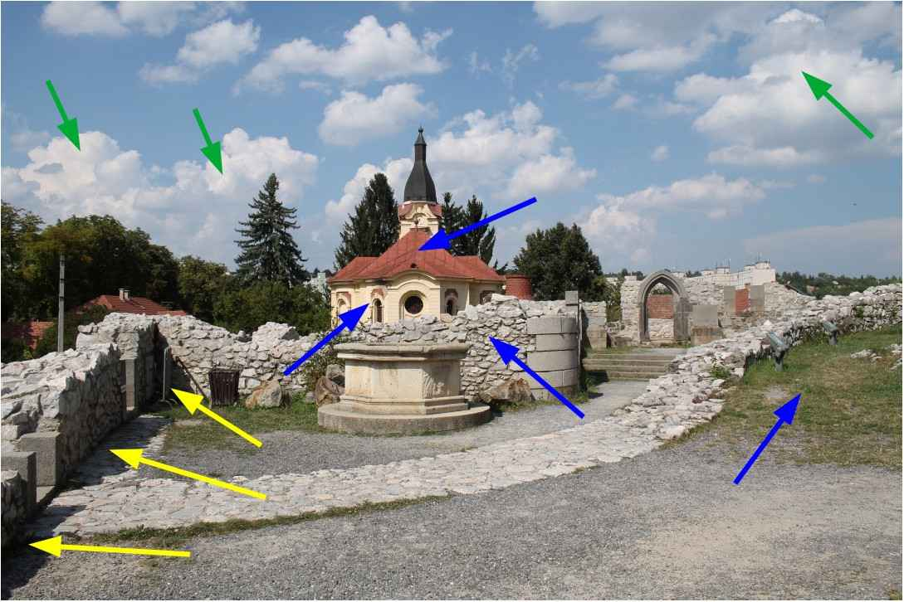  
*Csúcsfények, középtónusok, árnyékok*

A fenti képen nyilakkal jelöltem meg néhány területet. Zöld nyilakkal csúcsfényeket, kék nyilakkal középtónusokat, sárga nyilakkal árnyékokat.

##  2\.6 Dinamikatartomány (árnyalatterjedelem), kontraszt

A dinamikatartomány (árnyalatok tartománya, árnyalatterjedelem) nagyon fontos a nyers fájlok szerkesztése szempontjából, ezért részletesebben kell foglalkoznunk vele. Beavatkozásaink jelentős része a tónusokkal kapcsolatos, a tónusok módosítására, tömörítésére, nyújtására irányul.

*A dinamikatartomány*

-   *a fotótéma, vagy*
-   *a fényképezőgép által nyers formátumban rögzített adatok, vagy*
-   *az eredményül kapott fénykép* 

*legvilágosabb és legsötétebb részeinek világosságkülönbsége fényértékben kifejezve.*

*A maximális dinamikatartomány a legvilágosabb és legsötétebb részek lehetséges maximális világosságkülönbsége fényértékben kifejezve.*

*Lényegében a dinamikatartományhoz (árnyalattartományhoz) hasonló fogalom a kontraszt is, amely a kép bizonyos részén, vagy a kép egészén a legvilágosabb és legsötétebb részek világosságkülönbsége. Ha a világosságkülönbség nagy, akkor a képnek azon a részén, vagy a kép egészén nagy a kontraszt, ellenkező esetben kicsi.*

A fotózandó táj maximális dinamikatartománya elérheti a 20 fényértéknyit. A fényképezőgépek által nyers formátumban rögzíthető maximális dinamikatartomány technikai értelemben 12-14 fényértéknyi. Az általánosan használt, színcsatornánként 8 bites JPEG képfájlban rögzíthető maximális dinamikatartomány technikai értelemben körülbelül 9 fényértéknyi.

A valóságos fotótémák dinamikatartománya sok esetben nem túl nagy, számos esetben pedig nagyon nagy. A kis dinamikatartomány nem jelent technikai problémát, a nagy dinamikatartomány azonban jóval meghaladhatja azt az dinamikatartományt, amelyet fényképezőgépünk rögzíteni képes.

A színcsatornánként 8 bites JPEG kép a gyakorlatban kisebb (kb. 9 fényértéknyi) dinamikatartomány átvitelére képes, a nyers fájl dinamikatartománya elvileg ennél nagyobb is lehet, sokkal nagyobb (12 vagy 14 bites) felbontás mellett, azaz nagyon kicsi világosságbeli különbségek is megkülönböztethetők lehetnek. Ez azt jelenti, hogy a nyers fájl sokkal több információ tárolására alkalmas a JPEG képnél. Fontos megértenünk, hogy a nyers fájlban eltárolható nagyobb dinamikatartomány csak elvi lehetőség. Ha a téma dinamikatartománya kicsi, akkor a nyers fájlban is csak kis dinamikatartomány lesz eltárolva, azonban az is nagyon kis lépésközökkel, nagy felbontásban tárolódik.

Az alábbi táblázatban nézzük meg a [dxomark.com](https://www.dxomark.com/) mérései alapján a Canon EOS 5D Mk IV (full-frame), és a Canon EOS 750D (APS-C) váz maximális dinamikatartományát a névleges ISO érzékenység függvényében, fényértékben kifejezve:

| ISO | Canon EOS 5D Mk IV | Canon EOS 750D |
| --- | --- | --- |
| 100 | 13,59 | 11,96 |
| 200 | 13,41 | 11,8 |
| 400 | 12,84 | 11,5 |
| 800 | 12,18 | 10,9 |
| 1600 | 11,46 | 10,24 |
| 3200 | 10,66 | 9,38 |
| 6400 | 9,82 | 8,49 |
| 12800 | 8,85 | 7,23 |
| 25600 | 7,83 | 6,62 |
| 51200 | 7,03 | - |
| 102400 | 6,18 | - |

ISO 100 névleges érzékenységnél a Canon EOS 5D Mk IV fényképezőgép maximális dinamikatartománya 13,59 fényérték, amely ISO 25600-nál lecsökken 7,83 fényértékre, végül ISO 102400-nál már csak 6,18 fényértéknyi. A Canon EOS 750D fényképezőgép maximális dinamikatartománya ISO 100-nál 11,96, ISO 25600-nál 6,62 fényérték. Láthatjuk, hogy azonos névleges érzékenységnél a full-frame váz magasabb maximális dinamikatartománnyal rendelkezik. A dinamikatartomány az ISO érzékenység növelésével jelentősen lecsökken.

Most foglalkozzunk a fényképezőgép valós dinamikatartományával.

Nagyon szépnek tűnnek a DxOmark által mért dinamikatartományok. Sajnos azonban ezek valamiféle technikailag lehetséges abszolút maximumok. A fotóst azonban a gyakorlatban hasznosítható, valós dinamikatartomány érdekli, és nem egy elméleti érték.

*A fényképezőgép valóban kihasználható dinamikatartományát a legvilágosabb árnyalatoknál a vágás, a legsötétebb árnyalatoknál a képzaj határolja.*

A fényképezőgép gyakorlatban hasznosítható dinamikatartományának megállapítása szubjektív, mert attól is függ, hogy a legsötétebb tónusokban mennyi képzajt, a legvilágosabb tónusokban mennyi vágást, illetve valamely színcsatorna vágása miatt mennyi elszíneződést engedünk meg.

 A valós dinamikatartomány szempontjából is nagyon érdekes a [https://www.photonstophotos.net](https://www.photonstophotos.net) weboldal, ahol számos fényképezőgép-típus valóban hasznosítható maximális dinamikatartományát nézhetjük meg az ISO érzékenység függvényében. A weboldal a hasznosítható dinamikatartományt "fényképészeti dinamikatartomány"-nak nevezi.
 
   
 *Forrás: https://www.photonstophotos.net/Charts/PDR.htm*
 
A fenti ábrán két full-frame (Canon EOS 5D Mark IV - kék, és Nikon D800E - narancssárga), valamint két APS-C (Canon EOS 1100D - fekete, és Canon EOS 750D - zöld) váz dinamikatartományát láthatjuk a photonstophotos.net szerzője által meghatározott feltételek szerint.

Itt is megfigyelhetjük a full-frame vázak előnyét. Az ISO érzékenység növelésével jelentősen csökken a hasznosítható dinamikatartomány.

[Ebben a videóban Andy Astbury](https://www.youtube.com/watch?v=aKNLOxER34s)  megmutatja, hogy hogyan tudjuk nagyon egyszerű módszerrel megmérni saját fényképezőgépünk valóban kihasználható maximális dinamikatartományát. Ő maga a videóban megmérte ezt a Nikon D800E 36 MP-es full-frame fényképezőgép esetében.

Andy Astbury a mérést a legalacsonyabb ISO értéknél végezte. A valóban kihasználható dinamikatartomány felső határának azt az expozíciót tekintette, amelynél még egyáltalán nem következett be vágás a nyers adatokban, alsó határának pedig azt, amelynél még egyáltalán nem jelent meg képzaj nagy nagyításnál sem. Meg kell állapítani az alsó és felső határhoz tartozó expozíciót, majd ki kell számolni, hogy hány fényértéknyi a különbség a két expozíció között, és ennyi a valóban hasznosítható dinamikatartomány. A fényképezőgépnek a legalacsonyabb ISO értéknél kell a legjobban teljesítenie, ezért Andy Astbury szigorú feltételei nem túlzók.

A Nikon D800E fényképezőgép dinamikatartománya legalacsonyabb ISO esetén a DxOmark mérése szerint 14,3 fényértéknyi, Andy Astbury pedig 8,3 fényértéknyi valóban hasznosítható dinamikatartományt mért. Ez hatalmas eltérés.

A fentieket azért írtam le, hogy lássuk a valóságot, lássuk azt, hogy esetleg közel sem annyi fényértéknyi információ áll rendelkezésünkre egy nagy dinamikájú téma fotózásakor, mint amennyit gondolunk.

Egy elméleti példában nézzük meg, hogy ISO 100 érzékenységet feltételezve hogyan képezhetjük le egy nagy, 12 fényérték dinamikatartományú téma nyers adatainak 9 fényértéknyi tartományát a JPEG kép mindössze 7 fényértéknyi tartományára. Nézzük meg az alábbi ábrát:

1. A képérzékelőből maximálisan kinyerhető információ 9 fényértéknyi
2. A téma dinamikája ennél nagyobb (12 fényértéknyi)
3. Nyers fekete szint
4. Cél szürke pont (középszürke)
5. Nyers fehér szint
6. Nyers levágás: a 11., 12., 13. fényérték információja levágásra kerül (felveszi a nyers fehér szint értékét)
7. Sötét tónusok tömörítése
8. A középtónusokat fényértékenként képezzük le
9. Csúcsfények tömörítése
10. JPEG képen megjelenő árnyalatterjedelem (amely legyen 7 fényértéknyi)

A fenti ábrán azt az esetet láthatjuk, amikor a téma nagy dinamikájú, dinamikája meghaladja a fényképezőgép képérzékelője által átvihető árnyalatterjedelmet. Az átvihető maximális árnyalatterjedelmet természetesen csak nyers formátumban hasznosíthatjuk. A mai képérzékelők technikai értelemben 12-14 fényértéknyi árnyalatterjedelem átvitelére képesek, ennél azonban kevesebb hasznosítható valójában. Az ábrán maximálisan 9 fényértéknyi dinamika átvitelére alkalmas képérzékelőt láthatunk, be is számoztam fényértékenként az árnyalatterjedelmet. A téma azonban 12 fényértéknyi dinamikájú, a JPEG kép pedig példánkban mindössze 7 fényértéknyi árnyalatterjedelem megjelenítésére alkalmas. Az alapvető kérdés az, hogy mi és hogyan kerüljön a nyers fájl 9 fényértéknyi dinamikát tartalmazó adataiból a JPEG kép 7 fényértéknyi árnyalatterjedelmébe, és mi történjen a fényképezőgép árnyalatterjedelmét meghaladó 10., 11., 12. fényértékekkel.

Az ábrán láthatjuk a nyers fekete szintet. A nyers fekete szint azt a legkisebb világosságértéket határozza meg, amelytől kezdve hasznosíthatók a nyers fájlban található adatok. Az ez alatti értékeket nem hasznosítjuk a feldolgozás során, azokat a nyers fekete szint értékével azonosaknak tekintjük (hiába kisebbek annál), más szóval levágjuk azokat. 

Az ábrán a nyers fehér szintet a 9. fényérték végénél látható függőleges piros vonal jelképezi. A nyers fehér szint a még hasznosítható legvilágosabb árnyalatértéket határozza meg. Láthatjuk, hogy a téma árnyalatterjedelme 12 fényértéknyi, amely meghaladja az érzékelő által átvihető dinamikát. A nyers fehér szintet meghaladó értékek a nyers fehér szint értékét veszik fel, ezért vágás történik.

Elvileg bárhogyan előállíthatjuk a 9 fényértéknyi adatokat tartalmazó nyers fájlból a JPEG képben megjelenő, 7 fényértéknyi adatot. Az ábrán egy lehetséges esetet látunk, mégpedig a téma 3. és 7. fényértéke között egy az egyben átvisszük az adatokat a JPEG képbe (kék nyilak). A csúcsfényeknél és a legsötétebb árnyalatoknál azonban tömörítés történik, amely azt jelenti, hogy a nyers fájlból több fényértéknyi adatot a JPEG kép kevesebb (az ábrán egy) fényértéknyi tartományába képezünk le (zöld nyilak). A sötét árnyalatoknál több, mint 1 fényértéknyi, a csúcsfényeknél 2 fényértéknyi adatot tömörítünk. Az nem lenne jó módszer, ha a JPEG kép árnyalatterjedelmén kívül eső világosságértékeket levágnánk, illetve a JPEG kép árnyalatterjedelmének szélső értékeire konvertálnánk. A tömörítés által a JPEG kép árnyalatterjedelmén kívül eső tónusok is megjelennek a képen, azonban ezen a szakaszon a tömörítés miatt az egyes témarészek közötti világosság-különbségek kisebbek lesznek a valóságosnál (kontrasztvesztés).

Az ábrán láthatjuk a Cél szürke pontot (középszürke) is, amely elvileg 18%-os világosságú középszürke. A Cél szürke ponttal azt állítjuk be, hogy a nyers fájl középszürke világosságú adatai a kimeneten (pl. a JPEG képen) milyen világosságúként jelenjenek meg.

A nyers fájl feldolgozásának végén a megszokott látványt nyújtó, normál dinamikájú (Standard Dynamic Range, SDR) képpé kell alakítani a nagy árnyalatterjedelmű képadatokat, egyrészt monitoron történő megjelenítéshez, másrészt képfájl létrehozásához. Más szavakkal azt mondhatjuk, hogy megjelenítésre alkalmassá kell tenni a képadatokat. Erre láttunk a fenti ábrán példát. Az ART-tal létrehozhatunk nagy dinamikatartományú (High Dynamic Range, HDR) képet is, azonban könyvemben ezzel részletesen nem foglalkozom. Az ART dokumentációjában olvashatunk erről.

Az ART-ban be lehet állítani a (nem nyers) fekete és a fehér szinteket is, amellyel befolyásolhatjuk, hogy a képen milyen világosságértékeknél történjen meg a vágás. Feldolgozás közben sajnos könnyen előidézhetünk vágást. Amennyiben ezt tapasztaljuk, meg tudjuk találni, hogy mely feldolgozási lépés idézte azt elő, és tudunk tenni ellene.

  
*Részlettelen fehér (kiégett) és részlettelen fekete (bebukott) részletek (a fényképet a szerző készítette)*

A fenti képen a téma árnyalatterjedelme túl nagy. Sárga nyilakkal jelöltem meg néhány bebukott, részlettelenül fekete részt. Piros nyíllal jelöltem meg két részlettelenül fehér, kiégett területet.

Szemünk sokkal inkább elviseli a vágást a sötét árnyalatoknál (a részlettelen feketéket), mint a legvilágosabbaknál (a részlettelen fehéreket). Emiatt sok fényképezőgép 1/3 - 1 1/3 fényértékkel szándékosan alulexponálja a képet. Mi is megtehetjük azt, hogy (ha szükséges) nyers formátumban fotózva némileg szándékosan alulexponáljuk a témát úgy, hogy a csúcsfények lehetőleg ne legyenek a nyers fájlban túlexponálva (levágva). Arra kell törekednünk, hogy olyan nyers fájlt hozzunk létre, amelyből a legtöbbet tudjuk kihozni a feldolgozás során.

Most foglalkozzunk egy kicsit a színes képpel. Gondoljunk az RGB színrendszerre. Nemcsak egyszerre mindhárom színcsatornánál következhet be vágás, hanem egy vagy két csatornánál is. Gondoljunk arra, hogy van egy \[120,130,230\] világosabb kék színünk. A három színcsatorna bizonyos aránya eredményezi az észlelt színt. Ha ezt expozíció-kompenzációval világosítjuk, akkor mindhárom színcsatorna értéke nőni kezd, és elérkezünk oda, hogy a kék színcsatorna értéke eléri a maximális, 255 értéket. Ha tovább világosítjuk, akkor a kék csatorna értéke tovább már nem tud nőni, a másik kettő azonban nőni fog, megváltozik a három színcsatorna aránya, amely színeltolódáshoz vezet. Tipikus példa erre az égbolton a világos felhők, amelyek vágás esetén például rózsaszínűek lehetnek a színeltolódástól. Ez ellen úgy védekeznek a szerkesztőprogramok, hogy a másik két csatornát is levágják, hogy inkább fehéret kapjunk, mert még az is jobb a rózsaszínnél. Virágok szirmain is megfigyelhetjük a jelenséget. Az alábbi ábrán a szirmok kivilágosodott, fakóbb részeit (a szirmok végénél) a vörös színcsatorna vágása okozza.

##  2\.7 Átlátszatlanság

Sok szerkesztőeszközben beállíthatunk átlátszatlanságot, ezért foglalkoznunk kell vele. Sőt még olyan szerkesztőeszközöknél is jelen van, amelynél nem találkozunk ezzel a kifejezéssel (ilyen például a küszöbgörbe az Élesítés eszközben, vagy az "Erősség" csúszka bizonyos szerkesztőeszközökben). Tekintsük át az átlátszatlanságot az Élesítés eszköz példája alapján.

A végső képfájl létrehozásakor a szerkesztőeszközök a beállított paramétereknek megfelelően, egymás után fejtik ki hatásukat. Minden szerkesztőeszköznél van két képünk:

-   Az egyik az eszköz bemeneti képe, amelyet az előző eszköztől kap további feldolgozásra. 
-   A másik az a kép, amelyen az eszköz már kifejtette hatását, nevezzük ezt módosított képnek.

Az eszköz a kép minden részére egyformán hat, például az élesítés eszköz egyformán élesíti a teljes képet. Az élesítés esetében a bemeneti kép az előző eszköztől kapott, még nem élesített kép, a módosított kép az élesítés után kapott kép, amely mindenhol egyformán élesítve van.

Számos szerkesztőeszköznél valamilyen egyéb paramétertől függően szabályozni lehet, hogy mennyire érvényesüljön az adott szerkesztőeszköz hatása a kép különböző részein (például a kontrasztosabb területeken erősebben, máshol kevésbé). Ezt az átlátszatlansággal szabályozhatjuk. Az átlátszatlanság a szerkesztőeszköz által módosított képnek az átlátszatlanságát jelenti, %-ban adjuk meg, és ennek mértékét sok esetben közvetlenül be tudjuk állítani a szerkesztőeszközben, más esetben például egy görbével szabályozhatjuk a kép bizonyos tulajdonságának függvényében a kép egyes területeinek átlátszatlanságát. Nagyon fontos kitétel, hogy az átlátszatlanság mértéke különböző lehet a kép különböző részein.

Úgy képzeljük el, hogy a szerkesztőeszköz bemeneti képére rátesszük a megfelelő átlátszatlanságú módosított képet, és azt nézzük, hogy milyen képet kapunk ha erre a két egymásra helyezett képre ránézünk:

-   Ha a felső kép bizonyos területének átlátszatlansága 0%, akkor ezen a részen a felső kép teljesen átlátszó, mintha ott sem lenne, ezért az alsó (bemeneti, még nem élesített) képet fogjuk látni.
-   A felső kép azon területein, ahol az átlátszatlansága 100%, semmi sem fog látszódni az alsó (bemenő) képből, csak a felső (módosított, élesített) képet látjuk, mintha az alsó ott sem lenne.
-   A két szélső érték között pedig minél nagyobb az átlátszatlanság értéke, annál inkább a felső, élesített kép hatása érvényesül.

A szerkesztőeszköz végső kimeneti képe a két egymásra helyezett kép eredőjeként kapott kép lesz.

*Azt a műveletet, amelynek során a bemenő kép és a módosított kép felhasználásával (bizonyos paraméterek, pl. átlátszatlanság figyelembevételével) létrehozzuk az eredő képet, keverésnek nevezzük.*

A keverés nemcsak ilyen egyszerű módon valósulhat meg, hanem többféle módon lehet két képet keverni, az egyes keverési módok más és más eredményt adhatnak.

##  2\.8 Tollazat

Tollazattal a maszkoknál, a Folt eltávolítása, valamint az Átmenetes szűrő szerkesztőeszköznél találkozhatunk. Célja az, hogy egy adott eszköz hatása ne éles határolóvonallal szűnjön meg, hanem a környezete felé fokozatos legyen az átmenet.

A fenti ábrán egy éles határvonalú, sárga színű maszkot láthatunk. A maszk területén szeretnénk a képet világosítani.

A kép közepének világosítása éles határolóvonallal történt.

Tollazatot adtam hozzá a maszkhoz.

Az expozíció-kompenzáció hatása a tollazat miatt fokozatosan szűnik meg.

##  2\.9 Wavelet dekompozíció

A Wavelet dekompozíció (Wavelet szétbontás) egy bonyolult matematikai eljárás. Segítségével egy képet több részletszintre lehet bontani. Az egyes szintek a kép más és más részletszintjeit tartalmazzák. Az első részletszinten például a program a kép minden 2x2 pixeles területén nézi meg a képpontok egymáshoz képesti kontrasztját, a második szinten 4x4 képpontnyi területekre bontva elemzi a képet, a harmadik szinten 8x8 pixel ez a terület stb. Az alábbi ábrákon láthatjuk a második, ötödik, hatodik, és nyolcadik szinten tapasztalható részletességet.

  
*A 2\. szint csak a kép nagyon finom részleteit tartalmazza (forrás: darktable)*

  
*Az 5\. szint csak jóval nagyobb részleteket tartalmaz, finom részleteket nem (forrás: darktable)*

  
*A 6\. szint csak még nagyobb részleteket tartalmaz (forrás: darktable)*

  
*A 8\., utolsó szint csak a kép legnagyobb részeit tartalmazza, részletek nincsenek (forrás: darktable)*

A Wavelet dekompozíció a kép elemeit az L\*a\*b\* színtér összetevőire (L\*, a\* és b\*) bontja, és a színárnyalatban bekövetkező eltérések is megjelennek az egyes részletszinteken.

Mivel minden szinten csak a színárnyalatban vagy a fényerőben bekövetkező eltéréseket (gradienseket vagy különbségeket) elemzi a rendszer, a részletszintek nem tartalmaznak semmilyen információt, ha a kép világossága és színe teljesen egyenletes. Ebben az esetben az egyes szintekből kinyert eltérések a digitális zajból és a kontraszt (vagy színárnyalat) változásából származnak, amelyek az éleffektusok, köd, vagy más, a témával kapcsolatos optikai jelenségek miatt következnek be.

A maradékkép úgy keletkezik, hogy az eredeti képről a bontott szintek részleteit eltávolítjuk, és ami megmarad, az lesz a maradékkép. Ebből következik, hogy az adott részletszinten végrehajtott módosítások (kontraszt, színárnyalat stb.) nincs hatással a maradékképre, és fordítva. Nemcsak az egyes részletszinteken, hanem a maradékképen is végrehajthatunk műveleteket. Az is lehetséges, hogy ha bizonyos szinteken változtattunk valamit, akkor utána a többi szinten (és a maradékképen) teljesen más változtatásokat eszközöljünk.

A részletszintek és a maradékkép újraegyesítésével visszakapjuk a teljes képet. A szintekre bontás lehetővé teszi, hogy bizonyos beavatkozásokat csak bizonyos részletszinten illetve részletszinteken végezzünk el, a többi szintet, és a maradékképet változatlanul hagyva.

A Wavelet dekompozíció többféle célra felhasználható, például képzaj eltávolítására, az egyes szintek kontrasztjának, tónusainak beállítására, a nem kívánt részletek elmosására vagy eltávolítására, a telítettség vagy a színek megváltoztatására, élesítésre stb.

Ha egy szerkesztőeszköz nevében vagy leírásában szerepel a "részletek szerint" kitétel, akkor szinte biztosak lehetünk abban, hogy Wavelet dekompozícióról van szó.

Nézzünk meg egy példát a darktable felhasználói kézikönyve alapján. Az alábbi ábrán az eredeti kép részletét láthatjuk, a problémát az arcon lévő bőrhibák jelentik, amelyeket csökkenteni szeretnénk.

  
*Az eredeti kép (forrás: darktable)*

  
*Az 5\. szint, ezen látszanak legjobban a bőrhibák. Ha ezen a szinten elmosódást hozunk létre, akkor a bőrhibák sokkal kevésbé lesznek láthatók. (forrás: darktable)*

  
*Az eredményül kapott kép, amelyen a finom részletek megmaradtak, azokra nem hatott az elmosódás (forrás: darktable)*

Úgy alkalmaztunk elmosódást, hogy az csak az 5\. szinten fejtette ki hatását, a többi szint változatlan maradt.

##  2\.10 Élesítési eljárások

Az élesítés az egyik leggyakrabban alkalmazott eljárás a feldolgozás során. Az általánosan elterjedt digitális fényképezőgépek elvileg sem biztosítják a képérzékelő felbontásával elérhető maximális valós felbontást. A maximális felbontás akkor lenne elérhető, ha az egyes képpontok függetlenek lennének egymástól, mert akkor csak az elemi érzékelőre vetített fény színétől, erősségétől függene az adott képpont világossága és színe, egyéb tényezőktől nem. A valóságban a képpontok nem függetlenek egymástól. Ennek egyik oka az, hogy a képérzékelő színeket nem lát, és a színeket az elemi érzékelők előtt lévő színszűrők (pl. Bayer szűrő) segítségével, a szomszédos képpontok adatait is figyelembe véve, interpolációval állítják elő. A másik ok a sok fényképezőgépben a képérzékelő előtt található, szándékoltan enyhe elmosódottságot eredményező, úgynevezett átlapolásmentesítő (anti-aliasing, AA) szűrő. Ehhez járulnak még az egyéb tényezők, például az objektív tökéletlensége, kevésbé kontrasztos képe.

*Az élesség egy szubjektív érzet, amely nem azonos az objektív felbontóképességével, de nem is független tőle. Egyáltalán nem biztos, hogy a nagyobb felbontóképességű objektív képét élesebbnek is látjuk. A kontrasztnak az élesség észlelésében fontos szerepe van. A részletekben is kontrasztosabban rajzoló objektív képét élesebbnek látjuk, mint az azonos felbontóképességű, kevésbé kontrasztosan rajzoló objektívét. Részben ezen alapulnak az élesítési eljárások.*

Az élesítésben fontos szerepük van az éleknek. Az élek a kép olyan részleteit jelentik, amelyeknél hirtelen világosságátmenet figyelhető meg. Ezek nem feltétlenül valamilyen tárgyon található valódi élek, azonban akkor is éleknek nevezzük őket. Lehetnek például egy témarészlet kis részletei közötti hirtelen világosságátmenetek is. Az éleknek azért van szerepük élesítéskor, mert ha az élek mentén (a világosságátmenetnél) megnöveljük a kontrasztot, akkor a képet élesebbnek érzékeljük annak ellenére, hogy ezáltal az objektív felbontóképessége nem változott, és több részlet sem jelenik meg a képen.

Sokszor nem előnyös, ha az élesítés a teljes képet azonos mértékben érinti. Az elmosódott területeket felesleges élesítenünk, mert csak rontunk rajta. A nagy, homogén területeket sem érdemes élesítenünk, mert azzal csak a képzaj erősödését érjük el. Leginkább a kis részleteknél érdemes élesíteni.

A legismertebb élesítési eljárás az életlen maszk módszer. Ez úgy éri el az élesítést, hogy az élek mellett megnöveli a kontrasztot. Általában van egy sugár nevű paraméter, amely arra van hatással, hogy az élek mentén milyen szélesen történjen meg a kontraszt megnövelése. Az élesítés legtöbbször akkor a legjobb, ha a sugár kisebb, főleg alacsony ISO-érzékenységgel készített, fókuszban lévő, és elmosódás nélküli képek esetén.

  
*Életlen maszk módszerrel élesített kép (forrás: RawTherapee)*

Néhány egyéb módszer is lehetséges:

  
*Csak az élek élesítése (forrás: RawTherapee)*

Az életlen maszktól eltérően az élek élesítése valódi élesítési algoritmus. Csak a már éles éleket élesíti, figyelmen kívül hagyva azokat, amelyeknek nincs elég kontrasztjuk.

  
*Csak az élek élesítése, és a mikrokontraszt növelése (forrás: RawTherapee)*

Az élek élesítésén kívül a mikrokontrasztot is növeli. A mikrokontraszt pixelszintű (pixelek közötti) kontrasztot jelent, míg másféle (pl. helyi) kontraszt nagyobb területek közötti kontrasztot.

  
*Élesítés a mikrokontraszt növelésével (forrás: RawTherapee)*

  
*A kontraszt részletszintek szerinti növelése (Wavelet szétbontást alkalmaz) (forrás: RawTherapee)*

A következő élesítési eljárás az RL dekonvolúció.

Először szólni kell a Gauss-féle eloszlás szerint végzett elmosásról. Ez a képszerkesztésben is alkalmazott eljárás. Segítségével Gauss-féle eloszlásfüggvény szerinti elmosást végez a szoftver. Ez a módszer kevésbé finom, kevésbé szép elmosódást eredményez, mint a szebb háttérelmosásra alkalmas objektívek.

Az RL dekonvolúció eljárás a Gauss-féle eloszlásfüggvény szerinti elmosás megfordítására ("visszacsinálására") alkalmas. Az objektívek elmosása nem teljesen olyan, mint a Gauss elmosás, azonban ennek ellenére a módszer élesítésre alkalmas. Esetleg még újabb részletek is előtűnhetnek a képen.

Az objektívek tökéletlensége miatt a hirtelen átmenetek sohasem olyan hirtelenek, mint a valóságban. Ha lefényképezünk egy olyan ábrát, amelyen egy fekete és egy fehér területet éles határvonal választ el egymástól, akkor a fényképen nem lesz olyan éles a határvonal, hanem némi átmenet keletkezik, életlenséget okozva. A kontraszt is némileg csökken, a fekete világosodik, a fehér sötétedik (szürkül). Az élek mentén az élességet csökkentő átmenet "visszacsinálására", eltüntetésére alkalmas az RL dekonvolució eljárás. Az alábbi ábrán az RL dekonvolúcióval végzett élesítés eredményét láthatjuk.

  
*RL dekonvolúcióval élesített kép (forrás: RawTherapee)*

Ennél is beállíthatunk sugár paramétert. Ha ennek értéke túlságosan eltér a szükséges értéktől, akkor kellemetlen hatású műtermékeket tapasztalhatunk, például fényudvart (halo) az élek mentén. A sugár megfelelő értékét próbálgatással kell megállapítani.

Az RL dekonvolúció iteratív módszer, azaz többször egymás után meg kell ismételni a megfelelő eredmény elérése érdekében. Beállíthatjuk az iterációk (egymás után történő végrehajtások) számát. Egy előző iteráció kimenő képadata lesz a következő iteráció bemenő adata, amelyen az RL dekonvolúció eljárás ismételten végrehajtásra kerül stb. Minden egyes iteráció csökkenti az elmosódást, növeli a feldolgozási időt, és egyúttal növeli a műtermékek valószínűségét is. Próbálgatással lehet megtalálni a legoptimálisabb beállításokat. Sokszor már az alapértelmezett beállítás is jó eredményt ad. Fontos a mértékletesség, a feldolgozóeszközök túlzott mértékű alkalmazása általánosságban is kerülendő.

Itt kell szólnom az úgynevezett anonimizálásról (cenzúrázásról). Sok esetben a fényképen látható személyeknek, rendszámoknak jogi okokból felismerhetetleneknek kell lenniük. Ha fontos a biztos felismerhetetlenség, akkor ne Gauss elmosással kísérletezzünk, hanem fessük be a képen az arcot vagy a rendszámtáblát valamilyen színűre, mert azt sehogyan sem lehet visszacsinálni.

##  2\.11 Zajos képek

A másik gyakran alkalmazandó eljárás a képzaj csökkentésére szolgál. Kétféle zajt kell megkülönböztetnünk: világosságzajt és színzajt. Világosságzaj esetén a zaj színe nem tér el jelentős mértékben annak a felületnek a színétől, amelyen megtalálható, míg a színzajnál jelentősen eltér.

  
*A világosságzaj dominál, színzaj alig látható (Canon 750D, ISO 6400)*

  
*Jelentős mértékű a színzaj (Canon 1100D, ISO 6400). Különösen feltűnő a fekete pénztárcán a vörös színzaj, de a zöld terítőn is jól látható*

A nyers fájlokat feldolgozó programokban a kétféle zajt legtöbbször külön kell kezelnünk. A fenti ábrákon láthatjuk, hogy a fejlettebb képérzékelőjű Canon 750D képein elsősorban a világosságzajt kell kezelni, míg a régebbi Canon 1100D esetén mindkettőt.

Számottevő mértékű képzaj leginkább akkor keletkezik, amikor magas ISO érzékenységet alkalmazunk kevés fény esetén, azonban alacsony érzékenységgel készült kép legsötétebb területein is előfordulhat zaj.

Háromféle eljárás terjedt el:

-   Helyi módszer, amelynél minden egyes pixelnél a környező pixelek figyelembevételével történik meg a pixel jellemzőinek módosítása zajcsökkentés céljából. Ez erőforrás-igényes módszer.
-   Wavelet szintek segítségével történő zajcsökkentés. Ez gyorsabb működésű.
-   A Nem helyi eszközök (Non-local means) nevű algoritmus a kép összes pixelének átlagolásán alapul. Ez sokkal nagyobb tisztaságot, és kisebb részletvesztést eredményez a helyi módszerhez képest.

A gyakorlatban alkalmazott zajcsökkentő eszközök ezeknek a módszereknek a továbbfejlesztéséből, más eljárásokkal történő kombinálásából keletkeztek.

Erős zaj esetén érdemes lehet akár kétféle zajcsökkentést is alkalmazni egymás után, ha lehetséges. A zajcsökkentési eljárások a kép részleteinek bizonyos fokú elvesztésével járnak. Meg kell találni az egyensúlyt a zaj csökkentése és a részletek elvesztése között. Általános szabályként elfogadhatjuk, hogy ha képzaj csökkentésére kényszerülünk, akkor óvatosan bánjunk az élesítéssel, nehogy a képzajt is élesítsük.

##  2\.12 Műtermékek a képen

A feldolgozásban használt eljárások nem tökéletesek, és hajlamosak műtermékek létrehozására főleg akkor, ha túl erősre állítjuk hatásukat. A műtermékek olyan elemek megjelenése a képen (pl. elszíneződések), amelyek a témán nem voltak megfigyelhetők, azok a szerkesztőeszközökben alkalmazott eljárások tökéletlensége miatt keletkeztek.

Például az élesítési eljárások általában nem úgy működnek, hogy több apró részletet jelenítenek meg a képen, mert ezek a részletek általában nem állnak rendelkezésre. Ehelyett látásunknak azt a sajátosságát használják ki, hogy a kontrasztosabb képet egyúttal élesebbnek is érzékeljük. Az élesség fokozására a kép hirtelen átmeneteinél megnövelik a kontrasztot. A kontrasztot úgy növeli meg, hogy a sötét rész kissé sötétebb, a mellette lévő világos rész pedig kissé világosabb lesz. Ha túl erősen alkalmazzuk az élesítést, úgynevezett halo keletkezik a sötét részek mellett, mintegy fényudvarszerűen szegélyezve azokat. Ez műtermék, mert a témán ilyen nem volt. Az alábbi ábrán látható képen szándékosan nagyon erősen alkalmaztam élesítést, hogy a műtermék jól érzékelhető legyen.

Az ábrán túlzott élesítéssel létrehozott fényudvarokat (halo) láthatunk. A nagy kontrasztú helyeken jelenik meg, ahol sötét témarészlet mellett nagyon világos témarészlet van. A fa törzsének egy része mellett, a modell feje mellett, ahol a világosabb vízfelület a háttér, ott is megjelenik a fényudvar. Néhányat nyíllal be is jelöltem. Műtermék nemcsak fényudvar formájában jelentkezhet. Törekedni kell arra, hogy az eszközöket ne alkalmazzuk túlzott mértékben, mert ezzel megelőzhetjük a nem kívánt műtermékek megjelenését.

##  2\.13 A mid.tif kép

A mid.tif képet Alberto Griggio az ART fórumán tette közzé, és [erről a linkről tölthető le](https://discuss.pixls.us/uploads/short-url/qYoPNYBD23KtAvOwxhkBgy4qSPf.tif). Néhány, tónusokra ható szerkesztőeszköz hatását ennek a képnek a segítségével mutatom be. A fájlt érdemes letölteni, mert számos eszköz működése jobban megérthető segítségével. 

A kép lineáris Rec.2020 színtérben felülről lefelé egyre világosabb sávokat tartalmaz, amelyek pontosan 1 fényértéknyire vannak egymástól. Ez azt jelenti, hogy felülről lefelé az i-edik sáv értékeiből 2-vel történő szorzással kapjuk meg az i+1-edik sáv értékeit. Összesen 20 sáv van, a kép összesen 20 fényértéknyi árnyalatterjedelmet tartalmaz, felülről a 11. sáv a 18%-os középszürke árnyalat. Ha ezt a fájlt megnyitjuk szerkesztésre, akkor természetesen megjelenítésre alkalmas, sRGB színrendszerben látjuk az előnézeten. A 18%-os középszürke árnyalat az sRGB színrendszerben \[119,119,119\].

##  2\.14 Ajánlott számítógép-konfiguráció

Az ART futtatható 64 bites Windows, Linux, és macOS operációs rendszeren.

Az ART-ban szerkesztés közben az előnézeten figyelhetjük meg változtatásaink hatását. Ennek frissítése erőforrás-igényes. A nagy felbontású fényképezőgépek nyers fájljainak mérete nagy, az abból kinyert adatok lebegőpontos formátumban történő tárolása memóriaigényes, főleg úgy, hogy egyidejűleg akár több példányt is szükséges tárolni.

Ha kevés (4 GB) a memória, akkor jelentős lassulást tapasztalhatunk. A minimálisan szükséges RAM 8 GB (nagy méretű nyers fájlokkal talán még így is lehet problémánk).

Minimális ajánlott konfigurációként talán legalább 4 magos, nyolc szálat párhuzamosan futtatni képes processzor ajánlott, minimum 8 GB RAM-mal. Ma azonban már könnyen elérhetők 6 magos processzorok is, ha tehetjük, inkább válasszunk ilyet. Azt is feltétlenül nézzük meg az interneten, hogy a választani kívánt processzor hogyan szerepelt a tesztekben. 16 GB memória választása előnyösebb.

Jelenlegi gépem 32 GB RAM mellett AMD Ryzen 7 5700G processzorral rendelkezik. A processzor 8 magos, 16 szál futtatására alkalmas. Processzorba integrált GPU-t tartalmaz. Fontos szempont volt a kiválasztásnál, hogy normál energiafelhasználású legyen. A processzor legfeljebb 60-87 W-ot fogyaszt. Nem szerettem volna nagy fogyasztású, vízhűtéses gépet. Ez még kiválóan elmegy léghűtéssel (de nem a processzor saját hűtőventilátorával, hanem Be quiet! Pure Rock 2 Silver hűtőt vásároltam hozzá, mert nem szeretem, ha túl meleg a processzor, és túlmelegedés miatt esetleg határolja a teljesítményt). Ez a hűtő kellően alacsonyan tartja a processzor hőmérsékletét. Nem vagyok híve a számítógépek túlhajtásának, és ilyen teljesítményű gépet erre a célra teljesen felesleges túlhajtani, anélkül is gyors.

Ennek a gépnek a birtokában (bizonyos határig) nem kell foglalkozni azzal, hogy hány program fut a gépen, a böngészőben hány lap van megnyitva stb. Ha gyengébb gépünk van, és csak 8 GB memóriánk, akkor nagy méretű nyers fájl szerkesztésekor esetleg szükség lehet minden felesleges program, minden felesleges böngészőlap bezárására.

##  2\.15 Milyen monitort használjunk?

Ezt természetesen az határozza meg, hogy mi a célunk. Ha professzionális minőség az elvárás, akkor arra alkalmas monitort kell használnunk a feldolgozáshoz. Amatőr célra mások a követelmények.

Mindenképp IPS paneles monitort célszerű választani, amelynek színtartománya legalább 98-100%-ban lefedi az sRGB tartományt. Az IPS panel elég nagy betekintési szöggel rendelkezik, amely azt jelenti, hogy ha kissé oldalról nézzük is, nem változnak a színek. Az nagyon nem jó, hogy ha kissé oldalra mozdítjuk a fejünket, máris változnak a monitoron látható kép színei. Így nem lehet képet szerkeszteni. Manapság már sokféle megfelelő monitort találhatunk. Vásárlás előtt azonban nem árt az óvatosság, alaposan tájékozódni kell.

Ha a nagy színhűség követelmény (professzionális célra), akkor mindenképpen professzionális minőségű, kalibrált monitorra van szükségünk. Ez biztosíthatja azt, hogy például egy nyomaton, vagy az interneten is ugyanúgy nézzen ki képünk, ahogyan a szerkesztéskor láttuk. Tehát fontos, hogy a monitor könnyen kalibrálható legyen. Ha szerencsénk van, akkor monitorunk akár a gyári beállításokkal (kalibrálás nélkül) is alkalmas lehet amatőrként történő használatra. Ha problémát tapasztalunk, akkor néhány ezer forintért kalibráltathatjuk monitorunkat.

A monitor képátlója 23-27 inch legyen. Kisebbet nem célszerű választani. Ezeknél a programoknál sok mindent meg kell egyszerre jeleníteni a képernyőn, ha túl kicsi a képernyő, akkor túl kicsik lesznek az egyes elemek, zsúfolt lesz a képernyő, esetleg az ART eszköztárán látható gomboknak csak egy részét láthatjuk egyszerre. Nagyobb monitort ugyan használhatunk, de az feleslegesen megdrágítja a konfigurációt.

A monitor felbontásának és méretének összhangban kell lennie. Kisebb méretű monitornál full HD az ideális felbontás (1920x1080), 27"-osnál pedig WQHD (2560x1440) a legjobb. Annak ellenére ezt mondom, hogy vannak, akik minden körülmények között a minél nagyobb felbontást részesítik előnyben. Tekintettel kell lenni arra, hogyha túl nagy felbontást választunk az adott mérethez, akkor túl kicsi lesz a képernyőn minden, és emiatt úgyis a felbontás csökkentésére kényszerülünk. Ha esetleg 32"-os monitorunk van, akkor már célszerű 4K felbontást választani, azonban ekkora monitor nem szükséges erre a célra. Szerintem a 27"-os, 2560x1440 képpont felbontású monitor az ideális céljainkra, jó kompromisszumot jelent.

Több cég is gyárt gyárilag kalibrált monitorokat, amelyeknek a színtartományuk is megfelelő. Például az LG választékában is találhatunk ilyeneket. Én magam ASUS ProArt PA278QV 27"-os, 2560x1440 felbontású, gyárilag kalibrált, az sRGB színtér színeit 100%-ban reprodukálni képes monitort használok. Ez a monitor jól kalibrálható, és a professzionális célra is ajánlott monitorok alsó kategóriáját képviseli.

##  2\.16 Hogyan juthatunk objektívprofilokhoz és fényképezőgép-profilokhoz?

Az objektívprofilokat objektívhibák korrigálására, a fényképezőgép-profilokat bemeneti színprofilként használhatjuk az ART-ban.

Az objektívprofilok célja a geometriai torzítás és/vagy a peremsötétedés és/vagy a kromatikus aberráció csökkentése.

Az alapötlet az, hogy ha létrehozunk egy adatbázist vagy profilfájlt, amely tartalmazza az adott objektívre vonatkozó torzítás, peremsötétedés, és kromatikus aberráció korrigálásához szükséges adatokat, akkor ezt az adatbázist vagy profilfájlt bármikor felhasználhatjuk ezen objektívhibák korrekciójára, és nem kell minden egyes fényképen manuálisan korrigálnunk.

A fényképezőgép-profilok bemeneti színprofilként használhatók az ART-ban (a Színek eszközcsoportban található Színkezelés eszközben). Egy fényképezőgép-típushoz többféle fényképezőgép-színprofil is létezik, amelyek az adott fényképezőgép képstílusai szerintiek lehetnek, például normál, portré, tájkép, monokróm stb.

Az ART képes alkalmazni az Adobe LCP objektívkorrekciós-profilokat, és az Adobe fényképezőgép-profilokat is. Ilyen profilokhoz az Adobe DNG Converter szabadon letölthető programból juthatunk.

Az itt ismertetett módon legfeljebb az Adobe DNG Converter 12.4 verziójából nyerhetjük ki az Adobe profilokat, a későbbi verziókból nem. Ez a változat 2020-ban jelent meg, ezért a később megjelent fényképezőgépekhez és objektívekhez nem található benne profil. Amikor e sorokat írom, a 12.4 verzió még elérhető az interneten, de az Adobe oldalán már nem. A Windows operációs rendszerhez való telepítőt kell letölteni (DNGConverter\_12\_4.exe, kb. 471 MB). Innen tölthető le:

[filehorse.com](https://www.filehorse.com/download-adobe-dng-converter/54693/download/)

Ne telepítsük a számítógépre a programot, hanem egyszerűen csomagoljuk ki a letöltött telepítő exe fájlt. Linux esetén (ha szükséges), akkor telepítsük fel a kicsomagoláshoz az Engrampa archívumkezelő programot. Windows esetén megfelelő lehet a 7-zip program, de talán egyszerűbb ideiglenesen feltelepíteni a DNG Converter programot, amelyet később eltávolíthatunk.

Linux esetén kicsomagolás után három mappát kapunk: $APPDATA, $PLUGINSDIR, $PROGRAMFILES64. Minket a $APPDATA mappa érdekel, ezen belül az "Adobe/CameraRaw/" útvonalon találjuk a háromféle Adobe profilfájlokat.

Windows esetén a telepítés helyéről kiindulva az "Adobe\\CameraRaw" mappában találhatjuk a profilokat.

A Lensprofiles mappában lévő 1.0 mappában, gyártónként külön almappában találhatók a .lcp kiterjesztésű objektívprofil-fájlok.

A CameraProfiles mappában lévő Adobe Standard mappában rengeteg fajta fényképezőgép és telefon normál színprofilját találjuk. Ez a Normál (alapértelmezett) képstílushoz tartozó színprofil. A fájlok kiterjesztése .dcp.

A CameraProfiles mappában lévő Camera mappában fényképezőgép-típusonként külön mappában találhatók a normáltól eltérő, (például tájkép, portré) képstílusokhoz tartozó profilfájlok. A fájlok kiterjesztése .dcp.

Ezeknek a könyvtáraknak a tartalmát mentsük el, de legalább a fényképezőgépeink, és objektívjeink profilfájljait.

Az alábbi lehetőségek is rendelkezésünkre állnak.

Létezik egy Lensfun nevű, közösség által fejlesztett adatbázis, amely sokféle objektívhez tartalmazza a korrekciós adatokat. Ezt az ART tartalmazza.

Bizonyos esetekben a nyers fájlba ágyazott metaadatok is tartalmazhatnak objektívkorrekciós adatokat, de ez nem túl gyakori.

Adobe DCP fényképezőgép-profilokat Andy Astbury [Fényképezőgép-profilok](https://drive.google.com/drive/folders/19gN__tZ7Z0gnckHGnjDHqfGNRZ3_ozNN) oldaláról is letölthetünk, ezek újabbak az Adobe DNG Converter 12.4-ből kinyerhetőknél.

Az Adobe Standard sorában jobbra letölthetjük összecsomagolva az összes fényképezőgép normál profilját, a Camera sorában pedig hasonlóan letölthetjük az összes fényképezőgép egyéb profiljait. Az Adobe Standard feliratra duplán kattintva sokféle telefon és fényképezőgép normál színprofilja közül választhatunk, ha a Camera feliratra kattintunk duplán, akkor pedig a telefonok, fényképezőgépek egyéb (portré, tájkép stb.) színprofiljait tölthetjük le.

Keressük meg a listában mindegyik fényképezőgépünk típusát, és töltsük le (a Letöltésre kattintva) egy könyvtárba a .zip formátumú profilokat, majd csomagoljuk ki őket, és ezután a fényképezőgépünk típusa nevű (pl. Canon EOS 750D) mappában találjuk az adott fényképezőgép profiljait.

A profilokat (vagy a mappákat) mentsük el egy könyvtárba, ahonnan majd megnyitjuk őket az ART-tal. Úgy szervezzük mappákba profiljainkat, hogy könnyű legyen használni őket.

#  3\. Az ART nyersfájl-feldolgozó program

##  3\.1 Áttekintés

Az ART egy szabadon használható, nyílt forráskódú, Windows, Linux, és macOS platformon futó, magyar nyelvű kezelőfelülettel is rendelkező program. Fő célja nyers (raw) állományok feldolgozásával kiváló minőségű képfájlok előállítása. Más formátumú képfájlok (pl. JPEG, PNG, TIFF stb.) is módosíthatók segítségével, könyvemben azonban csak a nyers állományok feldolgozására fókuszálok.

A RawTherapee-nak (és a darktable-nak is) az a nagy hátránya, hogy bár nagy tudású eszköz, azonban bonyolult felhasználói felülete, és nagyon összetett, bonyolult szerkesztőeszközei miatt nem felhasználóbarát, nehezen tanulható. E hátrányok jelentős csökkentése érdekében hozta létre Alberto Griggio a RawTherapee kódjából kiindulva az ART-ot (Another RawTherapee = egy másik RawTherapee). Az ART könnyebben kezelhető, átláthatóbb felhasználói felületet, egyszerűbb, de nagyon hatásos szerkesztőeszközöket kínál, megőrizve a RawTherapee kiváló képminőségét. Sokkal könnyebben tanulható a RawTerapee-hoz (és a darktable-hoz) képest.

Mivel az ART fejlesztése alapvetően a RawTherapee-ból indult ki, nagy hasznát vehetjük a RawTherapee online felhasználói kézikönyvének is.

Az egyszerűség kedvéért "kép"-en továbbra is főleg nyers fájlt értek, hiszen annak szerkesztéséről lesz szó ebben a könyvben. Annak ellenére ezt teszem, hogy a nyers adatokat tartalmazó fájl nem kép. Természetesen "kép"-nek nevezem az eredményül kapott JPEG, TIFF, PNG stb. képet is.

##  3\.2 Az ART weboldala

A programról ezen az oldalon tájékozódhatunk:

[ART nyitólap](https://art.pixls.us)

Itt találunk linket a program (és a CTL szkriptek) letöltéséhez, a fórum eléréséhez, és itt találhatjuk a dokumentációt is, amelyet valamilyen fordítóval lefordítva magyarul is olvashatunk.

##  3\.3 Az ART telepítése

Az ART operációs rendszerünknek megfelelő, legújabb, stabil változatát innen tölthetjük le:

[ART stabil](https://github.com/artpixls/ART/releases)

Csak a Linuxra történő telepítésről írok néhány szót, mert az talán nem annyira nyilvánvaló. Le kell tölteni a ART-x.xx.x-linux64.tar.xz (az "x.xx.x" helyén a verziószám szerepel) tömörített fájlt, majd ki kell csomagolni abba a könyvtárba, ahol a helye lesz. Ennek nem kell rendszerkönyvtárnak lennie, elvileg bárhol lehet. Én magam az operációs rendszert is tartalmazó SSD RAM meghajtó felhasználó rendelkezésére álló részére tettem (tehát nem az operációs rendszer területére), hogy gyorsabban töltődjön be a memóriába. A létrehozott könyvtárba bemásoltam a letöltött fájlt. Kicsomagoltam, mégpedig úgy, hogy rajta jobb egérgombbal kattintottam, és a helyi menüből a Kibontás ide lehetőséget választottam. Ekkor létrejött például egy ART-1.19.3-linux64 könyvtár, benne a program alkönyvtáraival és fájljaival. Ezt a könyvtárat ART-ra neveztem át. A letöltött fájlt ezután törölhetjük.

A fenti ábrán az ART könyvtár tartalma látható, mégpedig a kicsomagolt könyvtárak, valamint a fájlok egy része. Az elindítandó fájl a bal alsó sarokban látható ART nevű szkript. Már csak az a feladatunk, hogy egy indítóikont készítsünk az asztalra, amelyre duplán kattintva a szkript végrehajtódik, és az ART elindul. Ennek érdekében az asztal üres helyén kattintani kell jobb egérgombbal, és a helyi menüből az Indítóikon létrehozása lehetőséget kell választani.

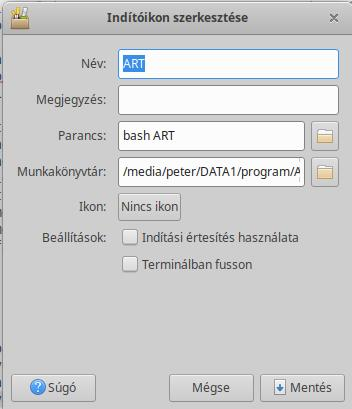

A megjelenő ablakban nevet kell adnunk az alkalmazásnak (ART), el kell indítanunk a szkriptet (bash ART), és a munkakönyvtárnál meg kell adnunk annak a könyvtárnak az útvonalát, amelyben az ART nevű szkript található, végül a Mentés gombra kell kattintani. Az indítóikont végrehajthatóvá kell tenni. Ha jól csináltuk, akkor csak duplán kell kattintanunk az indítóikonra, és az ART elindul. Ezt leírni bonyolultabb volt, mint megcsinálni, az egész telepítés nem tart tovább három percnél.

A Beállításokba a felhasználói felület bal alsó sarkában alulról a második ikonra (gombra) kattintva juthatunk. A fenti ábrán a Beállítások ablak látható. A nyelvek (languages) részen tudjuk beállítani a nyelvet. Ha az operációs rendszerünk nyelve megfelel, akkor elég bejelölni "Az operációs rendszer nyelvének használata" lehetőséget. A nyelv kiválasztása után a programot újra kell indítani.

##  3\.4 Roncsolásmentes feldolgozás

Az ART roncsolásmentes eljárással dolgozza fel a képeket. Ez azt jelenti, hogy a program semmit sem módosít a szerkesztésre megnyitott fájlon. Mindössze a szerkesztés közben alkalmazott szerkesztőeszközök beállításait tárolja el, és később ezek alkalmazásával hozza létre az eredményül kapott képet.

Az Aktuális kép mentésekor vagy a Feldolgozási sor feldolgozásakor a keletkező JPEG, TIFF, vagy PNG képfájlokat alapértelmezés szerint a szerkesztett fájlt tartalmazó mappán belül lévő "converted" nevű almappába menti. Amennyiben az almappa már tartalmaz egy korábbi feldolgozás során keletkezett ugyanolyan nevű képet, akkor azt nem írja felül, hanem alapértelmezés szerint a fájlnevet megtoldja az "-1", "-2" stb. utótaggal (amelyik következik). Például ha volt már IMG\_0322.jpg kép, akkor az új változat IMG\_0322-1.jpg lesz. A Beállításokban az is beállítható, hogy felülírja a célfájlt, azonban ezt nem célszerű alkalmazni.

##  3\.5 Kísérőfájlok

  
*Az IS2_3049.nef a nyers fájl, az IS2_3049.nef.arp a szerkesztési beállításokat tartalmazó kísérőfájl, az IS2_3049.nef.jpg.xmp a kép osztályozási adatait (pl. csillagozás, színcímkék) tartalmazó kísérőfájl*

A szerkesztőeszközök beállításait az ART kísérőfájlokban (angolul sidecar file) tárolja, amelyeknek .arp a kiterjesztésük, és amelyeket az ART a szerkesztett fájl mellé ment. A .arp kiterjesztésű kísérőfájlban tárolt szerkesztési paraméterek gyűjteményét más néven a kép feldolgozási profiljának nevezzük. A szerkesztett (általában nyers) fájl mellett mindig csak a kísérlőfájl legutolsó változata lesz megtalálható, a korábbi változatok nem.

Arra is van lehetőség, hogy az ART minden egyes eredményül kapott képfájl mellé is elmentse a hozzá tartozó kísérőfájlt, ezáltal minden szerkesztési változat mellett is lesz kísérőfájl. Ez nagyon ajánlott. A Beállítások Képfeldolgozás lapján tudjuk beállítani.

A kísérőfájloknak az a jelentősége, hogy az abban tárolt szerkesztőeszköz-beállításokat (feldolgozási profilt) hajtja végre az ART a képfájl (JPEG, TIFF, vagy PNG) előállítása során, vagy ha ismét megnyitunk egy korábban már szerkesztett képet szerkesztésre, akkor az ART automatikusan beállítja a szerkesztőeszközöket a kísérőfájlban tárolt információk alapján, és az utolsó szerkesztési állapotból folytathatjuk a kép feldolgozását. A kísérőfájlok nagyon fontosak, ha azokat elveszítjük, akkor elveszítjük azokat a szerkesztési paramétereket, amelyek a nekünk tetsző képváltozat létrehozásához vezettek. Lényegében a befektetett munkánkat veszítjük el.

A képek osztályozási adatait (pl. csillagozás, színcímkék) egy .xmp kiterjesztésű kísérőfájlban tárolja az ART, amelyet a nyers fájl vagy a képfájl mellé ment. A feldolgozás eredményeként keletkező képfájl mellé a .xmp fájlt nem menti.

A továbbiakban ha kísérőfájlt említek, akkor nem a .xmp, hanem a .arp kiterjesztésű, feldolgozási paramétereket tartalmazó kísérlőfájlra kell gondolni.

##  3\.6 Az ART csővezetéke

Amikor szerkesztünk egy képet, a kísérőfájlban eltárolásra kerül, hogy a szerkesztés során milyen szerkesztőeszközöket milyen beállításokkal használtunk. Mindig a szerkesztőeszközök beállításainak utolsó állapota tárolódik a kísérőfájlban. A mentendő képfájl létrehozásakor történik meg a nyers fájlból kiindulva, a feldolgozáskor alkalmazott szerkesztőeszközöknek (a kísérőfájlban eltárolt paraméterekkel) egymás után történő alkalmazása, és ennek eredménye lesz a mentett képfájl. Egymás után minden eszköz elvégzi a maga feladatát. A szerkesztőeszközök közötti adatáramlás a képfájl létrehozása során képzeletbeli csővezetékben történő áramláshoz hasonlít. Az első szerkesztőeszköz bemenő adata maga a nyers fájl, kimenő adata a következő eszköz bemenő adata lesz, annak kimenő adata lesz a harmadik eszköz bemenő adata, és így tovább. Az utolsó eszköz kimenő adata a kész kép, amely a felhasználó által kiválasztott formátumban mentésre kerül. A képadatok tehát szerkesztőeszközről szerkesztőeszközre mindig azonos irányban áramlanak, hasonlóan ahhoz, ahogyan a víz áramlik a vízvezetékben.

A szerkesztőeszközök végrehajtási sorrendje kötött, mindig azonos sorrendben történik meg a csővezetékben a végrehajtásuk. Az eszközök sorrendjének megállapítása úgy történt, hogy a lehető legjobb minőségű eredményt adja. A lehető legtovább lineáris adatokon történik meg a feldolgozás, ez nagyszerű képminőséget, és kevesebb műterméket eredményez. A végrehajtási sorrenden változtatni nem lehet. Az eszközök végrehajtási sorrendje nem függ attól, hogy az egyes eszközöket milyen sorrendben használtuk a szerkesztés során.

A szerkesztőeszközök csővezetékben elfoglalt helye az alábbi listán figyelhető meg. A végrehajtás felülről lefelé történik, be is sorszámoztam ennek megfelelően az eszközöket. Minden szerkesztőeszköz neve mellett láthatjuk azt a színteret, amelyben az adott eszköz működik.

Az ART csővezetéke a jelenleg rendelkezésre álló információk szerint a következő:

  1. Flat-Field - RAW  
  2. Dark-Frame - RAW  
  3. RAW fekete pont - RAW  
  4. Peremsötétedés-korrekció - RAW  
  5. Forró/Halott képpont szűrő - RAW  
  6. Zöld egyensúly/Vonalzaj szűrő - RAW  
  7. RAW színhiba-korrekció - RAW  
  8. Filmnegatív - RAW  
  9. Színrekonstrukció - RAW  
10. Csúcsfény rekonstrukció - Fényképezőgép  
11. Fehéregyensúly/Fehér pont - Fényképezőgép  
12. Folt eltávolítása - Fényképezőgép  
13. Bemeneti színprofil - Fényképezőgép (fényképezőgépből Lineáris RGB munkaprofilba)  
14. Zajcsökkentés - Lineáris RGB  
15. Homály eltávolítása - Lineáris RGB  
16. Dinamikus tartomány tömörítése - Lineáris RGB  
17. Objektív/Geometriai korrekciók - Lineáris RGB  
18. Csatornakeverő - Lineáris RGB  
19. Expozíció-kompenzáció - Lineáris RGB  
20. Színkiegyenlítő - Lineáris RGB  
21. Tónuskiegyenlítő - Lineáris RGB  
22. Élesítés - Lineáris RGB  
23. Impulzuszaj csökkentése - Lineáris RGB  
24. Színhibajavítás (defringe) - Lineáris RGB  
25. Szín/Tónus korrekció - Lineáris RGB  
26. Simítás - Lineáris RGB  
27. Átmenetes/Peremsötétedés szűrő - Lineáris RGB  
28. Textúra kiemelése/Élesítés - Lineáris RGB  
29. Logaritmikus tónusleképezés - Lineáris RGB  
30. Telítettség/Élénkség - Lineáris RGB  
31. Tónusgörbék - Lineáris RGB határolt  
32. Filmszimuláció - RGB  
33. RGB görbék - Lineáris RGB határolt  
34. L\*a\*b\* korrekciók - L\*a\*b\*  
35. Lágy fény - RGB gamma 2.2 határolt  
36. Helyi kontraszt - L\*a\*b\*  
37. Fekete-fehér - RGB gamma 2.2 határolt  
38. Filmszemcse - L\*a\*b\*  
39. Kivágás  
40. Átméretezés  
41. Kimenet élesítése - Lineáris RGB  
42. Kimeneti színprofil - Lineáris RGB (munkaprofilból kimeneti RGB színtérbe)  

##  3\.7 Az ART három alapvető nézete

Az ART funkcionalitása három alapvető nézetre oszlik: Állományböngésző, Szerkesztő, és Feldolgozási sor. Mindháromnak fontos funkciója van. A nézeteket a bal szélen lévő "fülekkel" válthatjuk.

**Állományböngésző**

Általában az állományböngészőt használjuk először. Lehetőségünk van képeink válogatására, minősítésére, szűrésére, és nagy nagyítással történő vizsgálatára. Ha egy nyers fájlra duplán kattintunk, akkor megnyílik szerkesztésre, és a Szerkesztőbe jutunk.

**Szerkesztő**

  

A Szerkesztőben feldolgozhatjuk (szerkeszthetjük) képeinket. Bár van lehetőségünk a szerkesztés végén minden egyes képet azonnal lemezre menteni, az ajánlott munkafolyamat mégis az, hogy helyezzük a képet a Feldolgozási sorba.

**Feldolgozási sor**

  

Ha minden kép szerkesztésével végeztünk, és a szerkesztés végén minden egyes képet elhelyeztünk a Feldolgozási sorba, akkor kell erre a nézetre váltanunk. Csak el kell indítani a feldolgozást, és megtörténik a képek előállítása.

##  3\.8 Állományböngésző

Ebben a részben az Állományböngészővel foglalkozunk, amely lehetővé teszi a számítógépen lévő nyers fájljaink, valamint képeink közvetlen böngészését, és feldolgozását. Úgy képzeljük el, mintha diáinkat egy világító asztallapra helyeznénk abból a célból, hogy azokat megtekintsük, minősítsük, csoportosítsuk, a rossz képeket selejtezzük. Például csillagozással minősíthetjük, színcímkék segítségével csoportosíthatjuk képeinket. Itt választhatjuk ki azt is, hogy mely kép nyers állományát szeretnénk szerkeszteni.

###  3\.8\.1 Az Állományböngésző felhasználói felülete

Az ART felhasználói felülete a RawTherapee-hoz képest egyszerűsödött, könnyebben kezelhetővé vált. Az alábbi ábrán láthatjuk az Állományböngésző felhasználói felületét:

1. Állományböngésző
2. Feldolgozási sor
3. Szerkesztő
4. Megjelenített mappa elérési útja, elérési út megadása megjelenítéshez
5. Bal oldali panel elrejtése/megjelenítése
6. Összes szűrőfeltétel kikapcsolása
7. Szűrőfeltételek: színcímkék, nem mentett képek, mentett képek, kuka tartalmának megjelenítése, csak a nem törölt képek megjelenítése, csak az "eredeti" képek megjelenítése
8. Képinformációk megjelenítése/elrejtése
9. Bélyegképek nagyítása/kicsinyítése
10. Bélyegképek rendezése
11. Keresés
12. Jobb oldali panel elrejtése/megjelenítése
13. Szűrő
14. Vizsgálat
15. Teljes képernyő mód
16. Beállítások

Az ART felhasználói felülete több panelre tagozódik. A bal oldali és a jobb oldali panel szélessége a belső oldalának húzásával megváltoztatható.

Az ART három fő nézetét a bal szélső, keskeny függőleges panelen látható (1, 2, 3) fülekre kattintva válthatjuk. A zárójelben látható számok mindig az ábrán látható sorszámozásra utalnak. Ugyanezen a panelen alul láthatjuk a Teljes képernyős mód (15), és a Beállítások (16) nyomógombját. Ha az egérmutatót egy gomb fölé mozgatjuk, akkor a legtöbb esetben egy magyarázat jelenik meg a gomb funkciójáról.

A mellette lévő szélesebb panel a "bal oldali" panel, amelyen az Állományböngésző látható. Segítségével böngészhetjük számítógépünk fájlrendszerét, és bármely mappa (könyvtár) tartalmát, azaz a benne lévő nyers fájlokat, illetve képfájlokat jeleníthetjük meg a középső nagy panelen bélyegképek formájában. Felül a Helyek közül választhatunk, míg alatta a mappák faszerkezetét láthatjuk. Ha egy mappára duplán kattintunk, annak tartalma megjelenik a középső panelen, de csak közvetlenül abban a mappában lévő fájlok, az almappák tartalma nem. Középen, a felső panelen annak a könyvtárnak az elérési útját (4) láthatjuk, amelynek bélyegképei a középső nagy panelen láthatók. Itt meg is adhatjuk egy mappa elérési útját. Mellette láthatjuk a Keresőmezőt (11), amelybe egy fájl nevét, vagy nevének részletét kell beírni a kereséshez.

A keresőmező alatt láthatjuk az eszköztárat, amelyen balról jobbra a következő lehetőségek közül választhatunk:

-   A bal oldali panelt elrejthetjük/megjeleníthetjük (5), mellette a keskeny panel látható marad.
-   Az összes szűrőfeltételt kikapcsolhatjuk (6).
-   Megjelenítendő képeinket szűrhetjük csillagozás és színcímkék szerint, aszerint, hogy már szerkesztettük-e vagy sem, mentettük-e vagy sem, megjeleníthetjük a kuka tartalmát, csak a nem törölt képeket, és csak az "eredeti" képeket (7). A csillagozásnak és a színcímkéknek képeink minősítése (csillagozással) és csoportosítása (színcímkék) szempontjából van jelentősége. Ha több fájl létezik azonos fájlnévvel de eltérő kiterjesztéssel, akkor az tekintendő "eredetinek", amelynek a kiterjesztése a lista tetejéhez a legközelebb van a Beállítások > Fájlböngésző > Felismert kiterjesztések listában.
-   Kikapcsolhatjuk a bélyegkép alatti képinformációk megjelenítését (8) (expozíciós adatok, a kép készítésének ideje, a fájl neve).
-   Bélyegképek nagyítása/kicsinyítése (9).
-   Bélyegképek rendezése (10), rákattintva választhatunk a listából.

A képek osztályozási adatai (pl. csillagozás, színcímkék) egy .xmp kiterjesztésű kísérőfájlban tárolódnak a nyers fájl vagy a képfájl mellett.

Ha monitorunk felbontása nem elég nagy ahhoz, hogy az eszköztárak minden eleme elférjen rajta, akkor ha az egérmutatót az eszköztár fölé visszük, az egér görgőjével jobbra-balra mozgathatjuk az eszköztár elemeit, és így minden lehetőséghez hozzáférünk.

Az ART (az operációs rendszer kukájától teljesen független) saját kukát használ. Ebbe elhelyezhetünk képeket, megjeleníthetjük a kuka tartalmát, kivehetünk képeket a kukából, és a kukában lévő képeket véglegesen törölhetjük.

A felhasználói felület jobb szélénél egy keskeny függőleges panelt láthatunk, amelyen lévő fülek segítségével válthatjuk a tőle balra lévő jobb oldali panelen megjelenő Szűrő nézetet (13), vagy Vizsgálat (14) nézetet. A keskeny függőleges panelt a jobb oldali panellel együtt elrejthetjük/megjeleníthetjük (12).

A Szűrő fülre (13) kattintva szűrőfeltételek jelennek meg a jobb oldali panelen. A fenti ábrán ezt láthatjuk. Metaadatok alapján szűrhetünk, mégpedig állománytípus, rekeszérték-tartomány, záridőtartomány, ISO-tartomány, fókusztávolság-tartomány, a felvétel készítésének dátumtartománya, az expozíció-kompenzáció értéke, a fényképezőgép típusa, és az objektív típusa szerint.

###  3\.8\.2 Bélyegképek

Nézzük meg a bélyegképeknél rendelkezésre álló lehetőségeket.

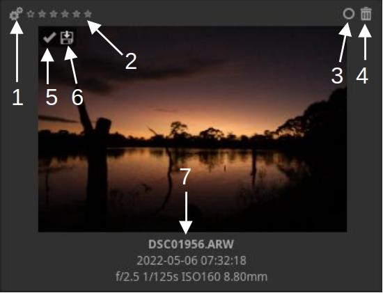

1. Feldolgozási sorba helyezés
2. Értékelés csillagozással
3. Színcímkék kezelése
4. Kukába helyezés, eltávolítás a kukából
5. Feldolgozott kép
6. Feldolgozási sorba helyezett/Mentett kép
7. Információk: fájl neve, készítés ideje, rekeszérték, záridő, ISO érzékenység, gyújtótávolság

A feldolgozott kép azt jelenti, hogy tartozik hozzá kísérőfájl.

A fenti ábrán Feldolgozási sorba helyezett, és Mentett képet láthatunk. A mentett kép azt jelenti, hogy a képfájl mentése (például a Feldolgozási soron keresztül) megtörtént.

A színcímkék kezelése gombra kattintva egy kis ablak jelenik meg, ennek segítségével kezelhetjük a színcímkéket. Egy képhez többféle színcímkét is választhatunk.

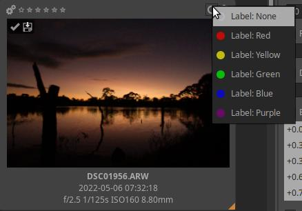

A selejtnek nyilvánított képeket vagy a bélyegképeknél látható kukába helyezés gombra kattintva, vagy több kijelölt kép esetén egyikükön jobb egérgombbal kattintva, és a helyi menüből a Fájlműveletek > Áthelyezés a kukába menüpontot választva helyezhetjük a kukába.

Ha egy képet a kukába helyeztünk, akkor megváltozik a jobb felső sarkánál lévő kuka gomb, és rákattintva kivehetjük képünket a kukából, helyreállítva a kukába helyezés előtti állapotot.

A kuka tartalmát az eszköztáron lévő gombra kattintva tekinthetjük meg.

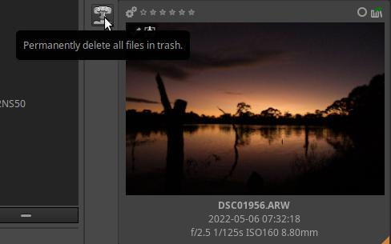

Ha a kuka tartalmát nézzük, akkor bal oldalon megjelenik egy új nyomógomb, amelyre kattintva az összes kukába helyezett képet törölhetjük a háttértárról (merevlemezről, memóriakártyáról, pendrive-ról stb.).

Az alapértelmezett nézethez történő visszatéréshez az eszköztáron az összes szűrőfeltétel kikapcsolása gombra kell kattintani.

A képeket a háttértárról a kuka használata nélkül is törölhetjük. Kattintsunk jobb egérgombbal egy képre vagy az egyik kijelölt képre (több kép kijelölése esetén), és válasszuk a helyi menüből a Fájlműveletek > Törlés lehetőséget. E véglegesen törli a háttértárról a kiválasztott képeket, és ha szeretnénk, akkor azok kísérő fájljait is. A törlendő kísérőfájlok kiterjesztésének listáját egy megjelenő ablakban adhatjuk meg.

###  3\.8\.3 Bélyegképek frissítése

Amikor megnyitunk egy mappát, amelyet még nem nyitottunk meg ART-ban, az ART a központi panelre bélyegképeket generál a mappában lévő fényképekről. Nyers fájlnál a beágyazott JPEG-kép alapján hozza létre a bélyegképet, képfájl esetén magából a képből állítja elő. Ez eltarthat egy ideig több száz fényképet tartalmazó mappában, de ez csak a mappa első megnyitásakor történik meg. Minden későbbi alkalommal, amikor egy korábban már megnyitott mappába lépünk, az ART a gyorsítótárból olvassa be a bélyegképeket, ha vannak, és ez sokkal gyorsabb lesz, mint a mappa első megnyitásakor.

A kép szerkesztésének megkezdése után a bélyegkép a Szerkesztő nézetben látható előnézetre cserélődik, és minden változtatás megjelenik a bélyegképen is.

A bélyegképek méretét nem célszerű megváltoztatni, mert a túl nagy bélyegképek fogyasztják a memóriát.

###  3\.8\.4 Helyi menü

Ha egy bélyegképre jobb egérgombbal kattintunk, akkor egy helyi menü jelenik meg.

A menüből gyorsan és egyszerűen érhetjük el a műveleteket, amelyek a következők:

-   Megnyitás szerkesztésre
-   Feldolgozási sorba helyezés
-   Feldolgozási sorba helyezés (gyors exportálás)
-   Összes kijelölése
-   Értékelés (csillagokkal)
-   Színcímke
-   Fájlműveletek
-   Feldolgozási profil műveletek
-   Dark-frame (Fekete referenciakép)
-   Flat-field referenciakép
-   Gyorsítótár

Amennyiben több képen szeretnénk ugyanazt a menüpontot alkalmazni, a bélyegképeket ki kell jelölni. A kijelölés szabványos billentyűkombinációkkal történik: Shift+kattintás egy tartomány kijelölése, Ctrl+kattintás egyes képek kijelölése, Ctrl+a pedig az összes kép kijelölése. A kijelölt bélyegképek keretének színe kissé világosabb lesz, jobb alsó sarkánál pedig egy kis narancssárga háromszög lesz látható.

###  3\.8\.5 Feldolgozásiprofil-műveletek

Az ART lehetővé teszi egy feldolgozási profil (eszközbeállítások gyűjteménye) részleges vagy teljes vágólapra másolását és beillesztését tetszőleges számú képre. Azt is lehetővé teszi, hogy tetszőleges számú képen egyszerre alkalmazzunk egy előre csomagolt (a programmal együtt kapott), általunk létrehozott, vagy semleges feldolgozási profilt. Ez nagyszerű lehetőségeket biztosít számunkra. Nézzük meg ezeket közelebbről.

Mindkét módszer (vágólapra másolt vagy elmentett profil alkalmazása) állományböngésző nézetben hajtható végre. Mindkét módszernél ki kell jelölnünk azokat a képeket, amelyekre alkalmazni szeretnénk a feldolgozási profilt.

A feldolgozási profil vágólapra másolása és beillesztése a kijelölt képekhez nagyon gyakori feladat. Tételezzük fel, hogy fényképsorozatot készítettünk, például stúdiófelvételeket, vagy esküvői portrékat, vagy fókuszeltolásos makrófotókat. A sorozat egyes képei nagyon hasonlóak lesznek egymáshoz, valószínűleg ugyanazzal az objektívvel, ugyanazzal az ISO értékkel, ugyanazzal a fehéregyensúllyal készültek, és a felvételeket ugyanarra a célra, ugyanarra a felhasználásra szántuk. Ez azt jelenti, hogy valószínűleg mindegyikhez ugyanazokra a feldolgozási beállításokra lesz szükség, ugyanazt a zajcsökkentést, ugyanazt az élesítést stb. kell rajtuk végrehajtani.

Úgy járunk el, hogy megnyitunk egy képet a sorozatból Szerkesztő nézetben, és ízlésünknek megfelelően feldolgozzuk. Ezután alkalmazzuk a kép feldolgozási profilját a sorozat összes többi képére. Ehhez Állományböngésző nézetbe lépünk, jobb egérgombbal kattintunk a feldolgozott képre, és kiválasztjuk a helyi menüből a Feldolgozási profil műveletek > Feldolgozási profil másolása menüpontot, majd kijelöljük azokat a képeket, amelyekre alkalmazni szeretnénk ezt a profilt, végül jobb egérgombbal valamelyik kijelölt képre kattintunk, és a helyi menüből kiválasztjuk a Feldolgozási profil műveletek > Feldolgozási profil beillesztése menüpontot. Ezzel mindegyik kijelölt képhez ugyanazt a feldolgozási profilt (ugyanazokat a szerkesztőeszköz-beállításokat) rendeltük hozzá.

Az ART azt is lehetővé teszi, hogy a vágólapra másolt feldolgozási profilnak csak egy részét alkalmazzuk (illesszük be) a kijelölt képeken, és ne az összeset. Például csak az átméretezés eszközt szeretnénk alkalmazni, hogy mindegyik képet ugyanakkorára méretezzen át az ART. Ennek elérésére a Feldolgozási profil műveletek > Feldolgozási profil beillesztése helyett a Feldolgozási profil műveletek > Részleges beillesztés menüpontot kell alkalmaznunk. A megjelenő ablakban kijelölhetjük, hogy mely szerkesztőeszközök beállításait szeretnénk alkalmazni.

A másik lehetőség egy előre csomagolt, egy általunk létrehozott, illetve egy semleges feldolgozási profil alkalmazása a kijelölt képeken. Ennek érdekében a kijelölt képek egyikén kattintsunk jobb egérgombbal, a helyi menüben válasszuk a Feldolgozási profil műveletek > Alkalmaz menüpontot, majd válasszuk ki az alkalmazni kívánt profilt.

Lehetőség van a kiválasztott profil részleges alkalmazására, ha az Alkalmaz menüpont helyett a Részlegesen alkalmaz menüpontot választjuk.

A feldolgozási profil műveletek a filmszalagon keresztül is elvégezhetők (a filmszalagról a szerkesztő nézetnél lesz szó).

###  3\.8\.6 Munkamenetek

Az ART támogatja munkamenetek alkalmazását is. Ennek az a fő célja, hogy megkönnyítse a Digikammal és más hasonló alkalmazásokkal történő integrációt, azonban egyéb célból is létrehozhatunk munkamenetet. A munkamenet a felhasználó által létrehozott ideiglenes képgyűjtemény, amelynek képei nem feltétlenül azonos mappában találhatók.

A bal oldali panelen látható Helyek részen belül találjuk a Munkamenet lehetőséget. Ha erre kattintunk, akkor az eszköztár felett megjelenik négy új gomb, amelyek segítségével betölthetünk egy elmentett munkamenetet, elmenthetünk egy létrehozott munkamenetet, hozzáadhatunk/eltávolíthatunk képet a munkamenethez/munkamenetből. Az ábrán felül láthatjuk a négy gombot.

Ha a + gombra kattintunk, akkor egy fájlválasztó ablak jelenik meg, és a Ctrl nyomva tartásával akár több hozzáadandó képet is kijelölhetünk.

Munkamenet mentésekor nevet adhatunk a munkamenetnek, és elmenthetjük azt az általunk kívánt helyre.

Az állományböngészőben kijelölt képeket az egyikre jobb egérgombbal történő kattintás után megjelenő helyi menüből a Fájlműveletek > Hozzáadás a munkamenethez menüponttal is hozzáadhatjuk a munkamenethez.

##  3\.9 Vizsgálat

A Vizsgálat (14) fülre kattintva a jobb oldali panelen azt a képet vizsgálhatjuk, amelynek bélyegképére rákattintottunk.

A fenti ábrán a Vizsgálat nézetet láthatjuk. A nagyobb előnézet érdekében a bal oldali panelt elrejtettem, a jobb oldali panelt belső oldalának húzásával annyira szélesítettem, hogy a középső panelen a bélyegképek csak egy oszlopban helyezkedjenek el.

Az ART az aktuális kinézetet az Állományböngésző, Feldolgozási sor, Szerkesztés, Szűrő, Vizsgálat nézetekhez külön-külön tárolja el. Ez azt jelenti, hogy ha például később ismét a Vizsgálat fülre kattintanánk, akkor azonnal visszakapnánk a fenti ábrán látható kinézetet. Nem kellene ismét elrejteni a bal oldali panelt, és nem kellene ismét szélesíteni a jobb oldali panelt, mert az ART megjegyzi a beállításokat.

Az ábrán az előnézet 100%-os nagyítású, alul az eszköztáron a "fényképezőgép" gomb bekapcsolt állapotú, amely azt jelenti, hogy a nyers fájlba beágyazott JPEG képet látjuk. Az előnézet az egérrel megfogható és vonszolható, 100% nagyítás esetén így tudjuk a kép minden részletét megtekinteni.

A vizsgált kép alatt egy eszköztár látható, amelynek segítségével kiválaszthatjuk a megjelenő információkat. Az egyes gombok funkciói balról jobbra:

-   Osztott nézet be-/kikapcsolása
-   Információ be-/kikapcsolása
-   Hisztogram be-/kikapcsolása
-   Fókusz maszk be-/kikapcsolása
-   Beágyazott előnézeti kép
-   Gyors nyers renderelés lineáris tónusgörbével
-   Gyors nyers renderelés filmszerű tónusgörbével
-   Gyors nyers renderelés árnyékokat kissé világosító tónusgörbével
-   Levágott nyers képpontok megjelenítése/elrejtése
-   Ablakhoz illesztés
-   Nagyítás 100%-ra
-   Színkezelés engedélyezése (színskála gomb)

A Vizsgálat a képek ellenőrzéséhez, minősítéséhez, selejtezéséhez nyújt segítséget.

A fenti ábrán az osztott nézetet láthatjuk. Ha rákattintunk az Osztott nézet gombra, akkor két ablak jelenik meg egymás mellett, az aktuális ablakot fehér keret jelzi. Az ablakot rákattintással tehetjük aktuálissá. Ha rákattintunk egy bélyegképre, az megjelenik az aktuális ablakban. Az osztott nézet lehetővé teszi képek összehasonlítását.

A fenti ábrán két teljesen különböző képet jelenítettem meg osztott nézetben, azonban inkább azonos témáról készült képek összehasonlítására érdemes használni. 

##  3\.10 Szerkesztő

A képszerkesztő segítségével nyers fájlokat vagy JPEG, TIFF, PNG és egyéb formátumú képfájlokat szerkeszthetünk. Az ART-ban lehetőségünk van a Beállítások > Általános lap > Szerkesztési módnál egyetlen szerkesztőlap módot vagy több szerkesztőlap módot választani. A több szerkesztőlap mód erős gépet és sok memóriát igényel. Ezt hagyjuk alapértelmezett értéken (az első lehetőség). Ez azt jelenti, hogy egyidejűleg csak egy képet szerkeszthetünk. Csak ezzel a lehetőséggel foglalkozunk a továbbiakban.

Ha monitorunk felbontása nem elég nagy ahhoz, hogy az eszköztárak minden eleme elférjen rajta, akkor ha az egérmutatót az eszköztár fölé visszük, az egér görgőjével jobbra-balra mozgathatjuk az eszköztár elemeit, és így minden lehetőséghez hozzáférünk.

Az alábbi ábrán az ART Szerkesztő nézetét láthatjuk.

1. Navigátor
2. Felső eszköztár
3. Hisztogram
4. Előzmények
5. Előnézet
6. Feldolgozási profilok
7. Szerkesztőeszközök csoportjai
8. Kiválasztott csoport szerkesztőeszközei
9. Pillanatképek
10. Filmszalag
11. Alsó eszköztár

Tekintsük át röviden az ART alapértelmezett Szerkesztő nézetének elemeit.

###  3\.10\.1 Előnézet

A középső nagy panelen a szerkesztett kép előnézete (előnézeti kép) (5) látható. Ezen követhetjük nyomon a szerkesztés során tett módosításaink képre gyakorolt hatását. Az előnézetet az egér görgőjével nagyíthatjuk/kicsinyíthetjük, ha az egérmutató felette áll.

###  3\.10\.2 Navigátor

A bal oldali panelen felül a Navigátor (1) található. A Navigátoron nyomon követhetjük, hogy a teljes kép mely részlete látható az előnézeten, és láthatjuk az egérmutatónál lévő képpontok színadatait RGB, LCH, és L\*a\*b\* színrendszerben.

A Navigátorban az L\*a\*b\* kivételével a számértékekre kattintva válthatunk a kijelzés formátuma között. Az RGB értékek vagy \[0...255\], vagy \[0...1\] tartományban, vagy \[%\]-ban kifejezve kerülhetnek kijelzésre. Az LCH értékek vagy \[0...255\], vagy \[0...1\] tartományban, vagy a H érték fokban, a másik kettő pedig %-ban kifejezve.

Ha nem fér el az előnézeten rendelkezésre álló helyen a teljes kép (mert felnagyítottuk), akkor a navigátoron lévő képen egy piros keret jelzi az előnézeten látható képrészletet. Ezt a piros keretet az egérrel a kép kívánt helyére húzhatjuk, és a piros keretben látható képrészlet lesz látható az előnézeten.

###  3\.10\.3 Felső eszköztár

A felső eszköztár (2) gombjai segítségével számos hasznos funkciót kapcsolhatunk be-/ki. Nézzük meg a gombok funkcióit balról jobbra.

A bal szélén láthatjuk a bal oldali panel elrejtése/megjelenítése gombot, majd a képinformáció ki-/bekapcsolására szolgáló gombot.

Mellette láthatjuk az előtte/utána nézet ki-/bekapcsolására szolgáló gombot. Ennek nemcsak akkor van értelme, ha vannak pillanatképeink, hanem bármikor szerkesztés közben.

Az ábrán az "Előtte" szó mellett láthatjuk a feloldás/zárolás ("lakat") gombot. Ha az előtte nézet zárolva van, akkor nem változik. Ha fel van oldva, akkor egy lépéssel lemaradva követi szerkesztésünket. Ilyenkor az utána képen az aktuális állapot, az előtte képen az utolsó szerkesztési művelet előtti állapot látható.

A mellette látható gombokkal néhány feldolgozást segítő eszköz gyorsan elérhető.

Balra a nyíl eszközt láthatjuk, ez eredményezi a nyíl alakú egérmutatót.

Utána a fehéregyensúly kijelölésére szolgáló eszköz következik. Rákattintva aktivizálható, és ekkor a Fehéregyensúly szerkesztőeszköz nyílik meg a jobb oldali panelen. Aktivizálás után egy olyan területet kell keresni a képen, amely a valóságban semleges színű fehér vagy szürke. Ha erre kattintunk, akkor az ART úgy változtatja meg a színeket, hogy a mintavétel területe semleges színű legyen (ne legyen elszíneződött).

Mellette a színválasztó ki-/bekapcsoló gombját láthatjuk.

Bekapcsolása után egérkattintással helyezhetünk el a kép különböző helyeire színválasztókat, amelyeket az egérrel a kívánt helyre húzhatunk, akár utólag is. A kis kör alakú terület alatti színt választjuk ki segítségével. Egy színválasztót rajta jobb egérgombbal kattintva törölhetünk. Az egyik színválasztón történő Ctrl+Shift+jobb kattintás törli az összes színválasztót. A színválasztókon kívüli területen a jobb egérgombbal kattintva visszatérünk a nyíl módhoz. Ugyanez történik akkor is, ha a színválasztó ki-/bekapcsoló gombjára kattintunk. A színválasztó a kiválasztott szín aktuális RGB értékeit mutatja. A színválasztókkal figyelemmel kísérhetjük a kiválasztott színek változását szerkesztés közben.

A következő a kivágás gomb. Rákattintva az előnézeten az egérrel létrehozhatjuk a kivágást, és a jobb oldali panelen a Kivágás eszköz nyílik meg.

Ezt követi a vízszintes/függőleges vonal kijelölése gomb. Rákattintva aktivizálódik. Utána rá kell kattintani például a horizont egyik végére, lenyomva tartás mellett végighúzzuk a vonalat, majd amikor a végét is pontosan a kívánt helyre illesztettük, felengedjük az egérgombot. Ha ferde horizonton alkalmazzuk, az ART úgy forgatja el a képet, hogy a horizont vízszintes legyen. Az elforgatás miatt a szükséges részt le is vágja a képről. Függőleges objektum esetén teljesen hasonlóan működik. Segítségével például egy ferdére sikerült tornyot korrigálhatunk.

  
*A fényképet a szerző készítette*

A fenti ábrán a horizonton látszik az eszközzel történt kijelölés. Leolvashatjuk annak ferdeségét is fokokban. Az alábbi ábrán láthatjuk az eredményt.

Ebből a csoportból az utolsó gomb a perspektíva-korrekciót aktivizálja. Bekapcsolva a jobb oldali panelen az Átalakítás eszközcsoportba jutunk.

Az eszköztár következő csoportját az alábbi ábrán láthatjuk:

A bal oldalon lévő három "kapcsolóval" az előnézet hátterének színét változtathatjuk meg. Lehet fekete, szürke, vagy fehér. Segítségével többféle háttérrel nézhetjük meg, hogy képünk hogyan néz ki. A szerkesztéshez a szürkét célszerű használni.

A jobb oldali négy kapcsolóval az előnézet R, G, és B színcsatornáinak világosságértékeit jeleníthetjük meg, illetve fényerő előnézeti módban tekinthetjük meg a képet. Fekete-fehér képeket látunk, mert a világosságértékek nem a színekről szólnak.

Az egyes csatornák előnézete hasznos lehet az RGB-görbék szerkesztésénél, a fekete-fehér konverzió tervezésénél, a képzaj kiértékelésénél stb. Ha a képen esetleg problémát észlelünk, megtudhatjuk, melyik csatorna vágása okozhatja azt. A fényerősség előnézeti mód segíthet a kép azonnali fekete-fehérben történő megtekintésében a szerkesztési paraméterek megváltoztatása nélkül.

Az ábrán az egyes képeknél felül láthatjuk a kapcsolók állását. Balról jobbra láthatjuk a vörös (R), a zöld (G), és a kék (B) színcsatornák világosságértékeit, végül a fényerő előnézeti mód eredményét. Például a vörös színcsatorna fekete-fehér képén minden képpont világossága azzal arányos, amilyen értékű ugyanazon képpont vörös színcsatornája a színes képen.

Az eszköztár következő csoportját az alábbi ábrán láthatjuk:

A bal oldali gomb az expozíciót jeleníti meg hamis színekkel. Ha bekapcsoljuk, akkor a gomb színesre vált, mutatja, hogy milyen expozíciós szinthez milyen szín tartozik az előnézeten.

A fenti ábrán a hamis színek IRE értékei láthatók. Az előnézeten a különböző fényerősségű értékeket különböző színek jelölik, amelynek az a célja, hogy a kép minden részének expozíciós szintjéről pontos információt kaphassunk.

A fehér szín a feketéket, a vörös szín a csúcsfényeket, a közepes szürke a középszürkét jelképezi.

Mellette a fókuszmaszk előnézetének kapcsolója látható. Ha bekapcsoljuk, az előnézeten zölddel jelzi a legélesebb területeket. Ajánlatos az előnézet 10-30%-os nagyítása mellett használni.

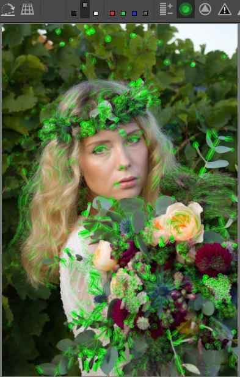

A fókuszmaszk előnézete alapján ne selejtezzünk képet, mert ez arra nem alkalmas, és esetleg olyan képet is leselejtezünk, (törlünk), amely valójában elég éles.

A következő gombra kattintva az élesítési kontraszt maszkot kapcsolhatjuk be.

Ez csak akkor működik, ha az Élesítés szerkesztőeszközt engedélyeztük a Részletek eszközcsoportban. A maszkot az Élesítés eszközben finomítani lehet. A maszk dönti el, hogy a kép mely részleteit érinti az élesítés. A fehér részek lesznek élesítve. Például a szép háttérelmosás homályos területeit nem kell élesíteni, mert ott csak a képzajt emelnénk ki még jobban.

A következő gombra kattintva láthatóvá válnak az alulexponált (vágott) területek. Kiemeli azokat a területeket, ahol mindhárom színcsatorna értéke a küszöbérték alatti, illetve legfeljebb elérte a küszöbértéket. Az alapértelmezett küszöbérték 8.

Majdnem három fényértéknyi negatív expozíció-kompenzációt alkalmaztam a képen, hogy be tudjam mutatni a gomb hatását. A fenti ábrán az alulexponált területek fehér foltokkal kerültek kiemelésre.

Végül az utolsó gombra kattintva a túlexponált (vágott) területeket láthatjuk. Azokat a területeket emeli ki, ahol legalább az egyik színcsatorna értéke elérte vagy meghaladta a küszöbértéket. Az alapértelmezett küszöbérték 253. Ha csak azokat a területeket szeretnénk látni, ahol az összes színcsatorna értéke elérte vagy meghaladta a küszöbértéket, akkor engedélyezni kell a fényerő előnézeti módot is.

Pozitív expozíció-kompenzációt kellett alkalmaznom a képen a hatás bemutatásához. Az ábra bal oldali képén csak a túlexpozíció-jelzőt kapcsoltam be (ez felül látható is). A túlexpozíció-jelző fekete színnel jelzi az előnézeten a fenti feltételeknek megfelelő területeket. Ezen a képen fenn az égbolton, a lány vállánál, és a virágokon láthatjuk a fekete foltokat, amelyek azt jelzik, hogy azokon a helyeken legalább az egyik színcsatorna elérte vagy meghaladta a küszöbértéket. A jobb oldali képen engedélyeztem a fényerő előnézeti módot is, ezért csak azokat a helyeket jelzi vörös foltokkal, ahol mindhárom színcsatorna elérte vagy meghaladta a küszöbértéket. Láthatjuk, hogy több helyen csökkent a jelzés területe, csak kisebb területeken érte el vagy haladta meg mindhárom színcsatorna a küszöbértéket. 

A küszöbértékek a Beállítások Általános lapján, a Vágás jelzése részben megváltoztathatók.

Ne feledjük, hogy a küszöbértékeket elérő vagy az alatti/feletti sötét/világos képpontok ugyanúgy a kép részét képezhetik, mint bármely más világosságú képpont. A mennyiségük nem mindegy. Az nem jó, ha szándékaink ellenére túl nagy terület lesz részlettelen fekete, vagy részlettelen, és esetleg még el is színeződött fehér.

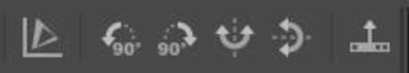

A következő gombot Színskála gombnak nevezzük. Ha kikapcsolt állapotban van (ez az alapértelmezés), akkor a gamma-korrigált (nem lineáris) kimeneti profil szerinti adatok jelennek meg a Hisztogramon és a Navigátoron, ha engedélyezzük, akkor a lineáris munkaprofil szerinti adatok. Az ART alapértelmezett munkaprofilja a Rec.2020. Ennek a gombnak nincs hatása a nyers hisztogramra, de hatással van az alulexpozíció- és túlexpozíció-jelző által mutatottakra.

A következő gombcsoporttal a képet 90 fokkal elforgathatjuk, illetve függőlegesen és/vagy vízszintesen tükrözhetjük.

Végül az eszköztár utolsó gombja segítségével a Filmszalagot elrejthetjük/megjeleníthetjük. Amikor szerkesztünk egy képet, akkor nincs szükség a Filmszalagra.

###  3\.10\.4 Hisztogram

A jobb oldali panelen felül látható a hisztogram (3). A hisztogram helyén a hisztogramon kívül többféle diagramot meg lehet jeleníteni, hullámforma diagramot, és vektornézet diagramokat.

  
*Az ART RGB hisztogramja*

1. Hisztogram megjelenítése
2. Nyers hisztogram megjelenítése (vörös, zöld, és kék színcsatornák, a forrás nyers fájlon történő Színrekonstrukció végrehajtása előtt)
3. RGB egymás mellett diagram
4. Hullámforma diagram megjelenítése
5. Színezet - telítettség vektornézet
6. Színezet - színesség vektornézet
7. Bal oldali gomboszlop megjelenítése/elrejtése
8. Vörös színcsatorna megjelenítése/elrejtése
9. Zöld színcsatorna megjelenítése/elrejtése
10. Kék színcsatorna megjelenítése/elrejtése
11. L\*a\*b\* világosság (L\*) hisztogram megjelenítése/elrejtése
12. Színesség (chromaticity) hisztogram megjelenítése/elrejtése
13. Váltja a hisztogram lineáris-lineáris, logaritmikus-lineáris, és logaritmikus-logaritmikus skála szerinti megjelenítését
14. Jelzősáv megjelenítése/elrejtése
15. Jelzősáv (annak a képpontnak az értékeit mutatja, amelyre az  egérmutató mutat az előnézeten)
16. Csúcsfényvágásjelző
17. Árnyékvágásjelző
18. Bal szélső oszlop, részlettelen feketék
19. Árnyékok
20. Középtónusok
21. Csúcsfények
22. Jobb szélső oszlop, részlettelen fehérek
23. Az egérmutató alatt lévő képpont kék csatornája
24. Az egérmutató alatt lévő képpont zöld csatornája
25. Az egérmutató alatt lévő képpont vörös csatornája

####  3\.10\.4\.1 Hisztogram

*A hisztogramon azt láthatjuk, hogy képünk technikai értelemben helyesen exponált-e, valamint mennyire kontrasztos.*

*A hisztogram ismerete alapvető fontosságú, és nagyon hasznos is, mert segítségével láthatjuk a kép bizonyos problémáit, függetlenül monitorunk képminőségétől, és attól, hogy jól vagy rosszul kalibrált-e.*

A hisztogram egy oszlopdiagram. Szorosan egymás mellett 256 darab függőleges oszlopot tartalmaz. Az oszlopok összeérnek egymással, nincs közöttük távolság. A fenti ábrán alul a tónusskálát láthatjuk, ez az ART-ban nem jelenik meg, csak oda kell képzelnünk. A tónusskála a lehetséges világosságértékek tartománya. A képen megjeleníthető világosság-értékeknek felelnek meg az egyes oszlopok.

A hisztogram a bemeneti kép bitmélységétől (felbontásától) függetlenül mindig 256 oszlopos. A bemeneti kép lehetséges árnyalattartománya mindig 256 részre van osztva, és emiatt egy oszlopban sohasem egy konkrét árnyalatú, hanem egy árnyalattartományba eső képpontok száma látható a hisztogramon.

A bal oldali szélső oszlop jelképezi a legsötétebb árnyalatokat (18), a jobb oldali szélső oszlop a legvilágosabbakat(22), a többi a köztes értékeket. Az egyes oszlopok magassága azzal arányos, hogy az adott világosságú képpontból hányat tartalmaz a kép. Ha nem tartalmaz egyet sem, akkor az az oszlop üres lesz, ha keveset tartalmaz, akkor alacsonyabb, ha sokat, akkor magasabb lesz az oszlop.

Ha a jobb szélső oszlop (22) nagyon magas, az azt jelenti, hogy nagyon sok képpont maximális világosságértékű, amely a csúcsfények vágására utalhat. A csak maximális világosságértékű képpontokat tartalmazó területek részlettelen fehérek lesznek (kiégett területek). A csúcsfények vágására figyelmeztet a hisztogram jobb felső sarkában látható Csúcsfényvágásjelző is (16), az ábrán mindhárom csatorna vágását jelzi.

Ha a bal szélső oszlop (18) nagyon magas, az azt jelenti, hogy nagyon sok képpont minimális világosságértékű, amely az árnyékok vágására utalhat. A csak minimális világosságértékű képpontokat tartalmazó területek részlettelen feketék lesznek (bebukott területek). Az árnyékok vágására figyelmeztet a hisztogram bal felső sarkában látható Árnyékvágásjelző is (16), az ábrán a zöld és kék csatorna vágását jelzi.

A legsötétebb, és a legvilágosabb árnyalatok is részei lehetnek a képnek. A problémát az jelenti, ha ezeknek a képpontoknak a száma túlságosan nagy, mert az vágásra utalhat. Ha kevés képpontnak van maximális vagy minimális értéke, és nem látunk zavaróan kiégett vagy bebukott területeket a képen, akkor nincs probléma.

Ha a hisztogram diagramján jelentős számban található képpont az első oszlopban is (a diagram "nekifekszik" a hisztogram bal szélének), és a diagram jobb oldala üres, nincsenek azokhoz a világosságértékekhez tartozó képpontok, akkor a kép technikai értelemben alulexponált. Ilyenkor a bal szélső oszlopba tartozó képrészek részlettelen feketék lesznek. Minél magasabb a szélső oszlop, a kép annál nagyobb része lesz ilyen.

Ha a diagram "nekifekszik" a hisztogram jobb oldalának, és a bal oldali oszlopok üresek, akkor a kép technikai értelemben túlexponált.

Ha az oszlopok vízszintesen jól kitöltik a hisztogramot, azaz egyaránt vannak a bal szélső oszlophoz és a jobb szélső oszlophoz közeli oszlopok is, akkor képünk kontrasztja nagy. Ha az oszlopok vízszintesen csak a hisztogram egy részét töltik ki, és a kitöltött rész mellett egyik vagy mindkét oldalon a hisztogram széléig csak üres oszlopok vannak, akkor képünk kontrasztja kisebb.

A fenti ábrán bal oldalon egy kis kontrasztú kép világosság hisztogramját láthatjuk. A nem üres oszlopok a hisztogram közepén helyezkednek el, vízszintesen csak egy kisebb részt foglalnak el. A kép összes képpontja a teljes tónustartománynak egy kisebb tartományában helyezkedik el. A kép kontrasztja kicsi, mert a legsötétebb és legvilágosabb képpontok világosságkülönbsége kicsi (alul az x tengelyen). Az oszlopok magasak, mert a kép összes képpontja a tónusoknak ebben a szűkebb tartományában helyezkedik el.

Az ábrán jobb oldalon a kontraszt megnövelése után kapott hisztogramot láthatjuk. Az oszlopok most már sokkal jobban kitöltik vízszintesen a hisztogramot, a legsötétebb és a legvilágosabb tónus között sokkal nagyobb lett a világosságkülönbség. A képpontok világossága jóval több oszlop között került szétosztásra, ezért egy adott oszlopba tartozó (adott világosságú) képpontok száma kevesebb lett, az oszlopok alacsonyabbak lettek.

Az, hogy milyen világosságú képpontból mennyi található a képen, a lefényképezett témától nagymértékben függ. Sötét téma esetén sok képpontnak lesz kis világosságértéke (magas bal oldali oszlopok), és fordítva. Éppen ezért nincs olyan, hogy "ideális alakú hisztogram". Az lenne az ideális, ha se túlexponált, se alulexponált részek nem lennének, és minden a megszokott vagy a megkívánt világosságú lenne a képen.

Szemünk sokkal inkább elviseli a bebukott (vágott) sötét árnyalatokat, mint a kiégett (vágott) csúcsfényeket, ezért ha választani kell, inkább a kiégett csúcsfényeket kerüljük el.

A Jelzősávon (15) annak a képpontnak az értékeit láthatjuk, amelyre az egérmutató mutat az előnézeten. A fenti ábrán RGB hisztogramot láthatunk, a Jelzősáv ennek megfelelően a képpont R (25), G (24), és B (23) világosságértékeinek helyét jelzi. Segítségével például meg tudjuk állapítani, hogy a hisztogramon egy csúcsot a kép mely részei okozzák, hol vannak a kép legsötétebb és legvilágosabb árnyalatai stb.

Logaritmikus/Lineáris megjelenítés a (13) gombra kattintva váltható, amely az alábbi háromféle lehet:

-   Lineáris mód: A függőleges rácsvonalak (x tengely) nem lineáris skálázásúak, hanem fényértékeknek felelnek meg - balról jobbra minden rácsvonallal megduplázódik az érték, ezért van függőleges rácsvonal az 1, 3, 7, 15, 31, 63 és 127 értékeknél. A vízszintes rácsvonalak (y tengely) lineáris skálázásúak.

-   Logaritmikus-lineáris mód: Az x tengely és a függőleges rácsvonalak logaritmikus skálázásúak. A vízszintes rácsvonalak (y tengely) lineáris skálázásúak.

-   Logaritmikus-logaritmikus mód: Mind az x-, mind az y-tengely logaritmikus skálázású.

A háromféle megjelenítési mód közül azt válasszuk, amelynél legjobban áttekinthető a diagram.

A hisztogram egyidejűleg a következők közül egyet vagy többet mutathat:

-   Vörös színcsatorna (8)
-   Zöld színcsatorna (9)
-   Kék színcsatorna (10)
-   L\*a\*b\* világosság (L\*) (11)
-   Színesség (12)
-   Nyers hisztogram (2)

A világosság hisztogram valóban a hisztogram oszlopait mutatja. A vörös, zöld, kék csatornák hisztogramjánál, valamint a színesség hisztogramnál nem az oszlopokat láthatjuk, hanem csak az egyes oszlopok tetejét összekötő színes grafikonvonalakat.

A hisztogram a felsorolt diagramokat mutatja a gamma-korrigált kimeneti profil használatával, ha a Színskála gomb le van tiltva (alapértelmezett), vagy a munkaprofil szerint mutatja, ha a gomb engedélyezett. Ennek a gombnak az állapota a Navigátoron megjelenő értékekre, valamint a bebukott árnyékok, és kiégett csúcsfények jelzőire is hatással van, de nincs hatással a nyers hisztogramra.

Az ART csővezetékénél láttuk, hogy a képadatok szerkesztőeszközről szerkesztőeszközre egy irányban áramlanak. A legtöbb szerkesztőeszköz befolyásolja a színadatokat, a kép tónusait. Alapértelmezés szerint a hisztogram a feldolgozás végén megjelenő adatokat jeleníti meg. Az ART-ban lehetséges az Előzmények tetszőleges sorára kattintva, a szerkesztés közbülső állapotaiban is megnézni a hisztogramot. A Színskála gomb engedélyezésével már a korai szakaszban elérhetjük az adatokat, amikor azokat a Munkaprofil színterébe konvertálja az ART. A nyers hisztogram segítségével megnézhetjük a Színrekonstrukció alkalmazása előtti nyers adatokat is.

A nyers hisztogramok a Fekete szint kivonása után mutatják az értékeket. A hisztogram jobb vége a Fehér szinten van rögzítve. A nyers hisztogramokat az észlelt fekete és fehér szintek, valamint a fekete és fehér szint felhasználó által történt beállításai befolyásolják.

A nyers hisztogram vizsgálatakor érdemes a Színrekonstrukció módszert "Nincs (érzékelőmintázatot mutat)" értékre állítani, így nézhetjük meg a Színrekonstrukció alkalmazása előtti adatokat. Ez felfedi az elemi érzékelők előtti színszűrőket az előnézeten. Ha nem történik Színrekonstrukció, akkor az R, G, B nyers hisztogramok a nyers fájl adatai alapján a vörös, a zöld, és a kék színcsatornák adatait mutatják, a nyers fájlon történő Színrekonstrukció végrehajtása előtt. A Színrekonstrukció előtt még nincsenek színek, csak a különböző színű színszűrők alatti elemi érzékelőkből kiolvasott, az exponáláskor az elemi érzékelőt ért fénymennyiséggel arányos értékek vannak. A vörös (Bayer vagy X-Trans) színszűrők alatti elemi érzékelők értékei alkotják a vörös nyers hisztogramot, a zöld színszűrők alattiak értékei a zöld hisztogramot, a kék színszűrők alattiak értékei pedig a kék hisztogramot.

Ilyenkor a Navigátor panelen annak a képpontnak a nyers RGB-értékei jelennek meg, amelyre az egérmutató mutat. Ha például zöld szűrő alatti elemi érzékelő adatait nézzük, akkor csak a zöld csatornának van nullától különböző értéke, a másik kettő színcsatorna értéke nulla, és ez így van a vörös vagy kék színszűrők alatti elemi érzékelőknél is. Ezeket az értékeket befolyásolják az észlelt fekete-fehér szintek, valamint a felhasználó által az ART-ban végzett feketeszint-beállítások, de nem befolyásolják a felhasználó által az ART-ban végzett fehérszint-beállítások (fehérpont-korrekciók).

A fenti ábrán azt láthatjuk, hogy a Raw eszközcsoportban a Színrekonstrukció módszert a "Nincs (érzékelőmintázatot mutat)" kiválasztásával kikapcsoltam, és az előnézetet felnagyítottam 1600x-osra. Az alábbi megállapításokat tehetjük ezzel kapcsolatban:

-   Közvetlenül a nyers fájl adatait láthatjuk.
-   Láthatóvá vált a Bayer-féle színszűrő mintázata, az ábrán a vörös, zöld, és kék színszűrők ugyanúgy helyezkednek el a képpontok előtt, ahogyan a képérzékelő elemi érzékelői előtt elhelyezkedtek a felvétel elkészítésekor.
-   Nyilvánvaló, hogy a nyers fájlban arra vonatkozóan is van információ, hogy mely képpont elemi érzékelője előtt milyen színű színszűrő volt felvételkészítéskor.
-   Az elemi érzékelő csak az előtte lévő színszűrő szerinti színt érzékelte, és a érzékelt fénymennyiséggel arányos jel volt kiolvasható belőle. Ezt a kiolvasott értéket digitalizált formában tárolja minden egyes képpont tekintetében a nyers fájl.
-   Az ábrán az egérmutató egy olyan képpontra mutat, amely előtt kék szűrő volt, és ebből azt is lehet tudni, hogy a nyers fájlban ehhez a képponthoz tárolt érték a kék csatorna értéke. A Navigátoron látható is, hogy a kék csatorna 220 értékű, a másik két csatorna értéke nulla.
-   A nyers RGB hisztogram a vörös, zöld, és kék szűrővel rendelkező képpontok R, G, B értékeit ábrázolja (a másik két csatorna értéke mindig nulla) (az ábrán a hisztogram nem látható).
-   Az előnézeten az egyes képpontok a nyers fájlban tárolt világosságértékükkel arányos világosságú vörös, zöld, vagy kék színnel jelennek meg. A navigátoron láthatjuk, hogy az előnézet zöld színű. Ez azért van, mert kétszer annyi zöld szűrő van, mint vörös, vagy kék.

####  3\.10\.4\.2 A kép és hisztogramja

A fenti ábrán R, G, B, és fényerő hisztogramot láthatunk. Láthatjuk, hogy a kép különböző világosságú területei hol jelennek meg a hisztogramon (mely oszlopok mutatják az olyan világosságú képpontok számát). Minél sötétebb a terület, annál közelebb van a hisztogram bal oldali széléhez, minél világosabb a terület, annál közelebb van a jobb széléhez. A kép jobb alsó sarkában egy nagyobb méretű kiégett, részlettelen fehér területet láthatunk (a piros nyílnál). Ez a hisztogram jobb szélső oszlopában jelenik meg. Itt az árnyalatok vágása történt, mert a valóságban a témának ezen a részén is voltak részletek, azonban ezek világosságértékei jelen körülmények között meghaladják az átvihető árnyalatterjedelem felső határát, ezért ezek a képpontok a maximális értékre konvertálódtak, holott annál nagyobbnak kellene lenniük, de ez nem lehetséges. A jobb felső sarokban a Csúcsfényvágásjelző jelzi is, hogy mindhárom színcsatornánál, illetve a fényerő hisztogramnál egyaránt vágást tapasztalhatunk.

  
*Az előző ábrán látható kép hisztogramjai*

A fenti ábrán az azt megelőző ábrán látható fénykép fényerő- és színcsatornánkénti (R, G, és B) hisztogramjait láthatjuk. Megfigyelhetjük, hogy a jobb szélső oszlop mindegyiken nagyon magas, szinte az egekbe tör. Ez azt jelenti, hogy nagy terület részlettelen fehér. Ezeken a területeken mindegyik színcsatorna tekintetében vágás történt.

  
*A fényképet a szerző készítette*

Ezen a képen a hisztogram kiemelkedő széles részét a közepes árnyalatoknál a zöld vízfelület okozza, hiszen ez a legnagyobb területű (legtöbb képpont) a képen. A hisztogramon ettől balra látható alacsonyabb oszlopok a kép sötétebb képpontjai, például a madár csőre, a madár sötét háta, mögötte az árnyék. A csúcstól jobbra eső alacsony oszlopok a világosabb területeknek felelnek meg, például a madár világos tollainak. A hisztogramon látható, hogy sötét és főleg világos képpontból nincs túl sok.

  
*A fényképet a szerző készítette*

Ezen a képen sok a sötét és a fekete felület, ez meg is jelenik a hisztogram bal oldalánál lévő csúcs formájában. Ezen a részen magasak az oszlopok, amely azt jelzi, hogy sok sötét képpont van. Világos képpont jóval kevesebb található, ezért a hisztogram jobb oldalánál az oszlopok alacsonyak. A hisztogram bal szélső és a jobb szélső oszlopa üres, tehát a kép technikai értelemben nincs se túlexponálva, se alulexponálva, azonban vízszintesen jól kitölti a diagramot, tehát a kép kontrasztja nagy.

  
*A fényképet a szerző készítette*

Ez a felvétel technikai értelemben jól exponált, a bal és a jobb szélső oszlop üres. A víz kék felülete és a zöld levelek a legnagyobb felületűek. A nagy csúcsot a nagy sötétkék vízfelület okozza, a tőle jobbra lévő két kis csúcsot a levelek. A nagy csúcstól balra lévő sötét részek a vízen látható sötét részeknek felelnek meg. A nagy csúcstól jobbra lévő kettős csúcs utáni alacsony oszlopmagasságú világosabb részek a virág alsó szirmai, az ettől jobbra lévő, kissé kiemelkedő szakasz a virág többi részének felel meg.

  
*A fényképet a szerző készítette*

A téma vízszintesen majdnem teljesen kitölti a hisztogramot, tehát a kontraszt nagy. A fényerő hisztogram alapján úgy tűnik, hogy a kép nincs túlexponálva.

Az ART azonban feketével jelzi a kiégett (túlexponált, vágott) területeket. Meglepően sok van belőlük. Ilyenkor meg kell nézni a kép egyes színcsatornáit.

A zöld és a kék színcsatornánál nincs probléma. A fenti ábrán a vörös színcsatornát láthatjuk. Itt van a probléma, amelyet a vörös színcsatorna túlexpozíciója (vágása) okoz. A vörös színcsatorna túlexponált területeit vörös színnel jelzi az ART. Ha valamely színcsatorna túlexponálódott, akkor a túlexponált területeken színeltolódást tapasztalhatunk. Nézzük meg, hogy miben nyilvánul ez meg. A legelöl lévő nagy virágon sok túlexponált terület van, a mögötte lévő kis virágon alig van ilyen.

Nézzük meg a fenti ábrán ezt a két virágot. Azt láthatjuk, hogy a nagy virág színe a túlexponált részeken fakóbb, kevésbé erőteljes narancssárga, míg a mögötte lévő nem túlexponált kis virágon erőteljesebb, sötétebb. Ugyanez megfigyelhető a bal oldali virágokon is. Azokon a területeken, ahol az előző ábrán vörössel jelölt terület található, ott ezen az ábrán a virágszirom világosabb, fakóbb, közvetlen mellette, ahol már az előző képen nincs vörös jelzés, ott a szirom színe erőteljesebb, kevésbé fakó. Ezt a színeltolódást eredményezte a vörös csatorna túlexponáltsága, vágása.

Ezen a képen láthatjuk, hogy ha a világosság hisztogram mellett megjelenítjük a három színcsatorna hisztogramját is, akkor láthatjuk a túlexpozíciót, hiszen a vörös csatorna grafikonja a jobb szélen nagyon magasra tör.

Ennek a képnek a hisztogramján megfigyelhetjük, hogy nemcsak a vörös színcsatorna magas a jobb szélső oszlopban, hanem a hisztogram bal szélénél a kék színcsatorna is igencsak magas, azaz vannak a kék színcsatorna szempontjából alulexponált, vágott képpontok nem is kis számban.

Arra következtethetünk, hogy hiába nem mutatott a világosság hisztogram se túl- se alulexpozíciót, a kék és a vörös színcsatornát tekintve ezen a képen vágás történik. Ezt a színcsatornánkénti hisztogramon tudjuk jól megfigyelni. A vágás katasztrofális hibát nem okoz, azonban színeltolódást eredményez a kép bizonyos részein.

####  3\.10\.4\.3 Az előnézet, a Navigátor és a Hisztogram együttműködése

Nézzük meg az előnézet, a Navigátor és a Hisztogram együttműködését.

A fenti ábrán az R, G, B színcsatornák hisztogramja, és a fényerő hisztogram kijelzése is be van kapcsolva. A bal oldalon a hisztogram alatt sárga nyíl mutatja a jelzősávot, amelyen jelen esetben négy kis vonalat látunk, egy vöröset, egy zöldet, egy kéket és egy fehéret. Láthatjuk az egérmutatót az, amelyet az előnézeten a sárga virágra állítottam. A Navigátor ennek a pontnak az adatait jelzi ki, többek között az adott pontra vonatkozó R, G, B színcsatornák értékeit, az LCH, és az L\*a\*b\* értékeket, amelyek közül az L\* az adott pont világosságának értéke. A hisztogramon 256 oszlop jeleníthető meg. A vörös, zöld, és kék csatorna az RGB értékek szerinti helyen jelenik meg a jelzősávon. Az L\* legkisebb értéke 0, legnagyobb értéke 100. Ezt figyelembe véve jelenik meg a jelzősávon az L\* értékét jelképező fehér vonalka.

Ne feledjük, hogy a Színskála gomb állapota befolyásolja az eredményt. Ha kikapcsolt állapotban van, akkor gamma-korrigált kimeneti profil szerinti adatok jelennek meg a Hisztogramon és a Navigátor modulon, ha engedélyezzük, akkor pedig a munkaprofil szerinti adatok.

####  3\.10\.4\.4 A vágás okának megállapítása

Ha a hisztogram vágást mutat (az első vagy az utolsó oszlop túl magas), akkor először azt állapítsuk meg, hogy hol történik a vágás. Ellenőrizzük a nyers hisztogramot, le van-e vágva valamelyik csatorna? Ha igen, akkor nézzük meg ezeknek a képpontoknak az R, G, B, és L\* értékeinek helyét a hisztogram jelzősávján. Talán a csúcsfények rekonstrukciója segíthet. Ha a nyers hisztogramok nincsenek vágva, akkor a feldolgozás valamely szakasza okoz vágást. Győződjünk meg arról, hogy a munkaprofil tartománya elég nagy-e, azáltal, hogy engedélyezzük a színskála gombot. Ha a feldolgozási színprofil nem okoz vágást (az alapértelmezett feldolgozási színprofil a Rec2020, amely minden bizonnyal elég nagy tartományú), akkor valószínűleg a saját beállításaink okozzák a problémát. Az Előzményekben vissza tudunk ideiglenesen lépni, hogy láthassuk, mely eszköz alkalmazása okozza a problémát.

####  3\.10\.4\.5 Hullámforma diagram

A hullámforma diagram a kép vízszintes oldalán elfoglalt helyének függvényében mutatja a különböző világosságértékű képpontok számát. A kimeneti színprofil (a mentésre kerülő kép színei) alapján történik a kiszámítása.

1. x tengely: a kép vízszintes oldala. A diagram bal szélén a kép bal széle, a jobb szélénél a kép jobb széle van ábrázolva.
2. y tengely: világosságértékek. Alul a feketék, felül a legvilágosabb tónusok helyezkednek el.
3. Jelzősáv
4. A csúszka a diagram fényerejét szabályozza.
5. Vágott területek a kép jobb szélénél.

*A diagram egyes pontjainak fényessége az adott helyen (x tengely) lévő, adott világosságú (y tengely) képpontok darabszámával arányos.*

A hullámforma diagramon láthatunk néhány szaggatott vízszintes vonalat. Ezek az 1, 3, 7, 15, 31, 63 és 127 értékeket jelentik (ezek ugyanazok, mint a hisztogram függőleges szaggatott vonalai). Ezek fényértékeknek felelnek meg, azért feleződnek/duplázódnak az értékek.

A fenti ábrán be volt kapcsolva mindhárom színcsatorna és a fényerő (világosság) kijelzése is.

Az alábbi ábrán az **RGB egymás mellett** diagramon láthatjuk ugyanezt. Mindössze annyi a különbség, hogy az egyes diagramok egymás mellett helyezkednek el, nem egymáson.

Mind a négy diagram jobb felső szélénél jól megfigyelhetjük a kép jobb szélénél lévő túlexponált területet. Mindhárom színcsatorna túlexponált, azaz jelen esetben levágott. Azt, hogy történt-e vágás, elsősorban a maximálisan fehér képpontok számából állapíthatjuk meg. A maximális világosságú fehér is lehet a kép része, hiszen az ugyanolyan szín, mint a többi. Ha kevés ilyen képpont van, az nem probléma. Ha sok ilyen képpont van, illetve nagy területek ilyenek, mint a fenti ábrán, azt mindenképpen vágás okozza.

Ennek a képnek a hullámforma diagramjait láttuk a fenti ábrákon. A diagram jobb felső sarkában a fehér vízszintes vonal a kép jobb felső sarkában lévő égbolt kiégettségét (vágását) jelzi.

####  3\.10\.4\.6 Vektornézet diagramok

A vektornézet diagram a képpontok színeinek grafikus ábrázolása. Minden képpont fehér pontként jelenik meg a diagramon, és a színezetének és telítettségének megfelelő pozícióban látható. Minél fényesebbek a pontok, annál több képpont van a képen olyan színezetű, olyan telítettségű képpontokból. A diagram fehér pontjai minél közelebb helyezkednek el a külső körvonalhoz, annál telítettebb a szín. A kimeneti színprofil (a mentésre kerülő kép színei) alapján történik a kiszámítása.

A HSL és az LCH közötti különbség az, hogy az utóbbi a színeket olyan módon ábrázolja, amely közelebb áll ahhoz, ahogy mi látjuk őket.

Ha az előnézet egy pontja fölé helyezzük az egérmutatót, akkor láthatjuk, hogy az a pont a diagramon hol helyezkedik el.

**Színezet-telítettség vektornézet**

A HSL színmodell alapján mutatja a képpontok színezetét, telítettségét. A szaggatott vonalú körök 25%, 50%, és 75% telítettséget jeleznek, a külső, folyamatos vonallal rajzolt kör pedig 100%-ot. A diagram széle a kimeneti színtér tartományának határát jelenti, ezért ezen a diagramon megbecsülhetjük, hogy hány képpont helyezkedik el a tartomány határához közel, illetve mennyi helyezkedik el azon kívül.

**Színezet-színesség vektornézet**

Az LCH színtér alapján (érzékelésünknek megfelelően) mutatja a képpontok színezetét, színességét. A szaggatott vonalú körök 32, 64, 128, és 256 értékű színességet jeleznek.

###  3\.10\.5 Feldolgozási profilok panel

A hisztogram alatt a Feldolgozási profilok (6) panel található.

A feldolgozási profilok panel lehetővé teszi a feldolgozási profilok részleges vagy teljes alkalmazását, mentését, betöltését, vágólapra másolását és beillesztését a vágólapról.

###  3\.10\.6 Szerkesztőeszközök csoportjai

Az ART-ban a szerkesztőeszközök funkciójuk szerint csoportosítva vannak. A feldolgozási profilok panel alatt lévő gombokkal (7) a szerkesztőeszközök csoportjai között válthatunk. Ha rákattintunk az egyikre, akkor az alatta lévő ablakban ("lapon") (8) jelennek meg a csoporthoz tartozó szerkesztőeszközök.

A fenti ábrán az első, Expozíció csoport van kiválasztva, amelyet a gomb sárga aláhúzása jelez. A többi gomb balról jobbra haladva a következő csoportokat jelképezi: Részletek, Színek, Helyi szerkesztés, Különleges hatások, Átalakítás, Raw, Metaadat.

A könyv 4. fejezete részletesen szól a szerkesztőeszközök csoportjairól, és a szerkesztőeszközökről.

###  3\.10\.7 Szerkesztőeszközök fejléce

Az ART számos szerkesztőeszközt kínál. Ezek a jobb oldali panelen találhatók, funkciójuk szerint csoportosítva. A legtöbb eszközt be kell kapcsolni (aktiválni) kell, mert enélkül hatástalanok. Vannak olyan eszközök, amelyek mindig aktívak, mert mindig szükség van rájuk, ezeket ki sem lehet kapcsolni. A modul fejlécének bal szélén található bekapcsoló gombra kattintva kapcsolhatjuk be vagy ki a szerkesztőeszközt.

A fenti ábrán az Élesítés eszköz fejlécét láthatjuk bekapcsolt állapotban. Ha az eszköz nincs bekapcsolva, akkor a fejlécén lévő feliratok és gombok halványan jelennek meg. A bekapcsoló gomb mellett a szerkesztőeszköz neve található. Jobb oldalon az 1:1 ikon azt jelzi, hogy ennek az eszköznek a hatása csak akkor látható jól az előnézeten, ha annak nagyítása legalább 100%. Természetesen nem feltétlenül kell az egész képet ennyire felnagyítani, az is elég, ha legalább 100%-os nagyítású Részletablakot helyezünk el a kép számunkra fontos pontjaira. Ennek gombja az alsó eszköztáron található. A fejléc jobb szélén a visszaállítás gombot láthatjuk.

Ha egy szerkesztőeszköz nevére kattintunk, akkor lenyitjuk azt, kezelőszervei láthatóvá válnak. Ha jobb egérgombbal kattintunk egy eszköz nevére, akkor úgy nyílik le az eszköz, hogy az adott csoportban lévő többi lenyitott eszköz összecsukódik, és csak az az egy lesz nyitva. Ha lenyitunk egy eszközt, attól az még nem aktiválódik, nem kapcsolódik be.

###  3\.10\.8 Előzmények

A Navigátor alatt az Előzményeket (4) láthatjuk. Minden egyes szerkesztési lépés egy bejegyzést eredményez az Előzményekben, amely az eszköz nevét, és az eszköz beállításait (paramétereit) tartalmazza. Az Előzmények bármely sorára kattintva visszatérhetünk abba az állapotba, és onnan folytathatjuk a feldolgozást.

###  3\.10\.9 Pillanatképek

Az előzmények alatt a Pillanatképeket (9) láthatjuk. Pillanatképet a szerkesztés bármely pillanatában készíthetünk, ha a Pillanatképeknél látható "+" gombra kattintunk. A kiválasztott pillanatképet a mellette lévő "-" gombra kattintva törölhetjük. A pillanatképeket előtte/utána nézetben (ha bekapcsoljuk a felső eszköztáron), vagy az előnézet helyén nézhetjük meg. A pillanatképek a kísérőfájlban eltárolásra kerülnek, ezért ha később ismét megnyitjuk szerkesztésre a képet, ismét rendelkezésre állnak.

###  3\.10\.10 Filmszalag

Az alsó panelen láthatjuk a Filmszalagot (10). A Filmszalag képeit a szűrési feltételeknek megfelelő képek alkotják. Egy képre duplán kattintva szerkeszthetjük azt. Egy képen jobb egérgombbal kattintva egy helyi menü jelenik meg, amely hasonló az állományböngésző nézetben láthatóhoz.

A Filmszalagon egyszerre több képet is kijelölhetünk, amelyekre egyszerre alkalmazhatjuk a menüből kiválasztott műveletet.

###  3\.10\.11 Alsó eszköztár

Az alsó eszköztár (11) gombjai segítségével számos hasznos funkció áll rendelkezésünkre.

Nézzük meg az alsó eszköztár elemeit balról jobbra haladva.

Többféleképpen is elmenthetjük az éppen feldolgozott képet. Egyik lehetőség az első gombra kattintva az Aktuális kép mentése, az elkészült képet a Feldolgozási sorba helyezhetjük a második gombra kattintással, vagy meghívhatunk egy Külső programot a harmadik gombra kattintva (pl. GIMP-et), amelyben tovább szerkeszthetjük a képet, és abból menthetjük el.

Ha az Aktuális kép mentését választjuk, akkor az alábbi ábrán látható Mentés ablak jelenik meg.

Az alapértelmezett értékek általában megfelelnek, csak indokolt esetben változtassunk rajtuk. Ha szeretnénk, akkor választhatunk más Fájlformátumot. A 92-es JPEG minőség jó minőséget jelent elfogadható fájlméret mellett. Az Almintavételezés lehetőségnél indokolt esetben választhatjuk a Legjobb minőséget, de ez a feldolgozási idő növekedését vonja maga után. A Feldolgozási paraméterek mentése a kép mellé lehetőséget ajánlatos bejelölni. Az Alkalmazza a következő profilt az exportálásnál opció engedélyezésével választhatunk egy saját profilt is az exportáláshoz. Ilyen lehet például egy általunk készített, a képet átméretező profil. A jobb oldalon választhatunk, hogy azonnal menteni szeretnénk a képet, vagy a Feldolgozási sor elejére vagy a végére szeretnénk helyezni. Az "Utótag automatikus hozzáadása, ha a fájl már létezik" lehetőséget nagyon ajánlatos bejelölni, mert ezzel megakadályozzuk, hogy egy már előzőleg mentett képet felülírhassunk.

Az Aktuális kép mentése ablak alapértelmezés szerint azt a helyet nyitja meg, ahová a legutóbbi használatakor mentettünk. A forrásképet tartalmazó mappa automatikusan hozzáadódik a mentés ablak bal oldalán található könyvjelzőkhöz (a fenti ábrán az "idegen képek" mappa). Ha a képet a forrásmappába szeretnénk menteni, csak a könyvjelzőre kell kattintani.

Az Aktuális kép mentése funkciónak nemcsak a kép azonnali mentése szempontjából van fontos szerepe. Segítségével úgy helyezhetünk a Feldolgozási sor elejére vagy végére képet, hogy azt ne az ott érvényben lévő beállításokkal dolgozza fel az ART, hanem az itt megadottakkal. Ez azt jelenti, hogy például a Feldolgozási sorban 8 bites JPEG fájl előállítása van beállítva, ebben az ablakban az aktuális képre vonatkoztatva beállíthatunk például TIFF (16-bit) fájlformátumot, és az almintavételezésnél akár Legjobb minőséget is. Amit itt beállítunk, az a feldolgozási sorban erre a képre érvényesülni fog.

Az Aktuális kép mentése gombja melletti sáv jelzi, hogy az előnézet frissítése hol tart.

A legördülő listából monitorunk színprofilját választhatjuk ki. Ha kalibrált monitorral dolgozunk, és rendelkezésre áll annak színprofilja, akkor kiválaszthatjuk azt, és így pontos, színhelyes előnézetet kapunk.

A Beállítások > Színkezelés lapon "A monitor színprofiljait tartalmazó könyvtár"-nál kell beállítani a monitor színprofiljait tartalmazó könyvtárat.

Mellette Megjelenítési szándékot választhatunk. A Relatív kolorimetrikus lehetőséget válasszuk (hacsak nincs komoly okunk másik választására).

A következő gombra kattintva engedélyezhetjük a Soft proofing előnézetet. Ez egy módja annak, hogy megbecsüljük, hogyan fog kinézni a kép, ha egy másik adathordozón (pl. egy másik monitoron vagy kinyomtatva) jelenik meg. Tehát a Soft proofing a megjelenítő közeg színprofiljára vonatkozik, nem a kimeneti képre. Az, hogy milyennek érzékelünk egy képet (nyomatot), függ annak megvilágításától, a megvilágító fény színhőmérsékletétől, a kép hátterének, környezetének színétől stb. A Soft proofing segít abban, hogy úgy állíthassuk be a kép paramétereit, hogy az adott környezetben (pl. egy kiállításon) a legjobb látvány legyen az eredmény.

A következő gomb bekapcsolása kiemeli a színtartományon (gamuton) kívüli színű képpontokat. Ha a Soft proofing engedélyezve van, akkor Soft proofing színprofilján kívül eső színeket jelzi, ha nincs engedélyezve, akkor a kimeneti színprofilon kívül esőket.

A következő ("monitor") gomb kiemeli a monitorprofil színtartományán (gamuton) kívül eső színeket.

A következő gomb a szerkesztésre megnyitott képhez képest az előző képet nyitja meg szerkesztésre.

A következő gombra kattintás a Filmszalagon középen jeleníti meg az éppen szerkesztett képet, illetve a Fájlböngészőben is az lesz a kiválasztott kép. Ha ki van szűrve az éppen szerkesztett kép, akkor bélyegképe természetesen nem jelenik meg.

A következő gomb a szerkesztésre megnyitott képhez képest a következő képet nyitja meg szerkesztésre.

A következő gombcsoporttal megváltoztathatjuk az előnézet nagyítását.

Az első és második gomb kicsinyíti, illetve nagyítja az előnézetet, a következő a képernyőhöz (rendelkezésre álló helyhez) igazítja, végül az utolsó gombra kattintva 100%-os nagyításban, teljes (1:1) méretben tekinthetjük meg az előnézetet. Vannak olyan feldolgozóeszközök, amelyeknek hatása csak akkor látható jól az előnézeten, ha annak nagyítása legalább 100%. Ezek elsősorban a Részletek csoportban találhatók. Minden ilyen eszköz fejlécének jobb oldalán 1:1 ikon jelzi ezt.

A gombok mellett az aktuális nagyítás mértéke látható százalékban megadva.

A következő gombra kattintva egy új Részletablakot helyezhetünk el a képen. Az alábbi ábrán három ilyen ablak látható.

Ha rákattintunk a gombra, akkor egy piros keret jelenik meg, és megnyílik egy kis Részletablak, amelyben az előnézet piros keretben lévő részletét láthatjuk 100% nagyításban. A piros keretet az egérrel a kép bármely részére húzhatjuk, és a Részletablakot is a fejlécénél fogva a középső panelen tetszőleges helyre mozgathatjuk. A képet a Részletablakban is mozgathatjuk, ha megragadjuk az egérrel. A Részletablakok fejlécében három gombot láthatunk: a nagyítást csökkenthetjük, növelhetjük, illetve 1:1 arányú (100%-os) nagyítást állíthatunk be. Természetesen 100%-nál nagyobb nagyítást is beállíthatunk. Ezeknek a Részletablakoknak az az elsődleges céljuk, hogy azoknak a szerkesztőeszközöknek a hatását, amelyek hatása csak legalább 100% nagyítás esetén látható jól az előnézeten, egyidejűleg a kép több részletén is megfigyelhessük (gondoljunk például az élesítés eszköz hatásának megfigyelésére). Tehát nem feltétlenül kell a teljes előnézetet 100%-ra nagyítani, elegendő ha elhelyezünk néhány Részletablakot. Ha a teljes képet nagyítjuk 100%-ra, akkor csak a kép egy kis részén figyelhetjük meg az eszköz hatását, ha pedig Részletablakokat helyezünk el, akkor nagy nagyítás mellett egyidejűleg megfigyelhetjük a kép egymástól távol eső részeit is. Mindig ahhoz a Részletablakhoz tartozó kis piros keret látható a képen, amely aktív (amelyre rákattintottunk). A Navigátor színértékjelzői akkor is működnek, ha Részletablakok felett van az egérmutató.

A következő az összes panel elrejtése/megjelenítése gomb. Ha elrejtjük a paneleket, akkor csak a középső panel marad látható a felső és az alsó eszköztárral, valamint a bal oldali keskeny panel.

Végül az utolsó gomb a jobb oldali panel elrejtésére/megjelenítésére szolgál.

##  3\.11 Feldolgozási sor

Ha végeztünk egy kép feldolgozásával, a képet a Feldolgozási sorba helyezhetjük. Ez az ajánlott eljárás. A feldolgozási sorban sorba állítjuk képeinket, amelyek arra várnak, hogy elindítsuk a képfájlok létrehozásának folyamatát, azaz a Feldolgozási sorban lévő képek feldolgozását. Ekkor történik meg a nyers fájlból kiindulva, a kísérőfájlban tárolt műveletek és paraméterek felhasználásával a képfájl előállítása. Egymás után minden sorba állított kép feldolgozása megtörténik.

Ha az Automatikus indítás opciót bejelöljük, akkor a kép Feldolgozási sorba helyezése után azonnal megkezdődik a képfájl előállítása. Azonban nem ez az ajánlott működés. A képfájlok előállítása nagyon erőforrás-igényes, ezért kézzel történő elindítás a célszerű, amikor már minden kép feldolgozásával végeztünk a szerkesztőben. A kötegelt feldolgozást a nagy bekapcsoló gombra (az ábrán a bal felső sarokban látható) történő kattintással indíthatjuk el.

Az alapértelmezett paraméterek jól működnek, azonban indokolt esetben célszerű lehet eltérni tőlük. Ha csak egy-egy képet szeretnénk eltérő paraméterekkel menteni (például nem JPEG hanem TIFF formátumban), akkor azokat az Aktuális kép mentése funkción keresztül helyezzük a feldolgozási sorba a fentebb leírtak szerint.

A fenti ábrán a bélyegkép bal felső sarkában látható ikon jelzi, hogy a kép Gyors exportálás funkcióval került a Feldolgozási sorba. A Gyors exportálás a bélyegképre jobb egérgombbal kattintva, a helyi menüből érhető el. Gyors exportáláskor a feldolgozás néhány időigényes lépése kimarad, a képminőség csökken, nem az előnézeten látott kép lesz az eredmény. A kép legfeljebb a Beállítások > Teljesítmény lapon megadott maximális méretű lehet. A Gyors exportálásnak ritkán van értelme.

##  3\.12 Feldolgozási profilok

*A feldolgozási profilok olyan .arp kiterjesztésű szövegfájlok, amelyek szerkesztőeszközök beállításait tartalmazzák.*

Eddig ezeket kísérőfájloknak is neveztük, amelyeket az ART a szerkesztés kiindulási (kép- vagy nyers-) fájlja, illetve (engedélyezés esetén) a szerkesztés eredményeként létrehozott képfájl mellé is menthet. Tehát a kísérőfájl is feldolgozási profil.

A feldolgozási profil azonban ennél tágabb fogalom. A kísérőfájl funkción kívül a feldolgozási profiloknak más szerepük is van. Használhatjuk őket szerkesztőeszközök beállításainak tárolására, amelyeket később bármely képen alkalmazhatunk.

Amikor először nyitunk meg egy fotókat tartalmazó mappát az ART állományböngészőjében, akkor egyik képhez sem tartozik kísérőfájl. Egy képhez akkor történik meg a kísérőfájl létrehozása, amikor az alábbi műveletek egyikét végrehajtjuk:

-   Megnyitjuk a képet szerkesztésre.
-   Egy feldolgozási profilt manuálisan alkalmazunk az állományböngésző vagy a filmszalag helyi menüjének használatával.
-   Amikor végrehajtásra kerül az alapértelmezett feldolgozási profil, amely lehet dinamikus profil is.

Amikor megnyitunk egy nyers fájlt szerkesztésre, az ART a nyers fájl adatait látható képpé alakítja. Ennek érdekében számos beállítást kell alkalmaznia. Ezen beállítások, és azok paraméterei az alábbiaktól függnek:

-   Az alapértelmezett feldolgozási profiltól.
-   A dinamikus feldolgozási profil szabályaitól, ha vannak ilyenek.
-   A jobb egérgombbal a helyi menüből kiválasztott és végrehajtott feldolgozási profiltól.

A fenti ábrán a Feldolgozási profilok panelt láthatjuk. Az elemek balról jobbra: Feldolgozási profil hozzáfűzési mód helyi szerkesztőeszközökhöz (hozzáfűzés/felülírás), Profilválasztó, Feldolgozási profil betöltése, Aktuális feldolgozási profil mentése, Aktuális feldolgozási profil vágólapra másolása, Feldolgozási profil beillesztése a vágólapról.

Feldolgozási profilok három különböző forrásból származhatnak:

-   Az ART egy profilcsomaggal érkezik. Ezeknek az a célja, hogy jó kiindulási alapot biztosítsanak, bemutassák, hogyan használhatók együtt az eszközök. Ezek azok profilok, amelyeket a Profilválasztó legördülő listájának "Csomagolt profilok" részében láthatunk.

-   Saját magunk is készíthetünk saját profilokat amelyek a Profiljaim csoportban jelennek meg a legördülő listán. Az ábrán látható, hogy jelenleg nincsenek ilyen profilok.

-   Automatikusan generált profilok azok a profilok, amelyek a képek feldolgozása során automatikusan keletkeznek, és a kiindulási nyers fájlok vagy képek mellé történik a mentésük kísérőfájlként.

A képhez tartozó feldolgozási profil (kísérőfájl) lemezre írása ekkor történik meg:

-   amikor manuálisan alkalmazunk a képen egy feldolgozási profilt, vagy dinamikus profilt használunk;
-   ha bezárjuk az aktuális szerkesztő lapot;
-   ha bezárjuk az aktuálisan szerkesztett képet egy másik kép megnyitásával;
-   amikor manuálisan mentjük el a feldolgozási profilt a Feldolgozási profilok panelen lévő Aktuális feldolgozási profil mentése funkció segítségével;
-   amikor bezárjuk az aktuális képet az ART bezárásával;

Ezek voltak a fontosabb esetek.

Ha egy fényképhez feldolgozási profil tartozik, akkor egy zöld pipa jelenik meg a bélyegképének bal felső sarkában.

Alapértelmezett feldolgozási profilok:

Ezt a Beállítások > Képfeldolgozás lapon lehet beállítani. Ha nem nyers állományt nyitunk meg (pl. JPEG képet), akkor az alapértelmezett feldolgozási profil a Semleges. Ennek a profilnak az összes eszközbeállítása semleges értéken van, így nincs hatásuk. Mivel a nem nyers képek általában már feldolgozásra kerültek (például a fényképezőgép szoftvere által), az a kívánatos, hogy az ART alapértelmezés szerint ne módosítsa a képet.

Nyers állomány esetén dinamikus alapértelmezett feldolgozási profilt alkalmaz az ART. Ezt láthatjuk az alábbi ábrán.

Az alábbi ábrán láthatjuk az alapértelmezett dinamikus feldolgozási profilhoz beállított szabályokat.

Mindig alkalmazza az Auto-Matched Curve (Automatikusan illeszkedő tónusgörbe) csomagolt profilt. Ennek alkalmazásakor az ART elemzi a nyers fájlba beágyazott JPEG képet, és úgy állítja be a Tónusgörbék eszközben a tónusgörbét, hogy az közel a beágyazott JPEG képpel megegyező előnézetet eredményezzen a szerkesztés kiindulásaként. ISO 0 és ISO 640 között a Sharpening (élesítés) csomagolt profilt is alkalmazza. ISO 640 és 51200 között a Noise Reduction Low (alacsony mértékű zajcsökkentés) csomagolt profilt is alkalmazza. ISO 3200 és 51200 között a Noise Reduction High (magas mértékű zajcsökkentés) csomagolt profilt is alkalmazza. Tehát több csomagolt profilt is alkalmaz egymás után.

Dinamikus profilt csak mint alapértelmezett profilt hozhatunk létre. Dinamikus profilnál a képhez tartozó metaadatoktól függenek a feldolgozás paraméterei. A metaadatok közül a fényképezőgép típusa, az objektív típusa, gyújtótávolsága, a rekeszérték, a záridő, az ISO érzékenység, és az expozíció-kompenzáció vehető figyelembe a szabály megalkotásakor.

Létrehozásakor a Beállítások > Képfeldolgozás lapon az Alapértelmezett feldolgozási profil > RAW fotókhoz mezőt Dinamikusra kell állítani. Utána a Beállítások > Dynamikus profil szabály lapon adhatjuk meg a szabályokat.

Nézzük meg néhány mondatban a részleges feldolgozási profilokat (részprofilok), és a betöltési módokat. Ha a Feldolgozási profilok panel jobb oldali négy gombjának valamelyikére kattintunk, akkor a teljes profilra vonatkozik a művelet. Ha a Ctrl lenyomásával kattintunk rájuk, akkor csak a szerkesztőeszközök egy részhalmazán hajtódik végre. Van azonban egy kivétel: vágólapra másoláskor a Ctrl hatástalan, csak teljes profilt lehet a vágólapra másolni, és a beillesztésnél lehet kiválasztani, hogy mely szerkesztőeszközök beállításait illessze be. Részleges mentéskor, részleges betöltéskor, vagy részleges beillesztéskor megjelenik egy ablak, és kiválaszthatjuk, hogy a művelet mely szerkesztőeszközökre vonatkozzon.

Lehetséges például csak a Fehéregyensúly és a Zajcsökkentés eszköz beállításait átmásolni egyik képről a másikra.

A teljes profil és a részleges profil viselkedése között az alábbi eltérések figyelhetők meg:

- A teljes profil az összes eszköz beállításait tartalmazza, azokét is, amelyek ki voltak kapcsolva, amikor a profilt elmentettük. Ha ezt a profilt teljes egészében alkalmazzuk, akkor az összes szerkesztőeszközt beállítja a profilban tárolt beállítások alapján. Amely eszköz a profilban kikapcsolt állapotú, az a profil alkalmazásakor ki lesz kapcsolva. Ha a teljes profilt csak részben alkalmazzuk, akkor csak a kiválasztott eszközök beállításai változnak a profilban tároltakra.
- Ha részleges profilt mentünk el, akkor csak a kiválasztott szerkesztőeszközök beállításait menti el a profilba, a többi szerkesztőeszközzel kapcsolatban semmi sem tárolódik a profilban. Ha a részleges profilt teljes egészében alkalmazzuk, akkor is csak azokat a szerkesztőeszközök paramétereit állítja be, amelyek a profilban tárolásra kerültek, a többi szerkesztőeszköz beállításain semmit sem változtat. Elvileg lehetőségünk van a részleges profilt csak részben alkalmazni, azonban ez nem valódi lehetőség, mert nem lehet tudni, hogy egy részleges profil mely szerkesztőeszközök beállításait tartalmazza (hacsak nem szerepel a fájl nevében, amikor elmentjük). Ha olyan eszközt is kiválasztunk a részleges profil részleges alkalmazásánál, amelynek beállításai nem szerepelnek a részleges profilban, akkor annak az eszköznek a beállításai nem változnak.

A "Hozzáfűzés/Felülírás mód helyi szerkesztőeszközökhöz" gomb lehetővé teszi annak eldöntését, hogy mi történjen egy részleges feldolgozási profil alkalmazásakor, amikor az a helyi szerkesztés eszközeinek beállításait is tartalmazza (korrekciós rétegek, maszkok beállításait). Hozzáfűzés mód (gomb lenyomva) esetén a profilban található helyi szerkesztési beállítások hozzá lesznek fűzve az aktuális beállításokhoz (az aktuális beállítások is megmaradnak). Felülírás módnál (gomb felengedve) a profilban található helyi szerkesztési beállítások felülírják az aktuális beállításokat (azok eltűnnek, csak a profilban lévő beállítások maradnak meg). Ez csak a Helyi szerkesztés eszközcsoport eszközeire igaz, ez a gomb csak a helyi szerkesztési eszközöket tartalmazó profil alkalmazásakor hatásos, egyéb eszközök beállításaira hatástalan. A többi eszközcsoport szerkesztőeszközeinél mindig felülírás történik.

##  3\.13 Feldolgozási profilok készítése

A feldolgozási profilok nagyon hasznosak, és a gyakran használt műveletekre célszerű is saját profilokat létrehozni.

Feldolgozási profilt úgy hozunk létre, hogy megnyitunk egy nyers fájlt szerkesztésre, a szükséges szerkesztőeszközöket bekapcsoljuk, beállítjuk a szerkesztőeszközök paramétereit, majd teljes profilként vagy részprofilként elmentjük.

###  3\.13\.1 Alapértelmezett feldolgozási profil készítése

Új feldolgozási profilokat fogunk készíteni, amelyeket nyers fájlok alapértelmezett feldolgozási profiljaként használhatunk. Ez azt jelenti, hogy akár le is cserélhetjük vele az eredeti alapértelmezett feldolgozási profilt. Arra is van lehetőség, hogy meghagyjuk az eredeti profilt, és az új profilt csak akkor hajtsuk végre, amikor szükségesnek gondoljuk.

Az ART alapértelmezett, dinamikus nyers feldolgozási profilja a nyers fájlba beágyazott JPEG képhez hasonló előnézetet próbál kiindulási alapként előállítani. Ennek az az előnye, hogy ha tetszik a fényképezőgép által készített JPEG kép, és csak keveset szeretnénk azon változtatni, akkor a szerkesztéshez jó kiindulási alap az ahhoz hasonló előnézet. Ha attól jelentősen eltérőt szeretnénk létrehozni, akkor talán jobb kiindulás lehet a semlegesebb kép. Sokan jobban szeretik semlegesebb képből elkezdeni a szerkesztést. Csak SDR (normál dinamikatartományú) kép létrehozására koncentrálunk, és erre alkalmas új profilokat hozunk létre. Aki végigcsinálja ezeket a lépéseket, alapszinten azt is megtanulhatja, hogyan lehet többször felhasználható feldolgozási profilt készíteni.

Induljunk tiszta lappal, és nyissunk meg egy még nem szerkesztett akármilyen nyers fájlt a szerkesztőben (ne legyen mellette kísérőfájl).

Menjünk a Színek eszközcsoportba, és nyissuk le a Színkezelés eszközt.

  
*A fényképet a szerző készítette*

Mindent hagyjunk alapértelmezésen, és ellenőrizzük, hogy alul a Kimeneti profilnál az sRGB (ICC V2) színprofil legyen kiválasztva. Feljebb a Munkaprofil Rec2020 legyen, még feljebb a Bemeneti profilnál pedig Fényképezőgép standard legyen kiválasztva. Ha valamelyik nem ez lenne, válasszuk ki ezeket. A fenti ábrán ezt láthatjuk is.

Ugyanebben az eszközcsoportban a Fehéregyensúly legyen bekapcsolva, az összes többi pedig legyen kikapcsolt.

Menjünk a RAW eszközcsoportba. Az Érzékelő Bayer Mátrixszal alcsoportban Bayer-féle színszűrőt tartalmazó fényképezőgépünkhöz választhatunk Színrekonstrukció eljárást. Tehát ez nem vonatkozik Fujifilm fényképezőgépekre, kizárólag más gyártók gépeire. A Színrekonstrukció eljárás kiválasztása nem mindegy. Az egyes algoritmusok között észlelhető különbség kicsi, leginkább a kép finom részletein érződhet. Van, hogy a jobb eredmény érdekében kétféle algoritmust is használnak egymás után, mi is ezt fogjuk tenni. Az alapértelmezett RCD eljárás is jó eredményt ad. Az általunk alkalmazandó kétféle algoritmus együttes alkalmazása ugyan erőforrás-igényesebb, azonban bizonyos esetekben valamivel jobb lesz az eredmény. A különbség azonban kicsi, leginkább akkor látható, ha legalább 100%-ra nagyítjuk az előnézetet. Válasszuk ki az RCD+Bilinear lehetőséget.

Érzékelő X-Trans Mátrixszal alcsoportban a Színrekonstrukciónál a Fujifilm gépek tulajdonosai is kiválaszthatják a megfelelő eljárást. A legjobb minőséget talán a 3-menetes (Markesteijn) Színrekonstrukció módszer adja, válasszuk ki ezt.

A Színrekonstrukció részt csukjuk össze, és nyissuk le a Kromatikusaberráció-korrekció eszközt. Az Automatikus korrekció legyen bejelölve, a Színeltolódás elkerülése pedig ne legyen bejelölve. Ha ez be lenne jelölve, bizonyos szituációkban színeltolódáshoz vezethetne.

Az Átalakítás, a Különleges hatások, és a Helyi szerkesztés eszközcsoportban minden eszköz legyen kikapcsolva.

Menjünk át a Részletek eszközcsoportba. Kapcsoljuk be a Zajcsökkentés modult. A Színtér legyen RGB, a Mód pedig Konzervatív. A Világosság, a Részletek helyreállítása, és a Részletek küszöb csúszkák nullára legyenek állítva. Ezáltal csak színzajcsökkentés lesz a képen, világosságzaj-csökkentés nem. Ez nem baj, mert ha szükséges, akkor a feldolgozás során manuálisan be tudjuk majd állítani a világosságzaj csökkentését is.

Ugyanitt kapcsoljuk be a Színhibajavítás (defringe) eszközt, és mindent hagyjunk alapértelmezésen. Csak a Zajcsökkentés, a Színhibajavítás (defringe) és az Élesítés eszköz legyen bekapcsolva.

Menjünk át az Expozíció eszközcsoportba, és ott az Expozíción kívül minden eszköz legyen kikapcsolt állapotban. Nyissuk le az Expozíció eszközt, és a Csúcsfény rekonstrukciónál Kiegyensúlyozott legyen kiválasztva.

Ezzel készen is vagyunk. Most el kell mentenünk az elkészült feldolgozási profilunkat. A jobb oldali panelen felül a Feldolgozási profiloknál a mentés ("floppy") gombra kell kattintani, a megjelenő ablakban felül nevet kell adni a profilnak, és a mentés gombra kell kattintani. Én az "ART Base" nevet adtam, így keletkezett egy "ART Base.arp" fájl.

Az ART Base profil alkalmazása semleges kiindulási helyzetet eredményez, ezért az előnézet nem hasonlít a fényképezőgép által létrehozott JPEG képhez.

Folytathatjuk fényképezőgépünk .dcp profiljának felhasználásával, a fényképezőgépünkkel készített nyers fájlok feldolgozásához használható alapértelmezett feldolgozási profil készítésével. Ennek a profilnak a használatával a fényképezőgép által készített JPEG képhez hasonló előnézetből kezdhetjük a feldolgozást.

Először le kell tölteni mindegyik fényképezőgépünkhöz a .dcp profilt (ha többféle fényképezőgéppel rendelkezünk). DCP fényképezőgép-profilokat Andy Astbury [Fényképezőgép-profilok](https://drive.google.com/drive/folders/19gN__tZ7Z0gnckHGnjDHqfGNRZ3_ozNN) oldaláról tölthetünk le. A profilok letöltéséről a "2\.16 Hogyan juthatunk objektívprofilokhoz és fényképezőgép-profilokhoz?" című fejezetben tájékozódhatunk.

A fenti linkre kattintás után látható oldalon töltsük le a kívánt fényképezőgép-profilokat, és másoljuk a megfelelő könyvtárba.

Ha a másolással készen vagyunk, akkor folytatni kell az ART-ban. Ott hagytuk abba, hogy elmentettük az ART Base.arp profilt. Ebből az állapotból kell folytatnunk, ez fontos (!). Ha esetleg kiléptünk közben a szerkesztőből vagy az ART-ból, az sem probléma. Ha visszalépünk a szerkesztőbe, és az alábbiakban leírtak szerint végrehajtjuk az elmentett "ART Base.arp" profilt, akkor máris folytathatjuk.

Ismét menjünk a Színek eszközcsoportba, és nyissuk le a Színkezelés eszközt. Kattintsunk rá az Egyedi mellett látható (Nincs)-re, és válasszuk ki egyik fényképezőgépünk Standard színprofilját.

A fenti ábrán látható, hogy Canon EOS 750D fényképezőgép Standard profilját választottam ki. Kattintsunk a Megnyitás gombra.

A fenti ábrán láthatjuk, hogy a fényképezőgép profilja kiválasztásra került. Jelöljük be a Tónusgörbe, "Look" táblázat, és ha lehetséges, akkor az Alapexpozíció lehetőséget. Ezzel készen vagyunk.

Mentsük el ezt is, én például "750D ART Base.arp" néven mentettem el. Ha több fényképezőgépünk van, akkor mindegyikhez készíthetünk alapértelmezett feldolgozási profilt. Ennek érdekében az első fényképezőgéphez hasonlóan ki kell választani a következő fényképezőgép Standard profilját, és be kell jelölnünk az imént említett három lehetőséget, majd el kell menteni a profilt.

Természetesen nemcsak Standard profilokhoz, hanem a többihez is (pl. tájképhez, portréhoz stb.) készíthetünk alapértelmezett feldolgozási profilt, ha szeretnénk.

Azt tisztázni kell, hogy az alapértelmezett feldolgozási profilokat nem akkor kell használni, amikor egy már szerkesztett nyers fájlt módosítani szeretnénk az utolsó szerkesztési állapothoz képest, és azt megnyitottuk a szerkesztőben. Erre figyeljünk!

*Kizárólag akkor hajtsuk végre az új alapértelmezett feldolgozási profilt, amikor egy, még nem szerkesztett nyers fájlnak szeretnénk elkezdeni a feldolgozását, vagy egy már szerkesztett fájl esetén elölről szeretnénk elkezdeni a szerkesztést (az előzőleg történt feldolgozás lépéseinek elvesztésével !!!!! ). A szerkesztésre történő megnyitást követően azonnal kell alkalmaznunk. Később is alkalmazhatjuk, de akkor az előzőleg végrehajtott szerkesztési lépéseink elvesznek.*

El kell döntenünk, hogy mit szeretnénk. Többféle lehetőség közül választhatunk.

Megtehetjük azt, hogy meghagyjuk az ART nyers fájlokhoz tartozó alapértelmezett feldolgozási profilját, és a most elmentett profilokat csak bizonyos képeken alkalmazzuk, amikor szeretnénk. Talán ez a legjobb módszer.

A profil alkalmazásához a következőket kell tenni. Nyissuk meg a nyers fájlt szerkesztésre. A jobb oldalon felül a Feldolgozási profiloknál a lenyitható listát nyissuk le. A Profiljaim profilcsoportban találjuk a korábban elmentett profilokat, és a nevére kattintva válasszuk ki azt, amelyet alkalmazni szeretnénk. Az egyszerűbb megoldás az, hogy a lenyitható lista melletti mappa gombra kattintunk, és akkor egy ablakban választhatunk saját profiljaink közül. Ez látható az alábbi ábrán. A fényképezőgép-specifikus profilok közül azt kell választani, amelyik fényképezőgéppel készült a feldolgozandó kép.

Ha kiválasztottuk a megfelelő profilt, és a Megnyitás gombra kattintunk, akkor a profil azonnal alkalmazásra kerül. Az előzményekben ez látható is lesz.

Ha szeretnénk, hogy a még nem feldolgozott nyers fájlunk mindig semleges előnézetet eredményező saját profilunkkal nyíljon meg, akkor az ART alapértelmezett profilját (Dinamikus) lecserélhetjük az általunk készítettre (ART Base.arp). Ha így csináljuk, és közvetlenül sohasem alkalmazzuk az új profilt, akkor biztosak lehetünk abban, hogy az ART azt csak még fel nem dolgozott nyers képeken alkalmazza.

A lecseréléshez meg kell nyitnunk a Beállítások ablakot, majd válasszuk a Képfeldolgozás lapot. Az Alapértelmezett feldolgozási profil részben a "RAW fotókhoz" lenyitható listából kell kiválasztanunk az elmentett profilunkat. Itt is hasonlóan kell kiválasztanunk, mint amikor alkalmaztuk azt, azaz a Profiljaim listában találjuk az ART Base.arp profilt. Természetesen alkalmazhatjuk valamelyik fényképezőgépünkhöz tartozó profilt is, ha a fényképezőgép által készített JPEG képhez hasonló kiindulási állapotot szeretnénk.

Ha jól csináltuk, az alábbi ábrán láthatóhoz hasonlót kell látnunk, persze mindenki azt a nevet látja, amilyen nevet adott a profiljának.

Természetesen az új profilunkban megadott beállításokat is megváltoztathatjuk a szerkesztés során, ha szükséges.

Tegyük fel, hogy az alapértelmezett feldolgozási profilt a Beállításoknál átállítottuk ART Base.arp-re. Ha megnyitottunk egy még nem feldolgozott nyers fájlt szerkesztésre, akkor azon az ART Base.arp profil alkalmazásra kerül. Mi a teendő, ha a megnyitott képen alapértelmezett feldolgozási profilként inkább a 750D ART Base.arp profilt szeretnénk használni? Mindössze annyit kell tennünk, hogy alkalmaznunk kell a szerkesztésre megnyitott nyers képre a 750D ART Base.arp profilt. Ennek érdekében jobbra fent a Feldolgozási profiloknál a mappa gombra kattintunk, a megjelenő ablakban kiválasztjuk a 750D ART Base.arp profilt, és rákattintunk a Megnyitás gombra.

###  3\.13\.2 Képek átméretezése

Az ART nagyszerű lehetősége, hogy a Feldolgozási sorban egy kiválasztott részleges profilt alkalmazhatunk a feldolgozandó képre anélkül, hogy a részprofilban lévő adatok belekerülnének az adott kép kísérőfájljába. Ez például olyankor hasznos, ha a Feldolgozási sorba helyezett képeket azonos méretre szeretnénk átméretezni. Ilyenkor a képek kísérőfájlja nem fogja tartalmazni az átméretezést, azaz más alkalommal akár teljes méretű, vagy bármilyen tetszőleges méretű JPEG vagy TIFF képet készíthetünk.

Készítsünk egy átméretezést tartalmazó részleges profilt. Ehhez nyissunk meg egy nyers fájlt szerkesztésre. Menjünk be az Átalakítás eszközcsoportba, aktiváljuk és nyissuk le az Átméretezés eszközt. Alkalmazzuk a 900x900 képpont méretű határolókeretet, a PPI értékét hagyjuk 300-on. A 900x900 képpont méretű határolókeret azt jelenti, hogy a kép hosszabb oldala lesz 900 képpont hosszúságú.

Ezután a Feldolgozási profilok részen a Ctrl billentyűt lenyomva kattintsunk a floppy gombra, adjuk meg a profil nevét, kattintsunk a Mentés gombra. Én a 900x900.arp nevet adtam.

A megjelenő ablakban jelöljük be az Átméretezést, és kattintsunk az OK gombra.

A részleges profil kipróbálásához helyezzünk egy képet a Feldolgozási sorba.

Jelöljük be az Alkalmazza a következő profilt az exportálásnál lehetőséget. A mellette található legördülő listából válasszuk ki az imént elmentett részleges profilt. Indítsuk el a feldolgozást, majd nézzük meg az eredményt.

Az eredményül kapott kép magassága 900, szélessége 600 képpont.

A Feldolgozási sorban alkalmazott profil adatai nem tárolódnak el a kísérőfájlban. Olyan profilt célszerű itt alkalmazni, amelynél nem szeretnénk, hogy adatai a kísérőfájlban eltárolódjanak.

Szerkesztő nézetben az Aktuális kép mentésénél (az előnézet alatt balra a floppy gomb) is rendelkezésre áll ugyanez a lehetőség. Ha az egyik helyen beállítottuk a profil alkalmazását, akkor az ART eltárolja a profil alkalmazásának szükségességét, és legközelebb az Aktuális kép mentésénél vagy a Feldolgozási sor nézetben egyaránt alkalmazni fogja a profilt. Erre figyeljünk, és ha nincs szükség a profil alkalmazására, akkor vegyük ki a jelölést az Alkalmazza a következő profilt az exportálásnál lehetőség elől.

A fentiekhez hasonlóan tetszőleges eszközöket és beállításokat alkalmazva a gyakran használt beállításainkból létrehozhatunk olyan profilokat, amelyeket bármely képnél végrehajthatunk. Ehhez vegyük figyelembe a profilokról a korábbi részekben leírtakat is. Leginkább részprofilokat szoktunk így létrehozni.

###  3\.13\.3 Képfájl mellé mentett feldolgozási profil alkalmazása

Arról lesz szó, hogy hogyan alkalmazzuk az eredményül kapott képfájl mellé mentett feldolgozási profil (kísérőfájl) beállításait a képen.

Az ART-tal egy kép többféle változatát is létrehozhatjuk. Ha engedélyezzük, akkor az ART nemcsak a kiindulási fájl mellé menti el a kísérőfájlt, hanem minden egyes változathoz a converted mappába, az eredményül kapott képfájl mellé is elmenti. Hogyan tudjuk alkalmazni ezt a kísérőfájlt a nyers fájlon abból a célból, hogy ebből a változatból kiindulva folytathassuk a szerkesztést? Erről szólok itt röviden.

Magától értetődőnek tűnhet, hogy Fájlböngészőben a converted mappába navigálva az eredményül kapott képen jobb gombot nyomva, a helyi menü segítségével a vágólapra másoljuk a feldolgozási profilt, majd a nyers fájlhoz beillesztjük azt. Azonban ez a módszer nem működik, nem másolódik át semmi.

Csak a fájlból történő betöltés, a kísérőfájl közvetlen kiválasztása, és alkalmazása működik. Nyissuk meg a nyers fájlt szerkesztésre, majd a Feldolgozási profilok modulban kattintsunk a Profil betöltése fájlból (mappa) gombra. A megjelenő ablakban navigáljunk a converted mappába, válasszuk ki, és alkalmazzuk a kívánt kísérőfájlt.

Jó ha tudjuk, hogy ha közben valamely soron jobb gombot nyomunk, akkor egy helyi menü jelenik meg. A Show Hidden Files engedélyezésével a rejtett mappák és rejtett fájlok között is navigálhatunk.

##  3\.14 Csúszkák, görbeszerkesztők

Minden szerkesztőeszközben vezérlőelemeket találunk, amelyekkel az eszköz paramétereit állíthatjuk be. Legtöbbször csúszkákkal és görbeszerkesztőkkel találkozunk. Tekintsük át ezeket.

###  3\.14\.1 Csúszkák

Csúszkák segítségével egy paraméter értékét állíthatjuk be. A paraméter értékének megváltoztatása megváltoztatja a kép valamilyen tulajdonságát. Például ha az expozíció-korrekció csúszkán állítunk, akkor megváltozik a kép világossága.

  
*Csúszkák, felül normál módban, alul finomhangolás módban*

A csúszka értékének beállítása:

-   **Görgetéssel**: Vigyük az egérmutatót a csúszka fölé, nyomjuk le a Shift billentyűt, és görgessük az egeret. (Ha Shift lenyomása nélkül görgetünk, akkor a teljes jobb oldali panelt görgetjük, nem a csúszkát.)
-   **A csúszka gombjával**: A csúszkán lévő gomb egérrel történő elmozdításával is beállíthatjuk a csúszka értékét.
-   **Rákattintással**: Ha rákattintunk a csúszkára, akkor a kattintás helyére állítjuk a csúszkát.
-   **Számértékkel megadva**: A csúszka megnevezésével (Expozíció-kompenzáció) egy vonalban jobbra láthatjuk a csúszka pillanatnyilag beállított értékét. Rákattintva az érték átírható, a számérték megadása után Entert kell nyomni.
-   **+/- gombokkal**: A számérték mellett lévő +/- gombokra kattintva, (illetve rajtuk nyomva tartva az egérgombot) is állíthatunk az értéken.

**Finomhangolás mód**: A fenti ábrán két csúszkát láthatunk, a felső normál beállítás módban, az alsó finomhangolás módban van. A finomhangolás módot az jelzi, hogy a gomb előtti csúszkavonal szélesebb lesz. Finomhangolás módba juthatunk, ha 

-   a csúszka gombját megnyomjuk, egy másodpercig elmozdulásmentesen lenyomva tartjuk, majd továbbra is lenyomva tartva az egér gombját, az egér mozgatásával a kívánt mértékben elmozdítjuk a csúszkát.

-   a Shift gomb lenyomva tartásával kattintunk a csúszka gombjára, akkor azonnal finomhangolás módba jutunk, és mindkét gombot (Shift+bal egérgomb) lenyomva tartva finoman állíthatunk a csúszka értékén.

Minden csúszkához három érték tartozik:

-   **Aktuális érték**: amelyet a csúszka gombjának valamely helyzetbe történő mozgatása eredményezett (az említett módszerek valamelyikével).
-   **Alapértelmezett érték**: amely a legtöbb esetben (de nem mindig) nulla. Ezt a visszaállítás gombra történő kattintással érhetjük el, amely közvetlenül a csúszka végénél található.
-   **Kezdeti érték**: amelyet a feldolgozási profil használt, amikor a kép betöltődött a szerkesztőbe. Erre akkor áll a csúszka, ha a Ctrl billentyű lenyomva tartása mellett kattintunk a visszaállítás gombra.

###  3\.14\.2 Görbeszerkesztők

Az ART háromféle általános görbetípust használ: tónusgörbét, kiegyenlítő görbét, és küszöbgörbét.

Ezek a görbék arra szolgálnak, hogy a vízszintes (más néven x) tengelyen lévő bemeneti értékek és a függőleges (más néven y) tengelyen lévő kimeneti értékek között teremtsenek kapcsolatot a görbe vonalának segítségével. A bemenő és a kimenő tulajdonság sok esetben (de nem mindig) ugyanaz.

**A görbe működése**: A görbe kap egy bemeneti képet. A bemeneti kép minden egyes képpontjára vonatkoztatva megnézi, hogy az adott képpontnak milyen értékű a görbén a vízszintes tengelyen ábrázolt tulajdonsága (pl. világossága), meghatározza, hogy a görbe szerint ehhez a bemeneti (x) értékhez milyen kimeneti (y) érték tartozik, és ezt beállítja az adott képpontnál úgy, hogy azt is figyelembe veszi, hogy a kimeneti értékkel a képpont milyen tulajdonságát (pl. telítettségét) kell módosítani. Tehát egy világosság-telítettség görbe esetén a bemenő kép egy képpontjának világosságértéke (x) szerint a görbe segítségével meghatározza, hogy annak a képpontnak mekkora lesz az új telítettségértéke, és megváltoztatja az adott képpont telítettségének értékét. Ezt a műveletet a bemenő kép minden egyes képpontjára végrehajtja.

####  3\.14\.2\.1 Tónusgörbe-szerkesztő

A tónusgörbe (Expozíció > Tónusgörbék eszköz) példáján keresztül nézzük meg az ART ilyen jellegű görbéinek működését.

  
*Az ART tónusgörbéjének elemei*

1. Fekete
2. Árnyékok
3. Középtónusok
4. Csúcsfények
5. Fehér
6. Árnyalatok, ugyanazok, mint az ábrán alul
7. Árnyalatskála
8. Vezérlőpontok
9. Lineáris egyenes
10. Hisztogram
11. A görbe megnevezése
12. A görbe típusa
13. Visszaállítás
14. Beállítási pont választó
15. Vezérlőpont be-/kimeneti érték szerkesztő
16. Aktuális görbe másolása a vágólapra
17. Görbe beillesztése a vágólapról
18. Görbe betöltése
19. Aktuális görbe mentése
20. Görbetípus-választó

Mivel példánkban tónusgörbéről van szó, mind a bemeneti, mind a kimeneti értékek tónusok. A bal oldalon és alul árnyalatskálát láthatunk. A két árnyalatskála egyforma. Alul be is jelöltem a legsötétebb fekete színt, a legvilágosabb fehéret, az árnyékokat, a középtónusokat, és a csúcsfényeket. Ezek hasonlóan helyezkednek el a függőleges tengelyen is.

  
*Balra Lineáris, jobbra Egyedi tónusgörbe*

1. Bemeneti értékek (x tengely)
2. Kimeneti értékek (y tengely)
3. Azonos bemeneti árnyalattartományok
4. A lineáris görbe miatt a kimeneti árnyalattartomány megegyezik a bemeneti árnyalattartománnyal (a görbének nincs hatása a képre)
5. A lineáris görbénél meredekebb görbe miatt a kimeneti árnyalattartomány nagyobb a bemenetinél, amely kontrasztosabb képet eredményez

A fenti ábrán nézzük meg, hogyan teremt kapcsolatot a görbe a bemenő és a kimenő adatok között. A bal oldalon lineáris görbe látható, amely egy átlós egyenes. Tulajdonképpen a matematikából ismert y=x függvényt valósítja meg, ahol a kimeneti (y) érték ugyanakkora, mint a bemeneti (x). Ha arra vagyunk kíváncsiak, hogy egy adott bemenő értéknél (árnyalatnál) milyen kimenő értéket (árnyalatot) kapunk a görbe hatására, akkor annál a bemenő világosságértéknél egy merőlegest kell állítani a vízszintes (x) tengelyre, és ahol ez az egyenes metszi a görbét, abból a pontból egy merőlegest kell bocsátani a függőleges (y) tengelyre, és a merőleges egyenes valamint a függőleges tengely metszéspontjának megfelelő árnyalat lesz a kimenő árnyalat. Ez bonyolultan hangzik, de egyszerű dolog. A vízszintes tengely egy bizonyos árnyalatnak megfelelő helyén (bemenő árnyalat) sárga merőleges nyilat rajzoltam a görbe vonaláig. Ahol ez a nyíl eléri a görbét, abból a pontból pedig egy, a függőleges tengelyre merőleges sárga nyilat rajzoltam a függőleges tengelyig. Ahol a nyíl hegye eléri a függőleges tengelyt, az ott látható árnyalat lesz a kimenő árnyalat. Lineáris görbe esetén nyilvánvalóan a bemenő árnyalattal megegyezik a kimenő árnyalat, azaz a görbének semmilyen hatása sem lesz a képre, hiszen a kép összes képpontjának világosságértéke a görbe alkalmazása után is ugyanolyan lesz, mint előtte volt.

Az ábra jobb oldalán egyedi görbét láthatunk. Halvány szaggatott vonallal feltüntetésre került a lineáris görbe (egyenes) is. Sárga nyíllal bejelöltem ugyanazt a bemeneti világosságértéket, amelyet a bal oldali ábrán is láthatunk. Az egyedi görbe ennél a világosságértéknél a lineáris görbe felett halad, ezért a kimeneti árnyalat világosabb lesz a bementi árnyalatnál annyival, amennyivel a görbe ezen a ponton a lineáris görbe felett látható. Tehát azok az árnyalatok világosodnak, amelyeknél a görbe a lineáris egyenes felett halad, és azok sötétednek, ahol a görbe a lineáris egyenes alatt halad.

Nézzük meg a kontrasztot is. Mindkét ábrán piros nyíllal bejelöltem ugyanazt a sötétebb árnyalatot is. Mindkét ábrán a vízszintes tengelynél (bemenetnél) (3), és a függőleges tengelynél (kimenetnél) (4 és 5) fehér nyíllal bejelöltem a két árnyalat közötti különbséget. A lineáris görbénél nyilvánvaló, hogy a kimenetnél lévő fehér nyíl elvileg ugyanolyan hosszú, mint a bemenetnél lévő. Az egyedi görbénél azonban a kimenetnél ez az árnyalattartomány megnövekedett, a fehér nyíl hosszabb lett a függőleges tengely mellett. Ez azt mutatja, hogy ebben a bemeneti árnyalattartományban (a piros és a sárga nyíl között az x tengelyen) a kimeneten megnövekedett a kontraszt. Azért növekedett meg, mert ebben a tartományban a görbe meredekebb, mint a lineáris egyenes.

A **Görbetípus-választóval** (20) ötféle lehetőség közül választhatunk: **Kikapcsolt**, **Standard**, **Rugalmas**, **Parametrikus**, **Húrkontroll**.

Ha a Görbe típusa (12) ikon környékére kattintunk, akkor a görbeszerkesztőt **elrejthetjük/megjeleníthetjük**. Ez a görbe működését nem befolyásolja, azonban a képernyőn így kevesebb helyet foglal. Ha egy görbe nem kikapcsolt állapotban van, és a szerkesztőeszköz engedélyezve van, amelyen belül van a görbe, akkor az a görbe hatással lesz a képre, függetlenül a görbeszerkesztő láthatóságától.

A görbeszerkesztő használata közben a Ctrl+Z megnyomása az előzményekben lép vissza egy szinttel, nem pedig a görbeszerkesztés során elvégzett műveletet vonja vissza.

A **Visszaállítás gombbal** a görbe visszaállítható az alapértelmezett értékre.

A görbe hátterében a görbe szerkesztése előtti állapotot (a görbeszerkesztő bemeneti képét) tükröző világosság hisztogram (10) látható. A görbe szerkesztése, alakjának változása során bekövetkező változás ezen a hisztogramon nem követhető nyomon.

Bizonyos görbetípusok esetén **vezérlőpontokat** helyez el az ART a görbe két végpontjánál. Ilyen esetben mi magunk is helyezhetünk el vezérlőpontokat a görbe egy pontjára történő kattintással, amelyeket az egérrel a görbevonalon mozgathatunk, és le/fel mozgatva alakíthatunk a görbe alakján. A vezérlőpontok csak a görbe alakjának kialakítását segítik, a görbe hatása szempontjából csak a görbe alakja számít. Egy saját magunk által létrehozott vezérlőpont megszüntetéséhez az egérrel húzzuk azt ki a szerkesztési területről, és ott engedjük el.

Ha lenyomjuk a vezérlőpont mozgatása közben a Ctrl billentyűt, akkor a mozgás jelentősen lelassul, és **finomabb beállítás** lehetséges. Ha lenyomjuk a vezérlőpont mozgatása közben a Shift billentyűt, akkor a vezérlőpont felveszi valamely **kulcselem** értékét. Ilyen kulcselem lehet például a görbe maximális vagy minimális értéke, a 45 fokos átlós egyenes pontja, az előző vagy a következő vezérlőponttal azonos érték, valamint az előző és a következő vezérlőpontot összekötő egyenes pontja. Az az elem pirosra változik, amelyhez az illesztés megtörtént.

Legtöbbször megjelenik a görbe mellett a **Beállítási pont választó**. A beállítási pont választó lehetővé teszi, hogy egy vezérlőpontot helyezzünk el egy görbén pontosan azon a helyen, amely megfelel annak a területnek, amelyre az előnézeten az egérmutató mutat. Ez a lehetőség például a kép színeibe történő beavatkozáskor jön jól, de más esetekben is hasznos lehet. A gombra kattintva kapcsoljuk be a beállítási pont választót. Ha most az egérmutatót az előnézet fölé visszük, a görbe típusától függően egy vízszintes vagy egy függőleges egyenes jelenik meg a görbén. Ez a vonal annak a képpontnak az értékét jelöli, amely fölött van az egérmutató. Ha egy vezérlőpontot szeretnénk elhelyezni a görbén ahhoz az értékhez, amely fölött az egérmutató áll, akkor nyomjuk le, és tartsuk lenyomva a Ctrl billentyűt, majd nyomjuk le és tartsuk lenyomva az egér gombját, ekkor egy vezérlőpont jelenik meg a görbén. Ezután felengedhetjük a Ctrl billentyűt. Ha továbbra is nyomva tartjuk az egérgombot, akkor a vezérlőpontot az előnézet elhagyása nélkül állíthatjuk be az egér fel-le mozgatásával. Ha közben a Ctrl billentyűt is lenyomjuk, akkor nagyon finoman állíthatjuk be a vezérlőpontot. A beállítási pont választó kikapcsolásához ismét kattintsunk a gombra, vagy az előnézeten kattintsunk jobb egérgombbal.

Minden görbéhez tartozik egy gomb, amely lehetővé teszi a kiválasztott **vezérlőpont be-/kimeneti értékeinek szerkesztését**. Használhatjuk ezt például arra, hogy egy vezérlőpont kimenő értékét egy referenciaértékhez igazítsuk.

Használatához vezérlőpontokat kell létrehozni. Ezt legegyszerűbben a beállítási pont választóval tehetjük meg. Aktivizáljuk a be-/kimeneti értékeinek szerkesztését és a beállítási pont választót a gombokra történő kattintással. A görbe alatt megjelenik a "Be", azaz a bemeneti értéket, illetve a "Ki", azaz a kimeneti értéket tartalmazó mező. A mezők értékei megfelelnek az egérmutató alatti pontnak, ha az egérmutatót a görbe vagy az előnézet fölé visszük. Ha az egérmutatót az előnézet fölé visszük, akkor a fentebb leírtak szerint a Ctrl+kattintással elhelyezhetünk egy vezérlőpontot a görbén. A vezérlőpont be-/kimeneti értékeinek szerkesztéséhez kattintsunk jobb egérgombbal a vezérlőpontra. Ekkor a vezérlőpont piros színű lesz, és körülötte egy piros gyűrű látható.

1. Vezérlőpont létrehozása, szerkesztő mód aktivizálása
2. Értékek megváltoztatása

A bal oldali ábrán láthatjuk, hogy létrehoztuk a vezérlőpontot, és jobb egérgombbal rákattintva szerkesztő módba jutottunk. A lineáris görbe miatt az ábrán a bemeneti és kimeneti értékek megegyeznek. Most lehet szerkeszteni az alul látható mezőkbe történő számértékek beírásával, vagy a mező mellett lévő +/- gombokra kattintással a bemeneti és a kimeneti számértékeket, és a vezérlőpont a megadott értékeknek megfelelően elmozdul. A szerkesztés eredményét láthatjuk a jobb oldali ábrán. Az értékek szerkesztéséből a be/kikapcsoló gombra kattintással, vagy a görbén a vezérlőpontokon kívüli területre jobb egérgombbal történő kattintással léphetünk ki.

Többféle görbetípus áll rendelkezésre, nézzük meg ezeket.

-   Ki(kapcsolt)
-   Standard
-   Rugalmas
-   Parametrikus
-   Húrkontroll

**Ki**: a görbe kikapcsolt állapotban van, semmi hatása sincs a képre.

**Standard**: a fentiekben ezzel foglalkoztunk. Vezérlőpontok segítségével állíthatjuk be a görbe alakját.

**Rugalmas**: a rugalmas görbe egy vezérlőpontjának módosítása kevésbé lesz hatással a görbe távolabbi részére, mint standard görbe esetén.

**Parametrikus:**

Lehetővé teszi csúszkák használatát a görbe közvetlen alakítása helyett. A bemeneti világosságértékek négy tartományra vannak osztva, mégpedig **Árnyékok**, **Sötétek**, **Fények**, és **Csúcsfények**. Ezeken a tartományokon belül a görbét a görbe alatti négy csúszkával állíthatjuk. Ha az egérmutatót az egyik csúszka fölé állítjuk, akkor a görbevonal mellett a fenti ábrán is látható világosabb terület jelzi azt a tartományt, amelyen belül azzal a csúszkával változtatni lehet a görbén. A görbe alatti árnyalatskálán láthatjuk a **Zónaválasztót**, amelyet három vezérlőpont oszt négy részre. Ezeket egér segítséggel jobbra-balra tologathatjuk. Ezeknek a vezérlőpontoknak a helyzetétől függ, hogy az egyes csúszkák hatása milyen árnyalatokra lesz hatással. Mozgatásukra változik a kép bizonyos részeinek világossága, változik az a terület, amelyen belül a csúszkával alakíthatjuk a görbét, és változik a görbe alakja is. A bal oldali vezérlőpont balra történő mozgatása a sötét árnyalatok világosodását eredményezi, jobbra mozgatása azok sötétedését. A középső vezérlőpont balra történő mozgatásának hatására a középárnyalatok világosodnak, jobbra sötétednek. A jobb oldali vezérlőpont balra mozgatása a csúcsfényeket sötétíti, jobbra mozgatása pedig világosítja. A vezérlőpontokkal a kép jellegéhez, világosságértékeihez igazíthatjuk a görbeszerkesztő működését.

A csúszkák melletti visszaállítás gomb segítségével az egyes csúszkákat lehet alaphelyzetbe állítani. A görbe felett a jobb felső sarokban látható visszaállítás gombbal mind a négy csúszkát és mind a három kontroll pontot alaphelyzetbe állíthatjuk. Ha a zónaválasztón jobb egérgombbal kattintunk, akkor a vezérlőpontok alaphelyzetbe állnak, de a csúszkák értéke nem változik.

**Húrkontroll:**

Első ránézésre ez a görbetípus nagyon hasonlít a standard görbére, azonban vannak eltérések. A standard görbe érinti az összes vezérlőpontot, míg húrkontroll esetén a vezérlőpontok a görbén kívül helyezkednek el, és maguk felé vonzzák a görbét (bal oldali ábra). A húrkontroll lehetővé teszi a görbén egy egyenes szakasz előállítását, míg standard görbével ezt nem lehet megtenni. A húrkontrollnál ehhez legalább három vezérlőpontot kell létrehozni (tehát összesen legalább öt lesz). Ha lenyomva tartjuk a Shift billentyűt egy vezérlőpont húzása közben, akkor könnyebben hozhatunk létre egyenes szakaszt azáltal, hogy a középső vezérlőpontot az előző és a következő vezérlőpontot összekötő egyeneshez illesztjük (ekkor pirosra vált a három vezérlőpont) (jobb oldali ábra). Sok felhasználó előnyben részesíti a húrkontroll típusú görbéket a lehetséges alternatívákkal szemben.

####  3\.14\.2\.2 S-görbe

Miután már ismerjük a tónusgörbét, néhány szót kell szólni annak speciális esetéről, az S-görbéről. Nevét elnyújtott "S" betűhöz hasonló alakjáról kapta.

Az S görbét sokszor használjuk a kép tónusainak beállításához. A görbe középső szakaszán (középtónusoknál) nő a kép kontrasztja, az árnyékoknál és a csúcsfényeknél pedig tömörítés történik, amely kontrasztvesztéssel jár.

1. Sötét tónusok bemeneti tartománya
2. Sötét tónusok bemeneti tartományához tartozó kimeneti tartomány
3. Középtónusok kiválasztott bemeneti tartománya
4. Középtónusok bemeneti tartományához tartozó kimeneti tartomány
5. Világos tónusok bemeneti tartománya
6. Világos tónusok bemeneti tartományához tartozó kimeneti tartomány

Alul a vízszintes tengelyen, a bemenő tónusoknál kijelöltem három tónustartományt, egyet az árnyékoknál (1), egyet a középtónusoknál (3), egyet a csúcsfényeknél (5). A függőleges tengelyen bejelöltem azokat a kimeneti tónustartományokat, amelyek az egyes bemeneti tónustartományokhoz tartoznak (2, 4, 6).

*Ahol a kimenti tónustartomány kisebb a hozzá tartozó bemeneti tónustartománynál, ott tömörítés (összenyomás) történik, ahol nagyobb, ott nyújtás (széthúzás). A nyújtás a tömörítés ellentéte. A nyújtás növeli a kontrasztot, a tömörítés csökkenti.*

S-görbe esetén az árnyékoknál és a csúcsfényeknél kisebb a kimeneti tónustartomány, tehát tömörítés történik, amely kontrasztvesztéssel jár, mert csökken a tónusok közötti világosságkülönbség. A középtónusoknál nagyobb a kimeneti tónustartomány, tehát nyújtás történik, amely a kontraszt növekedésével jár, mert növekszik a tónusok közötti világosságkülönbség.

####  3\.14\.2\.3 Kiegyenlítőgörbe-szerkesztő

Ezt a görbét az ART több eszköze is használja. A Színek eszközcsoport > Színkiegyenlítő eszközén keresztül ismerkedjünk meg vele.

1. Bemeneti értékek (színezetskála)
2. Kimeneti értékek (H, S, vagy L)
3. Görbe megnevezése
4. Görbetípus ikonja
5. Görbetípus-választó (Ki/Kiegyenlítő)
6. Visszaállítás
7. Beállítási pont választó
8. Vezérlőpont be-/kimeneti érték szerkesztő
9. Aktuális görbe másolása a vágólapra
10. Görbe beillesztése a vágólapról
11. Görbe betöltése
12. Aktuális görbe mentése
13. Vezérlőpontok
14. Lineáris egyenes

A színkiegyenlítő eszköz felhasználói felületét láthatjuk a fenti ábrán. Ez az eszköz három kiegyenlítőgörbe-szerkesztőt tartalmaz, ennek megfelelően felül, a Csatorna felirat mellett van a H, az S, és az L görbeszerkesztő fejléce. A fejlécek három elemet tartalmaznak:

-   A **görbe megnevezése**, amely ebben a szerkesztőeszközben annak a kimenő tulajdonságnak a nevével egyezik meg, amelyet a görbe segítségével változtathatunk. Jelen esetben a HSL színrendszer csatornái szerinti H (Színezet), S (Telítettség), és L (Világosság) görbéket láthatjuk, amelyek segítségével a kép színeit, telítettségét, és világosságát változtathatjuk meg.
-   A **görbetípus ikonja**, amely a kiválasztott görbetípust jelzi. Hullámos vonal lesz az ikon, ha a Kiegyenlítő lehetőséget választottuk, és vízszintes vonal lesz Ki(kapcsolt) választásakor. A fenti ábrán az S és L görbék kikapcsolt állapotúak.
-   A lenyitható listában választhatunk **görbetípust**. Ha a **Ki**(kapcsolt) lehetőséget választjuk, akkor kikapcsoljuk a görbét, az nem is lesz szerkeszthető, ha a **Kiegyenlítő** lehetőséget választjuk, akkor pedig szerkeszthetjük a görbét. A kikapcsolt görbének nincs semmilyen hatása a képre.

Fejlécére kattintva tudjuk **aktuálissá tenni** a görbét. Mindig az aktuális görbe szerkesztőjét látjuk (ha a görbe nem kikapcsolt állapotú). Az aktuális görbe fejléce sötétebb színű. A fenti ábrán a H görbe az aktuális, annak a szerkesztőjét látjuk. Ha a már aktuális görbe fejlécére kattintunk, akkor elrejthetjük a görbeszerkesztőt, az nem lesz látható, ismételt kattintásra ismét látható lesz. Ennek csak az a szerepe, hogy amikor nem szerkesztjük a görbét, akkor ne foglalja a helyet a képernyőn. A görbe hatását nem befolyásolja az, hogy a görbeszerkesztő látható-e vagy sem. Csak a görbe alakja számít.

Alul, az x tengelyen a **bemenő tulajdonságot** láthatjuk, amely értékétől függően változik a képen a görbe kimenő tulajdonsága. Alul láthatjuk, hogy jelenleg a bemenő tulajdonság a színezet, láthatjuk a színezetskálát is. Bal oldalt az y tengelyen a **kimenő tulajdonság** van ábrázolva, amely a bemenő tulajdonság értékétől függően változhat, ez a H görbénél a színezet, az S görbénél a telítettség, és az L görbénél a világosság. A kimenő tulajdonság és annak értékei a kiegyenlítőgörbe-szerkesztőkben általában nincsenek feltüntetve.

Ha színezet a bemenő tulajdonság, akkor a görbe alatti színezetskálán a színkör színei láthatók. A színkörön a színek körbezáródnak, amely azt jelenti, hogy a színezetskála vége után annak elején folytatódnak a színkör színei.

A **lineáris állapot**, amikor a görbének semmi hatása sincs, az ábrán is látható, középen elhelyezkedő vízszintes egyenes. A lineáris, vízszintes egyenes halványan mindig látható a görbeszerkesztőben. Ahol a görbe vonala a lineáris egyenes felett halad, ott nő a kimeneti tulajdonság értéke, annál jobban, minél magasabban fut a görbe. Ahol a görbe vonala a lineáris egyenes alatt halad, ott csökken a kimeneti tulajdonság értéke, annál jobban, minél alacsonyabban fut a görbe.

Látható hat darab különböző színű függőleges vonal. A vonal színe megfelel a bemenő színezetnek (alatta az x tengelyen látható szín). Azaz a függőleges vonalak a bemenő színezet bizonyos színeit jelképezik.

A lineáris vízszintes vonal és a színes függőleges vonalak metszéspontjában **vezérlőpontok** találhatók, segítségükkel alakíthatjuk ki a görbe alakját.

A **visszaállítás** gomb az aktuális görbét állítja vissza lineárisra.

A **beállítási pont választó** gombra kattintva az előnézetről választhatunk egy pontot, amelyhez igazíthatjuk a görbét. Hasonlóan működik, mint a tónusgörbéknél.

A **vezérlőpont be-/kimeneti érték szerkesztő** gombra kattintva számértékekkel adhatjuk mag az értékeket. Részletesen lentebb foglalkozunk vele.

Az **aktuális görbe másolása a vágólapra** gombra kattintva az aktuális görbét a vágólapra másolja.

A **görbe beillesztése a vágólapról** gombra kattintva az előzőleg vágólapra másolt görbét beilleszti.

Az **aktuális görbe mentése** gombra kattintva az aktuális görbét fájlba menthetjük.

A **görbe betöltése** gombra kattintva az előzőleg fájlba mentett görbét betölthetjük.

A görbe hatását talán az L görbénél a legegyszerűbb megérteni. A fenti ábrán egy L (világosság) görbét látunk. Ez a görbe minden egyes képpont tekintetében azt szabályozza, hogy az adott képpont színezetétől függően hogyan változzon annak világossága. A lineáris "görbe" a középen haladó vízszintes egyenes. Balról jobbra nézve a görbét, azt láthatjuk, hogy a sárga színig a világosságértékek nem változnak, majd növekedni kezd sárgás-zöldes területek (képpontok) világossága a képen, a legjobban a zöld színű területek világossága nő meg, majd a kékeszöld színnél fokozatosan visszatér a világosság az eredeti értékre. A kékeszöld színű területek világossága nem változik, majd a kék szín felé haladva egyre inkább csökken az adott színű területek világossága, legjobban a kék területek világossága csökken. A kéktől a lila szín felé haladva visszanövekszik a világosság az eredeti értékre, a lila szín, és az attól jobbra lévő színek világossága nem változik. A görbe hatására ez eredeti világosságukhoz képest változik meg a képpontok világossága.

Ha az egyik metszéspontban lévő vezérlőpontra visszük az egérmutatót, és lenyomva tartjuk a gombot, akkor a függőleges vonal megvastagszik, majd ha elkezdjük mozgatni az egeret, megjelenik a vastag vízszintes vonal is. Mindig a vastag vonalat mozgathatjuk, jelen esetben mindkettőt. A vonalak színe a mozgatás során változik, elvileg a kimenő színt láthatjuk. A függőleges vonal alatt a színskálán láthatjuk a bemenő színt, amely a vastag vonal(ak) színére fog változni a képen. Az átmenetet a görbe alakja határozza meg.

A diagram tetszőleges, valamely két függőleges vonal közötti területének valamely pontjára kattintva magunk is létrehozhatunk vezérlőpontokat. Ezek ugyanúgy viselkednek, mint a már eredetileg meglévők. Az általunk létrehozott vezérlőpontot úgy tudjuk eltávolítani, hogy az egérrel kihúzzuk a szerkesztési területről, és ott elengedjük. Az ábrán két új vezérlőpontot iktattunk be azért, mert így hirtelenebb (meredekebb) átmenetet tudunk létrehozni. Mindjárt meglátjuk, hogy az átmenetet más módon is befolyásolhatjuk.

Ha a Ctrl billentyűt lenyomva mozgatjuk az egeret, akkor a vezérlőpont lassan mozog, és nagyon finom beállításra lesz lehetőségünk.

Ha a Shift billentyűt lenyomjuk a vezérlőpont mozgatása közben, akkor a vezérlőpontot kulcspontra illeszthetjük. Kulcspontok: a lineáris görbe pontja, a maximális érték, illetve a minimális érték.

Ha az egérmutatót a függőleges vonalra helyezzük, de nem a vezérlőpontra, és lenyomva tartjuk az egér gombját, akkor az azon a vonalon lévő vezérlőpontot tudjuk vízszintesen vagy függőlegesen mozgatni attól függően, hogy az egérrel az első mozdulatot milyen irányba tesszük meg. Ha függőleges irányba mozdítjuk meg az egeret, akkor csak függőlegesen tudjuk a vezérlőpontot mozgatni, azaz a vízszintes vonal vastag lesz, együtt mozog a vezérlőponttal, mint az ábrán látható. Ha vízszintesen mozdítjuk meg az egeret, akkor csak vízszintes irányba lesz mozgatható, ilyenkor a függőleges vonal lesz vastag. Mindig a mozgatható vonal lesz vastag. Az egérmutató mutatja a mozgatás irányát. Ezzel a módszerrel biztosítható, hogy csak abba az irányba mozogjon a vezérlőpont, amilyen irányba szeretnénk, a másik irányba nem tudjuk mozgatni. Ha magát a vezérlőpontot fogjuk meg az egérrel, akkor a vezérlőpont mind a négy irányba mozgatható.

Ha az egérmutatót a vezérlőpont fölé helyezzük, akkor mellette balra és jobbra megjelenik egy sárga és kék jelzőpont. Ha ezek valamelyikére állunk rá az egérmutatóval, az egérmutató balra-jobbra nyíllá változik, és most lenyomva a gombot, a görbe meredekségét (azaz jelen esetben a színváltás átmenetének fokozatosságát) változtatni tudjuk. A görbe meredekre állításával elérhető, hogy a színmódosítás csak a bemenő színezet kis tartományát érintse.

Vezérlőpontok létrehozásával, és a görbe meredekségének beállításával tetszőleges alakú görbe állítható elő.

Ennél a görbetípusnál is van lehetőség a **be-/kimeneti értékek szerkesztésére**. Ehhez a vezérlőpont be-/kimeneti értékeinek szerkesztése gombra kell kattintanunk, jobbra a görbe mellett. Ezután jobb egérgombbal kell kattintani arra a vezérlőpontra, amelynek értékeit szerkeszteni szeretnénk, ennek hatására a vezérlőpont színe pirosra vált.

**Be** és **Ki** mezők a vezérlőponthoz tartozó bemeneti, illetve kimeneti érték megadására szolgál, az **LT** a vezérlőpont bal oldalán szabályozza a görbe meredekségét, az **RT** a jobb oldalán.

Nézzünk meg egy egyszerű példát a kiegyenlítőgörbe használatára.

Változtassuk meg a lány mögötti levelek színét. Az lenne jó, ha nem lenne semmi másnak a levelekhez hasonló színe a képen, mert ha más hasonló színű képelem is van, akkor annak is megváltozna a színe. Ez nem teljesen teljesül, mert részben a virágcsokornál lévő zöldek is változnak. Menjünk a Színek eszközcsoportba, aktiváljuk, és nyissuk le a Színkiegyenlítő eszközt. A "H" görbe fejlécének jobb oldalánál nyissuk le, és válasszuk ki a Kiegyenlítő lehetőséget.

Fogjuk meg egérrel a zöld függőleges vonal közepén lévő vezérlőpontot, mozgassuk lefelé és oldalirányba is, amíg elérjük a megfelelő színárnyalatot. Amikor megfelelőnek találjuk a levelek színét, engedjük fel az egérgombot.

####  3\.14\.2\.4 Küszöbgörbe-szerkesztő

A küszöbgörbe azt határozza meg, hogy hogyan szeretnénk feldolgozni a képet az adott eszközzel a kép tónusainak, vagy egyéb tulajdonságának függvényében.

A Részletek eszközcsoportban található Élesítés eszköz példáján keresztül nézzük meg a küszöbgörbe használatát. Az élesítésen belül az Életlen maszk módszert kell kiválasztanunk, hogy a küszöbgörbe megjelenjen.

1. Bal alsó vezérlőpont, értéke 20
2. Bal felső vezérlőpont, értéke 80
3. Jobb felső vezérlőpont, értéke 1200
4. Jobb alsó vezérlőpont, értéke 2000
5. Visszaállítás
6. Nincs élesítés
7. Fokozatosan növekvő élesítés
8. Maximális élesítés
9. Fokozatosan csökkenő élesítés

A küszöbgörbe alá oda kell képzelnünk a tónusskálát, balra a legsötétebb, jobbra a legvilágosabb árnyalattal. A fenti ábrán oda is tettem. A küszöbgörbén láthatunk négy **vezérlőpontot**, kettőt alul, kettőt felül, és közöttük a "görbe" is be van rajzolva, amely mindig egyenes szakaszokból áll. Új vezérlőpontot nem lehet létrehozni, csak ezt a négyet lehet beállítani. Az ábrán a négy vezérlőpontot feketére színeztem, hogy jobban lehessen látni őket.

Az Élesítés eszköz esetében a küszöbgörbével azt lehet szabályozni, hogy a kép adott helyének tónusától hogyan függjön az élesítés mértéke. A képzaj a legsötétebb képrészeken jelenik meg legelőször, mert azon a részen éri a legkevesebb fény a képérzékelőt. A képzajt nem szeretnénk élesíteni, mert akkor még jobban láthatóvá válna a képen.

A négy vezérlőpont legfeljebb öt tartomány kialakítását teszi lehetővé, egyet a bal alsó előtt, hármat a négy vezérlőpont között, és egyet a jobb alsó után. A képen látható példában csak négy tartomány látható, az ötödik akkor keletkezne a jobb alsó vezérlőpont után, ha azt a jobb szélső helyzetből balra húznánk.

Ha az egeret a görbe fölé visszük, akkor megmutatja az aktuális értékeket.

Az ábrán láthatjuk, hogy a bal alsó vezérlőpont értéke 20, a bal felsőé 80, a jobb felsőé 1200, a jobb alsóé pedig a maximális 2000. Ezek az értékek azt jelzik, hogy a vezérlőpontok milyen világosságértékekre vannak állítva. A bal oldali szélső helyzet értéke 0, a jobb oldali szélső helyzet 2000. Ahol a görbe legalul fut, azoknál az árnyalatoknál az eszköz egyáltalán nem fejti ki hatását, ahol legfelül halad, ott maximális az eszköz hatása, ahol ferde, ott fokozatosan nő, illetve csökken az adott árnyalattartományban az élesítés mértéke. Ha konkrétan megnézzük a fenti ábrán a görbét, akkor azt láthatjuk, hogy a legsötétebb területeken nincs élesítés, mert a bal alsó vezérlőpont 20-ra van állítva, és 20 alatt alul fut a görbe. A bal alsó és a bal felső vezérlőpont közötti árnyalatoknál a görbe ferdén felfelé halad, és fokozatosan egyre nagyobb mértékű az élesítés. Ezek még mindig elég sötét képrészek. A bal felső vezérlőpontnál éri el a maximális hatást az élesítés, és ettől kezdve egészen a jobb felső vezérlőpontnak megfelelő világosságú területekig maximális marad. Ezután a jobb alsó vezérlőpontig, jelen esetben a legvilágosabb árnyalatokig fokozatosan csökken az élesítés mértéke.

A visszaállítás gomb az alapértelmezett értékeket állítja vissza. A Ctrl-z az előzményekben lép eggyel vissza nem pedig a görbe szerkesztési lépéseiben.

Az egyes vezérlőpontok egyenként történő mozgatásához tartsuk lenyomva a Shift billentyűt, mielőtt egy vezérlőpontra kattintanánk az egérrel. A Shift billentyű lenyomása nélkül együtt mozgathatjuk a bal alsó és bal felső, illetve a jobb felső és jobb alsó vezérlőpontpárokat. Ha a vezérlőpont mozgatása közben lenyomjuk a Ctrl billentyűt, akkor nagyon finoman mozgathatjuk.

Az Élesítés eszköznél a küszöbgörbével valójában az élesített (módosított) kép átlátszatlanságát szabályozzuk a képpontok világosságától függően.

##  3\.15 CTL szkriptek az ART-ban

Az ART 1.21-es változatától kezdődően nagyszerű lehetőség a CTL szkriptek alkalmazhatósága. A CTL (színátalakítási nyelv) egy szkriptnyelv, amelyet pixelszintű képtranszformációs műveletek létrehozására terveztek. A CTL szkriptek lehetővé teszik összetett képmanipulációs műveletekre szolgáló eszközök létrehozását C vagy C++ nyelvhez hasonló, aránylag egyszerű szkriptnyelven.

Az ART létrehozója, Alberto Griggio készített is egy nagyon hasznos CTL szkriptgyűjteményt, amelynek legfrissebb verzióját erről az oldalról lehet letölteni összecsomagolt (.zip) fájlként:

[CTL szkriptgyűjtemény](https://github.com/artpixls/ART-ctlscripts/tags)   

A letöltéshez a verziószám alatti sorban a "zip"-re kell kattintani.

A letöltött fájlt csomagoljuk ki. Kicsomagolás után kapunk egy könyvtárat, benne találjuk a CTL szkripteket, illetve egy languages nevű könyvtárat a szkriptek fordításaival (nyelvi fájlok). Ebből a könyvtárból kell majd átmásolni az összes .ctl kiterjesztésű fájlt és a fordításokat tartalmazó languages könyvtárat a megfelelő helyre (a README.md fájlt nem szükséges átmásolni).

A nyelvi fájlok fájlneve az adott nyelv megnevezése (pl. Magyar), amelyet nem szabad megváltoztatni, mert akkor az ART nem fogja megtalálni. A nyelvi fájlok a szkriptek felhasználói felületének fordításait tartalmazzák. Jelenleg magyar, holland, francia, koreai, japán és angol érhető el. Ha a program felhasználói felületéhez kiválasztott nyelvhez nem érhető el CTL szkript nyelvi fájl, akkor a szkriptek felhasználói felülete angol nyelvű lesz.

A szkriptek telepítése céljainktól függően kétféle módon történhet:

Egyik lehetőségként az ART telepítési könyvtárában található üres ctlscripts könyvtárba másoljuk az összes .ctl kiterjesztésű fájlt, és a languages könyvtárat is annak tartalmával együtt. Ezzel a megoldással minden felhasználónak rendelkezésére állnak a CTL szkriptek. A módszer hátránya az, hogy amikor az ART új változatát telepítjük, akkor ismét el kell végezni a másolást.

Ha az ART beállításaiban nyelvet változtatunk, akkor a CTL szkriptek is ugyanazon a nyelven jelennek meg (ha létezik hozzájuk az adott nyelvű fordítás).

Másik lehetőségként az ART konfigurációs könyvtárába másolhatjuk a CTL szkripteket a languages könyvtárral együtt. Konfigurációs könyvtára minden felhasználónak külön van a saját Home könyvtárán belül, ezért ha több felhasználó is használja a számítógépen az ART programot, akkor mindegyik felhasználónál el kell végezni a másolást. Az ART konfigurációs könyvtára Linux esetén általában a $HOME/.config/ART könyvtár, Windows esetén a %LOCALAPPDATA%\\ART könyvtár. Ebben kell létrehoznunk (ha még nem létezik) a ctlscripts nevű könyvtárat. A kicsomagolt fájlok közül ebbe kell bemásolnunk az összes .ctl kiterjesztésű fájlt, illetve a languages könyvtárat.

Amikor az ART elindul, akkor beolvassa a CTL szkripteket, és a Helyi szerkesztés eszközcsoportban található Szín/Tónus korrekció eszközben a Mód-nál kiválaszthatók lesznek. Jelenleg 26 CTL szkript áll rendelkezésre, de ez minden bizonnyal bővülni fog.

Kiválasztás után megjelennek a kiválasztott eszközhöz tartozó csúszkák, esetleg görbeszerkesztők stb.

A továbbiakban feltételezem, hogy a CTL szkriptek telepítve vannak, és elérhetők.

##  3\.16 Az ART alapvető munkafolyamata

Ez a fejezet az ART dokumentációjában található "ART Quick Start" című írás alapján készült, amelynek elkészítésében Barry Thomas működött közre.

Ez nem fordítása az említett dokumentumnak, azonban azt felhasználva készült.

Az itt látható nyers fájl forrása (innen tölthető le): [IMG\_3760.CR2](https://art.pixls.us/resources/IMG_3760.CR2)

A kép szerzője Barry Thomas. A kép közkincs, ezért felhasználhatjuk a szerkesztés gyakorlására. A képen a Wollaton Hall látható, amely Nottinghamshire-ben, az Egyesült Királyságban található. A nyers fájlt érdemes lehet letölteni, mert akkor ki lehet próbálni rajta a szerkesztés lépéseit.

Ebben a részben Barry Thomas jól exponált nyers képét fogjuk feldolgozni. Ennek kapcsán áttekintjük a feldolgozás legalapvetőbb lépéseit, az alapvető munkafolyamatot.

Bármilyen fénykép feldolgozása során mindig hasonló szempontok szerint kell mérlegelni. Célunk egyrészt a kép technikai szempontból történű javítása, módosítása, például a lencsehibák korrekciója, a képzaj csökkentése stb., másrészt a kép esztétikai megjelenését módosító változtatásokat végzünk, például expozíció-korrekciót, színek módosítását stb.

A fenti ábrán az Állományböngésző nézetet láthatjuk. Bélyegképként látható a feldolgozandó nyers fájl.

Először megvizsgálhatjuk a képet. Vizsgálat nézetbe a jobbra felül látható Vizsgálat fülre kattintva juthatunk.

A vizsgálat segít felmérni, hogy milyen beavatkozásokat szükséges a képen végrehajtani.

Ezután duplán kell kattintani a szerkesztésre kiszemelt kép bélyegképére, amely megnyílik Szerkesztő nézetben.

A filmszalag és a bal oldali panel megjelenítését letiltottam, így nagyobb hely áll az előnézet rendelkezésére. Az előnézet hátterét állítsuk szürkére.

Ebben a fázisban jobb, ha az előnézet méretét kisebbre állítjuk, hogy azt a szürke háttér által körülvéve szemlélhessük, mert az alapvető beállításokat így tudjuk legjobban elvégezni. A színek észlelése függ a háttér világosságától, színétől is.

Ettől a pillanattól kezdve a fénykép bélyegképe már nem a beágyazott JPEG-en, hanem a tényleges nyers adatokon alapul. Amikor módosítjuk a képet a szerkesztőben, a bélyegkép frissül, hogy tükrözze a változtatásokat.

Esetleg már most elégedettek lehetünk az eredménnyel, azonban most nem ez a lényeg, hanem az, hogy menjünk végig az alapvető szerkesztési lépéseken. Nem célunk a lehető legjobb kép létrehozása.

Először a fehéregyensúlyt kell beállítanunk. Ennek érdekében menjünk a Színek eszközcsoportba, amelyet balról harmadik gombra történő kattintással tehetünk meg. Az alábbi ábrán ez az gomb alá van húzva.

A fenti ábrán láthatjuk a Színek eszközcsoport eszközeit. A Fehéregyensúly eszköz alapértelmezés szerint be van kapcsolva (ha nincs, kapcsoljuk be). Kattintsunk a nevére, hogy lenyíljon, és a vezérlőeszközök láthatók legyenek.

Alapértelmezés szerint a fényképezőgép beállítását (Tárolt) használja. Ezen ne változtassunk. Ha nem látszik a fenti ábrához hasonlóan minden elem, vegyük szélesebbre a jobb oldali panelt a belső szélének húzásával. Leginkább a Színhőmérséklet csúszkát használjuk, ha állítani szeretnénk a színhőmérsékleten. Gondoljunk arra, hogy ilyenkor a témát megvilágító fény színhőmérsékletét állítjuk, és ehhez képest az ART annyit korrigál, mintha valós színeket szeretnénk kapni. Tehát ha a hidegebb irányba (magasabb színhőmérséklet felé) állítjuk, akkor melegebb tónusokat kapunk. A színhőmérséklet értékét a csúszkánál jobbra látjuk is, jelen esetben 5640 K. Ha melegebb színeket szeretnénk, akkor jobbra, ha hidegebbeket, akkor balra kell állítani a csúszkán. Ha színeltolódást tapasztalunk, akkor az alatta lévő két csúszkával korrigálhatjuk. A Színhőmérséklet csúszkával 6500 K színhőmérsékletet állítottam be.

Az eredmény itt látható:

Ezután átmehetünk az Expozíció eszközcsoportba, és ha szükséges, állíthatunk az Expozíció-kompenzáció csúszkán.

Ez a kép jól exponált, ezért erre nincs szükség. Most már megnövelhetjük az előnézet méretét az ablakhoz igazítva. Az Expozíció eszközcsoportban aktiváljuk a Tónuskiegyenlítő eszközt, és nyissuk is le. A kép előterében túl sötét részek vannak, világosítsunk ezen az Árnyékok csúszka értékének 30-ra állításával.

A kép jobb oldalán láthatók részlettelen fehér felhőrészek. Ennek javítása érdekében tömöríteni kell a csúcsfényeket. Ezt a Csúcsfények csúszka negatív irányba történő állításával tudjuk elérni (-50-re állítottam).

Az alábbi ábrán láthatjuk a beállításokat.

Most lépjünk a Részletek lapra (balról a második gomb).

Itt öt eszközt találunk: Folt eltávolítása, Élesítés, Zajcsökkentés, Impulzuszaj csökkentés, Színhibajavítás (defringe). Nekünk most az Élesítés eszközre lesz szükségünk, ezért kapcsoljuk be, ha esetleg nincs, és nyissuk le. Célunk az, hogy élesítsünk kicsit az épületen.

Háromféle élesítési módszer közül választhatunk, mindegyikhez másfajta vezérlőelemek tartoznak. A fenti ábrán balra az Életlen maszk, középen az RL Dekonvolúció, jobbra az Egyedi RL Dekonvolúció módszer vezérlői láthatók. Mi most az Életlen maszk módszert szeretnénk használni, válasszuk ki azt a legördülő listából. Az Élesítés eszköz fejlécében láthatjuk, hogy hatása csak 100% nagyítás mellett látható az előnézeten, ezért az előnézet alatti eszköztáron kattintsunk az 1:1 nagyító gombra. Ekkor 100% nagyítás mellett látjuk az épület részletét.

Az alapértelmezett beállítás sok esetben megfelelő, azonban annál kissé erősebb hatást szeretnénk elérni, ezért módosítunk a beállításon. Ennek érdekében a Sugár csúszka értékét 0,5 helyett 0,7-re módosítottam, és az élesítés mértékét szabályozó Mérték csúszkát 200 helyett 260-ra állítottam.

Az eredményt itt láthatjuk:

Végül a kép geometriájával kapcsolatos módosítások következnek. Ennek érdekében menjünk be az Átalakítás eszközcsoportba, ahol a következő eszközöket láthatjuk: Kivágás, Átméretezés, Kimenet élesítése, Geometria, Objektív. Nekünk a Geometria alcsoportra van szükségünk, ezért nyissuk le azt. Bekapcsológombot a fejlécében nem találunk, ez az eszköz mindig aktív, azonban az alapértelmezett beállításai semmit sem változtatnak a képen. A Geometria alcsoporton belül be kell kapcsolnunk a Perspektíva korrekció eszközt, mert az épület felfelé erősen összetartó élein szeretnénk korrigálni.

Felül szeretnénk szélesíteni némileg az épületen, ezért a Függőleges csúszkán kell állítanunk. A változtatás mértéke ízlésünktől függ. A csúszkát 10,9 értékre állítottam. Ekkor eléggé "kiegyenesedett" az épület.

Azonban minél inkább kiegyenesítjük, a képből annál kevesebb fér bele a képkivágásba. A fenti ábrán is láthatjuk, hogy az előtérből és a felhőkből is kevesebb fért rá a képre a módosítás során. A perspektíva korrekciója minden esetben azzal jár, hogy megváltozik a képkivágás is. Erre már a felvétel elkészítésekor gondolni kell. Ha a jobb oldalon a Geometria alatt az Automatikus kitöltés bejelölését megszüntetjük, akkor láthatjuk, hogy mi történt a korrekció során, és miért kellett vágni az ART-nak a képből.

Jelöljük be ismét az Automatikus kitöltést.

Végső műveletként még kivághatunk egy részt a képből, hogy az épület jobban kitöltse a képmezőt. Ennek legegyszerűbb módja, ha felül az eszköztáron a "pipetta" gombok mellett lévő Kivágás kijelölése gombra kattintunk. Ekkor a jobb oldali panelen lenyílik a Kivágás eszköz.

Kapcsoljuk be, és ha az eredetitől eltérő oldalarányú részt szeretnénk kivágni, akkor vegyük ki a jelölést az Arány rögzítésénél. Kattintsunk a Kiválasztás gombra, és jelöljük ki a kivágandó részt, majd kattintsunk a Kész gombra.

Ezzel készen is vagyunk. Már csak hozzá kell adnunk a szerkesztett képet a Feldolgozási sorhoz.

A feldolgozási sorba helyezés gombja az alsó eszköztáron van, balról a második, az Aktuális kép mentése mellett látható, két fogaskereket ábrázoló gomb. Kattintsunk rá a gombra. Ezzel a képet a Feldolgozási sorba helyeztük.

Most lépjünk be a Feldolgozási sor nézetbe a bal oldali fülre történő kattintással. Ne változtassunk az alapértelmezett beállításokon.

A sorban lévő képek feldolgozását a bal felső sarokban lévő nagy kapcsolóra kattintva indíthatjuk el. Indítsuk is el a feldolgozást.

Ha kész a feldolgozás, akkor eltűnik a bélyegkép. Most nézzük meg a nyers fájlt tartalmazó mappát. A mappában létrejött (ha eddig nem volt) egy converted nevű mappa, és ebben találjuk JPEG képünket. A képfájl neve megegyezik a nyers fájl nevével, kiterjesztése .jpg. A nyers fájl mellett megtalálhatjuk a kísérőfájlt (.arp), illetve ha a Feldolgozási sor nézetben a Feldolgozási paraméterek mentése a kép mellé be volt jelölve, akkor a JPEG kép mellett is. Célszerű ezt bejelölnünk, mert így minden JPEG képünk mellett ott lesz a hozzá tartozó kísérőfájl is. A nyers fájl mellett a kísérőfájlnak mindig csak a legutolsó változata lesz megtalálható.

Ezzel feldolgoztuk első képünket.

##  3\.17 A Szerkesztő nézet gyorsbillentyűi

Az alábbi ábrán látható táblázat Szerkesztő nézetben, az F1 billentyű lenyomására jelenik meg.

A táblázat a Szerkesztő nézetben alkalmazható gyorsbillentyűket mutatja. Mindegyik gyorsbillentyűvel egy csúszka értékét állíthatjuk be. Csak meg kell nyitnunk a fájlt szerkesztésre, és máris alkalmazhatjuk a gyorsbillentyűket. Semmit sem kell csinálnunk, nem kell bekapcsolni sem a szerkesztőeszközt, lenyitnunk sem kell, semmit sem kell csinálni. Csak lenyomva kell tartani a megfelelő billentyűt, és az egér görgetésével vagy a + és - billentyűkkel beállíthatjuk a csúszka értékét. A csúszka értékét az előnézet alatt láthatjuk is. A szerkesztőeszközt, amelynek valamelyik csúszkáján állítunk, be is kapcsolja. A gyorsbillentyűk használata nagyon meggyorsítja munkánkat, és az alapvető beállításokat nagyon egyszerűen és gyorsan megtehetjük.

Például megnyitunk szerkesztésre egy nyers fájlt. Ha az expozíció-kompenzáción szeretnénk állítani, akkor lenyomva tartjuk az "e" billentyűt, majd az egér görgetésével, vagy a + és a - billentyűkkel beállítjuk az értékét. Ha még az élénkségen is állítani szeretnénk, akkor nyomva tartjuk a "v" billentyűt, és beállítjuk ennek a csúszkának is az értékét stb. Nagyon egyszerű és gyors.

#  4\. Az ART szerkesztőeszközei eszközcsoportok szerint

Az ART-ban a szerkesztőeszközök funkciójuk szerint csoportosítva vannak, a csoportok balról jobbra a következők:

- Expozíció
- Részletek
- Színek
- Helyi szerkesztés
- Különleges hatások
- Átalakítás
- Raw
- Metaadat

A fenti sorrendben ismertetem az alábbiakban az egyes csoportok eszközeit.

A Metaadat valójában nem eszközcsoport, hanem egy eszköz, amely a metaadatok szerkesztésére szolgál.

Érdemes megjegyezni a Helyi szerkesztés eszközcsoport fontosságát, amely az ART funkcionalitásának igen jelentős részét adja.

Látásunk matematikailag nem írható le, ezért egyetlen "mindenható" eszközzel nem lehetséges jó eredményt elérni. Ne csodálkozzunk azon, hogy az ART számos szerkesztőeszköze és CTL szkriptje hasonló célt szolgál, ez más hasonló programnál is így van. Elsősorban a kép tónusainak, színeinek beállítása céljából választhatunk sokféle lehetőség közül. Ezek beállítására az elmúlt évtizedekben számos eljárást dolgoztak ki. Az egyik erre alkalmasabb, a másik másra, egyik sem tökéletes. Mindig az adott kép jellege és az elérendő célunk szerint kell eszközt választani. A kiválasztáshoz nincs általános módszer. Ki kell próbálnunk az egyes eszközöket, és közben megszerezzük azt a gyakorlati tudást, amely segít abban, hogy a kép jellegét is figyelembe véve ki tudjuk választani azokat az eszközöket, amelyekkel az ízlésünknek leginkább megfelelő képet létre tudjuk hozni.

##  4\.1 Expozíció eszközcsoport

Az Expozíció eszközcsoport eszközeivel elsősorban a kép tónusait állíthatjuk be különféle globális hatású szerkesztőeszközökkel. A globális hatású szerkesztőeszközök a teljes képen kifejtik hatásukat. Lehetőségünk van a csúcsfények és az árnyékok tömörítésére is. Az Expozíció eszközben van lehetőségünk a kiégett csúcsfények rekonstrukciójára (helyreállítására).

A csoport szerkesztőeszközei:

-   Expozíció
-   Tónuskiegyenlítő
-   Tónusgörbék
-   Dinamikus tartomány tömörítése
-   Logaritmikus tónusleképezés

###  4\.1\.1 Expozíció

Az Expozíció eszközcsoportban található.

**Csúcsfény rekonstrukció**: A fénykép túlexponált, kiégett területei helyreállíthatók a levágott pixelek környezetében elérhető részinformációk extrapolálásával. Négy lehetőség közül választhatunk:

-   **Ki**: Kikapcsolja a kiégett területek helyreállítását.
-   **Keverés**: Megkísérli kitalálni a levágott színcsatornákat úgy, hogy kitölti azok értékeit a közeli, levágatlan csúcsfény területek alapján.
-   **Színterjesztés**: Ez a legerősebb helyreállítási módszer. A fényerő visszaállítása mellett megpróbálja visszaállítani a színinformációkat úgy, hogy a környező, nem levágott színt "szivárogtatja" a levágott területre.
-   **Kiegyensúlyozott**: Ez a módszer egy kicsit kevésbé agresszív módszer, mint a Színterjesztés, és ezért néha segít elkerülni a műtermékeket. A levágott képpontok melletti képpontok átlagát veszi, és ez alapján állapítja meg a csúcsfények színét. Ez a módszer érzékeny a fehéregyensúly beállítására.

**Expozíció-kompenzáció**: Ez a csúszka a legközvetlenebbül befolyásolja a kép globális fényerő szintjét (világosságát) lineáris térben, vágás nélkül. A csúszkával fényértékben adhatjuk meg az expozíció-kompenzáció mértékét. A teljes hisztogramot a csúszka elmozdításának irányába tolja el (balra vagy jobbra), a fekete pontot és a fehér pontot ezzel ellentétes irányba mozgatja.

**Feketepont-kompenzáció**: Ez a csúszka emeli vagy csökkenti a hisztogram relatív fekete pontját (nulla expozíciónak megfelelő pontot), ami az árnyékok expozíciójának fordított változását okozza. Ahogy a fekete pont emelkedik, az árnyékok sötétednek, ahogy csökken, világosodnak.

####  4\.1\.1\.1 Kiégett terület befedése színterjesztéssel

Most a kiégett csúcsfények helyreállításának Színterjesztés módszerével foglalkozunk.

Nyissuk meg a nyers fájlt Szerkesztő nézetben.

A probléma az, hogy a nap és környéke teljesen kiégett, fehér. Mit lehetne tenni, hogy eltűnjön?

A problémát Színterjesztéssel orvosolhatjuk, amelynek során a fehér folt környékéről vett színmintákkal lesz kitöltve a fehér terület. A fehér terület szélénél lévő sárga területet kiterjeszti az ART a fehér területre, befedve azt.

Először az Expozíció eszközben a Csúcsfény rekonstrukciónál ki kell választani a Színterjesztés lehetőséget. Ezután be kell kapcsolni a Tónuskiegyenlítő szerkesztőeszközt. Jelen esetben a fehér foltot szeretnénk eltüntetni, ezért a Fehér csúszka értékén kell csökkenteni, ebben az esetben a legkisebb értékre, -100-ra kell állítani. A Pivot (középtónusok eltolása) csúszkát állítsuk be olyan értékre, hogy a leginkább elfedje a fehér foltot a sárga szín, ennél a képnél 0,24-re kellett állítani. Az Expozíció eszközben található Színterjesztés simasága csúszkával a színterjesztés környezete felé történő átmenet simaságát állíthatjuk be. Ebben az esetben a csúszka maximális értékénél kapjuk a legjobb eredmény.

###  4\.1\.2 Tónuskiegyenlítő

Az Expozíció eszközcsoportban található. A Tónuskiegyenlítő eszköz a teljes tónustartományt öt zónára osztva teszi lehetővé a tónusok szabályozását úgy, hogy közben igyekszik megőrizni a helyi kontrasztot. Az öt zóna:

- Feketék
- Árnyékok
- Középtónusok
- Csúcsfények
- Fehérek

Öt csúszkával lehet megváltoztatni az öt zóna világosságát.

**Pivot (középtónusok eltolása)**: Ezzel tudjuk beállítani, hogy az eszköz milyen tónustartományt tekintsen középtónusnak, amelynek világosságát a Középtónusok csúszkával szabályozhatjuk. Lényegében a csúszkákkal szabályozható tónuszónákat tolhatjuk el úgy, hogy azok jobban illeszkedjenek a szerkesztendő képhez. Például ha a kép alapvetően sötét részeket tartalmaz, akkor a középtónusnak tekintendő árnyalattartományt a sötétebb tónusok felé érdemes eltolni. Az eltolást fényértékben állíthatjuk be.

**Zónák közötti átmenetek simítása**: Ez a csúszka megpróbálja elsimítani az átmeneteket a zónák között úgy, hogy elkerülhessük a nem kívánt hatásokat, például a helyi kontraszt elvesztését.

**Tónustérkép megjelenítése**: Ha ezt engedélyezzük, akkor mind az öt zónához különböző színt rendel, és ezekkel a színekkel megjeleníti a zónaeloszlást az előnézeten. A csúszkák előtt színes pontok jelennek meg, ezáltal láthatjuk, hogy az egyes csúszkákkal történő változtatás a kép mely részére lesz hatással. Engedélyezésével jól megfigyelhetjük a Pivot (középtónusok eltolása), és a Zónák közötti átmenetek simítása csúszka hatását is.

Az eszköz hatását a mid.tif kép segítségével szemléltetem.

A fenti ábrán megnyitottam a képet szerkesztésre. Mivel ez nem nyers fájl, hanem kép, az ART semleges alapértelmezett profilt használ, azaz semmit sem változtat a képen. Láthatjuk, hogy a legvilágosabb tónusoknál vágás történt.

Aktiváltam a Logaritmikus tónusleképezés eszközt, majd azon belül az Automatikus gombra kattintottam. Hatására megszűnt a vágás, és a tónusok nagyjából egyenletesen oszlanak el a sávok között. Ezzel megjelenítésre alkalmassá tettem a képadatokat. Azt is mondhatjuk, hogy a mid.tif fájl hatalmas, 20 fényértéknyi árnyalatterjedelme úgy került leképezésre (tömörítés által) a megjelenítésre alkalmas, jóval kisebb árnyalatterjedelmű tartományba, hogy nem történt vágás. Ez természetesen azzal jár, hogy a megjelenítésre alkalmas sávok között már nem 1 fényértéknyi a különbség, hanem kevesebb.

Ezután aktiváltam a Tónuskiegyenlítő eszközt. Engedélyeztem a tónustérkép megjelenítését, amely mutatja, hogy mely csúszkák mely sávokra lesznek hatással. A középtónusokat szürke szín jelzi, és a sárga és kék átmenete környékén helyezkednek el. 

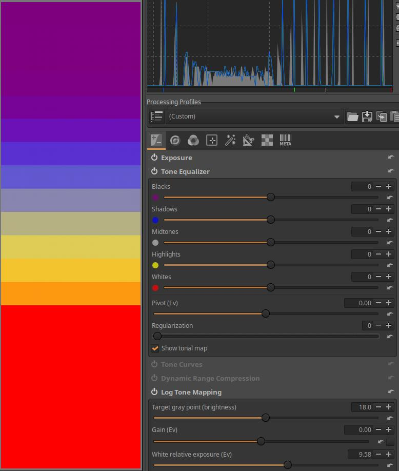

A Zónák közötti átmenetek simítása csúszkát 4-ről 0-ra állítottam. Láthatjuk, hogy a zónák nem mosódnak össze, hanem jól elkülönülnek egymástól. Utána visszaállítottam a csúszkát 4-re.

Ezután a Pivot (középtónusok eltolása) csúszka értékét 0-ról 6,16-ra növeltem. Ennek hatására a középtónusok tartománya az ábrán sokkal lejjebb (világosabb tónusoknál) helyezkedik el, és most már ezeknek a világosabb sávoknak a tónusát lehet állítani a Középtónusok csúszkával.

Mivel mind az öt zóna csúszkájának értéke nulla, a Pivot (középtónusok eltolása) csúszka értékének megváltoztatása nem változtat semmit sem a képen. A tónustérkép viszont mutatja, hogy a csúszkákhoz rendelt zónák megváltoztak.

Ha a zónák csúszkáinak értéke nullától különböző lenne, akkor a Pivot (középtónusok eltolása) csúszka értékének megváltoztatása hatással lenne a képre, mert a csúszkák a megváltozott zónák szerint fejtenék ki hatásukat.

Ezután a Pivot (középtónusok eltolása) csúszka értékét 0-ról -6,33-ra csökkentettem. Ennek hatására a középtónusok tartománya az ábrán sokkal feljebb (sötétebb tónusoknál) helyezkedik el, és most már ezeknek a sötétebb sávoknak a tónusát lehet állítani a Középtónusok csúszkával. Ezután visszaállítottam a Pivot (középtónusok eltolása) csúszka értékét 0-ra.

Ezután a Középtónusok csúszkát maximális, 100 értékre állítottam. Láthatjuk, hogy ennek a zónák elhelyezkedésére semmilyen hatása sincs. A csúszkát visszaállítottam 0-ra. Kikapcsoltam a Tónustérkép megjelenítését.

Minden egyes sávra elhelyeztem egy-egy színválasztót, ezeken megfigyelhetjük az egyes sávok RGB értékeit.

A Feketék csúszka értékét -90-re állítottam. A fenti, és az alábbi ábrákon a bal oldali oszlopban a sávok csúszkáinak 0 értékénél láthatjuk az egyes sávok RGB értékét. A jobb oldali oszlopban figyelhetjük meg, hogy mely sávok RGB értékei változtak, és milyen mértékben.

A Feketék csúszka értékét 96-ra állítottam.

A Középtónusok csúszka értékét -90-re állítottam.

Végül a Fehérek csúszka értékét 91-re állítottam. A legalsó, legvilágosabb sávnál vágás történt, mert ennek és az előző sávnak egyaránt \[255,255,255,\] az RGB értékei. Az utolsó előtti sávban a \[255,255,255,\] RGB érték még a kép része lehet, a következő sávban már biztosan vágás történt.

###  4\.1\.3 Tónusgörbék

Az Expozíció eszközcsoportban található. Szerkesztés közben többnyire "végtelen" tartományú lineáris adatokkal dolgozunk. Ezeket az adatokat a csővezeték vége felé át kell alakítani megjelenésre alkalmas adatokká. Erre ez a szerkesztőeszköz is alkalmas. Az előnézeten a már átalakított képet látjuk. Ebben a szerkesztőeszközben létrehozhatunk tónusgörbéket, beállíthatjuk a végső kép kontrasztját, telítettségét. Beállíthatjuk a fehér pontot is. Más eszköz is alkalmas a végső kép paramétereinek beállítására (pl. a Szigmoid).

Az ART görbeszerkesztőiről külön fejezet szól, itt röviden nézzük meg a Tónusgörbék szerkesztőeszköz egyedi sajátosságait.

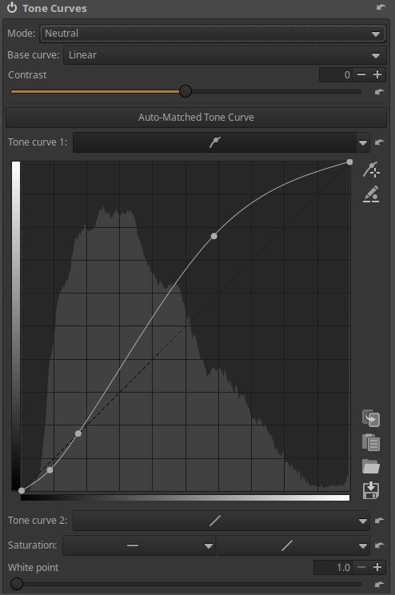

A fenti ábrán egy **Automatikusan illeszkedő tónusgörbét** láthatunk. Ezt általában a nyers fájlokhoz alkalmazandó alapértelmezett feldolgozási profil hozza létre. Ennek az a célja, hogy a nyers fájlba beágyazott JPEG képhez hasonló legyen a kiindulási előnézet. Ha az Automatikusan illeszkedő tónusgörbe gombra kattintunk, akkor az ART létrehozza a görbét.

Két tónusgörbét hozhatunk létre, ezek a **Tónusgörbe 1**, és a **Tónusgörbe 2**. Az Automatikusan illeszkedő tónusgörbe mindig a Tónusgörbe 1 lesz.

A görbék hátterében megjelenő hisztogram közvetlenül a görbe bemeneténél megjelenő adatokból származik. Ez eltér az ART hisztogramjától, amely a csővezeték végén a végső kép adataiból jön létre.

Miért van szükség két tónusgörbére? Azért, mert így finomabban szabályozhatók a tónusok. Általában a Tónusgörbe 1-et az értékek csökkentéséhez, a Tónusgörbe 2-t az értékek növeléséhez használjuk. A két görbe eredőjeként többnyire egy S-görbéhez hasonló görbét hozunk létre, azonban két görbével kisebb a veszélye az irreális színek kialakulásának.

A **Kontraszt** csúszkával értelemszerűen a kép kontrasztján állíthatunk. A Kontraszt csúszka mindig Standard módot alkalmaz.

A fenti ábrán láthatjuk a **Fehér pont** csúszkát, amelynek alapértelmezett értéke 1. A Fehér pont csúszka szabályozza a csúcsfények levágási pontját, és a görbe által érintett tónusok tartományát.

Az ART-tal általában SDR (normál dinamikájú) képeket készítünk, ehhez általában megfelelő az 1 érték, amely a \[0, 1\] tartományba kényszeríti a képpontok fényességét. Az 1 érték 100 nit maximális monitorfényerőnek felel meg, amely megfelelő a "szokásos", nem HDR monitorokhoz.

Ha HDR képet készítünk, akkor a fehér pont értékét növelni kell. 1 értékkel történő növelés 100 nit monitorfényerő-növekedést jelent. Ha tehát 1000 nit maximális fényerejű HDR monitorunk van, akkor 10-re kell állítani a Fehér pontot. A csúszka automatikusan "kinyújtja" a görbét, és szükség szerint módosítja a kontrasztképletet is. SDR monitornál ennek semmi értelme sincs, mert elviselhetetlenül világos előnézetet kapnánk.

A lényeg tehát az, hogy a Fehér pont csúszkával a csúcsfények levágási pontját a megjelenítő eszköz maximális fényerejéhez igazíthatjuk, és az ART a görbét a megfelelő mértékben automatikusan megnyújtja. Tehát ez az eszköz a tónusok levágását okozza. A csővezeték listában azt olvashatjuk az eszköz mellett, hogy "Lineáris RGB határolt", és a "határolt" utal a levágásra.

**Mód**: Lehetővé teszi a görbéhez használt megfelelő algoritmus kiválasztását. A Mód erősen befolyásolja a színek megjelenését, különösen akkor, ha kontrasztnövelő S-görbe görbét alkalmazunk. A Módtól függően bizonyos esetekben nemkívánatos színváltozások is felléphetnek. Az adott fényképhez kell kiválasztani az ízlésünknek és igényeinknek megfelelő Módot.

A **Módnál** az alábbi lehetőségek közül választhatunk:

-   **Semleges**: A görbét mindhárom színcsatornára alkalmazza, ezután színtartomány-tömörítést hajt végre úgy, hogy csökkentse a színárnyalatok eltolódását, és biztosítsa, hogy a csúcsfények természetes módon közelítsenek a fehérhez. A színtartomány-tömörítés azt jelenti, hogy az olyan színeket, amelyek az adott (pl. sRGB) színtéren kívül esnek, a színtéren belüli színekké konvertálja.
-   **Standard**: A görbét mindhárom színcsatornára alkalmazza, amely színeltolódást eredményezhet. Az S-görbe általában növeli a színcsatornák elválasztását, és ezáltal növeli a telítettséget.
-   **Súlyozott Standard**: Ez korlátozhatja a standard görbe színeltolódását, azonban teljesen nem szünteti meg.
-   **Filmszerű**: Ez a görbe a Standard típushoz nagyon hasonló eredményt ad, de az RGB-HSV színezet állandó marad, vagyis kevesebb a színeltolódási probléma. Ezt a görbetípust az Adobe tervezte a DNG részeként, ezért az Adobe Camera Raw és Lightroom is használja.
-   **Telítettség és érték keverése**: Ez a mód high-key fényképekhez a legalkalmasabb, de kreatív hatás elérésére egyéb fényképeknél is használható. Az eredmény nagyon hasonlít az L\*a\*b\* színtér világosság görbéjéhez (vagyis a kontraszt megváltoztatásához anélkül, hogy befolyásolná a színezetet vagy telítettséget). A kontrasztnövelő görbék esetében a megjelenés általában kissé telítetlen.
-   **Fényerő**: A színezet és a telítettség nem változik. A kontrasztnövelő görbék azonban enyhén telítetlen megjelenéshez vezethetnek.
-   **Észlelési**: Ez a mód megtartja a színezetet és a telítettséget, vagyis ha például S-görbét alkalmazunk, a kontraszt valóban megnő, de a színárnyalatok változatlanok maradnak, és a kép az eredetihez hasonló telítettségűnek tűnik. Kifejezetten kellemes alapkontrasztot lehet létrehozni segítségével anélkül, hogy megváltoztatná a kameraprofil (amely nem alkalmaz görbét) által biztosított színeket. Az algoritmus bonyolultsága miatt lényegesen lassabb, mint a többi görbemód.

A kontrasztot növelő görbék esetében a megjelenés általában kissé telítetlen lesz. Ez valójában nem azért van, mert a görbe telítetlenné tenné a színeket, hanem azért, mert az emberi látásban a kontraszt és a telítettség szorosan összefügg, így ugyanaz a kép nagyobb kontraszttal magasabb telítettséget igényel, hogy a képet ugyanolyan a telítettségűnek érzékeljük.

Az **Alapgörbe** lenyíló listánál választhatunk kétféle előre definiált alapgörbe közül, amelyet az ART az eszköz bemenő képén alkalmaz. A választási lehetőségek a következők:

-   **Lineáris**: Nem alkalmaz alapgörbét.
-   **Fokozatos átmenet a csúcsfényekhez**: Érintetlenül hagyja az árnyékokat és a középtónusokat, és szép sima (puha, gyengéd) átmenetet biztosít a kiválasztott fehér pont felé, durva levágás nélkül.
-   **Sima S-alakú**: Kissé elsötétíti az árnyékokat is azért, hogy a kontrasztot enyhén növelje. Szép sima (puha, gyengéd) átmenetet biztosít a kiválasztott Fehér pont felé, durva levágás nélkül.

A két tónusgörbe-szerkesztőnél a szokásos görbetípusok állnak rendelkezésre.

A szerkesztőeszközben alul a **Telítettség** részben egy kiegyenlítő görbét, illetve egy tónusgörbe típusú görbét találunk.

A kiegyenlítő görbe segítségével a kép tónusai szerint növelhetjük vagy csökkenthetjük a színek telítettségét.

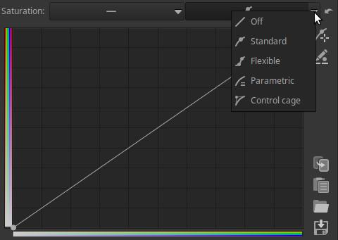

A fenti ábrán látható görbeszerkesztővel a kép színeinek telítettsége szerint változtathatjuk a színek telítettségét.

Az ART jelenlegi változataiban csak egyféle Módot lehet választani, és ha a Mód-ot kiválasztjuk, az a Tónusgörbe 1-re és 2-re egyaránt vonatkozik. Korábban mindkét tónusgörbéhez külön-külön lehetett Módot választani, ahogyan az alábbi ábrán látható.

Vannak akik jobban szerették a régi működést. Ezt nagyon egyszerűen el tudjuk érni az újabb változatokban is. Készíteni kell egy szöveges fájlt (feldolgozási profilt) erre alkalmas szövegszerkesztővel (pl. Windows esetén Notepad, Linux esetén Mousepad). Abba be kell másolni az alábbi sorokat.

\[Version\]  
Version=1025

\[ToneCurve\]  
CurveMode=Standard  
CurveMode2=Perceptual  
Curve=4;0;0;1;1;  
Curve2=4;0;0;1;1;  
ContrastLegacyMode=true

A fájlt nevezzük el, legyen például tone-curve-legacy.arp a neve, és mentsük el a saját feldolgozási profiljainkat tartalmazó könyvtárba. Ha ezt a profilt végrehajtjuk a szerkesztett képen, akkor a fentebbi ábra szerint külön választhatunk Módot a két tónusgörbénél. Azelőtt alkalmazzuk a profilt, mielőtt elkezdenénk a görbéket szerkeszteni.

Ha alkalmaztuk a profilt, és kiválasztottuk a Tónusgörbe 1 és 2 Módját, az alábbi viselkedést tapasztalhatjuk:

-   Ha legalább az egyik tónusgörbe ki van kapcsolva amikor kilépünk Szerkesztés nézetből, akkor a továbbiakban ismét az újabb változatok felhasználói felületét látjuk, és csak egy Módválasztó lesz, amelyen a Tónusgörbe 1 korábban kiválasztott Módja lesz látható. A Tónusgörbe 2 korábban kiválasztott módja érvényben marad, azonban az nem lesz látható a felhasználói felületen, és nem tudjuk megváltoztatni sem. A régi felhasználói felület csak a profil ismételt alkalmazása után lesz látható, azonban ez az eddigi görbék elvesztésével jár. Célszerű előtte a görbéket menteni.
-   Ha mindkét görbe be van kapcsolva amikor kilépünk Szerkesztés nézetből, akkor megmarad a régebbi változat felhasználói felülete, azaz mindkét tónusgörbénél megjelenik a Módválasztó. Emiatt kapcsoljuk be lineáris állásban a nem használt görbét is például azáltal, hogy "Ki" helyett másik görbetípust választunk.
-   Az Automatikusan illeszkedő tónusgörbe gombra történő kattintás mindig kikapcsolja Tónusgörbe 2-t, erre figyeljünk.

###  4\.1\.4 Dinamikus tartomány tömörítése

Az Expozíció eszközcsoportban található. Nagyon nagy dinamikatartományú kép (azaz egyaránt vannak nagyon világos és nagyon sötét területek is) esetén szükség lehet az árnyékok és a csúcsfények közötti dinamikatartomány csökkentésére a vágás elkerülése céljából. A Dinamikus tartomány tömörítése eszköz képes elérni ezt a csökkentést, képes hatékonyan tömöríteni az árnyékokat, illetve a csúcsfényeket. Ezt a hisztogram bal és jobb oldalánál meg is figyelhetjük.

**Mérték**: Beállíthatjuk a tömörítés mértékét. A magasabb értékek szűkebb dinamikatartományt eredményeznek.

**Részletek**: Beállíthatjuk, hogy az eszköz mennyi helyi kontrasztot őrizzen meg. A pozitív értékek csökkentik a tömörítést a kontraszt növelése érdekében, a negatív értékek csökkentik a kontrasztot.

**Telítettség szabályozása**: Ha bejelöljük, csökkenti a csúcsfények telítettségének a tömörítés miatt bekövetkező növekedését.

###  4\.1\.5 Logaritmikus tónusleképezés

Az Expozíció eszközcsoportban található. A Logaritmikus tónusleképezés eszköz lehetőséget biztosít a kép dinamikatartományának, azaz az árnyékoknak és/vagy a csúcsfényeknek a tömörítésére. Célját tekintve hasonló a Dinamikus tartomány tömörítése eszközhöz, vagy bizonyos mértékig a Tónuskiegyenlítő eszközhöz.

**Cél szürke pont (fényesség)**: Beállíthatjuk, hogy a bemeneti középszürke érték (amely a csúszkán mindig 0,18 értékű lesz) hová legyen leképezve a kimeneten. Használható a kép teljes fényességének beállítására a tónusleképezés után.

**Előtte történő Exp. Komp. (Fé)**: A tónusleképezés előtt alkalmazandó expozíció-kompenzáció mértéke.

**Fehér relatív expozíció (Fé)**: Beállíthatjuk, hogy a bemeneti fehér pont hány fényértéknyivel legyen a Cél szürke pont felett. A Cél szürke pont ezen a csúszkán mindig 1 értékű lesz.

**Fekete relatív expozíció (Fé)**: Beállíthatjuk, hogy a bemeneti fekete pont hány fényértéknyivel legyen a Cél szürke pont alatt. A Cél szürke pont ezen a csúszkán mindig 0 értékű lesz.

**Csúcsfények előtömörítése**: Segítségével tömöríthetjük a csúcsfényeket a tónusleképezés alkalmazása előtt.

**Helyi kontraszt megőrzésének mértéke**: A magasabb értékek jobban megőrzik a finom részleteket, azonban fényudvart eredményezhetnek.

**Telítettség szabályozása**: Ha bejelöljük, akkor csökkenti a csúcsfények telítettségének a tömörítés miatt bekövetkező növekedését. Alapértelmezés szerint engedélyezve van.

**Automatikus**: Ha rákattintunk, a kép tulajdonságai alapján kiszámított kiindulási értékekre állítja be a csúszkák értékét.

Az eszköz viselkedését az Alberto Griggio által közzétett mid.tif kép segítségével mutatom be.

A fenti ábrán megnyitottam a képet szerkesztésre. Mivel ez nem nyers fájl, hanem kép, az ART semleges alapértelmezett profilt használ, azaz semmit sem változtat a képen. Az alsó sáv kivételével mindegyik sávra egy színválasztót helyeztem el, amelyen láthatjuk a sáv RGB értékeit. Láthatjuk, hogy felülről a 11. sáv a 18%-os középszürke (\[118,118,118\]). A legvilágosabb árnyalatoknál vágás történt, maximális (\[255,255,255\]) értékű sávok vannak, a felső, sötét tónusú öt sáv is a minimumhoz közeli értékű.

Alul rákattintottam az Automatikus gombra, és az ART beállította a Fehér relatív expozíció, és a Fekete relatív expozíció csúszka értékeit. Ezzel megjelenítésre alkalmassá tette a mid.tif 20 fényértéknyi árnyalatterjedelmét (dinamikatartományát), azaz tömörítette. Ezáltal az egyes monitoron látható sávok között valójában nem egy fényértéknyi a világosságkülönbség. Felülről a 11. sáv továbbra is megmaradt középszürkének (\[117,117,117\]), ezt a sávot megjelöltem egy piros nyíllal. Láthatjuk, hogy a sávok egyenletesen vannak elosztva, nincs vágás. A legalsó sávon nincs színválasztó, az \[247,247,247\] RGB értékű. A középszürkéhez képest a Fehér relatív expozíció 9,58 fényérték, az alsó sáv 9 fényértéknyire van a középszürkétől (\[247,247,247\]), és a következő sávban (ha lenne) érné el a \[255,255,255\] RGB értéket. A középszürkéhez képest a Fekete relatív expozíció 11 fényérték, a felső sáv 10 fényértéknyire van a középszürkétől, RGB értéke \[19,19,19\], és a következő sávnál érné el (ha lenne sáv) a \[0,0,0,\] RGB értéket. Ne feledjük, hogy a \[0,0,0,\] és a \[255,255,255\] értékű képpontok is a kép részei lehetnek, ha nem történt vágás. Fontos megértenünk, hogy az említett fényértékek az eredeti mid.tif fájl fényértékei. Az, hogy "az alsó sáv 9 fényértéknyire van a középszürkétől" azt jelenti, hogy a tömörítés úgy történt, hogy a mid.tif legalsó sávja (amely valóban 9 fényértéknyire van a felülről 11. középszürke sávtól), a megjelenítésre alkalmas (monitoron látható) képen szintén a legalsó sávra lett leképezve (vágás nélkül).

A Fehér relatív expozíciót 9,58-ról 5-re állítottam. A középszürke megmaradt a 11. sávban. Ehhez képest lefelé az 5. sávban éri el a \[255,255,255\] RGB értéket, és az ez alatti sávokban vágás történik (azok is \[255,255,255\] RGB értékűek, azonban nagyobb értékűeknek kellene lenniük, de ez nem lehetséges). Az utolsó, még vágás nélküli sávot alul piros nyíllal megjelöltem. A világos tónusok kevésbé vannak tömörítve, ezért már a mid.tif középtónusától lefelé az ötödik sáv eléri a megjelenítésre alkalmas képen a világosságértékek lehetséges maximumát. Az ez alatti sávok vágásra kerültek. A két piros nyíl közötti sávoknál megnövekedett az egyes sávok közötti világosságkülönbség, azaz a kontraszt.

Ezután a Fekete relatív expozíció csúszkát -11-ről -5,98-ra állítottam. A középszürke továbbra is megmaradt a 11. sávban, a lenti piros nyíl helyzete, a sáv \[255,255,255\] RGB értéke sem változott. Ehhez képest felfelé a 6. sávban éri el a \[0,0,0\] RGB értéket, és az efeletti sávokban vágás történik (azok is \[0,0,0\] értékűek, azonban kisebb értékűeknek kellene lenniük, de ez nem lehetséges). Az utolsó, még vágás nélküli sávot felül szintén megjelöltem piros nyíllal.

A Cél szürke pont csúszka értékét 18-ról 33,4-re állítottam. A középszürke eddig a 11. sávban volt, amelyet az ábrán lila nyíllal jelöltem. Ez eltolódott két fényértéknyivel, most már felülről a 9. sávban található (sárga nyíl jelzi). A felső és az alsó piros nyíllal jelölt RGB értékek lényegében nem változtak, a közbülső árnyalatok azonban igen.

A Csúcsfények előtömörítése csúszkát 0-ról 65-re állítottam. A felső piros nyíl, és a sárga nyíl helye, és a sávok RGB értékei lényegében változatlanok, a legvilágosabb tónusok az alsó piros nyíl sávja előtti és utáni sávokban tömörítésre kerültek, már nem történik vágás a legalsó sávban sem. A tömörítés miatt azonban kontrasztvesztés következik be.

Végül az utolsó ábrán azt láthatjuk, hogy a Helyi kontraszt megőrzésének mértéke csúszkát 60-ról 100-ra változtattam. Az egyes sávok RGB értékei lényegében nem változtak.

Ha nem engedélyezzük a Telítettség szabályozása lehetőséget, annak semmilyen hatása sem lesz, mert a fekete-fehér kép telítettsége nulla.

##  4\.2 Részletek eszközcsoport

Ebben a csoportban elsősorban a kép részleteivel kapcsolatos globális szerkesztőeszközök találhatók.

A csoport szerkesztőeszközei:

-   Folt eltávolítása
-   Élesítés
-   Zajcsökkentés
-   Impulzuszaj csökkentése
-   Színhibajavítás (defringe)

###  4\.2\.1 Folt eltávolítása

A Részletek eszközcsoportban található. A kép nem kívánt részének eltüntetése céljából befedhetjük azt a kép más részeiről vett képrészletekkel. Forrásterületnek nevezzük azt a területet, ahonnan a képrészletet vesszük, és az a célterület, ahová másoljuk a forrásterületről vett képrészletet.

Jobbra láthatjuk a forrásterületet, amelynek középpontja pici piros ponttal van jelölve, balra található a célterület, amelynek középpontját zöld pont jelzi. Maga a cél- illetve forrásterület a belső körök területe. Az összetartozó forrásterület és célterület vonallal össze van kötve. A belső körök körül helyezkedik el a tollazat, amelyet a külső körök határolnak. A tollazat a célterület körül, annak környezete felé fokozatos átmenetet biztosít. Ha be van állítva tollazat, akkor nemcsak a forrásterületről, hanem az ábrán látható módon annak környezetéből is vesz képrészleteket, és annak segítségével alakítja ki a célterület körül a tollazatot. Az ábrán balra a célterület körül (felül) meg is figyelhetjük a fokozatos átmenetet. A **a forrás- illetve célterület koncentrikus köreit vonallal összekötve** együttesen "**folt**"-nak nevezzük. Több folt alkalmazásával az ábrán látható teljes fekete területet befedhetjük a felhőkből vett képrészletekkel.

A fenti ábrán láthatjuk a szerkesztőeszköz kezelőszerveit.

A felső sorban láthatjuk a létrehozott foltok számát, valamint jobbra három gombot, amelyek balról jobbra a következők:

-   **Törli az eddig létrehozott foltokat**
-   **Foltok hozzáadása/módosítása az előnézeten**: Az előnézeten egérrel hozhatunk létre és módosíthatunk foltokat.
-   **Foltok hozzáadása/módosítása egyszerűsített előnézeten**: Csak akkor működik, ha az előző gomb aktív. Ha ezt is bekapcsoljuk, akkor az ART egyszerűsített előnézetre vált, mert így kevesebb erőforrást igényel a foltokkal történő munka.

Nézzük a fenti ábrát, amelyen az alábbi négy lehetőséget figyelhetjük meg, miután már bekapcsoltuk a hozzáadás/módosítás módot:

**1**: Nyomjuk le a Ctrl billentyűt, kattintsunk a leendő forrásterület középpontjára, tartsuk lenyomva az egérgombot, engedjük fel a Ctrl billentyűt, vigyük a célterület középpontjára az egérmutatót, majd engedjük fel az egérgombot. Ekkor az ábrán legfelül látható szerkezethez hasonlót kell látnunk. A körök középpontját "+" jelöli. Az ábrán jobbra látható a középpontjánál pici piros ponttal jelölt forrásterület, és balra a zöld ponttal jelölt célterület. A forrásterület belső körében látható képrészlet fog rámásolódni a célterület belső körének területére. A külső körök a tollazat, azaz a környezet felé történő átmenet szélességét mutatják. A forrásterületről tollazattal együtt, azaz fokozatosan halványuló széllel másolódik át a képrészlet a célterületre.

**2**: A forrás- vagy célterület (a belső körök) nagysága egérrel állítható. Amely körnek az átmérőjét éppen változtatjuk, annak színe az ábrán látható módon megváltozik. A forrás- és a célterület átmérője együtt változik, ha az egyiken változtatunk, változik a másik is.

**3**: A forrás- vagy célterület tollazatának nagysága is állítható az egérrel. Amely tollazatot jelző (külső) körnek az átmérőjét éppen változtatjuk, annak színe az ábrán látható módon megváltozik. A forrás- és a célterület tollazatának határát jelző kör átmérője együtt változik, ha az egyiken változtatunk, változik a másik is.

**4**: A forrás- illetve célterületet az előnézeten az egérrel tetszés szerinti helyre mozgathatjuk.

Egy foltot úgy törölhetünk, hogy rajta jobb egérgombbal kattintunk.

A nem kiválasztott foltoknál csak a célterület középpontját ("+"), és a zöld pontot láthatjuk az előnézeten. Ha egy folt középpontja fölé visszük az egérmutatót és kattintunk, akkor az a folt lesz kiválasztva, és módosíthatjuk.

Csúszkákkal is módosíthatjuk a kiválasztott (aktuális) folt azon paramétereit, amelyeket az előzőekben egérrel állítottunk.

**Forrás X**: Vízszintesen mozgatja a forrásterület középpontját.

**Forrás Y**: Függőlegesen mozgatja a forrásterület középpontját.

**Cél X**: Vízszintesen mozgatja a célterület középpontját.

**Cél Y**: Függőlegesen mozgatja a célterület középpontját.

**Sugár**: A cél- illetve forrásterület sugara.

**Tollazat**: A tollazat szélessége.

**Átlátszatlanság**: A célterület átlátszatlansága százalékban. 100% átlátszatlanságnál a célterületen csak a forrásterületről átmásolt képrészlet látható, ha az átlátszatlanság kisebb 100%-nál, akkor áttűnik a célterületen az eredeti kép is, 0% átlátszatlanságnál pedig csak az eredeti képrészlet látszik, az átmásolt nem.

**Részletek védelme**: Ha 0 értéket állítunk be, akkor egyszerűen átmásolja a forrásterületet a célterületre, míg magasabb értékek esetén összekeveri a forrásterületet és a célterületről odamásolt képrészletet.

Nézzük meg az eszköz használatát:

A kép bal felső sarkában látunk egy nagy fekete foltot, ezt fogjuk befedni a fekete folt melletti felhőkből vett képrészletekkel. 

Az első folt elhelyezését láthatjuk a fenti ábrán. A tollazatot nagyra állítottam, mert fokozatos átmenetet szeretnék a folt környezetében. 

Ezen az ábrán az utolsó, 16. folt elhelyezését láthatjuk.

A fenti ábrán látható a végeredmény. Még lehetne finomítani rajta több folt elhelyezésével.

###  4\.2\.2 Élesítés

A Részletek eszközcsoportban található. Az élesítés hatásának megfelelő észlelése érdekében legalább 100%-ra (1:1) nagyítsuk az előnézetet, vagy helyezzünk el a kép különböző részeire néhány Részlet ablakot (az alsó eszköztáron található az gombja).

Az élesítés elsődleges célja a fényképezőgépben keletkező élességvesztés ellensúlyozása. A fényképezőgépben kétféle módon történhet élességvesztés. Egyrészt az objektív tökéletlensége miatt, másrészt a napjainkban is még sok fényképezőgépben meglévő anti-aliasing szűrő miatt. Az utóbbi esetben szándékosan hoznak létre egy, a képérzékelő előtt elhelyezkedő szűrővel nagyon enyhe elmosódást a képen. Elsősorban ezeknek a hatásoknak a kompenzálására szolgál az élesítés eszköz, azonban mindenki arra használhatja, amire csak szeretné.

Alapértelmezés szerint az eszköz elemzi a képet, és kiszámítja a paraméterek kezdeti értékeit úgy, hogy megakadályozza a képzaj élesítés által történő felerősödését. Sok esetben már az alapértelmezett értékek jó eredményt biztosítanak.

**Kontrasztküszöb**: A csúszka értékének növelése azt jelenti, hogy a részleteknek nagyobb kontrasztot kell elérniük ahhoz, hogy élesedjenek. A magasabb kontrasztküszöb-értékek csökkentik a zajra alkalmazott élesítés mértékét. Hatását akkor figyelhetjük meg, ha bekapcsoljuk az **Élességi kontraszt maszkot**.

A fenti ábrán láthatjuk az Élességi kontraszt maszkot, ajánlatos az Élesítés eszköz használatakor bekapcsolni. A maszkot fent, az eszköztáron kapcsolhatjuk be, az ábrán látjuk az gombot is, amelyre kattintani kell. Csak akkor lehet bekapcsolni, ha ez az Élesítés eszköz be van kapcsolva. Csak a maszk fehér színű területei lesznek élesítve.

**Módszer**: Háromféle lehet: Életlen maszk, RL Dekonvolúció, és Egyedi RL Dekonvolúció.

####  4\.2\.2\.1 Életlen maszk

Az Életlen maszk egy olyan módszer, amellyel a kép látszólagos élességét (élkontrasztját) növeljük, A módszer valójában nem élesít, nem jelenik meg több részlet a képen, azonban az éleknél (hirtelen átmeneteknél) történő kontrasztnövekedés miatt a képet élesebbnek érzékeljük.

**Sugár**: A fentebb említett, élességvesztést eredményező hatások ellensúlyozásárhoz szükséges sugárértéket automatikusan beállítja az eszköz. Ezen azonban változtathatunk, ha szükséges. A Sugár az élesített részletek méretét határozza meg, azt, hogy az élek mentén milyen távolságig, milyen sávban történjen élesítés. Általában az élesítés minősége jobb, ha az élesítési sugár kisebb. Alacsony ISO-érzékenységű, fókuszban lévő, és elmosódás nélküli képeknél a 0,5...0,7 érték kielégítő. Ha az érték túl alacsony, akkor nem lesz elegendő élesítés, ha pedig túl magas, akkor erős fényudvarképződéshez vezethet a hirtelen átmenetek ("élek") mentén.

**Küszöb**: A küszöbgörbe alá odaképzelhetjük a tónusskálát. A függőleges tengely az átlátszatlanságnak felel meg, alul 0%, legfelül 100%. A küszöbgörbe-szerkesztővel beállíthatjuk, hogy a kép milyen világosság-tartományában mekkora legyen az élesítés. A fentebbi ábrán azt láthatjuk, hogy bal oldalon, a legsötétebb árnyalatoknál nincs élesítés (a bal alsó vezérlőpont értéke 20), majd elég hirtelen emelkedik az élesítés mértéke, eléri a maximális értéket, amelytől kezdve egy széles tartományban maximális élesítés történik, végül a világos tónusoknál fokozatosan csökken az élesítés mértéke. Az alapértelmezett küszöbgörbe a legtöbb esetben megvéd a túlélesedéstől és a fényudvarképződéstől.

**Mérték**: Az élesítés mértékét lehet növelni vagy csökkenteni segítségével.

**Csak az éleket élesítse**: Ha ezt bejelöljük, akkor a homogén területek nem lesznek élesítve. Ezzel elkerülhetjük a képzaj élesítését. Engedélyezése zajos képeknél ajánlott. Ha engedélyezzük, akkor két új csúszka is megjelenik.

**Sugár**: Zajérzékeléshez használatos. Ha a zaj alacsony, kisebb sugár használható, és fordítva. A nagyobb sugár lelassítja a képfeldolgozást.

**Éltolerancia**: Meghatározza, hogy egy képpontnak mennyire kell különböznie a szomszédjától ahhoz, hogy élnek, és ne zajnak tekintse. Nagyon hasonlít az Életlen maszk Kontrasztküszöb paraméteréhez, és nagy hatással van a vizuális minőségre. Alacsony ISO értékű (alacsony zajszintű) képekhez használjunk 1000-et vagy kevesebbet, nagy ISO-értékek esetén 2500-3000-et vagy még többet.

**Fényudvar szabályozása**: Túl agresszív élesítéskor a világos tárgyak körül megjelenő fényudvar elkerülésére szolgál. Aktiválásakor egy új csúszka jelenik meg.

**Mérték**: A csúszka 100 értékénél maximálisan kifejti hatását, csökkentve az Életlen maszk módszer kellemetlen vizuális mellékhatását.

####  4\.2\.2\.2 RL Dekonvolúció

Az RL Dekonvolúció módszerét a Gauss elmosás hatásának "visszacsinálására" fejlesztették ki. Ha egy elmosódás Gauss elmosás szerinti, akkor egy matematikai eljárással vissza lehet állítani az eredeti információt. A valóságban a fényképen látható életlenség jelentősen eltérhet a Gauss elmosástól, ezért bizonyos műtermékek, például fényudvarok jelenhetnek meg, ha a sugár túlságosan eltér a képen látható elmosódás típusától, és amikor az élesítés hatása túl erősen érvényesül.

**Sugár**: A sugár határozza meg a képen látható Gauss-elmosódás szórását. Próbálgatással lehet megtalálni az adott képhez a legjobb értéket, amelynél megfelelő az élesítés, és kevés műtermék keletkezik.

**Automatikus**: A Sugár csúszka végénél, a Visszaállítás gomb mellett található egy jelölőnégyzet. Ha ezt engedélyezve van (be van jelölve), akkor a nyers adatok alapján automatikusan kiszámítja a Sugár megfelelő értékét.

**Mérték**: Az élesítés mértéke.

**Élesítés mértékének növelése a sarkokban**: Az objektív lencsehibái miatt a képek gyakran lágyabbak vagy elmosódottabbak a képsarkokban, mint a képmező közepén. Az itt található két csúszka segítségével a képsarkokban erősebb élesítést állíthatunk be.

**Sugár növelése**: A csúszka értékének növelésével növeli az élesítést a kép széleinél.

**Szélesség**: A csúszkával azt lehet beállítani, hogy a kép sarkainál milyen szélességben kell erősebben élesíteni.

####  4\.2\.2\.3 Egyedi RL Dekonvolúció

A való életben nem pontosan Gauss elmosással találkozunk képeinken, az RL Dekonvolúció eszköz pedig Gauss elmosást tételez fel, ezért nem teljesen pontos. Ebből származik az ötlet, hogy ha ismernénk a felvételi rendszer úgynevezett pontszórás függvényét (PSF), akkor pontosabban lehetne eltüntetni képünkről az elmosódást.

Erről a módról nagyon kevés információt lehet találni. Alkalmazásához szükség lenne a felvevő rendszer (gondolom a váz és az objektív együttese) pontszórás függvényére (PNG kép formájában). Ennek előállításának módja számomra ismeretlen. Egyszerű módszerrel nem lehet a pontos pontszóródási függvényt előállítani. A pontatlan pontszóródási függvénynek több a kára, mint a haszna.

Valószínűleg nem éri meg foglalkozni az Egyedi RL Dekonvolúció módszerrel, mert az RL Dekonvolúció tökéletesen működik.

###  4\.2\.3 Zajcsökkentés

A Részletek eszközcsoportban található. A világosságzajt és a színzajt csökkenthetjük segítségével. A zajcsökkentés hatásának megfelelő észlelése érdekében legalább 100%-ra (1:1) nagyítsuk az előnézetet, vagy helyezzünk el a kép különböző részeire néhány Részlet ablakot (az alsó eszköztáron található az gombja).

Alapvetően kétféle zajt különböztethetünk meg:

-   **Világosságzaj**: Eltérő fényerejű kis foltokként jelentkezik, kissé hasonlít a negatív filmek szemcséihez.
-   **Színzaj**: Eltérő színű kis színfoltokként jelentkezik.

**Mód**: Két általános zajcsökkentési Mód van (Konzervatív, és Agresszív), amelyek szabályozzák, hogy csak a magas frekvenciájú zajt távolítsa el, vagy az alacsony frekvenciájút is. Az alacsony frekvenciájú zaj olyan zaj, amelynek foltjai nagy területet fednek le, míg a nagyfrekvenciás zajnak kisebb foltjai vannak.

-   **Konzervatív**: Ebben a módban eltávolítja az összes zajt, kivéve a nagyon alacsony frekvenciájú zajokat, így a színrészletek jobban megőrződnek annak rovására, hogy nem távolítja el a nagyon nagy foltokat. A legtöbb esetben ezt célszerű használni.
-   **Agresszív**: Eltávolítja a nagyon alacsony frekvenciájú zajokat is azzal a hátránnyal, hogy magasabb frekvenciájú zaj esetén agresszívebb lesz. Csak rendkívül zajos fényképeken érdemes használni.

**Színtér**: Kiválaszthatjuk, hogy **RGB**, vagy **L\*a\*b\*** színtérben történjen a zajcsökkentés.

Az RGB/L\*a\*b\* színtér, és a Konzervatív/Agresszív hatása közötti különbséget akkor figyelhetjük meg jól, ha az előnézetet legalább 100%-ra nagyítjuk, vagy a kép különböző részeire néhány Részlet ablakot helyezünk el. Ezek a választási lehetőségek nem egyforma eredményt adnak, mindig ki kell választani azt a párosítást, amelyik az adott képhez a legjobb.

**Gamma**: A tónusok szerint változtatja a zajcsökkentés erősségét. A kisebb Gamma értékek lehetővé teszik, hogy a zajcsökkentés minden tónusra hatással legyen, az árnyékokra is, míg a Gamma magasabb értékei csak a képmező világosabb területeire korlátozzák a hatást.

####  4\.2\.3\.1 Világosságzaj

Ezen a részen a világosságzajt csökkenthetjük.

**Világosság**: A Világosság csúszkával a zajcsökkentő hatás erősségét szabályozhatjuk.

**Részletek helyreállítása**: A csúszka lehetővé teszi a részletek helyreállítását anélkül, hogy a képzaj erősítését okozná.

**Részletek küszöb**: A Részletek helyreállításának küszöbértéke.

####  4\.2\.3\.2 Színzaj

Ezekkel a beállításokkal a színzajt csökkenthetjük.

**Módszer**: Automatikus vagy Manuális közül választhatunk.

**Automatikus**:

**Automatikus csökkentés erőssége**: A csúszkával a színzaj Automatikus zajcsökkentésének erősségét szabályozhatjuk.

**Manuális**:

**Szín - Főszabályzó**: Szabályozza a színzajcsökkentés erősségét.

**Szín - Vörös-Zöld**: Csökkenti/növeli a zajcsökkentést a vörös-zöld csatornában (az L\*a\*b\* színtér a\* csatornájában).

**Szín - Kék-Sárga**: Csökkenti/növeli a zajcsökkentést a kék-sárga csatornában (az L\*a\*b\* színtér b\* csatornájában).

####  4\.2\.3\.3 Végső simítások

**Részletek helyreállítása**: A csúszka lehetővé teszi a részletek helyreállítását anélkül, hogy a zaj erősítését okozná.

**Világosság**: A világosságzaj csökkentésének erősségét szabályozza.

**Szín**: A színzaj csökkentésének erősségét szabályozza.

**Alkalmazási példa**

Nézzük meg az alábbi ábrán látható képrészletet.

A kép Canon 1100D fényképezőgéppel, ISO 6400 érzékenységgel készült. Jelentős világosságzaj és színzaj is látható.

A Zajcsökkentés eszközt csak bekapcsoltam, és a fenti ábrán láthatjuk az alapértelmezett beállítások hatását. Az ART Agresszív Módot alkalmazott, RGB színtérrel, a Szín részen Automatikus Módszert. Az eredmény nagyon jó. 

A kép másik részlete, szintén az alapértelmezett beállításokkal.

A végső simítások részben lévő Világosság csúszkának 27-re állításával próbáltam még csökkenteni a megmaradt zajon, azonban ez már a részletek elmosódásával járt.

A másik képrészlet a Világosság csúszka 27-re állítása után.

###  4\.2\.4 Impulzuszaj csökkentése

A Részletek eszközcsoportban található. Ez az eszköz csökkenti az impulzuszaj hatását, amelyet só-bors zajnak is neveznek. Az impulzuszaj fehér és fekete pixelekből áll, amelyek a fotóra szórt sóra és borsra emlékeztetnek. Ez az eszköz a Színrekonstrukció végrehajtása után működik.

**Küszöb**: Beállíthatjuk az Impulzuszaj csökkentésének küszöbértékét.

###  4\.2\.5 Színhibajavítás (defringe)

A Részletek eszközcsoportban található. Itt lila, ibolya, vagy zöld szegélyek formájában jelentkező színhibáról van szó. Ez a hosszanti színhiba egyik formája, és a világos területek melletti sötét élek mentén jelennek meg a pontatlan élességállítás, az objektív tökéletlenségei miatt. Sokszor az élességállítás síkján kívül eső területeken jelentkezik lila és zöld szegélyek formájában. Olyan objektívek is lehetnek a probléma okai, amelyek nem minden színt fókuszálnak ugyanarra a síkra. Az objektíveket úgy optimalizálták, hogy a hosszabb hullámhosszú látható fényt ugyanarra a síkra fókuszálják, azonban a rövidebb hullámhosszú fények által keletkező kép nem ugyanazon a síkon lesz éles, hanem vagy előtte, vagy mögötte. Ezért ezek a rövidebb hullámhosszú fények (lila, ibolya) láthatóan elszínezhetik a sötét területeket, amikor mellettük a világos területek kellő intenzitásúak. Ilyet tapasztalhatunk, ha a olyan fa lombját fényképezzük, amelynél a levelek között átsüt a nap.

  
*Forrás: Rawtherapee, Rawpedia*

A balra a javítás nélküli, jobbra a javított kép látható.

**Sugár**: A hatás sugara. Azt befolyásolja, hogy milyen szélességben távolítsa el a színes szegélyt.

**Küszöb**: A színes szegély megszüntetésének küszöbértékét lehet beállítani.

**Színezet**: Egy kiegyenlítő görbét találunk itt. Kiválaszthatjuk azt a színt, amilyen színű szegélyt meg szeretnénk szüntetni, és minél magasabbra húzzuk a görbét a kiválasztott szín felett, annál erősebb lesz az eszköz hatása.

Az alábbi ábrán látható JPEG kép szerzője [Slavica Panova, forrása Wikimedia](https://commons.wikimedia.org/wiki/File:Filigranski_nakit_02_edit.JPG). 

Az ábrán Nikon D7000 fényképezőgéppel, AF-S Nikkor 50mm f/1.8G objektívvel, f/1,8 rekeszértékkel készült kép részlete látható. A képen jelentős mértékű a zöld és lila színű hosszanti színhiba.

Az ábrán látható beállításokkal jelentősen sikerült csökkenteni a színhibát, azonban az eredmény nem tökéletes. A Sugár maximális, a Küszöb nulla, és a Színezet görbe alkalmazásával a zöld és a lila színhiba jelentősen csökkent.

##  4\.3 Színek eszközcsoport

Ebben a csoportban a kép színeinek beállításával kapcsolatos globális szerkesztőeszközök találhatók.

A csoport szerkesztőeszközei:

-   Fehéregyensúly
-   Telítettség/Élénkség
-   Csatornakeverő
-   Színkiegyenlítő
-   RGB görbék
-   L\*a\*b\* korrekciók
-   Színkezelés

###  4\.3\.1 Fehéregyensúly

A Színek eszközcsoportban található. A fehéregyensúly helyes beállításával színhelyes képeket hozhatunk létre. Ezzel az eszközzel állítsuk be a helyes fehéregyensúlyt, és kreatív célokra egyéb eszközökkel módosítsuk a kép színeit.

Fényképezéskor a témát megvilágító fény színe nem mindig egyforma. Például nyári napsütéses reggelen a fény melegebb, vörösesebb, mint délben, a hagyományos izzólámpa fénye is vörösebb a vaku fényénél stb. A fényképen csak akkor kapunk valóságoshoz hasonló színeket, ha a megvilágítás színéhez alkalmazkodva megfelelően korrigálunk. Ennek a korrekciónak a megvalósítására szolgál a fehéregyensúly helyes beállítása.

*A fehéregyensúly (angolul White Balance, rövidítve WB) beállításával úgy kompenzáljuk a JPEG kép létrehozásakor a színeket, hogy a semleges (nem elszíneződött) fehér vagy szürke tárgy a képen is semleges fehér vagy szürke legyen, valamint feltételezzük, hogy akkor a többi szín is a valóságosnak megfelelő lesz, és színhelyes képet kapunk.*

A fehéregyensúly beállítása minden színre hatással van. Úgy a legkönnyebb megállapítani, hogy a fehéregyensúly beállítása nem megfelelő, ha egy semleges fehér vagy szürke színű objektum nem tűnik semlegesnek, hanem elszíneződöttnek érzékeljük.

**Módszer**: A fehéregyensúly megállapításának módszere, amely az alábbiak valamelyike lehet:

-   **Tárolt**: A nyers fájlban tárolt a metaadatokból állapítja meg. A "Tárolt" azt a fehéregyensúlyt jelenti, amely a fényképezőgépen be volt állítva (a fényképezőgép vagy a fotós által) a felvétel készítésének idején.
-   **Auto**: A képadatok elemzésével automatikusan megbecsüli az egyes színcsatornák együtthatóit.
-   **Egyedi színhőmérséklet**: Egyedi színhőmérsékletet és színárnyalatot lehet beállítani a Színhőmérséklet és a Színárnyalat csúszka segítségével, és/vagy a pipetta eszköz használatával, a **Választ** gombra történő kattintással. A megfelelő fehéregyensúly beállításához a kép semleges fehér vagy semleges szürke területéről kell mintát venni. A mintavételezett terület méretét a **Méret** legördülő listából választhatjuk ki. Ha mintát veszünk a képről, akkor a Módszer automatikusan Egyedi színhőmérsékletre változik.

Gondoljunk arra, hogy ha állítunk a **Színhőmérséklet** csúszkán, akkor a témát megvilágító fény színhőmérsékletét állítjuk, és ehhez képest az ART annyit korrigál, mintha valós színeket szeretnénk kapni. Tehát ha hidegebb irányba (magasabb színhőmérséklet felé) korrigálunk, akkor melegebb tónusokat kapunk, és ez fordítva is igaz.

A **Színárnyalat** csúszkával bíborvörös és zöld színek irányába korrigálhatunk.

-   **Egyedi szorzók**: A három RGB csúszka használatával közvetlenül be lehet állítani az egyes színcsatornák szorzóértékeit.

-   **Fényképezőgépen beállított**: A fényképezőgép előre definiált színhőmérsékletei közül választhatunk.

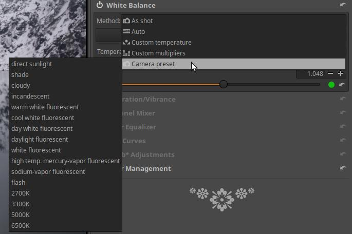

A fenti két ábrán láthatjuk, hogy a választási lehetőség fényképezőgép-típusonként eltérő. Az adott fényképezőgép-típus előre definiált színhőmérsékleteiről a fényképezőgép felhasználói kézikönyvében tájékozódhatunk.

###  4\.3\.2 Telítettség/Élénkség

A Színek eszközcsoportban található. A színárnyalatok telítettsége állítható be segítségével.

**Telítettség**: Az összes szín esetén egyformán változtatja a telítettséget.

**Élénkség**: Erőteljesebben változtatja a kevésbé telített színek telítettségét, mint a már eleve telített színekét.

###  4\.3\.3 Csatornakeverő

A Színek eszközcsoportban található. RGB mátrix csatornakeverő, és az Elsődleges színek korrekciója közül választhatunk.

####  4\.3\.3\.1 RGB mátrix

Az RGB mátrix keverővel a kép minden egyes képpontjához új R, G, és B értéket állítunk elő a képpont eredeti R, G, és B csatornaértékei, és a csúszkákon beállított százalékos értékek segítségével.

A csatornakeverőn három részt figyelhetünk meg: Vörös csatorna, Zöld csatorna, és Kék csatorna. A Vörös csatorna részen az adott képponthoz új Vörös (R) csatorna értéket hozunk létre a képpont eredeti R, G, és B értékeiből. A Vörös, Zöld, és Kék csúszkával azt állíthatjuk be, hogy a képpont eredeti R, G, és B értékei milyen arányban alkossák a képpont új R értékét. A Zöld csatorna és a Kék csatorna részen hasonló módon állíthatjuk elő a képpont új G, és B értékét.

Megfigyelhetjük, hogy

-   ha a Vörös csatorna részen jobbra mozgatjuk a csúszkákat, akkor a kép vörösebb lesz, ha balra mozgatjuk, akkor ciánkékebb,
-   ha a Zöld csatorna részen jobbra mozgatjuk a csúszkákat, akkor a kép zöldebb lesz, ha balra mozgatjuk, akkor bíborvörösebb,
-   ha a Kék csatorna részen jobbra mozgatjuk a csúszkákat, akkor a kép kékebb lesz, ha balra mozgatjuk, akkor sárgább.

Ez nem túl felhasználóbarát módszer, mert távol áll attól, ahogyan a színeket érzékeljük. Az emberek nem színcsatornákban gondolkodnak a színekről. 

####  4\.3\.3\.2 Elsődleges színek korrekciója

A **Vörös elsődleges**, a **Zöld elsődleges**, és a **Kék elsődleges** színezetét és telítettségét módosíthatjuk. A színezetet a szomszédos másodlagos színek irányába változtathatjuk, és minden elsődleges színhez beállíthatjuk a telítettséget. Ezáltal a kép színeit módosíthatjuk, beállíthatjuk.

Az ART-ban a szerkesztés során a változtatások lineáris RGB térben történnek. A Színek/Színkezelés eszközben meg is nézhetjük, hogy a Munkaprofil Rec.2020, amely egy nagyon széles színtartományú színtér.

A fenti ábrán láthatjuk a Rec.2020 színteret. A háromszög csúcsainál helyezkedik el a három alapszín (vörös, zöld, kék), ezeket nevezzük elsődleges színeknek. A különböző színrendszerekben, így a Rec.2020 színrendszerben is pontosan definiálva van a fehér pont, a vörös, a zöld, és a kék elsődleges színek koordinátái. Az elsődleges színek módosításával a háromszög csúcsait mozgathatjuk a háromszög oldalai mentén, és ezáltal változnak a háromszög belsejében elhelyezkedő színek is. A Vörös elsődlegeset a bíborvörös vagy a sárga, a zöld elsődlegeset a sárga vagy a türkiz (zöldeskék), a kék elsődlegeset a türkiz vagy a bíborvörös irányába mozdíthatjuk el.

###  4\.3\.4 Színkiegyenlítő

A Színek eszközcsoportban található. A kép kiválasztott színeinek színezetét, telítettségét, és/vagy világosságát változtathatjuk meg kiegyenlítő görbék segítségével.

Három teljesen egyforma működésű kiegyenlítőgörbe-szerkesztőt tartalmaz.

**Csatorna**: Három teljesen egyforma működésű kiegyenlítőgörbe-szerkesztőt láthatunk, amellyel a HSL színrendszer három csatornáját (Hue=Színezet, Saturation=Telítettség, és Lightness=Világosság) változtathatjuk meg a bemenő színezet függvényében. A bemenő színezetskálát alul láthatjuk. Minden egyes görbét a nevük mellett lenyitva kikapcsolhatunk, illetve választhatjuk a Kiegyenlítő lehetőséget, amelynek hatására megjelenik a görbeszerkesztő. A görbeszerkesztők semleges helyzete (amikor nem változtatnak semmit) a középső vízszintes vonal.

**H görbe**: Az alul kiválasztott színezetű területek színezetét változtathatjuk meg. Ha a kiválasztott színezet felett a görbét lefelé húzzuk, illetve fölfelé toljuk, más és más kimenő színezetet állíthatunk be. Ezzel tehát a kép bizonyos színű területeinek színét változtathatjuk meg.

**S görbe**: Az alul kiválasztott színezet telítettségét változtathatjuk meg. Ha a kiválasztott színezet felett a görbét lefelé húzzuk, akkor a telítettség csökken, illetve ha fölfelé toljuk, akkor növekszik.

**L görbe**: Az alul kiválasztott színezet világosságát változtathatjuk meg. Ha a kiválasztott szín felett a görbét lefelé húzzuk, akkor a világosság csökken, illetve ha fölfelé toljuk, akkor növekszik.

A háromféle görbe teljesen független egymástól, egyszerre akár mindhármat is használhatjuk.

**Simítás**: Elmossa az érintett területeket, a nagyobb értékeknél erőteljesebb az elmosás.

###  4\.3\.5 RGB görbék

A Színek eszközcsoportban található. Segítségével tónusgörbét alkalmazhatunk külön-külön az egyes RGB csatornákra.

Mindhárom csatorna szerkesztője (a színskálák színétől eltekintve) teljesen egyforma. A fenti ábrán a Vörös csatorna görbeszerkesztőjét láthatjuk. A fehérrel megjelenő görbe tartozik az éppen szerkesztett (az ábrán vörös) csatornához, a másik két színű (az ábrán zöld és kék) görbe a másik két csatorna szerkesztőjében létrehozott görbe. Mindhárom görbeszerkesztőben látjuk a másik kettőben létrehozott görbét is.

###  4\.3\.6 L\*a\*b\* korrekciók

A Színek eszközcsoportban található. Az L\*a\*b\* (L\*: világosság, a\*: zöld-bíbor és b\*: kék-sárga) színrendszerben működik. Az L\*a\*b\* színrendszer gyakran kevesebb mellékhatással jár, mint az RGB színrendszer, ez indokolja használatát. A kevesebb mellékhatás oka az, hogy az L\*a\*b\* színrendszer a világosságot és a színeket külön kezeli.

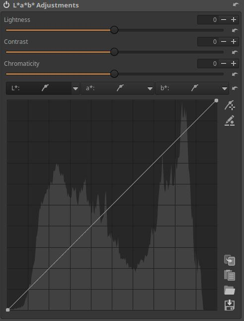

**Világosság**: Ez a csúszka egy tónusgörbét alkalmaz a L\*a\*b\* színtér L-csatornájára. A fekete pont és a fehér pont nem mozdul el.

**Kontraszt**: Ez a csúszka növeli vagy csökkenti a kép kontrasztját, szintén az L-csatornára hat.

**Színesség**: Ez a csúszka növeli vagy csökkenti a kép színességét azáltal, hogy kontrasztgörbét alkalmaz a L\*a\*b\* tér a\* és b\* csatornáira. Ha ezt a csúszkát -100-ra állítjuk, akkor minden szín eltávolításra kerül, ezért a kép fekete-fehér lesz. Azonban a kép fekete-fehérré alakításának javasolt módja a Különleges hatások eszközcsoport Fekete-fehér eszközének használata.

**L\* görbe**: Ez tulajdonképpen egy tónusgörbe. A görbe a kép bemenő tónusainak függvényében meghatározza a kimenő tónusokat.

**a\* görbe**: Az a\* csatorna bemenő értékeinek függvényében a görbével határozhatjuk meg az a\* csatorna kimenő értékeit.

**b\* görbe**: A b\* csatorna bemenő értékeinek függvényében a görbével határozhatjuk meg a b\* csatorna kimenő értékeit.

###  4\.3\.7 Színkezelés

Itt állíthatjuk be a Bemeneti Profilt, a Munkaprofilt, a Kimeneti Profilt, és a Renderelési szándékot.

**Bemeneti Profil**

A nyers feldolgozás elengedhetetlen lépése a fényképezőgép érzékelőjének adatait konvertálni az ART belső RGB színterébe (a Munkaprofilba). Ehhez az átalakításhoz kifejezetten az adott fényképezőgéphez készült bemeneti profilra van szükség. Egy ilyen profil annak az elemzésnek az eredménye, hogy a konkrét színeket és tónusokat hogyan rögzíti, dolgozza fel és ábrázolja nyers adatként az adott fényképezőgép. Kameraspecifikus bemeneti profil nélkül a pontos színábrázolás lehetetlen.

**Nincs profil**: Nem történik színkonverzió, ne használjuk ezt szerkesztéshez.

**Beágyazott**: Csak nem nyers fájloknál használható. A képfájlba ágyazott színprofilt használja, ha rendelkezésre áll.

**Fényképezőgép standard**: Egy egyszerű, előre meghatározott, kompromisszumos, a kamera típusától függő színmátrixot használ. Ha ez be van jelölve, akkor megjelenik a "Hajtsa végre a kromatikus adaptációt (CAT)" engedélyezésének lehetősége. (A kromatikus adaptáció az ember látásának azon képessége, hogy úgy alkalmazkodik a megvilágítás változásaihoz, hogy megőrzi a tárgyak színének érzékelését. Például egy fehér papírlapot a naplemente fényénél is fehérnek érzékelünk.) 

**Automatikusan illeszkedő fényképezőgép-profil**: Az ART több kiváló minőségű, egyedileg létrehozott, általános célú DCP-profilt tartalmaz, amelyek automatikusan megfeleltethetők a támogatott fényképezőgép nyers fájljának megnyitásakor. Az egyeztetés csak a fényképezőgép pontos megnevezésével működik (kis- és nagybetűkre érzékeny), ahogy az a nyers fájl metaadataiban megtalálható. Ez pontosabb, mint a Fényképezőgép standard profil. Csak akkor választható ki, ha rendelkezésre áll.

**Egyedi**: Egyedi DCP vagy ICC-kamera bemeneti profil kiválasztása. Akkor válasszuk, ha nem működik az Automatikus illeszkedés, illetve ha felül szeretnénk bírálni a Fényképezőgép standard vagy Automatikusan illeszkedő profilt.

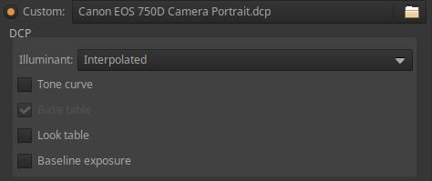

Ha kiválasztottuk, akkor a fenti ábrán látható beállítási lehetőségek jelennek meg:

**Fényforrás** lehet:

-   **Interpolált**: A kiválasztott fehéregyensúly alapján számítja ki, ha a fehéregyensúly 2850 K és 6500 K közötti, ellenkező esetben a kettő közül a közelebbi kerül kiválasztásra. Ez az alapértelmezett mód, és általában nincs szükség ennek megváltoztatásra.
-   **2850K**: A téma megvilágítója hagyományos izzólámpa, vagy ilyen színhőmérsékletű, jó színhűséget biztosító LED fényforrás.
-   **6500K**: A témát napfény világítja meg.

**Tónusgörbe**: A DCP profilok tónusgörbét tartalmazhatnak, amely kontraszt és fényerő hozzáadására használható a filmszerű megjelenés érdekében. Ezt főként a fényképezőgép által létrehozott JPEG képhez hasonló előnézetet eredményező profilokhoz használják. Csak akkor engedélyezhető, ha a profil tartalmaz tónusgörbét.

**Alaptábla**: Ez lehetővé teszi a DCP "HueSatMap" táblázat használatát, amely az alapmátrix fölé nemlineáris korrekciók hozzáadására szolgál. Általában hagyjuk bekapcsolva. Ez nem engedélyezhető, ha a betöltött profilból hiányzik a HueSatMap tábla.

**"Look" táblázat**: Ez lehetővé teszi a DCP "LookTable" táblázat alkalmazását, amelynek célja, hogy szubjektív megjelenést adjon általában egy beágyazott tónusgörbével együtt. Hagyjuk bekapcsolva.

**Alapexpozíció**: Ez egy expozíció-kompenzáció, amelynek általában az a célja, hogy az előnézet világossága megegyezzen a fényképezőgép JPEG képének világosságával. Ez "a felhasználói felület alatt" kerül alkalmazásra, így nem látható az expozíció-kompenzáció csúszkán. A fényképezőgépek általában szándékoltan alulexponálnak, ennek kompenzálására szolgál az Alapexpozíció.

Nézzük tovább a lehetőségeket:

**Referenciakép mentése**: A gombra kattintva egy, a bemeneti profil alkalmazása előtti lineáris TIFF-képet ment el. Ez a mentett fájl ezután fényképezőgép bemeneti profil létrehozásához használható. A nyílt forráskódú ArgyllCMS program segítségével ICC-profilokat, a DCamProf segítségével pedig ICC- vagy DCP-profilokat hozhatunk létre.

**Munkaprofil**: Az ART alapértelmezett Munkaprofilja lineáris Rec2020. Normál felhasználás esetén ne módosítsuk.

**Kimeneti profil**: Kiválaszthatjuk a kimeneti színprofilt. Mentés előtt a feldolgozott kép átalakul ebbe a színtérbe, és a profil beágyazódik a metaadatokba. Két típusa van: az ICC v2-vel kompatibilis és a v4-gyel kompatibilis. Az ART alapértelmezett Kimeneti profilja: sRGB (ICC V2).

**Renderelési szándéknál** azt választhatjuk ki, hogy az ICC-profilokat hogyan használjuk a tartományok vagy színterek közötti átalakításhoz. Például a folyamat végén a képadatokat (a forrás színtérből) a monitorprofil színterébe (cél) kell helyezni a helyes megjelenítéshez. Vagy nyomtató esetén (a Soft-Proofing részben) a forrás a folyamat végi képadatok, a cél pedig a kiválasztott nyomtatóprofil színtere.

A Renderelési szándék a következők valamelyike lehet:

-   **Észlelési**: A cél színterén kívül eső, a forrásból származó színek a rendeltetési hely színtartományába tömörülnek úgy, hogy a tartományon belüli színeket is befolyásolják. A tömörítés végrehajtásának módja a színprofilban található színskála-leképezéstől függ, és ez általában telítettségcsökkenést, sőt néha árnyalat-eltolódást is magában foglal. Az Észlelési szándék csak azokkal a LUT-profilokkal működik, amelyek tartalmazzák a szükséges tartományleképezési táblázatokat (a legtöbb ICC-profil nem tartalmazza), és ilyen esetekben valójában a Relatív kolorimetrikus szándékot használják helyette (a legtöbb szoftvernél ez a szokásos viselkedés).
-   **Relatív kolorimetrikus**: Azok a forrásból származó színek, amelyek kívül esnek a cél színtértartományán, a legközelebbi színtartományon belüli színnel jelennek meg, anélkül, hogy ez befolyásolná a többi színtartományon belüli színt. A fehér pont korrigálásra kerül. Ez az alapértelmezett beállítás, és minden profillal működik.
-   **Telítettség**: Ez nagyon hasonlít az Észlelési szándékhoz, kivéve, hogy a telítettséget finoman növeli, hogy kompenzálja a telítettség csökkenését.
-   **Abszolút kolorimetrikus**: Hasonló a Relatív kolorimetrikushoz, de a fehér pont nem lesz korrigálva. Emiatt akkor használatos, ha a papír fehérségét a képernyőhöz kívánjuk igazítani. Érdemes lehet használni próbanyomat készítésekor, de egyébként nem.

**Feketepont-kompenzáció**: Ezt célszerű engedélyezni a vágás elkerülésére. Ha engedélyezve van, a kimenő kép feketepont-szintje a bemenő kép feketepont-szintjére kerül a színátalakítás során (pl. munkaprofilról megjelenítési profilra). Ez azt jelenti, hogy csak a fényerő-csatorna kerül tömörítésre vagy nyújtásra. Ez a funkció az árnyékban megtartja a részleteket (elkerüli a részlettelen sötét területeket), a színhelyesség rovására.

##  4\.4 Helyi szerkesztés eszközcsoport

A Helyi szerkesztés eszközei abban különböznek a többi csoportban lévő globális eszközöktől, hogy maszkok alkalmazásával a kép bizonyos részeit is meg tudjuk változtatni, nemcsak a teljes képet. Ha nem hozunk létre maszkot, akkor a Helyi szerkesztés eszközcsoport eszközei teljes képre ható, globális eszközként viselkednek.

Mivel ezek a szerkesztőeszközök globális eszközként is használhatók, ezért mindenütt a "kép" változtatásáról írok, azonban ha létrehoztunk maszkot, akkor természetesen csak a maszk területén történik változás. Tehát nem írom le minden egyes esetben, hogy "a képen vagy a maszk területén".

A csoport szerkesztőeszközei:

-   Szín/Tónus korrekció
-   Simítás
-   Helyi kontraszt
-   Textúra kiemelése/Élesítés

A Szín/Tónus korrekció eszközben lehetőségünk van CTL szkriptek alkalmazására is.

###  4\.4\.1 Maszkok áttekintése

Nézzük meg egy egyszerű példán a maszk hatását.

A fenti ábrán látható képen csak a modell arcát szeretnénk világosítani Expozíció-kompenzációval, a többi területet sötéten szeretnénk hagyni.

Létrehozunk egy Területmaszkot a modell arcán, Tollazattal és Elmosódással. A maszk miatt a Helyi szerkesztésen belül lévő Szín/Tónus korrekció eszközben lévő Expozíció-kompenzáció CTL szkript hatása csak a maszk területén érvényesül, a Tollazat és az Elmosódás hatására a maszk szélénél az Expozíció-kompenzáció hatása nagyon szépen, fokozatosan szűnik meg. A maszk sárga színnel jelenik meg a kép felett. A maszk szélénél látható fokozatos átmenet miatt lesz fokozatosan megszűnő az Expozíció-kompenzáció hatása.

+3,42 fényértéknyi Expozíció-kompenzációt állítottam be. Az eredmény a fenti ábrán látható.

####  4\.4\.1\.1 Korrekciós rétegek

1. Korrekciós rétegek listája
2. Korrekciós réteg hozzáadása
3. Kijelölt korrekciós réteg eltávolítása
4. Kijelölt korrekciós réteg felfelé mozgatása a listán
5. Kijelölt korrekciós réteg lefelé mozgatása a listán
6. Kijelölt korrekciós réteg másolatának létrehozása 
7. Parametrikus maszk
8. Színbeli hasonlóság maszk
9. Területmaszk
10. Ecsetmaszk
11. Maszk megjelenítésének be-/kikapcsolása
12. Maszk beillesztése a vágólapról
13. Maszk vágólapra másolása
14. Fordított maszk

A szerkesztőeszköz fejléce alatt találjuk a Korrekciós rétegek listáját. Amikor belépünk egy helyi szerkesztőeszközbe, máris automatikusan létrejön egy Korrekciós réteg (1). Egy korrekciós réteget a listán rákattintva jelölhetünk ki (tehetünk aktuálissá).

-   Mindegyik Korrekciós réteg a többitől függetlenül működik.
-   Több Korrekciós réteg hatása összeadódik.
-   A Korrekciós réteg a teljes képre kifejti hatását, kivéve ha ezt a hatást egy vagy több Maszk korlátozza.

Bármikor hozzáadhatunk újabb Korrekciós rétegeket (2), törölhetjük a kijelölt Korrekciós réteget (3), a kijelölt Korrekciós réteget a listán előrébb (4) vagy hátrább (5) sorolhatjuk, illetve létrehozhatjuk a kijelölt Korrekciós réteg másolatát (6). A jelölőnégyzet segítségével az adott Korrekciós réteget Ki/Bekapcsolhatjuk (1).

Másolat létrehozásakor a Korrekciós réteghez tartozó maszkok is átmásolódnak.

A korrekciós rétegek maximális száma nincs korlátozva. A Korrekciós rétegek (és ezáltal a maszkok) feldolgozása a listán látható sorrendben, felülről lefelé történik. Más feldolgozási sorrend más eredményt adhat, ezért van szerepe annak, hogy az adott Korrekciós réteg hol helyezkedik el a listán.

####  4\.4\.1\.2 Maszkok

Tetszőleges számú korrekciós réteget hozhatunk létre. Mindig a kiválasztott Korrekciós réteghez alakítunk ki egy eredő maszkot a négyféle maszktípus segítségével. Az eredő maszk kialakításában (hogy az eszköz a kép mely területén, illetve milyen mértékben fejtse ki hatását) a maszktípusok mindegyike részt vehet.

-   Négyféle maszktípus létezik: Parametrikus maszk (7), Színbeli hasonlóság maszk (8), Területmaszk (9), és Ecsetmaszk (10).
-   Bármely Korrekciós réteg alkalmazhatja a négy típus bármelyikét vagy mindegyikét, de mindegyik típusból csak egyet.

A **Parametrikus maszk** a képpontok színezete, színessége, és világossága és/vagy a szomszédos pixelek kontrasztja szerint választja ki a területet.

A **Színbeli hasonlóság maszk** az alapján választja ki a képpontokat, hogy azok színezet, színesség, és világosság tekintetében mennyire hasonlóak a kiválasztott referenciaszínhez.

**Területmaszk** esetén felhasználó által létrehozott alakzatokat lehet alkalmazni a maszk területének kijelölésére. Bármennyi alakzat létrehozható. Az egyes alakzatok kontrasztja, tollazata, és elmosódása beállítható. Az egyes alakzatok külön-külön is állhatnak, de át is fedhetik egymást. Az átfedő alakzatokhoz beállíthatjuk, hogy azok összeadódjanak, és ezáltal egy kombinált formát adjanak, vagy kivonódjanak, amely azt jelenti, hogy az alakzat az átfedés területét kivágja, vagy metszetet képezhetnek, amely azt jelenti, hogy az egymást átfedő alakzatokból csak a közös rész, maga az átfedés lesz kiválasztva.

Az **Ecsetmaszk** egy vagy több ecsetvonásból épül fel. Minden ecsetvonás egymástól eltérő beállításokkal adható hozzá. Vannak olyan beállító eszközök is, amelyekkel egyszerre az összes ecsetvonás jellemzőit beállíthatjuk.

Ez a megvalósítás nagy szabadságot ad. Például a Területmaszkkal tetszőleges számú terület lehet a maszk része, a Parametrikus maszkon belül a képpontok különböző tulajdonságai egyszerre jelölhetik ki a maszk részeit, az Ecsetmaszk segítségével tetszőleges számú ecsetvonást hozhatunk létre, a Színbeli hasonlóság maszkkal a kép hasonló színű területei alkothatják a maszkot.

Be/kikapcsolhatjuk a maszk megjelenítését (11). Az aktuális maszkot a vágólapra másolhatjuk (13), és például egy másik Korrekciós réteghez beilleszthetjük a vágólapról (12). Be/kikapcsolhatjuk a maszk "Fordítottá" tételét (14). Ha bekapcsoljuk, akkor a maszk inverzre vált: amely terület nem volt része a maszknak, az a részévé válik, amely területen az eszköz kevéssé fejtette ki a hatását, ott erőteljesen ki fogja fejteni stb.

A fenti ábrán a Korrekciós réteg listán látható, automatikusan létrejött Korrekciós réteghez alul egyik maszktípus sincs aktiválva. Ilyenkor a szerkesztőeszköz a teljes képen, teljes mértékben kifejti hatását, azaz globális eszközként használható. Ha ekkor bekapcsoljuk a Maszk megjelenítését, akkor az előnézet felett megjelenik egy sárga, átlátszatlan réteg.

A Maszk megjelenítésének bekapcsolásakor az előnézet fekete-fehérre vált, és a maszk sárga színnel jelenik meg rajta. Ha csak a sárga maszk látható (a maszk átlátszatlansága maximális), mint a fenti ábrán, akkor az eszköz a teljes képen teljes mértékben kifejti hatását. Ahol a maszk alól áttűnik a kép (a maszk valamennyire átlátszó), ott az eszköz csak részlegesen fejti ki hatását, minél átlátszóbb a sárga maszk, annál kevésbé. Ahol a maszk teljesen átlátszó, és csak a fekete-fehér előnézet látható, ott az eszköz hatástalan lesz.

A Maszk felirattól jobbra láthatjuk, hogy a kiválasztott Korrekciós réteghez tartozó maszknak nevet is adhatunk (az ábrán látható maszknak nincs neve (Névtelen).

####  4\.4\.1\.3 Parametrikus maszk

A maszkot színezet (H), színesség (C), világosság (L) kiegyenlítő görbék korlátozása által határozhatjuk meg. Létrehozhatunk Kontrasztküszöb maszkot is.

Felül a három kiegyenlítőgörbe-szerkesztő fejlécét láthatjuk, mégpedig a színezet (H), színesség (C), világosság (L) görbék szerkesztőit. Jobb szélüknél lenyitva, és a Kiegyenlítőre kattintva aktiválhatjuk őket. Mindhárom görbe egymástól függetlenül működik. Lineáris állapotuk egy legfelül elhelyezkedő vízszintes vonal.

A fenti ábrán L görbét láthatunk. Amely bemenő értéknél lefelé húzzuk a görbét, azt a világosságtartományt kizárjuk a maszkból, minél inkább lejjebb húzzuk, annál jobban. A lehúzás mértéke a kizárt terület átlátszatlanságát befolyásolja.

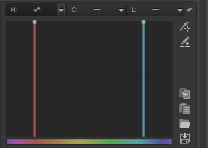

Az ábrán a színezet (H) görbeszerkesztő látható. Alul a bemeneti színezetet láthatjuk, amely színnél alulra húzzuk a görbét, azt a színt vagy színtartományt kizárjuk a maszkból.

Az ábrán a színesség (C) görbeszerkesztő látható. Amely színességnél alul fut a görbe, az olyan színességű (telítettségű) terület ki lesz zárva a maszkból.

A fenti ábrán a világosság (L) görbeszerkesztő látható. Bizonyos tónustartományt zárhatunk ki segítségével.

A fenti ábrán látható csúszkákkal magát a maszkot befolyásolhatjuk.

**L maszk részletvédelem**: Ha növeljük a csúszka értékét, akkor egyre inkább a kis részletek is a maszk részei lesznek.

**Kontrasztküszöb maszk**: Kontrasztküszöb maszkot lehet létrehozni segítségével, amelyet a fenti ábrán láthatunk.

**Elmosódás**: Elmosódást ad hozzá a maszkhoz.

Nézzük meg a parametrikus maszk alkalmazását.

A fenti ábrán látható képen a modell ruhájára szeretnénk maszkot készíteni. Aktiváljuk a Helyi szerkesztés eszközcsoportban lévő Szín/Tónus korrekció eszközt, azon belül a Parametrikus maszk részt.

Kapcsoljuk be a Maszk megjelenítését, ekkor a teljes képet maszk borítja. A H (színezet) görbénél válasszuk ki a Kiegyenlítő lehetőséget, és próbáljuk kizárni a ruhát a maszkból. Először a ruha kivételével a többi képelemre próbálunk maszkot készíteni. Ehhez a kéket, és a körülötte lévő színeket kell kizárnunk. A fenti ábrán láthatjuk is a görbét.

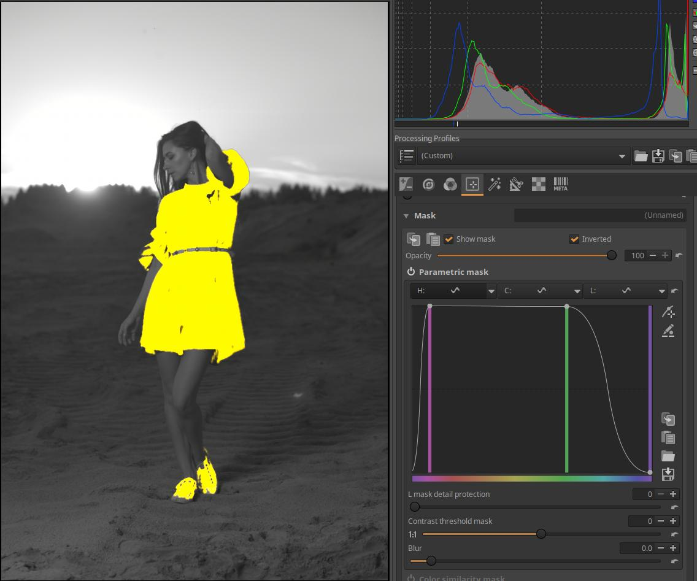

Jelöljük be a Fordított jelölőnégyzetet a Maszk megjelenítése mellett. Ekkor a maszk inverzre vált. Még láthatunk némi sárgás elszíneződést a háttéren és a modell lábán. Ha felül a két vezérlőpontot jobbra és balra húzzuk, akkor az elszíneződés megszűnik.

A modell cipője is része lett a maszknak, amelyet ecsetmaszkkal szüntethetünk meg. Ezt az Ecsetmaszkról szóló részben meg is nézhetjük.

Nézzük meg az alábbi képet.

A modell ruhájára szeretnénk maszkot készíteni Parametrikus maszk segítségével.

Engedélyezzük a Helyi szerkesztés eszközcsoportban a Szín/Tónus korrekció eszközt. Ezen belül engedélyezzük a Parametrikus maszkot, és kapcsoljuk be a Maszk megjelenítését. Ekkor a teljes képet maszk borítja, amely egyáltalán nem átlátszó. Nyissuk le a H (színezet) görbeszerkesztőt, és próbáljuk úgy korlátozni a színeket, hogy minél inkább csak a ruha alkossa a maszkot. A fenti ábrán láthatjuk, hogy ezt teljesen nem tudjuk elérni.

Nyissuk le a C (színesség) görbeszerkesztőt, és a görbével próbáljuk korlátozni, hogy a ruhán kívül minél kevesebb terület legyen a maszk része. A fenti ábrán láthatjuk az eredményt.

Ez még nem elég jó, finomítani kell rajta. Ha területmaszkkal vesszük körbe a modellt, akkor a területmaszkon kívüli részek nem lesznek a maszk részei. Ezt a Területmaszkoknál meg is nézhetjük.

####  4\.4\.1\.4 Színbeli hasonlóság maszk

A Színbeli hasonlóság maszkok a kép képpontjainak egy kiválasztott referenciaszínhez való hasonlóságán alapulnak.

**Kiválaszt**: Ennek a gombnak a megnyomása után az előnézet megfelelő pontjára történő kattintással jelölhetjük ki a referenciaterületet, amelyen lévő képpontok jellemzőihez hasonlítja a kép képpontjait.

Az itt látható L, C, H, és Tartomány csúszkákkal finomíthatjuk, hogy mennyire pontosan kell egyeznie a képpontnak a referenciaterülettel ahhoz, hogy a maszk része lehessen. Azt is mondhatjuk, hogy azt finomíthatjuk, hogy a referenciaszíntől milyen eltérés engedhető meg ahhoz, hogy az adott képpont még a maszk része legyen.

**L, C, és H csúszkák**: Az L, C, és H az LCH színrendszerre utal. Az L, C, és H csúszkák mindegyike két-két egymástól független csúszkát helyettesít. Van egy-egy felső csúszka, amellyel az L (Világosság), C (Színesség), illetve H (Színezet) értékét állíthatjuk be. Az alsó csúszkákkal pedig súlyozást (fontossági szintet) adhatunk hozzá, amely azt szabályozza, hogy a felső csúszka értéke milyen súllyal vegyen részt a maszk kiszámításában. A súlyozás csúszka bal oldali értékeinél megengedőbb lesz (nagyobb eltérés lesz megengedhető, amely nagyobb maszkterületet eredményez), a jobb oldali értékeinél pedig korlátozóbb lesz (kisebb eltérés lesz megengedhető, amely kisebb maszkterületet eredményez).

A beállítást vizuálisan is követhetjük a csúszkákon. Ha az alsó csúszkát bal szélső állásba toljuk, akkor a csúszka színe feketére vált, és a felső csúszkán bármilyen értéket is állítunk be, azt nem fogja figyelembe venni a maszk kiszámításakor. Minél inkább jobbra toljuk az alsó csúszkát, annál nagyobb mértékben veszi figyelembe a felső csúszkán beállított értéket, és a csúszkán látható színek annál világosabban jelennek meg.

**Tartomány**: Ha a Tartomány csúszkát nagyobb értékre állítjuk, akkor a referenciához képest nagyobb eltérés lesz megengedhető, ezért nagyobb terület lesz a maszk része, és fordítva.

**Átmeneti terület csökkentése**: Segítségével a maszkolt és a nem maszkolt területek közötti átmenet szélességét állíthatjuk. Alacsonyabb érték nagyobb átmeneti területet, simább átmenetet biztosít, míg magasabb értékek esetén az átmenet hirtelenebb, kevésbé fokozatos lesz.

**Erősség**: A maszk átlátszatlanságát, és ezáltal a szerkesztőeszköz hatásának erősségét állítja.

**Fordított**: Ennek bejelölése megfordítja, invertálja a Színbeli hasonlóság maszkot.

**Színbeli hasonlóság maszk alkalmazása:**

A fenti ábrán látható képet nyitottuk meg szerkesztésre. Célunk az, hogy maszk segítségével megváltoztassuk a modell ruhájának színét. Ezen a képen ezt könnyen meg tudjuk csinálni, mert a többi képelem színe erősen eltér a ruha színétől, ezért könnyen alkalmazható a Színbeli hasonlóság maszk, amely a hasonló színű területek kijelölésén alapul. Példánkban egy maszkot hozunk létre a ruhán úgy, hogy a színváltoztatás csak a ruhán érvényesüljön.

A Helyi szerkesztés eszközcsoportban bekapcsoljuk (aktiváljuk) a Szín/Tónus korrekció eszközt, a nevére kattintva lenyitjuk, és ekkor láthatóvá válnak a kezelőszervek. A Módnál Észlelési legyen kiválasztva. Láthatjuk, hogy már van is egy Korrekciós rétegünk. Ehhez fogunk most maszkot létrehozni.

Lejjebb kell görgetnünk, és le kell nyitnunk a Maszk részt. Ezután be kell kapcsolnunk a Színbeli hasonlóság maszkot, majd a nevére kattintva le kell nyitnunk.

Ezután a Kiválaszt gombra kell kattintanunk. Az egeret a módosítani kívánt színű terület fölé visszük, amely példánkban a modell ruhája, majd kattintunk az egérrel. Ekkor a Kiválaszt gomb alatti téglalap alakú területen megjelenik a kiválasztott szín.

Láthatjuk, hogy valóban megjelent a szín. Kapcsoljuk be a Maszk megjelenítését. Ekkor az előnézet szürkeárnyalatos lesz, és a sárga színű maszk megjelenik. Ahol sárga színt látunk, ott lesz hatása az eszköznek a képre. Az átlátszatlan sárga részeken (egyáltalán nem tűnik át a sárga maszkon keresztül a szürkeárnyalatos kép) teljes mértékben kifejti az eszköz a hatását, minél inkább láthatóvá válik a szürkeárnyalatos kép, annál kevésbé érvényesül az eszköz hatása. Láthatjuk, hogy a kijelölés nem túl jó, mert azt szeretnénk, ha a maszk teljesen lefedné a ruhát, hiszen a teljes ruhának meg szeretnénk változtatni a színét. Azok a problémás részek, ahol a ruhán a sárga maszk szélénél fekete részeket látunk. Ezt a problémát a Tartomány csúszkával korrigálhatjuk. Ezzel a csúszkával azt mondjuk meg a programnak, hogy a kiválasztott színhez képest mennyire térhet el az a szín a képen, amelynek még a maszk részének kell lennie. Az alapértelmezett érték 1, ezt nyilván növelni kell, mert ennél nagyobb eltérésű területeket is bele kell vennünk a maszkba annak érdekében, hogy a maszk melletti fekete területek is a maszk részei legyenek. Ha túlságosan megnöveljük a Tartományt, akkor a ruhán kívüli egyéb területeken is megjelenik a maszk sárga színe. Ha ezután csökkenteni kezdjük, akkor a ruhán kívül utoljára a fekete cipőkön láthatjuk a sárga színt. Addig kell csökkenteni, hogy a cipőkről éppen eltűnjön a sárga elszíneződés (az már ne legyen a maszk része). Itt éles határvonalú maszkra van szükség, hiszen azt szeretnénk, ha a teljes ruhát egyformán befedné a maszk, de azon kívül semmi se legyen a maszk része.

Így már sokkal jobb lett, 6,1-re kellett megnövelnünk a Tartomány értékét. Ha felnagyítva megnéznénk, akkor bizonyára még találnánk eltérést a maszk pontosságában. Természetesen van eszköz a maszk pontosítására, például Ecsetmaszkkal pontosítani lehetne, de ennek részleteibe most nem megyek bele.

Kapcsoljuk ki a Maszk megjelenítését, és ismét kék ruhában láthatjuk a modellt. A Színezet-eltolás csúszka segítségével tudjuk megváltoztatni a ruha színét. Ennek alapértelmezett értéke 0. A maszk miatt a Színezet-eltolás csúszka csak a maszk területén fejti ki hatását, azon kívül hatástalan. Az alábbi ábrák alatt feltüntettem a Színezet-eltolás csúszka azon értékét, amely a képen látható színt eredményezte.

  
*Színezet-eltolás: -32,7*

  
*Színezet-eltolás: -150*

  
*Színezet-eltolás: -180*

  
*Színezet-eltolás: 25,8*

  
*Színezet-eltolás: 86,8*

  
*Színezet-eltolás: 123,4*

Természetesen nemcsak a színét változtathatjuk meg a ruhának, hanem egyéb tulajdonságait is. Alkalmazhatunk expozíció-kompenzációt, változtathatunk a színtelítettségen, állíthatunk a kontraszton stb.

####  4\.4\.1\.5 Területmaszk

Téglalap, ellipszis, kör, görbékkel határolt, sokszög alakú, illetve átmenetes maszkot hozhatunk létre segítségével.

**Tollazat**: Tollazatot adhatunk hozzá az összes létrehozott alakzathoz.

**Elmosódás**: Gauss elmosást adhatunk hozzá az összes létrehozott alakzathoz.

Az alakzatok listája alatt megjelenő **Tollazat** és **Elmosódás** csúszka csak a kiválasztott Alakzatra van hatással, a többire nem hat.

**Kontrasztgörbe**: Egyszerű kontrasztgörbe segítségével módosíthatunk a maszkon. Akkor látható jól a hatása ha nemcsak teljesen átlátszó és teljesen átlátszatlan, hanem köztes átlátszatlanságú területei is vannak a maszknak.

**Alakzat**: Alakzatok listája. Itt láthatjuk a létrehozott alakzatokat.

Egy alakzatot **kiválasztani** (aktuálissá tenni) a listán történő rákattintással lehet.

Az alakzatlista mellett jobbra gombokat látunk, amelyeknek a funkciója felülről lefelé a következő:

**Visszaállítás**: Törli az összes létrehozott alakzatot.

**+**: Új alakzat hozzáadása.

**\-**: A kiválasztott alakzat eltávolítása.

**Felfelé nyíl**: Alakzat felfelé mozgatása a listán.

**Lefelé nyíl**: Alakzat lefelé mozgatása a listán.

**Mód**: (balról jobbra) **Hozzáadás**, **Kivonás**, vagy **Metszet** (közös rész) lehet.

Felül jobb oldalon négy gombot láthatunk, amelyeknek a funkciói jobbról balra az alábbiak:

1\. Megjeleníti az előnézeten az aktuális alakzatot, amelyet szerkeszthetünk is.

2\. Téglalap alakú alakzat hozzáadása az előnézetre történő rajzolással. A téglalap alakú alakzatok az előnézet határain tetszőlegesen túlnyúlhatnak.

A fekete terület a szerkesztett "kép", és a fehér téglalap az alakzat, amely az előnézet határain jóval túlterjed.

3\. Sokszög alakú alakzat létrehozása az előnézeten pontok hozzáadásával. A sokszög alakú alakzatok az előnézet határain tetszőlegesen túlnyúlhatnak.

4\. Átmenet hozzáadása.

#####  4\.4\.1\.5\.1 Téglalap hozzáadása, szerkesztése

Kattintsunk a jobbról második (a fenti listán 2-es) gombra, és az egérrel rajzoljuk az előnézetre a téglalapot.

Az alakzat oldalait az egérrel húzhatjuk. A szemben lévő oldalak egyszerre, szimmetrikusan mozognak.

A középponton átmenő két egyenes valamelyikét az egérrel megfogva a középpontja körül elfordíthatjuk a téglalapot.

A téglalap középpontját az egérrel megfogva a téglalapot tetszőleges helyre mozgathatjuk.

**Kerekség**: Ha növeljük az értékét, akkor a maszk sarkai egyre inkább lekerekednek, a csúszka maximális, 100-as értékénél ellipszist kapunk eredményül. Ha az alakzatunk négyzet alakú, akkor kör lesz a végeredmény.

A kerekség 100-as értékénél kapott ellipszis alakú maszk látható a fenti ábrán. Mint látható, maga az alakzat nem lesz ellipszis alakú, csak a maszk.

Az alakzat helye az előnézeten, a téglalap szélessége és magassága, valamint elfordulása nemcsak egérrel, hanem csúszkákkal is állítható.

**Középpont X**: Az alakzat középpontját vízszintesen mozgatja.

**Középpont Y**: Az alakzat középpontját függőlegesen mozgatja.

**Szélesség**: A téglalap szélességén állíthatunk.

**Magasság**: A téglalap magasságán állíthatunk.

**Szög**: Az alakzat középpontja körüli elfordulás szögén állíthatunk.

**Tollazat**: Tollazatot adhatunk hozzá a kiválasztott (aktuális) alakzathoz.

**Elmosódás**: Gauss elmosást adhatunk hozzá a kiválasztott (aktuális) alakzathoz.

#####  4\.4\.1\.5\.2 Sokszög hozzáadása, szerkesztése

Ehhez a részhez felhasználtam [Jean-Christophe Frisch írását](https://art.pixls.us/Shapes).

Sokszöggel, illetve görbe vonallal határolt maszkot hozhatunk létre segítségével.

Kezdjük el a sokszög létrehozását. Kattintsunk rá a sokszög létrehozása gombra. Ekkor aktív lesz a jobb szélső, az alakzat megjelenítésére, szerkesztésére szolgáló jobb szélső gomb is. Ennek egészen addig aktívnak kell lennie, amíg az alakzatot szerkesztjük. Pozicionáljunk az előnézeten, és Ctrl + kattintás létrehozza az első pontot. A fenti ábrán ez a bal oldali pont. Ezután pozicionáljunk a második pont helyére, és Ctrl + kattintás létrehozza a második pontot. Ekkor azt kell látnunk, amely az ábrán látható. A fehér vonal szaggatottan látszik, mert még nincs alakzat (ahhoz, hogy legyen, legalább három pont kellene). Megjelent egy narancssárga vonal is, amelyet Beszúrási vonalnak nevezünk. A narancssárga vonal végeinél látható két pont a Beszúrási vonal végeit mutatja. A Beszúrási vonal alapértelmezett helye az alakzat utolsó és első pontja között van, ez zárja le az alakzatot.

Ha most az alakzaton kívül Ctrl + kattintással egy újabb pontot hozunk létre, akkor a létrejövő két vonal valóban az előző ábrán látható Beszúrási vonal végpontjaihoz csatlakozik. Láthatjuk, hogy a fehér vonal folytonos vonalra változott, létrejött az alakzat. A folyamatos vonallal létrejött alakzat lesz a maszk határvonala.

Ha ismét létrehozunk egy pontot az alakzaton kívül Ctrl + kattintással, az ismét az előző ábrán látható Beszúrási vonal két végéhez csatlakozik (az eddigi utolsó, és a legelső pont közé).

Ha az alakzat valamely oldala fölé állunk az egérmutatóval, akkor az az oldal lesz a Beszúrási vonal, és Ctrl + kattintással azon hozhatunk létre egy új pontot.

Ha az egérmutatóval egy pont fölé állunk, akkor a pont színe narancssárgára változik, és az a pont lesz az aktuális pont. Bármely pontot megfoghatjuk egérrel, és tetszőleges helyre mozgathatjuk . Az aktuális pontot rajta Ctrl + jobb kattintással törölhetjük. Az utolsó három pontot nem tudjuk törölni, csak a teljes alakzat törölhető az Alakzatlista melletti "-" gombbal.

Az alakzat bármely oldalát megfoghatjuk az egérrel, és tetszőlegesen mozgathatjuk. Ha a Shift billentyűt is lenyomjuk, akkor a teljes alakzatot mozgathatjuk.

Ha az egérmutatóval ráállunk valamelyik pontra, lenyomjuk a Shift billentyűt, és az egeret jobbra mozgatjuk, akkor az alakzat csúcsait lekerekíthetjük. Balra mozgatva ismét egyre hegyesebb lesz. A lekerekítés mindig a pont két szomszédos pontja között jön létre. Az alakzat két szomszédos oldala szaggatott lesz, a lekerekítés marad folyamatos vonalú, jelezve, hogy az lesz a maszk széle.

Ctrl + kattintással maximálisan hegyes, Shift + Ctrl + kattintással pedig maximálisan lekerekített pontokat hozhatunk létre.

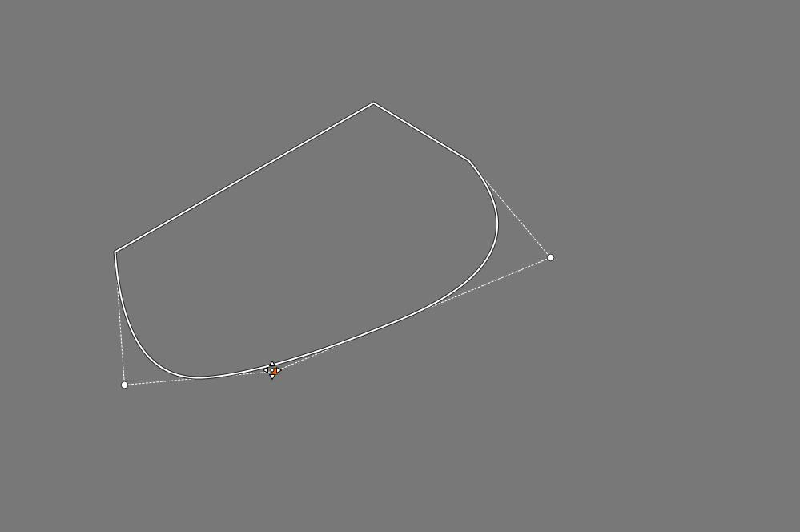

Ha két szomszédos lekerekített pont valamelyikénél megváltoztatjuk a lekerekítettséget, az hatással van a szomszédos pont lekerekítettségi görbéjének alakjára is. Erre a következő ábrán láthatjuk a megoldást.

Az ábrán a téglalap négy csúcsán helyezkednek el a lekerekített pontok. Minden oldal közepén elhelyeztem egy-egy maximálisan hegyes pontot. Mivel a lekerekítés mindig a lekerekített pont két szomszédos pontja között jön létre, az oldalak közepén elhelyezkedő pontok megakadályozzák a lekerekítés hatásának a téglalap másik csúcsa felé történő terjedését. Tehát az oldalak közepén elhelyezett pontok csak azt a célt szolgálják, hogy ha változtatunk az egyik sarok lekerekítettségén, annak ne legyen hatása a téglalap szomszédos csúcsainak lekerekítettségére.

Nézzük meg a maszkot.

Az Alakzatlista alatt látható Tollazat csúszkával tollazatot adhatunk (az alakzatlistán kijelölt) maszkhoz.

A maszk a tollazattal.

Az Alakzatlista alatt látható Elmosódás csúszkával elmosódást adhatunk a maszkhoz. A fenti ábrán a tollazatot és az elmosódást együtt láthatjuk. Az Elmosódás csúszka sem a képre hat, hanem magára a maszkra, alkalmazásával sokkal finomabb lesz az átmenet ahhoz képest, mintha csak Tollazatot alkalmaztunk volna.

#####  4\.4\.1\.5\.3 Átmenet hozzáadása, szerkesztése

Kattintsunk az átmenet hozzáadása céljából a jobbról negyedik gombra, és az előnézeten szerkeszthetjük az átmenetet.

A két párhuzamos egyenes egyikét egérrel megfogva beállíthatjuk az átmenet szélességét.

A középponton átmenő egyenesek egyikét egérrel megfogva elfordíthatjuk az átmenetet.

A középpontot egérrel megfogva az átmenetet a kívánt helyre mozgathatjuk.

**Középpont X**: A középpontot vízszintesen mozgatja.

**Középpont Y**: A középpontot függőlegesen mozgatja.

**Kezdő erősség**: Az átmenet kezdő erősségét lehet beállítani segítségével.

**Végső erősség**: Az átmenet végső erősségét lehet beállítani segítségével.

**Szög**: Az átmenet elfordulási szögének beállítására szolgál.

**Tollazat**: Tollazatot adhatunk az átmenethez. Ha a Tollazat értéke 0, akkor hirtelen átmenet keletkezik.

#####  4\.4\.1\.5\.4 Területmaszk a kép határain kívül

A területmaszkot kiterjeszthetjük a kép határain kívülre is. Ezt nézhetjük meg az alábbi ábrán.

A fenti ábrán látható kép alsó részét szeretnénk világosítani úgy, hogy felül a maszk határán fokozatos átmenet keletkezzen, de a kép oldalainál és aljánál ne keletkezzen átmenet. Az átmenetet tollazat hozzáadásával valósítjuk meg. A területmaszk határainak a kép jobb és bal oldalánál, valamint az aljánál jóval a képen kívül kell lennie, mert így elérhetjük, hogy a kép jobb és bal oldalánál, valamint az aljánál a tollazat a képen kívül jöjjön létre, és ne legyen hatással a képre.

#####  4\.4\.1\.5\.5 Területmaszkon kívüli terület kizárása a maszkból

A fenti ábrán látható maszkot Parametrikus maszkkal hoztam létre. A probléma az, hogy nem sikerült a maszkot úgy létrehozni, hogy a modell ruháján kívül semmi se legyen a maszk része.

A fenti ábrán a modell körül sokszög alakú Területmaszkot hoztam létre, amely kizárta a maszkból a rajta kívüli területeket.

####  4\.4\.1\.6 Ecsetmaszk

Ecsettel maszkot rajzolhatunk az előnézetre, és törölhetjük az előzőleg bármelyik maszktípussal létrehozott maszkunkat, vagy annak egy részét.

Jobb oldalon egymás alatt gombokat találunk, amelyek fentről lefelé a következők:

1\. Az összes ecsetvonás törlése.

2\. Csak az utolsó vonáscsoportot (utolsó "ecsetvonást") törli.

3\. Ecset be/kikapcsolása.

4\. Metszet képzése más maszkokkal (a közös rész lesz az eredő maszk).

5\. A többi maszk fölé adja hozzá az ecsettel létrehozott maszkot.

6\. Csak az aktív területmaszkon belül adja hozzá az ecsettel létrehozott maszkot a többi maszk fölé.

Ha bekapcsoljuk az ecsetet, akkor az ecsettel maszkot rajzolhatunk az előnézetre (az egérgomb lenyomva tartásával). A maszkot több ecsetvonással alakíthatjuk ki, az ecsetvonások száma nincs korlátozva. Az egérgomb felengedése nélkül végrehajtott festés egy ecsetvonásnak számít. Egy újabb ecsetvonást úgy kezdeményezhetünk, hogy felengedjük az egér gombját. Ha egy ecsetvonást elrontottunk, akkor közvetlenül utána törölhetjük azt.

Ha többször átmegyünk ugyanazon a területen egy ecsetvonáson belül, vagy akár több különálló ecsetvonással, akkor az ecsetvonások hatása nem adódik össze, olyan lesz a hatás, mintha csak egyszer festettük volna be a területet. Ez nagyon jó olyankor, amikor kimarad véletlenül egy kis terület. Ilyenkor átmehetünk újra az ecsettel a hiányzó részen, és nem kell attól tartanunk, hogy ahol ismét rámentünk az ecsettel a hiányzó rész melletti maszkterületre, akkor ott dupla hatása lesz az ecsetnek. Amikor azonban a Ctrl billentyűt lenyomva tartjuk az ecsetvonások készítése közben, akkor az ecsetvonások hatása összeadódik. Képzeletben 20%-os átlátszatlansággal hozzunk létre egy ecsetmaszkot, majd engedjük fel az egérgombot. Utána ha a Ctrl gomb lenyomása (és persze az egér gombjának lenyomása) mellett átfestjük az előzőleg létrehozott maszkot vagy annak egy részét, akkor azt tapasztalhatjuk, hogy a korábbi ecsetvonások és az újabb ecsetvonások hatása összeadódik, és az újabb ecsetvonások helyén a maszk átlátszatlanabb lett. Itt is igaz az, hogy egy ecsetvonáson belül történő többszöri átfestés csak egyszeres hatást vált ki. A Ctrl billentyű használata lehetőséget biztosít arra, hogy lágyabb és finomabb hatást érjünk el oly módon, hogy kevésbé átlátszatlan és/vagy nagyobb tollazatú ecsettel kezdünk, majd több ecsetvonást alkalmazunk a kívánt hatás eléréséig.

**Ecset beállításai**:

Az Ecset beállításai részben az Ecset beállításain akár ecsetvonásonként is változtathatunk. Ezek a változtatások a korábban létrehozott ecsetvonásokra hatástalanok, csak a változtatás után létrehozott ecsetvonásokat befolyásolják.

**Sugár**: Az ecset sugarát állíthatjuk be segítségével.

**Átlátszatlanság**: Az ecsetvonások átlátszatlanságát állíthatjuk be az eredeti képpel történő keveréshez (százalékban). Lentebb, az Általános beállításoknál alkalmazott Átlátszatlanságot tekinti 100%-nak, és ehhez képest lesz az eredő átlátszatlanság az Ecset beállításánál alkalmazott Átlátszatlanság szerint kevesebb. Például ha az Általános beállításoknál 50%, és az Ecset beállításainál szintén 50% átlátszatlanságot állítottunk be, akkor eredőül (0,5x0,5=0,25) 25% átlátszatlanságot kapunk.

**Radír mód**: Ha engedélyezzük, akkor az ecsettel törölhetünk részeket az előzőleg bármilyen módon létrehozott maszkunkról. Ha a Maszk megjelenítése mellett látható Fordított jelölőnégyzet be van jelölve, akkor a törléshez nem kell engedélyezni a Radír módot, hozzáadáshoz azonban engedélyezni kell.

**Általános beállítások**:

Az Általános beállítások részben történő változtatások az összes eddigi, és az összes ezután történő ecsetvonásra is hatással lesznek.

**Tollazat**: Tollazatot adhatunk hozzá a maszk környezete felé történő fokozatos átmenet elérése céljából.

**Átlátszatlanság**: Az ecsetvonások átlátszatlansága az eredeti képpel történő keveréshez (százalékban). Az Ecset beállításainál látható Átlátszatlanság az itt beállított átlátszatlanságot tekinti 100%-nak.

**Simaság**: A maszk környezete felé történő átmenet simaságát állíthatjuk be segítségével. A magasabb értékek simább átmenetet eredményeznek.

**Kontrasztgörbe**: Egyszerű kontrasztgörbe segítségével módosíthatunk a maszkon. Akkor látható jól a hatása ha nemcsak teljesen átlátszó és teljesen átlátszatlan, hanem köztes átlátszatlanságú területek is vannak.

#####  4\.4\.1\.6\.1 Felesleges maszkrészek eltüntetése Fordított maszk esetén

A fenti ábrát a Parametrikus maszknál már láthattuk. Ott engedélyeztük a Maszk megjelenítése melletti Fordított lehetőséget. A modell cipőjének nem kell a maszk részének lenni, ezért Ecsetmaszkkal eltüntetjük róla a maszkot.

Engedélyezni kell az Ecsetmaszkot, majd azon belül az Átlátszatlanság csúszka végénél található "Adja hozzá a maszkot a többi maszk fölé" gombra kell kattintani, melynek hatására ismét megjelenik maszkunk. Mivel maszkunk Fordított maszk, ezért nem kell engedélyeznünk a Radír módot, hanem normál módban be kell festenünk az ecsettel a modell cipőjénél lévő maszkrészt.

A fenti ábrán láthatjuk, hogy a cipő már nem a maszk része.

A Színbeli hasonlóság maszkon belül is találunk Fordított lehetőséget. Ha ez engedélyezve van, de a Maszk megjelenítése melletti Fordított nincs, akkor a törléshez engedélyezni kell a Radír módot.

####  4\.4\.1\.7 Maszk utófeldolgozás

A Maszk rész alján találjuk a Maszk utófeldolgozás részt. Az ebben található beállítási lehetőségek nem a képet, hanem magát a maszkot módosítják.

A **Poszterizáció** 0 és 6 között állítható. Minél nagyobb értéket állítunk be, annál inkább csökkenti a maszk átmeneti területeinek simaságát, és egyre inkább sávosodást (poszterizációt) okoz. Maximális értékénél a tónustartomány két értékre csökken, a minimum illetve a maximum értékre, köztük éles átmenettel.

A **Simítás** csúszka értékének növelése fokozatosan simítja az átmenetet a Poszterizáció csúszka által létrehozott tónustartományok között. A Poszterizáció csúszka nulla értékénél nincs hatása.

**Tónusgörbe**: Egyszerű tónusgörbe segítségével módosíthatunk a maszkon. Akkor látható jól a hatása, ha nemcsak teljesen átlátszó és teljesen átlátszatlan, hanem közbülső átlátszatlanságú területei is vannak a maszknak.

**Maszk utófeldolgozás alkalmazása**

Nézzük meg a Maszk utófeldolgozás lehetőségeit. Maszk utófeldolgozással magán a maszkon változtathatunk, finomíthatunk.

A fenti képet nyitottuk meg szerkesztésre. Aktiváljuk a Helyi szerkesztés eszközcsoportban található Szín/Tónus korrekció eszközt. A Módnál az Expozició-kompenzációt válasszuk ki. De választhatunk helyette mást is, a lényeg, hogy a kép világosságát szabályozni tudjuk.

Színbeli hasonlóság maszk segítségével az ábrán látható maszkot hoztuk létre.

Menjünk a Maszk utófeldolgozás részbe. Állítsuk a Poszterizáció csúszkát maximális, 6-os értékre. Figyeljük meg, hogy a maszk árnyalatai eltűntek, és most már vagy teljesen sárga (maximális fedettségű) rész van, vagy teljesen átlátszó, ahol csak a fekete-fehér előnézetet látjuk.

Nézzük meg a hatást, állítsunk a kép világosságán.

Ahogy növeljük a Simítás csúszka értékét, úgy lesz egyre simább az átmenet a maszk sárga részei és a környezete között.

A fenti ábrán nézzük meg, hogy milyen lett így a kép.

Most foglalkozzunk a tónusgörbével. Egy tónusgörbét alkalmazhatunk közvetlenül a maszkra. A fenti ábrán a görbe jobb felső sarkában látható vezérlőpontot lejjebb húztam. Láthatjuk, hogy a maszk teljes területén csökkent az átlátszatlanság (átlátszóbb lett), legjobban a legátlátszatlanabb területek átlátszatlansága csökkent (a görbének megfelelően).

Ha a bal alsó sarokban lévő vezérlőpontot felfelé toljuk, akkor növekszik a maszk átlátszatlansága, legerősebb mértékben a legkevésbé átlátszatlan (azaz leginkább átlátszó) területeken.

Végül állítsunk be egy görbét.

És nézzük meg a hatását. A görbe módosította a maszkot, amely miatt módosult a szerkesztőeszköz képre gyakorolt hatása, jelen esetben az expozíció-kompenzáció hatása.

####  4\.4\.1\.8 Műveletek maszkokkal

Az eredő maszk létrehozásakor úgynevezett halmazműveleteket hajt végre az ART, ezekkel történik a négyféle maszktípusból az eredő maszk előállítása. A halmazok az egyes maszktípusok által létrehozott maszkok képpontjai. Nézzük meg egy fehér kép és Területmaszkok segítségével a maszkokkal végezhető műveleteket. A maszkokkal (egészen pontosan azok képpontjaival) **hozzáadás**, **kivonás**, és **metszet** műveleteket lehet végezni. A metszet két (vagy több) maszk közös részét jelenti, azokat a részeket, amelyek mindegyik maszknak részei. A kivonás műveletének tényezői (a műveletben résztvevő maszkok) nem felcserélhetők, nem mindegy, hogy melyikből melyiket vonjuk ki. Ezért nem mindegy az alakzatlistában az alakzatok sorrendje sem. Az egyes alakzatoknál kiválasztott művelet az alakzatlistán látható sorrendben hajtódik végre.

Nyissunk meg egy bármilyen képet szerkesztésre. Aktiváljuk a Szín/Tónus korrekció eszközt. Aktiváljuk a Területmaszkot, és kapcsoljuk be a Maszk megjelenítését. Ekkor láthatjuk a teljes képet lefedő "globális" maszkot. Hozzunk létre egy téglalap alakú területmaszkot. A létrehozás pillanatában a globális maszk megszűnik.

Az ábrán a Mód-nál lehet kiválasztani a műveleteket, amelyek balról jobbra a következők lehetnek:

-   Hozzáadás mód
-   Kivonás mód
-   Metszet mód

A "semmiből" nem lehet kivonni, és a "semmivel" nem lehet metszetet képezni sem, ezért ha most ezekre az gombokra kattintunk, akkor üres maszkot kapunk. Most csak a hozzáadásnak van értelme annak érdekében, hogy legyen egy területmaszkunk.

Adjunk hozzá egy másik téglalapot úgy, hogy legyen átfedés a két téglalap között. Az ábrán a második téglalapnál is Hozzáadás módot állítottam be. A második téglalap hozzáadódott az elsőhöz.

Ha a második alakzatnál Kivonás módot állítunk be, akkor a második alakzat kivonódik az elsőből.

Ha a második alakzatnál a Metszet gombra kattintunk, akkor a két alakzat metszetét, azaz közös területét kapjuk. Az eredő maszk sárga területe része volt mindkét téglalapnak.

Az Ecsetmaszknál az alábbi módokat láthatjuk:

Jobbra egymás alatt láthatjuk a gombokat. A felső a Metszet mód, a középső a Hozzáadás mód, az alsó a "Hozzáadás a többi maszkhoz, de csak az aktív területmaszkon belül" mód gombja.

####  4\.4\.1\.9 Az eredő maszk létrehozása

Az ART a következőképpen hozza létre a négyféle maszk (Parametrikus maszk, Színbeli hasonlóság maszk, Területmaszk, Ecsetmaszk) kombinálásával az adott korrekciós réteghez tartozó eredő maszkot:

1\. Létrehozza a Parametrikus maszkot.

2\. A Parametrikus maszktól teljesen függetlenül létrehozza a Színbeli hasonlóság maszkot.

3\. Az 1\. és 2\. pontban létrehozott maszkoktól teljesen függetlenül létrehozza a Területmaszkot. Ezt a különféle alakzatok módja (Hozzáadás, Kivonás, Metszet) szerinti műveletekkel állítja elő az alábbiak szerint:

3.1 ܜres maszkból indul ki, és az alakzatok listájában felülről lefelé minden egyes alakzat esetén a kép minden képpontja tekintetében végrehajtja az alábbiakat:

3.1.1 Ha a képpont az aktuális alakzat belsejében van, akkor Hozzáadás mód esetén a képpontot hozzáadja a maszkhoz, Kivonás mód esetén kivonja a maszkból.

3.1.2 Ha a képpont nincs az aktuális alakzat belsejében, és Metszet mód van beállítva, akkor a képpontot eltávolítja a maszkból.

4\. Készít egy közbülső maszkot az 1. 2., és 3. maszk Metszetével. Azaz a közbülső maszk az 1. 2. 3. maszkok közös területeit tartalmazza.

5\. Előállítja az ecsetmaszk hatását a következők szerint:

5.1 Metszet mód esetén előállít egy mindentől független ecsetmaszkot, és Metszetét képezi a 4. pontban kapott maszkkal.

5.2 Hozzáadás mód esetén "átfesti" a 4. pontban kapott maszkot. Ez az "átfestés" hozzáadást, illetve Radír módban a törlés kivonást jelent.

5.3 "Hozzáadás a többi maszkhoz, de csak az aktív területmaszkon belül" mód esetén csak a 3. pont szerint kapott területmaszkon belül történik meg az előző pontban leírt "átfestés" (Radír módban kivonás), azon kívül nem.

6\. Ha a Fordított lehetőség be van jelölve, akkor előállítja az 5. pontban kapott eredő maszk fordítottját.

####  4\.4\.1\.10 Maszkokkal kapcsolatos óvintézkedések

A maszkokkal kapcsolatban néhány dologra figyelni kell.

**Óvintézkedések Területmaszkok és Ecsetmaszkok használatakor**: A Helyi szerkesztés eszközeinek mindegyike a geometriai képjavítások után helyezkedik el a csővezetékben, ezért ha Területmaszk vagy Ecsetmaszk létrehozása után geometriai korrekciót végzünk, akkor ezeket a maszkokat összezavarjuk. A Forgatást, Kivágást, Perspektíva korrekciót, Profilozott objektívhiba javítást, Objektívtorzítás korrekcióját a Területmaszkok és az Ecsetmaszkok létrehozása előtt kell elvégezni.

**Óvintézkedések Parametrikus maszkok és Színbeli hasonlóság maszkok használatakor**: Mivel a Helyi szerkesztés eszközei a csővezeték végének közelében helyezkednek el, a maszkok létrehozása előtt minden beállítást meg kell tenni, kivéve a következőket, amelyeket a maszk létrehozása után is el lehet végezni:

1\. **Helyi kontraszt szerkesztőeszköz esetén**: a Filmszimuláció, a Fekete-fehér, és a Filmszemcse eszközök beállításai.

2\. **Szín/Tónus korrekció, Simítás, és Textúra kiemelése/Élesítés szerkesztőeszköz esetén**: a Log tónusleképezés, a Telítettség/Élénkség, a Tónusgörbék, az RGB görbék, az L\*a\*b\* korrekciók, a Lágy fény, a Filmszimuláció, a Fekete-fehér, és a Filmszemcse eszközök beállításai.

####  4\.4\.1\.11 A csővezeték hatása a maszkokra

Gondoljuk át a csővezetékben lévő eszközök hatását a maszkokra.

Az előzőekben leírtak alapján teszek néhány megállapítást:

-   Maszk létrehozásakor az ART az adott szerkesztőeszköz bemeneti képére alkalmazza a maszk paramétereit, és így állítja elő a maszkot. Ha valamitől megváltozik a szerkesztőeszköz bemeneti képe, akkor maga a maszk is megváltozik.
-   Csak az a szerkesztőeszköz tudja megváltoztatni egy másik szerkesztőeszköz bemeneti képét, amely a csővezetékben előbb helyezkedik el, és ezért előbb hajtódik végre. Amelyik később hajtódik végre, az a bemeneti képre nem lesz hatással.
-   Ha valamely helyi szerkesztőeszközben be van kapcsolva a Maszk megjelenítése, akkor ez marad az előnézet akkor is, ha másik szerkesztőeszközbe megyünk át. Ez nagyon hasznos funkció, mert lehetőséget ad arra, hogy megnézzük az adott szerkesztőeszköz adott maszkra gyakorolt hatását.
-   Ha vágólapon keresztül átmásoljuk a maszkot, akkor csak a maszk létrehozásakor alkalmazott paraméterek másolódnak át, nem pedig képpontról képpontra maga a maszk.

A fenti ábrán a Helyi szerkesztés eszközcsoportban lévő Szín/Tónus korrekció  eszközben létrehoztam egy színbeli hasonlóság maszkot. A Maszk megjelenítését bekapcsolva hagytam.

Átmentem az Expozíció eszközcsoportba, és azon belül az expozíció eszközbe. Ez az eszköz a Szín/Tónus korrekció előtt helyezkedik el a csővezetékben. A maszk továbbra is látható. -0,5 fényértéknyi expozíció-kompenzációt alkalmaztam. Az előző ábrával összehasonlítva megállapíthatjuk, hogy mennyit változott meg a maszk. A maszk megváltozásával együtt természetesen változik a Szín/Tónus korrekció eszközben beállított módosítás (például Színezet-eltolás) hatása is, amely a megváltozott maszk szerint fogja kifejteni hatását.

Tehát megfigyelhettük, hogy mi történik akkor, ha a maszk létrehozása után módosítunk egy olyan eszköz beállításán, amely a csővezetékben az előtt az eszköz előtt helyezkedik el, amelyben a maszkot létrehoztuk. Hatására változik maga a maszk, és annak hatása is.

#####  4\.4\.1\.11\.1 Különböző maszkok azonos szerkesztőeszközön belül

Egy helyi szerkesztőeszközön belül mindegyik Korrekciós réteghez egyetlen eredő maszk tartozhat. Itt arról lesz szó, hogy hogyan befolyásolják egy adott Korrekciós rétegen végzett szerkesztési beállítások a Korrekciós réteg listán alatta lévő Korrekciós rétegeken kialakított maszkokat. Tehát arról van szó, hogy az első korrekciós rétegen például állítottunk az expozíció-kompenzáción, és arra vagyunk kíváncsiak, hogy ez befolyásolja-e a listán alatta lévő korrekciós réteghez létrehozott maszkot. Tehát magát a maszkot, és a maszk változása miatt a képet.

Ezt nagyon könnyű eldönteni. Mivel mindegyik Korrekciós réteg egymástól teljesen függetlenül, a szerkesztőeszköz bemeneti képéből állítja elő az eredő maszkját, az egyes Korrekciós rétegekhez alkalmazott eszközbeállításoknak a másik korrekciós réteg maszkjára egy szerkesztőeszközön belül nincs semmilyen hatása. Ezt ne értsük félre. Magára a képre természetesen hat az első korrekciós rétegnél történt paraméter (pl. expozíció-kompenzáció) megváltoztatása, és ha átváltunk a második korrekciós rétegre, akkor az első korrekciós rétegen történt változtatást látjuk is az előnézeten. Ha azonban megjelenítjük az egyes korrekciós rétegekhez tartozó sárga maszkokat, azok változatlanok maradtak, nem változtak az expozíció-kompenzáció változtatásának hatására.

#####  4\.4\.1\.11\.2 Maszkok másolása a Helyi szerkesztés eszközei között

A Helyi szerkesztés eszközei között átmásolva a maszkokat nem feltétlenül az eredetivel megegyező maszkot kapunk, ezért azokat szükséges lehet korrigálni. Ennek az az oka, hogy nem maga a maszk másolódik át, hanem csak a maszk előállításához szükséges paraméterek. Nézzük az ART csővezetékének a Helyi szerkesztés eszközeit tartalmazó részletet.

25. **Szín/Tónus korrekció** - Lineáris RGB  
26. **Simítás** - Lineáris RGB  
27. Átmenetes/Peremsötétedés szűrő - Lineáris RGB  
28. **Textúra kiemelése/Élesítés** - Lineáris RGB  
29. Logaritmikus tónusleképezés - Lineáris RGB  
30. Telítettség/Élénkség - Lineáris RGB  
31. Tónusgörbék - Lineáris RGB határolt  
32. Filmszimuláció - RGB  
33. RGB görbék - Lineáris RGB határolt  
34. L\*a\*b\* korrekciók - L\*a\*b\*  
35. Lágy fény - RGB gamma 2.2 határolt  
36. **Helyi kontraszt** - L\*a\*b\*  

A listában kiemeltem a helyi eszközöket. Akkor lenne az átmásolt maszk ugyanolyan, mint ahonnan másoltuk, ha a két eszköz bemeneti képe is ugyanolyan lenne. A csővezeték működési elve miatt azonban ez a feltétel nem biztosítható. Ha például a Textúra kiemelése/Élesítés eszközből a maszkot átmásoljuk a Helyi kontraszt eszközbe, akkor a Helyi kontraszt bemenő képét minden olyan eszköz befolyásolhatja, amely a csővezetékben a két eszköz között van (pl. a gyakran használt Tónusgörbék eszköz is).

Akkor lehetne ugyanolyan a szerkesztőeszközök között másolt maszk, ha nem a maszkot létrehozó paraméterek, hanem maga a maszk másolódna át képpontonként. Az ART-ban azonban ez nem lehetséges.

###  4\.4\.2 Szín/Tónus korrekció

A Helyi szerkesztés eszközcsoportban található. Színek és tónusok korrekciójára szolgál. Ez valójában nem egy eszköz, hanem egy eszközcsoport.

A Módnál választhatjuk ki a szerkesztőeszközök csoportjából azt a szerkesztőeszközt, amellyel dolgozni szeretnénk. A szerkesztőeszközök többsége CTL szkript, csak az első néhány (Standard, Észlelési, RGB csatornánként külön, HSL tényezők, LUT) nem az.

Tekintsük át a Módnál kiválasztható szerkesztőeszközöket.

####  4\.4\.2\.1 Standard és Észlelési

A Helyi szerkesztés eszközcsoportban található Szín/Tónus korrekció eszközben a Módnál választhatjuk ki.

A Standard és az Észlelési ugyanannak az eszköznek kétféle módját jelenti. A Standard lineáris RGB, az Észlelési pedig észlelési térben működik. A felhasználói felületük és a kezelőszerveik is közösek. Ez azt jelenti, hogy a beállítások megmaradnak, ha váltunk a Standard és az Észlelési Mód között.

Segítségével a színezet, a telítettség, a kontraszt, és a tónusok állíthatók be.

**Színezet-eltolás**: Eltolhatjuk a bemeneti kép színezetét a Színkör színei szerint a csúszkán beállított fokkal (-180 ... +180).

**Telítettség - Bemenet**: A bemeneti kép telítettségét változtathatjuk a csúszka segítségével. A bemeneti telítettség csúszka a többi vezérlő (színezet-eltolás, színkör stb.) előtt fejti ki hatását.

**Telítettség - Kimenet**: A kimeneti kép telítettségét változtathatjuk a csúszka segítségével. A kimeneti telítettség csúszka a többi vezérlő után fejti ki hatását.

Azért van szükség Telítettség - Bemenet és Telítettség - Kimenet csúszkára is, mert a kapott eredmény bizonyos esetekben eltérő lehet.

**Színkör**: Eltolja a bemeneti színeket a színkörön beállított színezet, és a színkörön beállított telítettség szerint.

**Fehéregyensúly beállítása**: A Színkör mellett jobbra fent találjuk a "pipetta" gombot, amellyel a fehéregyensúlyt állíthatjuk be. Ha bekapcsoljuk a gombra kattintva ezt a funkciót, és az egérmutatót az előnézet fölé állítjuk, akkor a Színkörön láthatjuk, hogy milyen korrekciót fog végezni az ART, amikor az adott pontból veszünk mintát a pipettával. A fehéregyensúly beállításához egy semleges színű fehér vagy szürke területre kell kattintani az előnézeten a Ctrl billentyű nyomva tartása mellett. Kiválasztás nélkül a gombra történő ismételt kattintással, vagy az előnézeten jobb egérgombbal történő kattintással kapcsolhatjuk ki ezt a funkciót.

**Színek megváltoztatása színkörrel**: A Színkör középpontján lévő pontra kell kattintani, és az egérgomb nyomva tartása mellett a megfelelő irányba kell húzni a pontot. Ennek hatására eltolja a bemeneti színeket a kiválasztott szín irányába. Minél távolabbra húzzuk a pontot a középponttól, annál nagyobb lesz a telítettség.

**Hatás erőssége**: A Színkör mellett jobbra találjuk a hatás erősségét szabályozó függőleges csúszkát.

A Színkör alatt láthatunk két gombot, amelyekre kattintva vagy a Színkört, vagy a tónusgörbét jeleníthetjük meg. A tónusgörbe függetlenül működik a színkörtől, a képen mindkettő hatása érvényesül.

A tónusgörbe a bemeneti képre kerül alkalmazásra. A görbét nem lehet közvetlenül szerkeszteni, ehelyett az alatta lévő csúszkákkal alakíthatjuk ki a tónusgörbe alakját. A görbe kezdetben egy átlós egyenes, amelynek semmi hatása sincs a képre.

A **Csúcsfények/Nyereség**, az **Árnyékok/Kiemelés**, a **Középtónusok/Gamma**, a **Pivot (középtónusok eltolása)**, és a **Tömörítés** csúszkákkal lehet kialakítani a görbe alakját.

####  4\.4\.2\.2 RGB csatornánként külön

A Helyi szerkesztés eszközcsoportban található Szín/Tónus korrekció eszközben a Módnál kiválasztható eszköz.

**Telítettség - Bemenet**: A bemeneti kép telítettségét változtathatjuk a csúszka segítségével. A bemeneti telítettség csúszka a tónusgörbék előtt fejti ki hatását.

**Telítettség - Kimenet**: A kimeneti kép telítettségét változtathatjuk a csúszka segítségével. A kimeneti telítettség csúszka a tónusgörbék után fejti ki hatását.

Azért van szükség Telítettség - Bemenet és Telítettség - Kimenet csúszkára is, mert a kapott eredmény bizonyos esetekben eltérő lehet.

Mindhárom színcsatornára külön tónusgörbét hozhatunk létre. A színcsatornát a görbe alatt választhatjuk ki.

**Megfelelő csúszkák összekapcsolása**: Ha bekapcsoljuk, akkor a görbe alatti csúszkák egyszerre mindhárom színcsatorna görbéjét változtatják.

**Fényerő mód**: Ha bekapcsoljuk, akkor a görbék a képpontok fényerejének megváltoztatására szolgálnak úgy, hogy megváltoztatják az egyes színcsatornák értékeit, miközben a színek nem változnak.

A tónusgörbe a bemeneti képre kerül alkalmazásra. A görbét nem lehet közvetlenül szerkeszteni, ehelyett az alatta lévő csúszkákkal alakíthatjuk ki a görbe alakját. A görbe kezdetben egy átlós egyenes, amelynek semmi hatása sincs a képre.

A **Csúcsfények/Nyereség**, az **Árnyékok/Kiemelés**, a **Középtónusok/Gamma**, a **Pivot (középtónusok eltolása)**, és a **Tömörítés** csúszkákkal lehet kialakítani a görbe alakját.

####  4\.4\.2\.3 HSL tényezők

A Helyi szerkesztés eszközcsoportban található Szín/Tónus korrekció eszközben a Módnál kiválasztható eszköz. Segítségével a színek módosíthatók, a telítettség, a kontraszt, és a tónusok beállíthatók.

**Színezet-eltolás**: Eltolhatjuk a bemeneti kép színeit a Színkör színei szerint a csúszkán beállított fokkal (-180 ... +180).

**Telítettség - Bemenet**: A bemeneti kép telítettségét változtathatjuk a csúszka segítségével. A bemeneti telítettség csúszka a többi vezérlő előtt fejti ki hatását.

**Telítettség - Kimenet**: A kimeneti kép telítettségét változtathatjuk a csúszka segítségével. A kimeneti telítettség csúszka a többi vezérlő után fejti ki hatását.

Azért van szükség Telítettség - Bemenet és Telítettség - Kimenet csúszkára is, mert a kapott eredmény bizonyos esetekben eltérő lehet.

Három színkört láthatunk. Segítségükkel három tónustartomány (Csúcsfények/Nyereség, Árnyékok/Kiemelés, Középtónusok/Gamma) színét tolhatjuk el. A színkör középpontját megfoghatjuk az egérrel, és a kívánt irányba húzhatjuk. Minél távolabbra húzzuk a középponttól, annál nagyobb lesz a telítettség.

A színkörök alatti csúszkákkal az adott tartomány világosságát változtathatjuk.

**Gamma**: A Gammát állíthatjuk segítségével.

####  4\.4\.2\.4 LUT

A Helyi szerkesztés eszközcsoportban található Szín/Tónus korrekció eszközben a Módnál kiválasztható eszköz.

Az ART a RawTherapee-tól örökölte a 3D LUT-ok (LUT = Look-Up Table) támogatását. Ezek támogatása a Filmszimuláció eszközben, és itt érhető el. Ilyen 3D LUT-okat tartalmaz a közösség által fejlesztett Hald CLUT LUT-gyűjtemény, amely különféle filmtípus szimulálására alkalmas. Az eszköz alkalmazása előtt valamilyen LUT-gyűjteménynek telepítve kell lennie.

Alkalmazása előtt a LUT-okat tartalmazó könyvtárat be kell állítanunk a Beállítások Képfeldolgozás lapjának Könyvtárak részén.

Ki kell választanunk az alkalmazandó LUT fájlt.

A Megnyitás gombra kattintás után az ART azonnal alkalmazza a LUT-ot.

####  4\.4\.2\.5 Általánosított hiperbolikus nyújtás CTL szkript

A Helyi szerkesztés eszközcsoportban található Szín/Tónus korrekció eszközben a Módnál kiválasztható CTL szkript.

Az Általánosított hiperbolikus nyújtás (Generalized Hyperbolic Stretch) CTL szkript lehetővé teszi a kép jobb megjelenítését. Lényegében S-görbe szerű görbét hoz létre.

A nyújtás a tömörítés (összenyomás) ellentéte. Ha nyújtást alkalmazunk a kép bizonyos tónusain, akkor máshol szükségszerűen tömörítés fog történni. Például ha a középtónusoknál nyújtunk, akkor az árnyékoknál és a csúcsfényeknél tömörítés lesz. A nyújtás növeli a kontrasztot, a tömörítés csökkenti.

**Mód**: RGB, Telítettség, vagy Fényerő lehet.

**RGB**: Az R, G, és B színcsatornákra hat.

**Telítettség**: a kép színeinek telítettségét befolyásolhatjuk.

**Fényerő**: A kép fényerejére, világosságára hat.

**Nyújtási tényező (D)**: Ez a paraméter szabályozza a nyújtás mértékét. Ha a Nyújtási tényező nullára van állítva, akkor nincs nyújtás, azaz az eszköznek nincs hatása.

**Helyi nyújtás intenzitása (b)**: Azt szabályozza, hogy a nyújtás milyen mértékben koncentrálódjon a Szimmetriapont köré. A Helyi nyújtás intenzitása nulla értékénél a kontrasztot a Szimmetriaponttól lehető legtávolabbi tónusoktól veszi el, és a Szimmetriapont szomszédságába helyezi. Ha a Helyi nyújtás intenzitása 1, akkor a legtávolabbi tónusok kevésbé érintettek, és a kontrasztnövekedés közvetlenül a Szimmetriapontnál adódik hozzá. Tehát a kontraszt hozzáadása közvetlenül a Szimmetriapontra koncentrálódik. A Helyi nyújtás intenzitásának negatív értékei is megengedettek, amelyek akkor a leghasznosabbak, ha fényerő általános növelésére vagy csökkentésére van szükség anélkül, hogy drámai módon megváltozna a kép kontraszteloszlása.

**Szimmetriapont (SP)**: meghatározza azt a középpontot, amely körül a nyújtást alkalmazásra kerül. A kontraszt szimmetrikusan oszlik el a Szimmetriaponthoz képest. Míg a Helyi nyújtás intenzitása meghatározza a nyújtás Szimmetriapont köré koncentráltságának mértékét, a Szimmetriapont meghatározza, hogy hol alkalmazzuk ezt a koncentráltságot. A Szimmetriapontot általában a hisztogram csúcs(ai) közelében kell elhelyezni, hogy ezt a szakaszt kiszélesítse, csökkentse a csúcs(oka)t, és itt adja hozzá a legnagyobb kontrasztot.

**Árnyékvédelmi pont (LP)**: Be lehet állítani egy értéket, amely alatt a nyújtás módosul, hogy megőrizze a kontrasztot az árnyékokban, és gyenge fényviszonyok között úgy, hogy a kép többi részének kontrasztja megmaradjon.

**Csúcsfényvédelmi pont (HP)**: Be lehet állítani egy értéket, amely felett a nyújtás módosul, hogy megőrizze a kontrasztot a csúcsfényekben úgy, hogy a kép többi részének kontrasztja megmaradjon.

**Használata:**

Engedélyezzük a felső eszköztáron a Színskála gombot, hogy a Hisztogramon a munkaprofil adatait láthassuk. Az eszköz használata közben figyeljük a Hisztogramot is.

Válasszuk ki a Módot aszerint, hogy a kép milyen tulajdonságán szeretnénk változtatni.

Ha egy S-görbére egyszerűsítjük az eszköz működését, akkor:

A Nyújtási tényező 0 értékénél az eszköznek, és a csúszkáknak semmilyen hatása nincs.

A Szimmetriaponttal az S-görbe "középpontját" állítjuk be. Ennek 0,5 értéke szimmetrikus S-görbét generál.

Állítsuk be az Árnyékvédelmi pontot és a Csúcsfényvédelmi pontot.

A Helyi nyújtás intenzitása az S-görbe alsó görbülete előtti, és a felső görbülete utáni rész hosszát szabályozza. Ennek természetesen a kép kontrasztjára is van hatása.

####  4\.4\.2\.6 Árnyékok kiemelése CTL szkript

A Helyi szerkesztés eszközcsoportban található Szín/Tónus korrekció eszközben a Módnál kiválasztható CTL szkript.

**Erősség**: A kiemelés erősségét állíthatjuk be segítségével.

Az eszköz hatását a mid.tif kép segítségével nézzük meg.

Megnyitottam a mid.tif képet szerkesztésre, engedélyeztem az Expozíció eszközcsoportban lévő Logaritmikus tónusleképezés eszközt, majd rákattintottam az Automatikus gombra. Ennek hatására a tónusok egyenletesen oszlanak el. Minden sávra egy-egy Színválasztót helyeztem. A középszürke felülről a 11. sávban található, amely \[116,116,116\] RGB értékű.

Utána a Helyi szerkesztés csoportban bekapcsoltam a Szín/Tónus korrekció eszközt, és a Módnál az Árnyékok kiemelése CTL szkriptet választottam. Alapértelmezett beállítással, az Erősség csúszka 0 értékénél is emeli az árnyékok szintjét, ezt a Színválasztókon jól megfigyelhetjük. A középszürke, és az annál világosabb tónusok RGB értékei szinte alig változnak, csak a felette lévő, sötétebb sávok RGB értékei változnak jelentősebben.

A fenti ábrán az Erősség csúszka 100 értékénél láthatjuk a Színválasztókat, ez a maximális kiemelés. A középszürke, és az annál világosabb tónusok RGB értékei szinte alig változnak, csak a felette lévő, sötétebb sávok RGB értékei változnak jelentősebben.

A fenti ábrán az Erősség csúszka minimális, -100 értékénél láthatjuk a Színválasztókat. A Szín/Tónus korrekció eszköz bekapcsolása előtti állapothoz képest nem változtak a Színválasztók RGB értékei, ez tekinthető az eszköz kikapcsolt állapotának.

####  4\.4\.2\.7 ART kimenet átalakítása CTL szkript

A Helyi szerkesztés eszközcsoportban található Szín/Tónus korrekció eszközben a Módnál kiválasztható CTL szkript.

Ez egy tónusleképező eszköz. Szerkesztés közben többnyire "végtelen" tartományú lineáris adatokkal dolgozunk. Ezeket az adatokat a csővezeték vége felé át kell alakítani megjelenésre alkalmas adatokká. Erre ez a szerkesztőeszköz is alkalmas. Ebben a szerkesztőeszközben expozíció-kompenzációt alkalmazhatunk, beállíthatjuk a végső kép kontrasztját, és a fehér pontot is.

**Előtte történő Exp. Komp.**: A szerkesztőeszköz bemeneti képén alkalmazandó expozíció-kompenzáció fényértékben.

**Kontraszt**: Beállíthatjuk a kép kontrasztját.

**Fehér pont**: A kép fehér pontját állíthatjuk be segítségével. Ha nincs engedélyezve a Középszürke skála fehér ponttal lehetőség, akkor SDR (normál dinamikatartományú) képhez alkalmas, ha engedélyezve van, akkor a fehér pontot magas értékre is állíthatjuk.

**Középszürke skála fehér ponttal**: Ha nagy dinamikatartományú megjelenítőnk van, vagy nagy dinamikatartományú képet szeretnénk létrehozni, akkor ezt be kell jelölni. Ha a szokásos SDR képet szeretnénk létrehozni, akkor nem kell bejelölni.

**Színezet megőrzése**: A színezet megőrzésének mértéke.

**Színtartomány tömörítése**

**Célterület**: Kiválaszthatjuk a színrendszert, amelybe tömöríteni szeretnénk. Akkor van igazán szerepe, ha a képet széles színtartományú (gamutú) eszközzel rögzítettük, és kisebb tartományú színtérbe kell tömöríteni a megjelenítéshez. Választhatjuk a Nincs lehetőséget, amikor nem történik tömörítés, vagy a Rec.2020, a Rec.709/sRGB, a DCI-P3, vagy az Adobe RGB egyikét. A szokásos SDR kép létrehozásához válasszuk a Rec.709/sRGB lehetőséget.

**Erősség**: A tömörítés erősségét szabályozhatjuk.

####  4\.4\.2\.8 Csatornakeverő CTL szkript

A Helyi szerkesztés eszközcsoportban található Szín/Tónus korrekció eszközben a Módnál kiválasztható CTL szkript.

A csatornakeverővel a kép minden egyes képpontjához új R, G, és B értéket állítunk elő a képpont eredeti R, G, és B csatornaértékei, és a csúszkákon beállított értékek segítségével.

A csatornakeverőn három részt figyelhetünk meg: Vörös, Zöld, és Kék. Például a Vörös részen az adott képponthoz új Vörös (R) csatorna értéket hozhatunk létre a képpont eredeti RGB értékeiből. A Vörös, Zöld, és Kék csúszkával azt állíthatjuk be, hogy a képpont eredeti R, G, és B értékei milyen arányban alkossák a képpont új R értékét. A Zöld és a Kék részen hasonló módon állíthatjuk elő a képpont új G, és B értékét.

Megfigyelhetjük, hogy

-   ha a Vörös csatorna részen jobbra mozgatjuk a csúszkákat, akkor a kép vörösebb lesz, ha balra mozgatjuk, akkor ciánkékebb,
-   ha a Zöld csatorna részen jobbra mozgatjuk a csúszkákat, akkor a kép zöldebb lesz, ha balra mozgatjuk, akkor bíborvörösebb,
-   ha a Kék csatorna részen jobbra mozgatjuk a csúszkákat, akkor a kép kékebb lesz, ha balra mozgatjuk, akkor sárgább.

####  4\.4\.2\.9 Egyszerűen felosztott tónusváltoztatás CTL szkript

A Helyi szerkesztés eszközcsoportban található Szín/Tónus korrekció eszközben a Módnál kiválasztható CTL szkript.

A kép tónustartománya mindössze két tartományra van osztva, mégpedig **Csúcsfényekre** és **Árnyékokra**. Külön-külön ki lehet választani a két tartomány **Színezetét**, és a hatás **Erősségét** (az átlátszatlanságot). A színezet a színkör színei szerinti.

####  4\.4\.2\.10 Expozíció-kompenzáció CTL szkript

A Helyi szerkesztés eszközcsoportban található Szín/Tónus korrekció eszközben a Módnál kiválasztható CTL szkript.

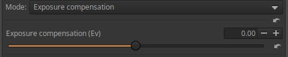

Az expozíció-kompenzációt állíthatjuk be segítségével.

####  4\.4\.2\.11 Fehéregyensúly és elsődleges színek korrekciója CTL szkript

A Helyi szerkesztés eszközcsoportban található Szín/Tónus korrekció eszközben a Módnál kiválasztható CTL szkript.

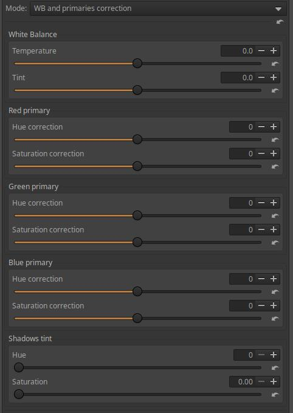

A **Színhőmérséklet** részben beállíthatjuk a **Színhőmérsékletet**, valamint a **Színárnyalatot**.

Alatta a **Vörös**, a **Zöld**, és a **Kék elsődlegesek** színezetét és telítettségét módosíthatjuk. A színezetet a szomszédos másodlagos színek irányába változtathatjuk, és minden elsődleges színhez beállíthatjuk a telítettséget. Ezáltal a kép színeit módosíthatjuk, beállíthatjuk.

Az **Árnyékok árnyalata** részben pedig az árnyékok Színárnyalatán és Telítettségén változtathatunk.

####  4\.4\.2\.12 Fekete-fehér keverő CTL szkript

A Helyi szerkesztés eszközcsoportban található Szín/Tónus korrekció eszközben a Módnál kiválasztható CTL szkript.

A fekete-fehérré történő átalakítás arról is szól, hogy a különböző színű és világosságú témarészletek milyen tónusú szürke árnyalattá konvertálódjanak.

Ha kiválasztjuk ezt a szkriptet, akkor a képet fekete-fehérré alakítja, az előnézet is fekete-fehér lesz. A **Vörös**, **Zöld** és **Kék** csúszkával azt befolyásolhatjuk, hogy a színes kép egyes színei milyen világosságú szürke árnyalatként jelenjenek meg a fekete-fehér képen.

####  4\.4\.2\.13 Filmfedettség CTL szkript

A Helyi szerkesztés eszközcsoportban található Szín/Tónus korrekció eszközben a Módnál kiválasztható CTL szkript.

A fedettség az analóg fotózásból származó fogalom, a filmszalag átlátszatlanságát vagy átlátszóságát jelentette. Minél nagyobb volt a fedettség, annál kevésbé volt átlátszó a film, annál sötétebbnek tűnt. A digitális fotózásban ez a fedettség a kép színeinek mélységét és gazdagságát jelenti. Ez a szkript ennek a hagyományos filmjellemzőnek az utánzását teszi lehetővé.

A csúszkákkal a **Telítettséget** és a **Fedettséget** állíthatjuk be. A Telítettség 0 értékénél a Fedettség csúszka hatástalan.

####  4\.4\.2\.14 Gamma/Lejtés CTL szkript

A Helyi szerkesztés eszközcsoportban található Szín/Tónus korrekció eszközben a Módnál kiválasztható CTL szkript. A kép tónusait tudjuk beállítani segítségével.

Előre iránynál ha növeljük a Kitevő értékét, akkor a csúcsfények irányába tolódik a hisztogram, Fordított irány esetén pedig az árnyékok irányába.

Meg kell találni azt az Előre/Fordított választást, azt a Kitevő és Kiegyenlítés értéket, amely a legkedvezőbb képet eredményezi. Először válasszunk irányt, utána változtassunk a Kitevőn, és állítsuk be azt a Kiegyenlítés értéket, amelynél a legjobban tetszik a kép. A két csúszkán addig változtatgassunk, amíg el nem érjük a legjobb eredményt. A csúszkák hatását a Hisztogramon megfigyeljük.

Nézzük meg a hatását a mid.tif kép segítségével. Először az Előre irányt nézzük meg.

A fenti ábrán a kiindulási helyzetet láthatjuk.

A Kitevőt 3-ra állítottam. A tónusok tömörítése egy bizonyos érték köré történik. A kontraszt nagyon lecsökkent. Ez jól látható a világosság hisztogramon is.

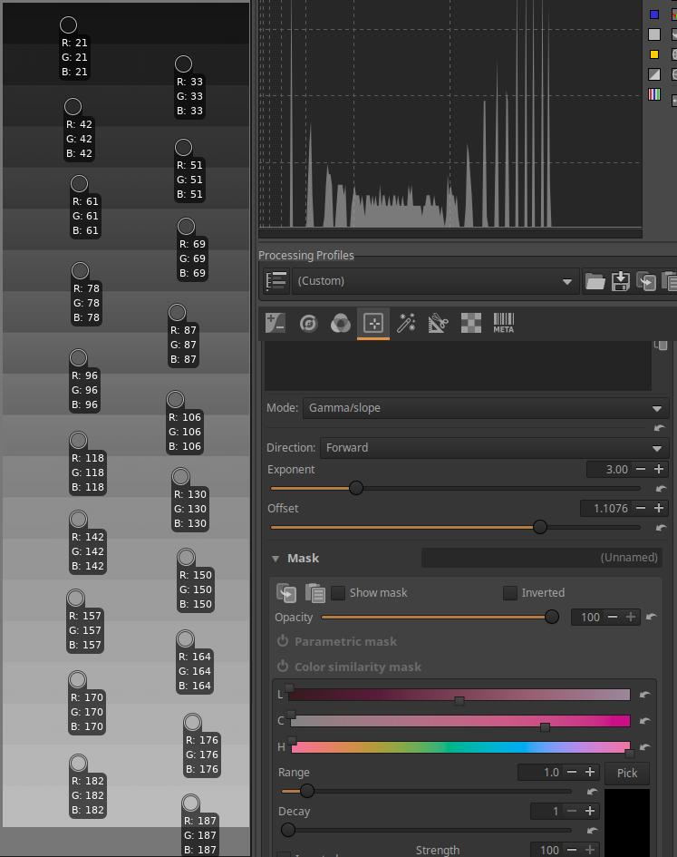

A Kiegyenlítés csúszkát minél nagyobb értékre állítottam, annál inkább növekszik a kontraszt (szélesedik  az árnyalattartomány a hisztogramon is), nyújtás történt. A legvilágosabb tónusok kevéssé változtak a csúszka hatására.

A Kitevőt 6-ra állítottam. A tónusok tömörítése továbbra is ugyanazon érték köré történik, most már a tömörítés mértéke sokkal nagyobb, a kontraszt sokkal kisebb.

A Kiegyenlítés csúszkát minél nagyobb értékre állítottam, annál inkább növekszik a kontraszt (szélesedik  az árnyalattartomány a hisztogramon is). A legvilágosabb tónusok kevéssé változtak a csúszka hatására.

Nézzük meg, mi történik, ha a Fordított lehetőséget választjuk.

A Kitevőt 3-ra állítottam. A tónusok nyújtása egy bizonyos érték körül történik. A kontraszt nagyon megnövekedett. Ez jól látható a világosság hisztogramon is. A sötét tónusoknál és a csúcsfényeknél egyaránt vágás történt (a színválasztókon látható).

A Kiegyenlítés csúszkát minél nagyobb értékre állítottam, annál inkább csökken a kontraszt (keskenyedik  az árnyalattartomány a hisztogramon is), tömörítés történik. A legvilágosabb tónusok kevéssé változtak a csúszka hatására, ott továbbra is vágás történik. A legsötétebb tónusoknál már nincs vágás.

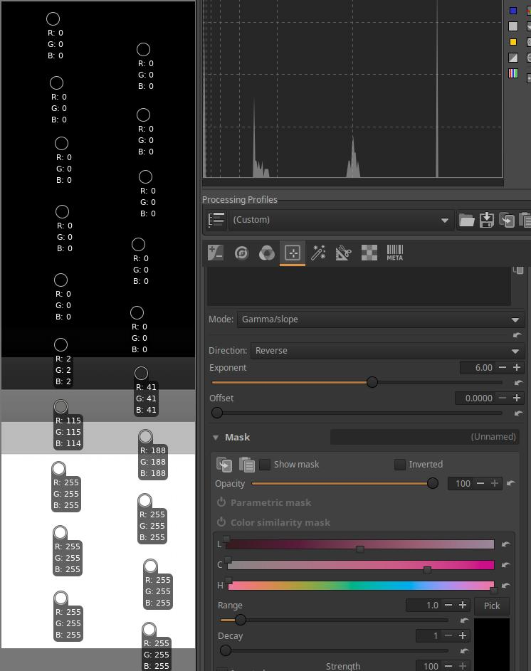

A Kitevőt 6-ra állítottam. A tónusok nyújtása továbbra is egy bizonyos érték körül történik. A kontraszt még jobban megnövekedett. Ez jól látható a világosság hisztogramon is. Már csak 4-5 sávon nem történt vágás (a színválasztókon látható).

A Kiegyenlítés csúszkát minél nagyobb értékre állítottam, annál inkább csökken a kontraszt (keskenyedik  az árnyalattartomány a hisztogramon is), tömörítés történik. A legvilágosabb tónusok kevéssé változtak a csúszka hatására, az utolsó négy sávban továbbra is vágás történik. A legsötétebb tónusoknál már nincs vágás.

####  4\.4\.2\.15 Kiegyenlítő CTL szkriptek

A Helyi szerkesztés eszközcsoportban található Szín/Tónus korrekció eszközben a Módnál kiválasztható CTL szkriptek.

Összesen hatféle kiegyenlítő szkriptről lesz itt szó. A szkriptek háromféle grafikus kiegyenlítőt, és háromféle csúszkákkal szabályozható kiegyenlítőt valósítanak meg.

Grafikus kiegyenlítő szkriptek:

-   Grafikus kiegyenlítő színezet szerint
-   Grafikus kiegyenlítő telítettség szerint
-   Grafikus kiegyenlítő fényerő szerint

Csúszkákkal szabályozható kiegyenlítő szkriptek:

-   Kiegyenlítő színezet szerint
-   Kiegyenlítő telítettség szerint
-   Kiegyenlítő fényerő szerint

A "színezet szerint", a "telítettség szerint", és a "fényerő szerint" kitétel a szkriptek elnevezésében arra a bemenő tulajdonságra utal, amely szerint tudjuk változtatni a kimenő tulajdonságok értékeit. A grafikus kiegyenlítőknél a kimenő tulajdonságok a HSL színrendszer szerinti **Színezet** (Hue), **Telítettség** (Saturation), és **Világosság** (Lightness). A háromféle grafikus szkript mindegyikében három kiegyenlítőgörbe-szerkesztőt találunk a háromféle kimenő tulajdonság szerint, mindhárom görbét akár egyidejűleg is alkalmazhatjuk.

Ez elsőre bonyolultnak tűnhet, de nem az. Például valamelyik "telítettség szerint" szkript segítségével megváltoztathatjuk a bemenő kép valamely telítettségtartományba eső képpontjainak színezetét, telítettségét, vagy világosságát. Vagy valamely "színezet szerint" szkript segítségével a bemenő kép bizonyos színezetű képpontjainak megváltoztathatjuk a színezetét, telítettségét, vagy világosságát.

A grafikus kiegyenlítők univerzálisabbak, jobban használhatók a csúszkákkal szabályozható szkripteknél.

A fenti ábrán a Grafikus kiegyenlítő színezet szerint szkript görbeszerkesztője látható. Ehhez teljesen hasonló a másik kettő grafikus szkript is, csak az alul látható bemenő tulajdonságban különböznek (színezet helyett telítettség, illetve fényerő). A fenti ábrán a grafikon alatt a bemenő tulajdonságként szereplő színskála látható, ennek segítségével választhatjuk ki, hogy milyen színezetű képpontok színezetét, telítettségét, illetve világosságát szeretnénk megváltoztatni.

Ezekben a grafikus kiegyenlítőkben háromféle görbeszerkesztő található, a Csatornánál választhatunk közülük. Az egyes szerkesztők neve a fejlécükben látható: ezek a HSL színrendszer csatornái, azaz H, S, L. A fejlécükre kattintva választhatunk az egyes görbeszerkesztők között. Mindegyik görbeszerkesztőt a fejlécénél az ábrán látható módon lenyithatjuk, és a Ki(kapcsolt), valamint a Kiegyenlítő közül választhatunk. Láthatjuk, hogy alapértelmezés szerint egyik sincs kikapcsolt állapotban.

A Csatorna felirat sorában a jobb szélen látható visszaállító gombra kattintva lineárisra állíthatjuk vissza az aktív (látható) görbeszerkesztőt.

A fenti ábrán az S (telítettség) szerkesztőt láthatjuk (annak fejléce sötétebb). A kék színek telítettségét megnöveltem, illetve a zöldek telítettségét csökkentettem.

Természetesen mindhárom görbeszerkesztőt használhatjuk, attól hogy nem látható valamely görbeszerkesztő, a képen még kifejti hatását. Ebben az esetben a másik két görbeszerkesztővel bizonyos színű területek színezetét, illetve világosságát változtathatjuk meg.

A fenti ábrán a Grafikus kiegyenlítő telítettség szerint szkript görbeszerkesztőjét láthatjuk. Az alul látható telítettségskála segítségével választhatunk telítettséget. Az alsó narancssárga sávon balra a legkevésbé telített, jobbra a legtelítettebb színt láthatjuk.

A fenti ábrán a Grafikus kiegyenlítő fényerő szerint szkript görbeszerkesztőjét láthatjuk. Az alul látható tónusskála segítségével választhatunk tónust. Ahol a görbe a középső vízszintes vonalhoz képest magasabban halad, ott az alul látható tónusú részletek a képen világosabbak lesznek, ha alacsonyabban, akkor sötétebbek.

Nézzük meg röviden a csúszkákkal szabályozható kiegyenlítőket is.

A csúszkákkal szabályozható Kiegyenlítő színezet szerint, és Kiegyenlítő telítettség szerint szkriptnél a kimenő tulajdonság Színezet, Telítettség, és Világosság lehet, míg a Kiegyenlítő fényerő szerint szkriptnél Világosság, Telítettség, és Élénkség. A csúszkákkal szabályozható szkriptek mindegyikénél csak egy kimenő tulajdonságot választhatunk. Ha ugyanannál a szkriptnél többféle kimenő tulajdonságot is meg szeretnénk változtatni, akkor azt több korrekciós rétegen tehetjük meg.

A fenti ábrán a Kiegyenlítő színezet szerint szkript kezelőfelületét láthatjuk.

Felül kiválaszthatjuk a Célt, vagyis a megváltoztatandó kimenő tulajdonságot, amely Színezet, Telítettség, és Világosság lehet.

A színezet-skála hat tartományra van osztva, mégpedig Vörös, Bíborvörös, Kék, Cián, Zöld, és Sárga. A csúszkákkal az adott színezetű területek kiválasztott céltulajdonságát változtathatjuk meg a csúszka elmozdítása szerinti mértékben. Például ha Célként a Telítettséget választottuk, akkor a Kék csúszkával a kék színű területek telítettségét a csúszka jobbra történő elmozdításával növelhetjük, balra történő elmozdításával csökkenthetjük.

A fenti ábrán a Kiegyenlítő telítettség szerint szkript kezelőfelületét láthatjuk.

Felül kiválaszthatjuk a Célt, vagyis a megváltoztatandó kimenő tulajdonságot, amely Színezet, Telítettség, és Világosság lehet.

A lehetséges telítettség-értékek öt tartományra van osztva. A Természetes a legkevésbé telített, a Tiszta a legtelítettebb színeket jelenti. A csúszkákkal az adott telítettségű területek kiválasztott céltulajdonságát változtathatjuk meg a csúszka elmozdítása szerinti mértékben. Például ha Célként a Telítettséget választottuk, akkor az Átlagos csúszkával a közepesen telített színű területek telítettségét a csúszka jobbra történő elmozdításával növelhetjük, balra történő elmozdításával csökkenthetjük.

A fenti ábrán a Kiegyenlítő fényerő szerint szkript kezelőfelületét láthatjuk. Felül kiválaszthatjuk a Célt, vagyis a megváltoztatandó kimenő paramétert, amely Világosság, Telítettség, és Élénkség lehet. Az Élénkség abban különbözik a Telítettségtől, hogy erőteljesebben változtatja a kevésbé telített színek telítettségét, mint a már eleve telített színekét. A csúszkákkal az adott fényerejű (világosságú) területek kiválasztott céltulajdonságát változtathatjuk meg a csúszka elmozdítása szerinti mértékben. A Feketék a legsötétebb, a Fehérek a legvilágosabb területeket jelképezik. Például ha Célként a Telítettséget választottuk, akkor a Középtónusok csúszkával a középtónusok telítettségét a csúszka jobbra történő elmozdításával növelhetjük, balra történő elmozdításával csökkenthetjük.

A Pivot (középtónusok eltolása) csúszkával azt állíthatjuk be, hogy mely világosságtartományt tekintsen középtónusnak, mely tónustartomány tulajdonságát lehessen a Középtónusok csúszkával állítani. Más szavakkal a kiegyenlítőt a kép sajátosságaihoz igazíthatjuk. Mást kell középtónusnak tekinteni egy olyan képen, amely elsősorban sötét tónusokat tartalmaz, mint egy főleg világos tónusokat tartalmazó kép esetén.

####  4\.4\.2\.16 Kivonó színkeverés CTL szkript

A Helyi szerkesztés eszközcsoportban található Szín/Tónus korrekció eszközben a Módnál kiválasztható CTL szkript.

**Összeg**: Lényegében az átlátszatlanságot szabályozza.

**Világosság megőrzése**: A keverés során megőrzi a kép eredeti világosságát.

####  4\.4\.2\.17 Lágy fény CTL szkript

A Helyi szerkesztés eszközcsoportban található Szín/Tónus korrekció eszközben a Módnál kiválasztható CTL szkript.

A Lágy fény eszköz azt a hatást emulálja, amikor egy képet önmaga másolatával kevernek össze a GIMP "lágy fény" rétegkeverési módjával. Az eredményül kapott képnek van egy kis extra kontrasztja és telítettsége, ami általában vizuálisan kellemes.

**Erősség**: A hatás erősségét szabályozhatjuk segítségével.

**Árnyékok/Csúcsfények egyensúlya**: Csak akkor van hatása, ha az Erősség nagyobb nullánál. Hatására a hisztogram balra/jobbra tolódik el.

####  4\.4\.2\.18 Poszterizáció CTL szkript

A Helyi szerkesztés eszközcsoportban található Szín/Tónus korrekció eszközben a Módnál kiválasztható CTL szkript.

A poszterizációként ismert hatást valósíthatjuk meg segítségével. A tónusok folyamatos átmenetének több tartományra történő átalakítását valósítja meg úgy, hogy az egyes tartományok között nem folyamatos az átmenet, hanem hirtelen váltás következik be, ezáltal a megjelenés plakátszerűbb lesz.

**Színcsatornánkénti bitek száma**: Minél kisebb értéket állítunk be, annál poszterszerűbb lesz a kép.

####  4\.4\.2\.19 Színezés fényerő szerint CTL szkript

A Helyi szerkesztés eszközcsoportban található Szín/Tónus korrekció eszközben a Módnál kiválasztható CTL szkript.

Az egyes tónustartományok színezetét, és a hatás erősségét állíthatjuk be segítségével.

A teljes árnyalatterjedelem öt tartományra van osztva: **Feketék**, **Árnyékok**, **Középtónusok**, **Csúcsfények**, és **Fehérek**. A **Színezet** csúszkákkal az egyes tartományok színezetét állíthatjuk be a színkör színei szerint, fokban. Az **Erősség** csúszkák a hatás erősségét szabályozzák.

**Pivot (középtónusok eltolása)**: A kép jellege szerint beállíthatjuk, hogy mit tekintsen Középtónusnak. Egy sötét tónusú képnél más tekintendő középtónusnak, mint egy világos tónusokból álló képnél.

####  4\.4\.2\.20 Színegyensúly RGB CTL szkript

A Helyi szerkesztés eszközcsoportban található Szín/Tónus korrekció eszközben a Módnál kiválasztható CTL szkript.

Ez egy roppant hasznos és népszerű eljárás. Ugyanilyen nevű szerkesztőeszköz a darktable-ben is megtalálható, amely az eszközön belül három lapot tartalmaz: mester, 4-utas, és maszkok. Ezek közül csak a mester lapot tartalmazza az ART-béli CTL szkript. Talán valaki elkészíti majd a teljes változatot is. Nézzük meg egy kicsit közelebbről.

**Színezet-eltolás csúszka**: A csúszka segítségével elfordulást idézünk elő a színkör szerint, miáltal az összes képpont színezete megváltozik úgy, hogy a világosság és a színesség állandó maradjon. Maszkokkal szelektíven alkalmazhatjuk, talán ez a leghasznosabb alkalmazása ennek a csúszkának, mert így például egy tárgy színét megváltoztathatjuk.

**Élénkség**: Segítségével élénkséget adhatunk hozzá a képhez, vagy annak egy részéhez. A csúszka a színességet növeli úgy, hogy a kisebb színességű területeken erőteljesebben növeli a színességet, mint a nagyobb színességű területeken.

**Kontraszt**: A kontrasztot változtatja állandó színezet és színesség mellett. Leginkább maszkokkal célszerű használni, a kép globális kontrasztjának beállításához esetleg egyéb eszközök jobbak lehetnek.

**Lineáris színesség korrekció**: A színesség mértékét változtatja, állandó színezet és világosság mellett. Lehetőség van globálisan (a teljes árnyalatterjedelemre) alkalmazni, illetve külön az árnyékokra, a középtónusokra, és a csúcsfényekre.

**Észlelési telítettség korrekció**: A telítettséget változtatja az észlelési színtérben, állandó színezet mellett. Lehetőség van globálisan alkalmazni, illetve külön az árnyékokra, a középtónusokra, és a csúcsfényekre.

**Észlelési ragyogás korrekció**: A ragyogást (színességet és világosságot) változtatja az észlelési színtérben, állandó színárnyalat mellett. Az expozíció-kompenzációhoz hasonló hatású. Lehetőség van globálisan alkalmazni, illetve külön az árnyékokra, a középtónusokra, és a csúcsfényekre.

####  4\.4\.2\.21 Színkeverés CTL szkript

A Helyi szerkesztés eszközcsoportban található Szín/Tónus korrekció eszközben a Módnál kiválasztható CTL szkript.

Különféle módokon megvalósított színkeverés megvalósítása.

**Szín a keveréshez**: A három színcsatorna értékének megadásával állíthatjuk be a keveréshez használandó színt. Minden csatorna értéke 0-255 tartományban lehet.

A fenti ábrán látható hatféle Keverési mód közül választhatunk.

**Összeg**: Lényegében az átlátszatlanságot szabályozza.

**Világosság megőrzése**: A keverés során megőrzi a kép eredeti világosságát.

####  4\.4\.2\.22 Színtartomány tömörítése CTL szkript

A Helyi szerkesztés eszközcsoportban található Szín/Tónus korrekció eszközben a Módnál kiválasztható CTL szkript.

Más szavakkal a gamut tömörítéséről van szó. A Színtartomány tömörítése egy olyan eszköz, amely lehetővé teszi a rendkívül széles színtartományú fényképezőgéppel készült kép tartományának tömörítését egy kisebb színtartományra.

**Céltartomány**: Az a színrendszer, amelybe tömöríteni szeretnénk a tartományon kívüli színeket.

Ha megjelenítési tartományba szeretnénk tömöríteni, akkor válasszuk az sRGB, vagy a DCI-P3 lehetőséget.

Ha a kimeneti fájlt egy másik szoftverben szeretnénk feldolgozni, akkor válasszunk széles tartományú színrendszert, pl. Rec.2020-at.

1. Küszöb
2. Korlát
3. Cián oldal
4. Sárga oldal
5. Bíborvörös oldal

Nézzük a fenti ábrát. A fekete háromszög jelöli ki az sRGB színrendszerben ábrázolható színek határait. A háromszög csúcsainál láthatjuk az elsődleges színeket, a vöröset, a zöldet, és a kéket. Az elsődleges színek által meghatározott háromszögön kívüli színek az sRGB színrendszerben nem jeleníthetők meg. Feltételezzük, hogy vannak háromszögön kívüli színeink is, mert a fényképet nagy színtartományú fényképezőgéppel készítettük. A zöld és a kék elsődlegesek keverékéből származik a cián szín, ezért a háromszögnek a kék és zöld csúcsát összekötő oldala a Cián oldal. Ehhez hasonlóan látható az ábrán Sárga és a Bíborvörös oldal is. A cián oldalnál bejelöltem a Küszöb paramétert. A **Küszöb** a tartomány szélétől a tartományon belül kijelölt sáv határát adja meg, amely sávba tömöríteni kell a **Korlát** paraméterrel kijelölt tartományból (sávból) a színeket. Az ábrán kék nyíl jelzi, illetve a kék vonal mutatja a Küszöb által meghatározott sáv határát a háromszög oldala mentén. A háromszögben a kék vonaltól a háromszög belseje felé eső színek változatlanok maradnak. A Küszöb paraméter értéke századrészben van megadva. ha például értéke 0,8, az tekinthető 80%-nak is, és a háromszög oldalánál lévő belső sáv 20% széles lesz (tehát 100%-ból ki kell vonni). A Korlát paraméter egy, a háromszögön kívüli sávot határoz meg, amelynek belsejében lévő színeket kell tömöríteni a háromszög belsejében, a Küszöb által meghatározott sávba. A Korlát a sávnak a háromszög oldalától mért szélességét adja meg. A Korláton kívüli színek nem kerülnek tömörítésre.

Az ábrán csak a cián oldalnál jelöltem be a Küszöböt és a Korlátot, de ehhez teljesen hasonlóan lehetne ábrázolni a háromszög másik két oldalánál is. A Cián, Sárga, és Bíborvörös oldalra vonatkozó Küszöb és Korlát paraméterek külön-külön állíthatók, ezért eltérő értékűek lehetnek. Ha például a bíborvöröset és a sárgát egy kicsit jobban szeretnénk védeni, mint a ciánt, akkor a ciánnál egy kicsit magasabbra állíthatjuk a Küszöböt

A tömörítés után a munkaprofil visszaáll ez eredetire.

####  4\.4\.2\.23 Tetraéderes színátalakítás (HSL) CTL szkript

A Helyi szerkesztés eszközcsoportban található Szín/Tónus korrekció eszközben a Módnál kiválasztható CTL szkript.

Az eljárás eredeti angol elnevezése Tetrahedral Color Warping, amelynek HSL felhasználói felületű megvalósítását tartalmazza ez a szkript.

1. Vörös
2. Zöld
3. Kék
4. Cián
5. Sárga
6. Bíborvörös (bíbor)
7. D65 (6500 K) fehér pont

A fenti ábrán a CIE 1931 YXZ színtér diagramja látható, amelyen ábrázolva van az sRGB színtér színtartománya, amely a fekete háromszög területe. Meg van jelölve a három elsődleges szín a vörös, a zöld, és a kék, valamint a cián, a sárga, és a bíborvörös másodlagos színek, és a D65 (6500 K) fehér pont.

A csúszkák segítségével minden egyes fentebb felsorolt színezet HSL paraméterei módosíthatók, azaz a **Színezetük**, **Telítettségük**, és a **Világosságuk**.

A **Feketének** **Színezete**, és **Telítettsége** módosítható, és a **Kiegyenlítés/Kiemelés** csúszkával az árnyékokat világosíthatjuk és sötétíthetjük.

A **Fehérnek** **Színezete** és **Telítettsége** módosítható.

A színezetet a színkör szerint fokban lehet megadni.

####  4\.4\.2\.24 Tetraéderes színátalakítás (RGB) CTL szkript

A Helyi szerkesztés eszközcsoportban található Szín/Tónus korrekció eszközben a Módnál kiválasztható CTL szkript.

Az eljárás eredeti angol elnevezése Tetrahedral Color Warping, amelynek RGB felhasználói felületű megvalósítását tartalmazza ez a szkript.

1. Vörös
2. Zöld
3. Kék
4. Cián
5. Sárga
6. Bíborvörös (bíbor)
7. D65 (6500 K) fehér pont

A fenti ábrán a CIE 1931 YXZ színtér diagramja látható, amelyen ábrázolva van az sRGB színtér színtartománya, amely a fekete háromszög területe. Meg van jelölve a három elsődleges szín a vörös, a zöld, és a kék, valamint a cián, a sárga, és a bíborvörös másodlagos színek, és a D65 (6500 K) fehér pont.

A csúszkák segítségével minden egyes fentebb felsorolt színárnyalat, valamint a Fehér és a Fekete **R**, **G**, és **B** színcsatornája módosítható.

####  4\.4\.2\.25 Tónusgörbe CTL szkript

A Helyi szerkesztés eszközcsoportban található Szín/Tónus korrekció eszközben a Módnál kiválasztható CTL szkript.

A tónusgörbe a bemenő és a kimenő világosságértékek között hoz létre kapcsolatot görbe segítségével.

Ez egy teljesen szokványos tónusgörbe.

###  4\.4\.3 Simítás

A Helyi szerkesztés eszközcsoportban található. Többféle célra használható eszköz.

A **Csatorna** az alábbiak egyike lehet:

A legtöbb Módnál választhatunk csatornát.

**RGB**: Az RGB komponensekre alkalmazza.

**Fényerő**: A fényerő csatornára (a részletekre és az élekre) alkalmazza, a színek megőrzése mellett.

**Színezet**: a színinformációkra alkalmazza, a fényerő megőrzése mellett.

A fenti ábrán láthatjuk a Mód lehetőségeit.

####  4\.4\.3\.1 Irányított

Irányított szűrővel történő, élmegőrző elmosás művelet.

**Sugár**: Az elmosás mértéke.

**Részletek**: A részletezettség mértéke/élmegőrzés.

**Iterációk**: Az iterációk (végrehajtások) száma.

####  4\.4\.3\.2 Gauss

Gauss elmosást alkalmaz.

**Sugár**: Az elmosás mértéke.

**Iterációk**: Az iterációk (végrehajtások) száma.

####  4\.4\.3\.3 Ragyogás

A Ragyogás hatás (Glowing effect) nevű módszert valósítja meg.

**Sugár**: A ragyogás mennyisége.

**Iterációk**: Végrehajtások száma. Szabályozza a ragyogó hatás terjedését.

**Csökkenés**: Szabályozza, hogy mennyire hirtelen szűnjön meg a ragyogó hatás.

####  4\.4\.3\.4 Nem helyi eszközök

A Nem helyi eszközök nevű algoritmust valósítja meg, amely a képzaj csökkentésére szolgál. Ellentétben a "helyi átlag" módszerrel, amely egy célpixelt körülvevő képpontok egy csoportjának átlagértékét veszi figyelembe a simításához, a Nem helyi eszközök módszer a kép összes pixelének átlagát veszi figyelembe, azzal súlyozva, hogy ezek a pixelek mennyire hasonlítanak a célpixelhez. Ez sokkal nagyobb tisztaságot, és kisebb részletvesztést eredményez a helyi módszerhez képest.

**Erősség**: A zajcsökkentés mértéke.

**Részletek**: A részletek megőrzésének mértéke.

**Iterációk**: Az iterációk (végrehajtások) száma.

####  4\.4\.3\.5 Wavelets

Wavelet dekompozíció (szétbontás) eljárást alkalmaz, az elmosást a kiválasztott részletszinten alkalmazhatjuk.

**Erősség**: Az elmosás mértéke.

**Szintek**: Wavelet szint kiválasztása (1 és 8 között). Az 1. szint a kép legkisebb részleteket, 8. szint a legnagyobb részleteket jelenti.

**Gamma**: A Gamma értékét lehet beállítani.

####  4\.4\.3\.6 Bemozdulásos elmosódás

Olyan hatása van, mintha a fényképezőgép a megadott paraméterekkel elmozdult volna felvételkészítés közben.

**Sugár**: Az elmosás mértéke.

**Szög**: Az elmosás szöge.

**Görbület**: Az elmosás görbülete. A nulla egyenest, a negatív érték homorú görbületet, a pozitív érték domború görbületet hoz létre.

**Eltolódás**: A csúszkával az elmozdulás útvonala mentén, a görbét követve lehet eltolni az elmosást.

####  4\.4\.3\.7 Objektív elmosása

Utánozza egy idealizált objektív elmosását.

**Sugár**: Az elmosás mértéke.

**Rekeszlamellák**: Az utánzott, idealizált objektív rekeszlamelláinak száma. Tehát itt nem arról az objektívről van szó, amellyel valójában készült a kép.

**Szög**: A rekeszlamellák helyzetének elfordítása.

Nagymértékű elmosódást állítottam be a Sugár csúszkával, és ötlamellás rekeszt a Rekeszlamellák csúszkával. Megjelent a képen az ötszög alakú rekesz képe, több példányban is. Nagyobb Sugár beállításával a rekesz képe is nagyobb lesz. A Szög csúszkával el lehet fordítani a rekeszlamellák ötszög alakú képét.

####  4\.4\.3\.8 Zaj hozzáadása

**Erősség**: A hozzáadott zaj mennyisége.

**Durvaság**: A hozzáadott zaj durvasága.

####  4\.4\.3\.9 Fényudvar

Fényudvar (halo) hatást utánoz.

**Erősség**: A hatás erőssége.

**Színezet**: A hozzáadott fényudvar színezete.

###  4\.4\.4 Helyi kontraszt

A Helyi szerkesztés eszközcsoportban található. Wavelet dekompozíció (szétbontás) eljárást alkalmaz, a kontraszt módosítását a kiválasztott részletszinten alkalmazhatjuk.

A kiegyenlítőgörbével szabályozhatjuk a kontrasztot. Az ábrán látható középső egyenes a görbe semleges állapota. Balra a legfinomabb részletek kontrasztját változtathatjuk, minél inkább jobbra haladunk, annál nagyobb részletek módosulnak. Ha a görbét a kiválasztott finomságú részleteknél felfelé húzzuk, akkor növekszik, ha lefelé húzzuk, akkor csökken a kiválasztott finomságú részletek kontrasztja.

**Maradék kontraszt**: A **maradékkép** úgy keletkezik, hogy az eredeti képről a bontott szintek részleteit eltávolítjuk, és ami megmarad, az lesz a maradékkép. Ez nyilván a legnagyobb részleteket tartalmazó "részletszint" lesz, hiszen a finomabb részleteket eltávolítottuk. Ebből következik, hogy a görbe segítségével végrehajtott módosítások nincsenek hatással a maradékképre, és ez fordítva is igaz. Nemcsak az egyes részletszinteken, hanem a maradékképen is végrehajthatunk műveleteket, jelen esetben növelhetjük vagy csökkenthetjük a maradékkép kontrasztját.

###  4\.4\.5 Textúra kiemelése/Élesítés

A Helyi szerkesztés eszközcsoportban található. Segítségével kiemelhetjük a textúrát, élesíthetünk, vagy elmosódást hozhatunk létre.

**Erősség**: A hatás erősségét szabályozza. Pozitív értékek a textúra kiemelését, illetve élesítést eredményeznek, a negatív értékek elmosást. Nem Gauss elmosást alkalmaz.

**Részletek**: Azt szabályozza, hogy milyen nagyságú részletekig érvényesüljön az eszköz hatása.

**Iterációk**: Az iterációk (ismétlések) számát állíthatjuk be segítségével. Többször végrehajtva fokozódik az eszköz hatása.

**Nézzünk egy egyszerű alkalmazási példát:**

A kép élesítését a Textúra kiemelése/Élesítés szerkesztőeszközzel szeretnénk elvégezni. Kapcsoljuk ki az Átalakítás eszközcsoportban a Kimenet élesítése eszközt, valamint a Részletek eszközcsoportban az Élesítés eszközt, hogy ezek ne élesítsenek a képen. A fenti ábrán 100% nagyítás mellett láthatjuk, hogy élesítés nélkül a kép élessége nem túl jó.

Menjünk a Helyi szerkesztés eszközcsoportba, és aktiváljuk a Textúra kiemelése/Élesítés eszközt, amelyet globális eszközként fogunk használni. Minden beállítást hagyjunk alapértelmezett értéken, nekünk csak az Erősség, Részletek, Iterációk csúszkákkal kell foglalkoznunk. Az Erősséggel az élesítés mértékét állíthatjuk be, a Részletek csúszkával azt szabályozhatjuk, hogy milyen méretű részletekre terjedjen ki az élesítés. Ha csak kis részleteket szeretnénk élesíteni, akkor állítsuk kis értékre. Ha ezt az eljárást egymás után többször végrehajtjuk, fokozódik a hatása. Az Iterációk csúszkával állíthatjuk be a végrehajtások számát. Az alapértelmezett, minimális érték 1, a maximális érték 5. Többszöri végrehajtás nagyobb erőforrást igényel (tovább tart a végső (JPEG) kép létrehozása a Feldolgozási sor indítása után).

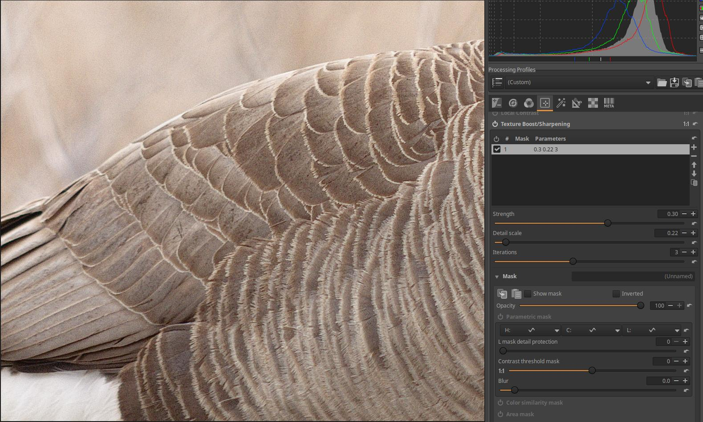

Próbáljunk állítani mindhárom csúszkán, és találjuk meg a számunkra legmegfelelőbb eredményt. Én a fenti ábrán látható Erősség=0,3, Részletek=0,22, Iterációk=3 értéket állítottam be. Ez nem jelent feltétlenül optimumot, mindenki saját ízlése szerint végezheti a beállítást.

##  4\.5 Különleges hatások eszközcsoport

Egyéb, speciális célra használható globális szerkesztőeszközök találhatók ebben a csoportban.

A csoport szerkesztőeszközei:

-   Fekete-fehér
-   Filmszimuláció
-   Lágy fény
-   Peremsötétedés szűrő
-   Átmenetes szűrő
-   Homály eltávolítása
-   Filmszemcse
-   Filmnegatív

###  4\.5\.1 Fekete-fehér

A Különleges hatások eszközcsoportban található. Színes képet fekete-fehérré alakíthatunk segítségével.

A fekete-fehérré alakítás a színekről is szól. Ez a fekete-fehér negatív filmes fotózás idején is így volt. A negatív film nem egyformán volt érzékeny a különféle színekre, ezért bizonyos színű fénysugarak jóval erősebb feketedést okoztak, mint ami a valóságos világosságukból következett volna (főleg kezdetben, amikor még csak ortokromatikus filmek voltak). A fotósok a fekete-fehér negatív filmre történő fényképezéskor gyakran színszűrőket használtak, amelyek megváltoztatták a film bizonyos színekre történő feketedésének mértékét. Ennek legismertebb példája a sárga színű színszűrő, amely kiszűri a kék színű fényt, ezért az ég kékje a negatívon világosabb lett (kevésbé feketedett), a pozitív papírképen pedig sötétebb lett. Ennek hatására a kék égen lévő világos felhők sokkal jobban kiemelkedtek.

*Tehát a fekete-fehérré történő átalakítás arról is szól, hogy a különböző színű és világosságú témarészletek milyen tónusú szürke árnyalattá konvertálódjanak.*

**Előre beállított**: Ha lenyitjuk, néhány előre definiált lehetőség közül választhatunk, és kezdőértéket adhatunk a Színszűrő felirat alatti három csúszkának.

Az előre definiált értékek az alábbi táblázatban láthatók.

| Előre beállított | Vörös (%) | Zöld (%) | Kék (%) |
| --- | --- | --- | --- |
| Normál kontraszt | 40,6 | 31,1 | 28,3 |
| Magas kontraszt | 29,9 | 25,4 | 44,8 |
| Fényerő | 30,0 | 59,0 | 11,0 |
| Tájkép | 66,0 | 24,0 | 10,0 |
| Portré | 49,1 | 40,0 | 10,9 |
| Alacsony érzékenység | 27,0 | 27,0 | 46,0 |
| Magas érzékenység | 30,0 | 28,0 | 42,0 |
| Pankromatikus | 33,3 | 33,3 | 33,3 |
| Hiper pankromatikus | 41,0 | 25,0 | 34,0 |
| Ortokromatikus | 0,0 | 42,0 | 58,0 |
| Abszolút RGB | 0,0 | 42,0 | 58,0 |
| Relatív RGB | 0,0 | 42,0 | 58,0 |
| Infravörös | -28,0 | 139,9 | -11,9 |

A Vörös, Zöld, és Kék csúszkákkal utólag korrigálhatunk, azonban óvatosan járjunk el, mert a negatív értékek könnyen műtermékeket, vagy szokatlan viselkedést okozhatnak. A csúszkák a fekete-fehér átalakításkor alkalmazott RGB csatornák arányainak megváltoztatására szolgálnak. A csúszkák értéktartománya -100 és +200 százalék között állítható. A levágott csúcsfények elkerülése érdekében a három csatorna összege nem haladhatja meg a 100%-ot, de speciális effektusok hozhatók létre az elvileg kötetlen beállításokkal.

**Színszűrő**: Egy legördülő listából választhatunk különféle színű színszűrők közül.

A kiválasztott szűrő hatása meg is jelenik az előnézeten. Az "infravörös" Előre beállított lehetőség választása után a színszűrő választásának lehetősége nem jelenik meg, de ha valamelyik színcsatorna csúszkájának értékét módosítjuk, ismét választhatunk színszűrőt.

**Gamma korrekció**: A középszürke pontot állíthatjuk be a csúszkák segítségével, ha szükséges.

**Színezés**: Ez két csúszka egybeépítve. A felső csúszkával  a fekete-fehér kép színezetét állíthatjuk be, az alsó csúszkával a telítettségét. A két csúszka közötti színes sáv is két részre van osztva, felül mutatja a felső csúszkához tartozó színezeteket, alul pedig mutatja a kiválasztott színezet telítettségskáláját. Az alábbi ábrán láthatjuk a Színezés hatását.

###  4\.5\.2 Filmszimuláció

A Különleges hatások eszközcsoportban található. Úgy alakíthatjuk át a képet, mintha nem digitális fényképezőgéppel, hanem egy bizonyos konkrét filmtípust használva, filmes fényképezőgéppel készült volna. Itt van lehetőségünk a Szigmoid tónusleképező használatára is.

Az ART a RawTherapee-től örökölte a 3D LUT-ok (LUT = Look-Up Table) támogatását. Ezek támogatása ebben az eszközben, és a Helyi szerkesztés csoportban található Szín/Tónus korrekció eszközben érhető el. Különféle filmtípusok szimulálására alkalmas 3D LUT-okat tartalmaz a közösség által fejlesztett Hald CLUT gyűjtemény. Az eszköz alkalmazása előtt valamilyen LUT-gyűjteménynek telepítve kell lennie, egyébként csak a Szigmoid tónusleképezőt használhatjuk.

Alkalmazása előtt a LUT-okat tartalmazó könyvtárat be kell állítanunk a Beállítások Képfeldolgozás lapjának Könyvtárak részén.

Először ki kell választanunk az alkalmazandó LUT fájlt.

Számos fekete-fehér és színes filmtípus, és egyéb kreatív lehetőségek (pl. holdfénynél készült felvétel) közül választhatunk, illetve választhatjuk a Szigmoid tónusleképezőt is. Kiválasztás után azonnal alkalmazza a LUT-ot.

**Erősség**: Az Erősség csúszkával a kiválasztott LUT hatásának erősségét (lényegében az átlátszatlanságot) állíthatjuk be.

####  4\.5\.2\.1 Szigmoid tónusleképező CTL szkript

A Filmszimuláció szerkesztőeszközben választható ki. Nem véletlenül került ide a Szigmoid CTL szkript, mert a Filmszimuláció a csővezeték vége felé (36.) helyezkedik el, és a Szigmoid CTL szkript segítségével a kép végső tónusait állíthatjuk be. A Szigmoid eljárás egy S-görbe szerű tónusleképezést hajt végre. Úgy bővíthetjük vagy szűkíthetjük a téma dinamikatartományát, hogy az illeszkedjen a monitor (vagy egyéb megjelenítő) dinamikus tartományához.

A fenti ábrán láthatjuk az eszköz kezelőszerveit.

**Kontraszt**: Az S-görbe két végénél a tónusok tömörítése történik. A kontraszt növelése növeli a görbe meredekségét, egyúttal az egyenes szakasz végeinél (az árnyékoknál és a csúcsfényeknél) agresszívabb, hirtelenebb bekövetkező tömörítést eredményez. A magasabb értékek alacsonyabb expozíciót igényelnek a kijelző fehér szintjének eléréséhez, és az árnyékok sötétebbé válnak. Az alacsonyabb értékek nagyobb dinamikatartomány megjelenítését teszik lehetővé.

**Ferdeség**: Eltolja a tömörítést az árnyékok vagy a csúcsfények felé. A Ferdeség segítségével el lehet tolni a kontrasztot az árnyékokból a csúcsfényekbe, vagy fordítva anélkül, hogy a középszürke árnyalatok kontrasztja megváltozna. A pozitív Ferdeség elsimítja az árnyékokat és tömöríti a csúcsfényeket. A negatív Ferdeség sötétebb árnyékokat és tompább csúcsfényeket hoz létre.

**Fehér pont**: A fehér pontot lehet beállítani segítségével.

**Egyedi elsődlegesek használata**: Ha nincs bejelölve, akkor a munkaprofilt (színteret) használja. Ha engedélyezve van, csak akkor aktivizálódik az alatta lévő hat csúszka.

**Alap elsődlegesek**: Kiválaszthatjuk a korrekciók alapjául szolgáló elsődlegesek készletét, azaz választhatunk a Rec. 2020 és a Rec. 709/sRGB színtér közül. Ez biztosítja, hogy ha a Színek/Színkezelés eszközben megváltoztatjuk az alapértelmezett Rec. 2020 munkaprofilt, akkor is az itt kiválasztott színtérrel történik meg a korrekció.

Az eszköz a szigmoid görbét minden egyes RGB csatornára külön-külön alkalmazza.

**Csillapítás**: Az R, G, és B színcsatornára külön-külön be lehet állítani a csillapítás értékét. A csillapítás csökkenti a Vörös/Zöld/Kék elsődlegesek tisztaságát, mielőtt a feldolgozás a szigmoid görbével megkezdődne. (**Tisztaság**: A pixel színének távolsága a fehér ponttól az xy színsíkban. A nulla tisztaság azt jelenti, hogy a fény akromatikus. A nagy tisztaság azt jelenti, hogy a fény lézerszerű, monokróm, vagyis egyetlen hullámhosszú fényből áll.) A csillapítás alkalmazásával elkerülhető például a poszterizáció.

**Forgatás**: Az elsődleges színek bizonyos mértékű elforgatását lehet beállítani színcsatornánként. Ez befolyásolja azt az "útvonalat", amely mentén a színárnyalat változik a fehérhez közeledve. Egyszerűbben mondva eltolja a színeket.

**Tisztaság helyreállítása**: Segítségével valamennyit visszanyerhetünk az eredeti tisztaságból a szigmoid görbe színcsatornánkénti alkalmazása után. A 100-as értéknél az összes csillapítás visszaáll, ezáltal a középső tartomány értékei az eredeti tisztaságuk közelében vannak. A 0 érték egyáltalán nem állítja vissza a tisztaságot, tehát minél nagyobb csillapítást alkalmazunk, annál kisebb a tisztaság a végső képen. A forgatások mindig visszaállnak, függetlenül a csúszka értékétől. Ha a csúszka értéke 0, akkor a modul kimenete garantáltan a kiválasztott Alap elsődleges tartományon belül marad.

**Erősség**: A hatás erősségét állíthatjuk be segítségével.

A szigmoid görbe a középtónusok körül változik, ezért használata előtt be kell állítani expozíció-kompenzáció segítségével a középtónusok világosságát.

A fenti ábrán megfigyelhetjük a Kontraszt és a Ferdeség csúszkák hatását. Ezek a szigmoid matematikai függvény hatásának bemutatására szolgáló weblapról származnak. A görbéket tónusgörbéknek képzeljük el. Az L paraméter változtatása hatását tekintve megfelel a Kontraszt változtatásának, a t paraméter hatása pedig a Ferdeségnek. Az ábrán a felső sor a Kontraszt, az alsó sor a Ferdeség hatását mutatja.

A felső sorban mindegyik görbénél a t értéke 0,6, ezért mindegyik grafikonnál az L értékétől függetlenül a (0,6;0,5) koordinátájú pont körül változik a görbe. A (0,6;0,5) koordinátájú pontot az ábra felső sorában piros ponttal jelöltem. Az L értéke a görbe meredekségét befolyásolja. Az alsó sorban láthatjuk, hogy a t értékének változtatása eltolja azt a pontot, amely körül a görbe változik, ezért változik a görbe alakja, meredeksége.

###  4\.5\.3 Lágy fény

A Különleges hatások eszközcsoportban található. A Lágy fény eszköz azt a hatást emulálja, amikor egy képet önmaga másolatával kevernek össze a GIMP "lágy fény" rétegkeverési módjával. Az eredményül kapott képnek van egy kis extra kontrasztja és telítettsége, ami általában vizuálisan kellemes.

**Erősség**: A Lágy fény hatásának erősségét (lényegében az átlátszatlanságot) szabályozza.

###  4\.5\.4 Peremsötétedés szűrő

A Különleges hatások eszközcsoportban található. Ezzel az eszközzel szándékoltan peremsötétedést adhatunk hozzá a képhez. Az objektív peremsötétedésének korrekciójához nem ez az eszköz, hanem az Átalakítás eszközcsoportban található eszköz használható (vagy még jobb a Flat-field eszköz).

Az eszköz fejléce alatt látható gombra kattintva az előnézeten megjelenik a peremsötétedés szűrő hatásának középpontja egy kis fehér kör formájában. A gombra történő ismételt kattintással a középpont nem lesz látható az előnézeten. Ha az előnézeten a kis körön kívül jobb egérgombbal kattintunk, akkor is kikapcsoljuk a középpont megjelenítését.

A hatás középpontját az egérrel az előnézet tetszőleges pontjára húzhatjuk. A középpont mozgatására például akkor lehet szükség, ha Kivágást alkalmazunk.

**Erősség**: A szűrő által okozott sötétedés/világosodás mértéke a képsarkokban, fényértékben megadva. A pozitív értékek sötétítik, a negatívak világosítják a képmező széleit.

**Tollazat**: A tollazat szélességét szabályozza. A csúszka 0 értékénél csak a kép sarkainál lesz egy kis tollazat, és a kép többi részét nem befolyásolja a szűrő. A csúszka 50 értékénél a kép sarka és a hatás középpontja távolságának feléig ér a Tollazat, 100 értéknél pedig egészen a hatás középpontjáig.

**Kerekség**: A szűrő alakját szabályozza. Ha a csúszka értéke 0, akkor a szűrő téglalap alakú lesz lekerekített sarkokkal, 50 értéknél ellipszis, 100-nál pedig kör alakú.

**Középpont X**: A hatás középpontjának vízszintes irányba történő eltolására szolgál.

**Középpont Y**: A hatás középpontjának függőleges irányba történő eltolására szolgál.

###  4\.5\.5 Átmenetes szűrő

A Különleges hatások eszközcsoportban található. Ezzel az eszközzel átmenetes semleges szürke szűrőt hozhatunk létre. A hatás olyan lesz, mintha felvételkor használtunk volna egy ilyen szűrőt. Az átmenetes semleges szürke szűrőt tájképek készítésekor használjuk, célja az égbolt sötétítése azért, hogy ne legyen túl világos, kiégett a képen. Ezen kívül bármilyen egyéb célra is használhatjuk.

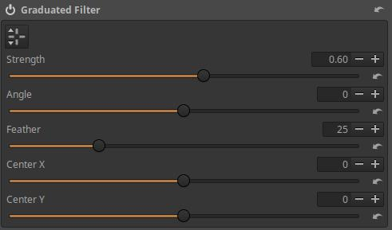

Az eszköz fejléce alatt látható gombbal be/kikapcsolhatjuk a szűrő szerkesztőjét. A szerkesztő megjelenítését az előnézet szerkesztőeszközön kívüli részén jobb egérgombbal történő kattintással is kikapcsolhatjuk.

A hatás középpontja az egérrel az előnézet kívánt helyére húzható.

Az átmenet a vízszintes vagy függőleges középvonal megfogásával elforgatható.

A Tollazat szélessége a felső vagy alsó határolóvonal húzásával állítható.

**Erősség**: A szűrő legnagyobb sötétsége fényértékben.

**Szög**: Az átmenet elfordulásának szöge.

**Tollazat**: A Tollazat szélessége.

**Középpont X**: A hatás középpontjának vízszintes irányba történő eltolására szolgál.

**Középpont Y**: A hatás középpontjának függőleges irányba történő eltolására szolgál.

###  4\.5\.6 Homály eltávolítása

A Különleges hatások eszközcsoportban található. Csökkenti a távlati homályt.

**Mód**: RGB és Fényerő közül választhatunk. RGB az alapértelmezett. A Mód befolyásolja a hozzáadott telítettség mértékét. RGB módban több telítettséget ad hozzá, mint Fényerő módban.

**Erősség**: Alapértelmezett a görbe bekapcsolt állapota, de akár ki is kapcsolhatjuk. Ha kikapcsoljuk, akkor nem történik homályeltávolítás, és a Mód állapota sem számít, azonban a Feketepont-korrekció működik. Ha bekapcsoljuk, akkor az ábra szerinti kiegyenlítőgörbe-szerkesztő jelenik meg. Alul a tónusskálát látjuk. A görbe alapértelmezett állapota egy vízszintes egyenes, amely a középvonaltól feljebb helyezkedik el (ahogyan a fenti ábrán látható), amely nem semleges állapot, hanem homály eltávolítása történik. A semleges állapotot a középvonalon elhelyezkedő vízszintes egyenes jelentené. A középvonal helyét a görbeszerkesztőben egy fekete vízszintes vonal jelzi. Az ábra szerint a középvonaltól feljebb elhelyezkedő vízszintes egyenes miatt egyenletesen erősséggel távolítja el a homályt a teljes tónustartományban. A görbe felfelé húzása erősíti a homály eltávolítását. Ha a görbét a középvonal alá húzzuk, akkor homályt adhatunk a képhez.

**Feketepont-korrekció**: Bizonyos mértékig korrigálhatjuk a fekete pont helyzetét.

**Az eszköz alkalmazása:**

Homály többféle okból keletkezhet a képen, például levegőtávlat, enyhe köd is okozhatja. A homályt sok esetben célszerű eltüntetni.

Nyissuk meg a nyers fájlt szerkesztésre. A homály a teljes képet beborítja.

Menjünk a Különleges hatások eszközcsoportba, aktiváljuk a Homály eltávolítása eszközt, és máris kevesebb homály lesz a képen.

Található itt egy kiegyenlítő görbe, amelynek segítségével a homály eltávolításának erősségét a kép tónusainak függvényében változtathatjuk. A bal szélén a legsötétebb, a jobb szélén a legvilágosabb képelemek homálymentesítésének erősségét szabályozhatjuk. A fenti ábrán legfelül, maximális értékre állítva láthatjuk az egyenes alakú "görbét". Hatására a teljes tónustartományban maximális a homály eltávolításának erőssége.

A fenti ábrán a görbén úgy módosítottam, hogy a világosabb árnyalatoknál egyre inkább csökkenjen a homály eltávolításának erőssége, sőt az egészen világos árnyalatoknál homályt adunk a képhez, mert a görbe a középvonal alatt halad.

###  4\.5\.7 Filmszemcse

A Különleges hatások eszközcsoportban található. Szemcsés zajt ad a képhez, amely a filmszemcsékhez hasonló.

**Durvaság**: A szemcse durvaságát (méretét) lehet beállítani ISO értékekben. A szemcse durvasága azért függ össze az ISO érzékenységgel, mert a filmes korszakban minél nagyobb érzékenységű volt a film, annál durvább volt a szemcsézete.

**Erősség**: A szemcsézet erőssége. Tulajdonképpen az átlátszatlanságot állítjuk.

###  4\.5\.8 Filmnegatív

A Különleges hatások eszközcsoportban található. Lefényképezett színes negatív feldolgozására használható. Színes negatív- és diafilmjeink digitalizálását hagyományos módon filmszkennerrel végezhetjük el, azonban a jó minőségű filmszkennerek nagyon drágák, és nagyon lassú működésűek. Meglévő vázunkhoz és objektívünkhöz jóval olcsóbban vásárolhatunk olyan előtétet, amellyel lefényképezhetjük negatív vagy pozitív filmkockáinkat. Ez a módszer olcsó, gyors, azonban utófeldolgozást igényel. Kisfilmhez, annak információtartalmát is figyelembe véve, bőven elég egy közepes (pl. 12 MP-es) váz, objektívnek legjobb egy makroobjektív.

A fenti ábrán JJC FDA-K1 típusú, objektív elé (a szűrőmenethez) rögzíthető adapter látható, amellyel kisfilmes filmszalagjainkat fényképezhetjük le digitalizálás céljából. Igen vékony keretű (maximum 2 mm !!!) diákhoz is alkalmas. Ez a készlet nem bármilyen objektívvel használható, csak néhány típussal. Sokan saját maguk készítenek adaptert objektívjük elé.

Tehát fényképezéssel digitalizált színes negatív filmkockáinkat szerkeszthetjük ennek a szerkesztőeszköznek a segítségével.

  
*A fényképet a szerző készítette*

A színes negatív filmek barnás alapszínnel rendelkeznek, amelyet a feldolgozás során kompenzálni kell.

Ha bekapcsoljuk (aktiváljuk) az eszközt, az előnézet pozitív képre vált.

**Válasszon semleges helyeket**: Erre a gombra kattintva egy "pipettával" próbálhatunk két semleges színű, különböző világosságú területet keresni az előnézeten. A kiválasztott helyekre kell kattintani, melynek hatására a kép színei megváltoznak, és a Vörös arány, Kék arány csúszkák értéke is megváltozik. Ezután finomíthatjuk a színeket a csúszkákkal.

**Referenciakitevő**: A zöld csatornára alkalmazott kitevő. Ennek az értéknek a megváltoztatása megváltoztatja a kép általános kontrasztját anélkül, hogy megváltoztatná a színeit. Az alapértelmezett érték egy átlagos kontrasztú negatívhoz jó. Nagyon halvány, vagy rosszul exponált negatív esetén az értéket meg kell növelni. Nagyon nagy kontrasztú negatív esetén a konvertált pozitív kép elérheti a vágást, ezért csökkenteni kell az értéken.

**Vörös arány**: A vörös csatorna kitevőjének a referenciakitevőhöz viszonyított aránya. Ez az együttható azt jelzi, hogy a vörös csatorna átviteli görbéje mennyire "hajlott" a zöld átviteli görbéhez képest. Ennek az értéknek a módosítása megváltoztatja a korrekció színjellemzőit, miközben megtartja a kép általános kontrasztját.

**Kék arány**: A kék csatorna kitevőjének a referenciakitevőhöz viszonyított aránya. Ez az együttható azt jelzi, hogy a kék csatorna átviteli görbéje mennyire "hajlott" a zöld átviteli görbéhez képest. Ennek az értéknek a módosítása megváltoztatja a korrekció színjellemzőit, miközben megtartja a kép általános kontrasztját.

  
*A fényképet a szerző készítette*

Az eddigiek a barnás alapszín hatásának kompenzálását szolgálták. Ezután be kell állítanunk a fehéregyensúlyt.

**Válasszon fehéregyensúly-foltot**: A "pipettával" válasszunk a képen egy semleges fehér vagy szürke részt a fehéregyensúly beállításához. Utána még korrigálhatunk a Hideg/Meleg és a Bíborvörös/Zöld csúszkákkal.

**Kimeneti szint**: A kép világosságát állíthatjuk be segítségével.

**Hideg/Meleg**: A fehéregyensúly beállítására szolgál.

**Bíborvörös/Zöld**: A fehéregyensúly beállítására szolgál.

Ha ezeket beállítottuk, utána már a szokásos módon szerkeszthetjük a képet.

##  4\.6 Átalakítás eszközcsoport

Ebben az eszközcsoportban a kép geometriáján változtathatunk, valamint korrigálhatjuk a különféle objektívhibákat. Itt globális szerkesztőeszközöket találunk.

A csoport szerkesztőeszközei:

-   Kivágás
-   Átméretezés
-   Kimenet élesítése
-   Forgatás
-   Perspektívakorrekció
-   Profilozott objektívkorrekció
-   Torzításkorrekció
-   Kromatikusaberráció-korrekció
-   Peremsötétedés-korrekció

###  4\.6\.1 Kivágás

Az Átalakítás eszközcsoportban található. Segítségével a képből kivághatunk egy tetszőleges részt.

A **Balról** és **Felülről** mezőkben megadhatjuk a kivágás bal felső sarkának koordinátáját, a **Szélesség** és **Magasság** mezőkben pedig a kivágott terület szélességét és magasságát. Ezeket képpontban kell megadni.

**Arány rögzítése**: Ha ezt bejelöljük, akkor megőrzi az eredeti, vagy a kiválasztott oldalarányt. Ha nincs bejelölve ez az opció, akkor a kivágás négy oldala egymástól függetlenül húzható az egérrel az előnézeten.

**Kiválasztás**: Ha rákattintunk erre a gombra, akkor az előnézeten az egérrel beállíthatjuk a kivágást. Az egérrel húzhatjuk a kivágás oldalait a beállításhoz. Miután rákattintottunk, a gomb felirata Kész-re vált, és ha végeztünk a kivágás területének beállításával, akkor ismét erre a gombra kell kattintanunk.

A **Kész** gombra történő kattintás után az előnézeten csak a kivágott képrészlet lesz látható, és a kiválasztott segédvonal is eltűnik. A teljes képet és a segédvonalakat a Kiválaszt gombra történő ismételt kattintással jeleníthetjük meg.

Az Arány rögzítése melletti lenyíló listából számos oldalarányt választhatunk ki.

Mellette a lenyíló listából kiválaszthatjuk, hogy a kiválasztott oldalarány milyen tájolású legyen.

**Segédvonalak típusa**: Számos segédvonal közül választhatunk, amely a kivágás beállításának ideje alatt az előnézet felett jelenik meg, segítve a kép komponálását.

**Visszaállítás**: A gombra kattintva az előzőleg létrehozott kivágás törlődik.

###  4\.6\.2 Átméretezés

Az Átalakítás eszközcsoportban található. A feldolgozás legvégén átméretezi a képet.

**Erre vonatkozik**:

Átméretezhetjük a **Kivágott területet** vagy a **Teljes képet**.

**Egység**: A méret megadásának mértékegysége **képpont** (px), **cm**, vagy **inch** lehet (1 inch = 25,4 mm).

**Méret növelésének engedélyezése**: Ha ezt engedélyezzük, akkor a kép mérete az eredeti méreténél (felbontásánál) nagyobb is lehet, egyébként csak kisebbre méretezhetünk át.

**Egyedi**: Határolókeret, Magasság, Szélesség, vagy Szorzó közül választhatunk.

**Határolókeret**: A Szélesség, illetve Magasság mezőben megadott méretű határolókeret segítségével történik az átméretezés. A kép oldalaránya megmarad, és úgy lesz átméretezve, hogy éppen illeszkedjen a határolókerethez. ha például a határolókeret mérete az ábrán látható 900x900 képpont, akkor a kép hosszabb oldala lesz 900 képpont hosszúságú, akár álló, akár fekvő tájolású a kép. Ha nem egyforma hosszúságú a határolókeret Szélessége és Magassága, akkor is úgy történik az átméretezés, hogy a kép függőlegesen vagy vízszintesen éppen kitöltse a keretet úgy, hogy a teljes kép a kereten belül legyen.

**Magasság vagy Szélesség**: Meg lehet adni a végső kép megkívánt Magasságát vagy Szélességét, akár álló, akár fekvő tájolású a kép. A kép másik mérete (Szélesség vagy Magasság) a kép oldalarányának megtartása mellett kerül megállapításra.

**Szorzó**: A csúszkával beállíthatunk egy szorzótényezőt 0,01 és 16 között. Ez azt mondja meg, hogy a kép oldala hányszorosa legyen az eredeti méretének. Ha 0,01 szorzótényezőt választunk, akkor a kép oldalai eredeti hosszuknak századrészei lesznek, 16-os szorzótényező esetén pedig tizenhatszorosai. A végső kép legkisebb mérete 32x32 képpont lehet. Ha 1-nél nagyobb szorzót választunk, és a Méret növelésének engedélyezése nincs bejelölve, akkor nem történik átméretezés, és hibaüzenetet sem kapunk.

**PPI**: Pixel Per Inch, azaz képpontok száma inchenként (1 inch = 25,4 mm), ezt képpontsűrűségnek nevezzük. Azt adja meg, hogy a nyomtató a nyomat oldalának minden inchnyi hosszát a digitális kép hány képpontjából állítsa elő. Ezt a digitális kép nyomtatásra történő előkészítése során állíthatjuk be képszerkesztő programokban, és magában a képfájlban kerül tárolásra. Ezt a beállítást a nyomtató automatikusan figyelembe veheti, és ennek megfelelően határozhatja meg a nyomat méretét. Ha csökkentjük a képpontsűrűséget, akkor a készíthető nyomat mérete nő, de képminősége csökken.

A PPI érték mellett a megadott adatokkal kapott nyomat mérete látható cm-ben, illetve inchben.

Nézzük meg röviden a nyomtatóhoz kapcsolódó DPI és PPI értéket.

**A nyomtató DPI értéke**: Ennek abszolút semmi köze a digitális képhez vagy annak felbontásához. A nyomtatók pici tintafoltok segítségével hozzák létre a képet a papíron. A DPI jelentése Dot Per Inch ((festék)pontok száma inchenként), azaz a nyomat egy inch (25,4 mm) hosszúságára eső festékpontok száma. Ez nem digitális képpontot jelent, hanem azt, hogy a nyomtató a nyomtatott kép oldalhosszának minden inch-nyi hosszán hány festékpontot helyez el. Tehát a tintapontok sűrűségéről van szó, azt is mondhatjuk, hogy a nyomtató felbontásáról. A tintasugaras nyomtatók felbontása általában 300 és 720 DPI közé esik, a lézernyomtatók és speciális fotónyomtatók felbontása meghaladhatja akár a 2400 DPI -t is. A nyomtató nagyobb felbontása jobb minőséget, a részletek finomabb visszaadásának lehetőségét jelenti.

A nyomaton, azaz a papíron valójában nincsenek képpontok. A digitális kép egy adott képpontjának megfelelő helyen elvileg a képpont színével megegyező pici terület található. Emiatt az egyszerűség, szemléletesség érdekében esetleg úgy képzelhetjük el, mintha a nyomaton ott lennének a négyzet alakú képpontok. A valóságban azonban a nyomaton a képpontok nem különülnek el egymástól.

A **PPI** (Pixel Per Inch, azaz képpontok száma inchenként). Ezt a fogalmat kétféle értelemben használjuk:

-   Egyrészt azt adja meg, hogy a nyomtató a nyomat oldalának minden inchnyi hosszát a digitális kép hány képpontjából állítsa elő. Ezt fentebb részletesebben leírtam.
-   Másrészt ezzel szokták megadni a monitorok, televíziók képernyőjének képpontsűrűségét, azt, hogy a monitor képernyője oldalának egységnyi hosszúságán hány fizikai képpontocska helyezkedik el. Egy monitor képernyőjének képpontsűrűsége fix érték.

###  4\.6\.3 Kimenet élesítése

Az Átalakítás eszközcsoportban található. A csővezeték legvégén helyezkedik el. Elsődleges célja a Kivágás eszköz alkalmazása utáni élesítés. Kivágás után érdemes kissé élesíteni. Természetesen nemcsak Kivágás után lehet használni, mindenki tetszése szerint használhatja. Hatása legalább 100% nagyítással nézve figyelhető meg jól az előnézeten.

Itt is két Módszer létezik, az Életlen maszk módszernél a Részletek/Élesítés eszköz Életlen maszk módszerének egyszerűsített változatát láthatjuk. Minden hasonlóan működik, mint ott.

Az RL Dekonvolúció is megegyezik az Részletek/Élesítés eszközben látottal, kivéve, hogy itt nem lehetséges a kép sarkai felé erőteljesebben élesíteni, valamint nem áll rendelkezésre a Sugár megfelelő értékének Automatikus megállapítása.

Vannak eltérések a működésben is, ebben az eszközben például a Részletküszöb maszk nem használható.

###  4\.6\.4 Geometria

Ebben az alcsoportban Forgatás, és Perspektívakorrekció eszköz áll rendelkezésre.

Perspektivikus torzítás korrekciója során a kép a fenti ábrán látható torzulást is elszenvedheti. Ezzel valamit kezdeni kell. Kétféle lehetőség közül választhatunk.

**Automatikus kitöltés**: Ha ezt engedélyezzük, akkor olyan mértékben felnagyítja vagy lekicsinyíti a képet, hogy a teljes kép beleférjen az eredeti képhatárokba úgy, hogy ne legyenek láthatók fekete szegélyek. Ez az alapértelmezett működés.

**Automatikus kivágás**: Ez a gomb csak akkor érhető el, ha az Automatikus kitöltés le van tiltva. Aktiváláskor nem okoz képinterpolációt (nagyítást vagy kicsinyítést), hanem úgy vágja ki a képet, hogy a fenti ábrán látható fekete részek már éppen ne kerüljenek a képre.

Ezt a beállítást a Geometria alcsoportban lévő eszközök figyelembe veszik.

####  4\.6\.4\.1 Forgatás

Az Átalakítás eszközcsoportban, azon belül a Geometria alcsoportban található. Segítségével elforgathatjuk a képet.

**Fok**: A csúszkán beállított fokkal elforgathatjuk a képet. Ezzel korrigálhatjuk például a horizont helyzetét, vagy egy torony ferdeségét.

**Vízszintes vonal kijelölése**: A gomb megnyomása után kijelölhetünk egy, a valóságban vízszintes vagy függőleges vonalat az előnézeten, és az ART úgy fordítja el a képet, hogy a kijelölés a képen is vízszintes vagy függőleges legyen.

  
*A fényképet a szerző készítette*

Rá kell kattintani a Forgatás eszközben lévő Vízszintes vonal kijelölése gombra, vagy az előnézet feletti eszköztáron a fenti ábrán balról a nyolcadik gombra. Az egérmutatóval rá kell állni a horizont egy pontjára, le kell nyomni az egérgombot, nyomva kell tartani, végig kell húzni a vonalat a horizont mentén, majd a végét pontosan a horizontra illesztve fel kell engedni az egérgombot. Ekkor azonnal megtörténik a kép elforgatása.

  
*A fényképet a szerző készítette*

A horizont vízszintes lett. Függőleges objektum esetén teljesen hasonlóan működik.

####  4\.6\.4\.2 Perspektívakorrekció

Az Átalakítás eszközcsoportban, azon belül a Geometria alcsoportban található. Segítségével korrigálhatjuk a perspektivikus torzítást.

A perspektivikus torzítás fogalma főleg az épületfotózáshoz kapcsolódik. Nem optikai értelemben vett torzításról van szó, hanem inkább a megszokott látványtól való eltérésről, amely nagy látószögű objektív használatakor fordul elő leginkább. Amikor egy nagy, magas épületet, például templomot fényképezünk, legtöbbször kénytelenek vagyunk nagy látószögű objektívet használni azért, hogy a templom €žbeleférjen a képbe. Ha vízszintesen (a templomtoronyra merőlegesen) tartanánk a fényképezőgépet, akkor nem lépne fel perspektivikus torzítás. A perspektivikus torzítás a nézőpontnak, a fényképezés irányának a következménye.

A Perspektívakorrekció eszköz manuális korrekciós beállításokat és hatékony automatikus korrekciót kínál. Először az Automatikus korrekciót érdemes kipróbálni, mert amikor működik, ez a legegyszerűbb és a legpontosabb. Ha szükséges, akkor a csúszkákkal korrigálhatunk, finomíthatunk. Ha az Automatikus korrekció használhatatlan eredményt adott, akkor vonjuk vissza (az Előzményekben) az Automatikus korrekció hatását, és korrigáljunk manuálisan.

**Vízszintes és Függőleges**: Ezekkel a csúszkákkal eltolhatjuk a képet egészen addig, amíg az eredményül kapott kép középpontja egy vonalba nem kerül az optikai középponttal. Ezt általában nem szükséges megtennünk, kivéve ha a tilt-shift objektív eltolási funkcióját használtuk, vagy korábban képszerkesztő programban nem centrikusan vágtuk ki a képet (centrikus: az eredeti kép középpontja megegyezik a kivágott kép középpontjával). A csúszkákkal a kép szélességének/magasságának százalékában megadva állíthatjuk be az eltolást.

**Nyírás**: Ezzel a csúszkával az átlós torzítást korrigálhatjuk.

**Szög**: Ezzel a csúszkával elforgathatjuk a képet.

**Oldalarány beállítása**: A kép helyes oldalarányának beállítása.

**Fókusztávolság**: Az objektív fizikai gyújtótávolsága. Ha ez szerepel a metaadatok között, akkor automatikusan beállítja.

**Vágási tényező (Crop faktor)**: A fényképezőgép kivágási szorzótényezője (crop faktor). A vágási tényező értéke full-frame váz esetén 1, Canon APS-C esetén 1,6, egyéb APS-C esetén 1,5, M4/3 esetén 2. Ezen kívül minden egyéb vágást (pl. digitális zoom) is figyelembe kell venni. Ha a program meg tudja állapítani a metaadatokból, akkor automatikusan beállításra kerül.

Ha az objektív fizikai gyújtótávolsága nem ismert, csak az ekvivalens gyújtótávolsága, akkor a Fókusztávolságnál állítsuk be az ekvivalens gyújtótávolságot, a Vágási tényezőnél pedig 1-et.

**Automatikus korrekció:**

Az Automatikus korrekció megtalálja a valószínűleg párhuzamos vonalakat a képen, és automatikusan korrigálja a perspektívát. A fényképezőgép adatait (Fókusztávolság, Vágási tényező és Vízszintes/Függőleges eltolások) megfelelően be kell állítani, hogy ez megfelelően működjön.

**Automatikus korrekció - Vízszintes**: Automatikusan beállítja a Forgatást és a Vízszintes korrekciót. A Függőleges korrekciót megfelelően kell beállítani a helyes működéshez.

**Automatikus korrekció - Függőleges**: Automatikusan beállítja a Forgatást és a Függőleges korrekciót.

**Automatikus korrekció - Vízszintes és függőleges**: Automatikusan beállítja a Forgatást, a Függőleges, és a Vízszintes korrekciót.

**Vezérlővonalak:**

Vízszintes és/vagy függőleges vezérlővonalak húzhatók az automatikus korrekció elősegítése érdekében. Egyes képeknél szükség lehet rájuk, ha a képen nincsenek megfelelő vonalak.

Vezérlővonalak létrehozásához először a **ceruza (szerkesztés)** gombra kell kattintani. Nyomjuk le, és tartsuk lenyomva a **Ctrl billentyűt**, pozicionáljuk az egérmutatót a vezérlővonal kezdőpontjához, nyomjuk le az egérgombot, és nyomva tartása mellett pozicionáljuk az egérmutatót a vonal végpontjához, majd engedjük fel az egérgombot. Egymás után több vezérlővonalat húzhatunk.

A vezérlővonal végein lévő vezérlőpontot az **egérrel megfogva** korrigálhatunk a vonalon.

Egy vezérlővonalat rajta **jobb egérgombbal** kattintva törölhetünk.

Az összes vezérlővonalat a **kuka gombra** történő kattintással törölhetjük. Csak akkor működik, ha a szerkesztést bekapcsoltuk a ceruza gombbal.

A **pipa gombra** kattintva a létrehozott vagy módosított vezérlővonalak alkalmazásra kerülnek. Csak akkor működik, ha a szerkesztést bekapcsoltuk a ceruza gombbal.

###  4\.6\.5 Objektív alcsoport

Ebben az alcsoportban az objektív hibáit korrigálhatjuk. A következő eszközök állnak rendelkezésre:

-   Profilozott objektívkorrekció
-   Torzításkorrekció
-   Kromatikusaberráció-korrekció
-   Peremsötétedés-korrekció

####  4\.6\.5\.1 Profilozott objektívkorrekció

Az Átalakítás eszközcsoportban, azon belül az Objektív alcsoportban található. Célja a Geometriai torzítás és/vagy Peremsötétedés és/vagy Kromatikus aberráció csökkentése úgynevezett objektívprofilok segítségével.

Az alapötlet az, hogy ha létrehozunk egy adatbázist vagy profilfájlt, amely tartalmazza az adott objektívre vonatkozó torzítás, peremsötétedés, és kromatikus aberráció javításához szükséges adatokat, akkor ezt az adatbázist vagy fájlt bármikor felhasználhatjuk ezen objektívhibák korrekciójára, és nem kell minden egyes fényképen manuálisan korrigálnunk.

Az objektívkorrekciós adatokat tartalmazó fájlt nevezzük Objektívkorrekciós profilnak, angolul Lens correction profile, ebből eredően a fájl kiterjesztése .lcp. Létezik egy **Lensfun** nevű, közösség által fejlesztett adatbázis is, amely sokféle objektívhez tartalmazza a korrekciós adatokat. Ezt az ART tartalmazza.

Ha egy objektív kétféle (pl. full-frame és APS-C) érzékelőméretű vázhoz is használható, akkor nem mindegy, hogy mely érzékelőméretre vonatkoznak a Lensfun adatbázisban vagy az LCP fájlban lévő korrekciós adatok. Ilyenkor a megfelelő érzékelőméretre vonatkozó profilt kell használni.

Bizonyos esetekben a nyers fájlba ágyazott metaadatok is tartalmazhatnak objektívkorrekciós adatokat. Ha az ART a metaadatokban talál korrekciós adatokat, akkor azokat automatikusan alkalmazza.

Nem feltétlenül állnak rendelkezésre mindhárom probléma korrigálásához a szükséges adatok. Amelyik nem áll rendelkezésre, az nem jelölhető be a Korrigálni kívánt problémák részben.

Ha bejelöljük az Automatikusan adatbázisból lehetőséget, akkor a Lensfun adatbázisban próbálja megkeresni a vázat és az objektívet a korrekciós adatok elérése céljából. Ehhez a nyers fájl metaadataiba ágyazott váznevet és objektívnevet használja. Ha megtalálta, akkor az ábrán láthatóhoz hasonlóan megjeleníti a váz és az objektív típusát. Az ábrán az ART automatikusan nem jelölte be a Kromatikus aberráció korrigálását, azonban ebben az esetben az objektívprofilban rendelkezésre áll, ezért be tudjuk jelölni.

Ha automatikusan nem találta meg az ART a Lensfun adatbázisban a váz vagy az objektív típusát, akkor a Manuálisan adatbázisból lehetőséget választva magunk is megkereshetjük és kiválaszthatjuk. Akkor nem találja meg automatikusan, ha a váz és/vagy az objektív megnevezése eltér a metaadatokban és/vagy az adatbázisban, vagy egyáltalán nincsenek adatok a vázhoz és/vagy az objektívhez a Lensfun adatbázisban.

Ha letöltött Adobe LCP profilfájlt szeretnénk használni, akkor jelöljük be az LCP fájl lehetőséget, és keressük meg az objektívhez, vagy a váz és az objektív együtteséhez tartozó Adobe LCP profilfájlunkat.

####  4\.6\.5\.2 Torzításkorrekció

Az Átalakítás eszközcsoportban, azon belül az Objektív alcsoportban található. Az objektív torzítását korrigálhatjuk segítségével.

**Automatikus**: Ha rákattintunk, akkor automatikusan korrigálja a torzítást azáltal, hogy a képet a torzítás szempontjából a beágyazott JPEG képhez igazítja (ha van beágyazott JPEG kép). Csak akkor van hatása, ha a fényképezőgép a JPEG kép létrehozása előtt korrigálta az objektív torzítását. Az automatikusan végrehajtott korrekció megjelenik az Erősség csúszkán, amelyet a csúszka segítségével finomíthatunk.

**Erősség**: Az Erősség csúszkával manuális korrekciót végezhetünk. A negatív értékek a hordó torzítást, a pozitívak pedig a párna torzítást korrigálják.

Ha aktiváljuk az Átalakítás eszközcsoportban lévő Kivágás eszközt, a Segédvonalak típusánál a Rács lehetőséget választjuk, és megnyomjuk a Kiválasztás gombot, akkor rácsot helyezhetünk el az előnézet elé, amely segíthet a torzításkorrekció beállításában. A rácsot a Kivágás eszközben a Kész gombra kattintva, vagy a Kivágás eszköz kikapcsolásával tüntethetjük el.

####  4\.6\.5\.3 Kromatikusaberráció-korrekció

Az Átalakítás eszközcsoportban, azon belül az Objektív alcsoportban található. A Színrekonstrukció után fejti ki hatását. (A RAW eszközcsoportban lévő hasonló eszköz pedig a Színrekonstrukció előtt.)

Színhiba (kromatikus aberráció) korrigálására szolgál. A világos területek melletti sötét élek mentén jelennek meg színes szegély formájában a színhibák. Színhibát például az égbolt előtt lévő faágak mellett láthatunk. A színhibáknak ezt a fajtáját oldalirányú színhibának nevezzük.

A színhiba korrigálását ajánlatos legalább 100%-ra nagyított előnézeten, vagy Részletablakban megfigyelni.

A nem túl nagy mértékű színhiba jól javítható, de azért a javíthatóságnak van határa. Ezt vegyük figyelembe.

A színhiba színétől függően a **Vörös** és/vagy a **Kék csúszkákkal** korrigálhatjuk a színhibát.

Az alábbi ábrán látható képrészlet nem nyers fájlból, hanem JPEG képből származik. A nagyítás 200%.

A képen jelentős mértékű vöröses és zöldes színű oldalirányú színhiba látható.

A Vörös és a Kék csúszkával kell korrigálni, a legkevesebb színhiba talán a Vörös csúszka 0,0006, és a Kék csúszka 0,0004 állásában látható. Tökéletesen nem lehet korrigálni a színhibát, azonban csak nagyon kevés színhiba maradt.

####  4\.6\.5\.4 Peremsötétedés-korrekció

Az Átalakítás eszközcsoportban, azon belül az Objektív alcsoportban található. Kifejezetten az objektív által okozott peremsötétedés korrekciójára szolgál, kreatív célokra a Különleges hatások eszközcsoportban található Peremsötétedés szűrő eszközt kell használni.

**Mérték**: A csúszka pozitív értékei a kép széleit világosítják a klasszikus peremsötétedés korrigálása érdekében. A csúszka negatív értékei esetén elsötétíti a széleket.

**Sugár**: Befolyásolja, hogy a hatás középpontjától számítva milyen távolságtól kezdődően világosodjon vagy sötétedjen a kép a sarkok felé. Alacsonyabb értékeknél nagyobb a sötétedés/világosodás területe, magasabb értékeknél kisebb.

**Erősség**: A sötétítés vagy világosítás mértékét állíthatjuk be segítségével. Ha a fényképen erősebben sötétedett sarkokat látunk, akkor erősebb világosításra van szükség a korrekcióhoz, és fordítva. Állítsuk be a Mérték értékét -100-ra, a Sugár értékét 50-re, mozgassuk az Erősség csúszkát 1-ről 100-ig, és láthatjuk, hogyan működik.

**Középpont X**: A hatás középpontját vízszintesen mozgathatjuk segítségével.

**Középpont Y**: A hatás középpontját függőlegesen mozgathatjuk segítségével.

##  4\.7 Raw eszközcsoport

Ebben az eszközcsoportban olyan globális szerkesztőeszközök találhatók, amelyeket csak nyers fájl szerkesztésekor használhatunk, képfájl szerkesztésekor nem. Ezek az eszközök a nyers adatokon fejtik ki hatásukat.

Az ART kétféle színmátrixszal készült képérzékelő nyers fájljainak feldolgozására alkalmas: X-Trans mátrixszal (csak Fujifilm fényképezőgépek), és Bayer mátrixszal (a többi gyártó).

Az ART felismeri, hogy a szerkesztett nyers fájl milyen színmátrixot alkalmaz, és csak a megfelelő szerkesztőeszköz-alcsoportot jeleníti meg. Az egyik az Érzékelő Bayer Mátrixszal alcsoport, a másik pedig az Érzékelő X-Trans Mátrixszal alcsoport. Ezek egymástól eltérő lehetőségekkel rendelkeznek.

A csoport szerkesztőeszközei:

-   (Bayer mátrix) Színrekonstrukció
-   (Bayer mátrix) Raw fekete pontok
-   (Bayer mátrix) Előfeldolgozás
-   (Bayer mátrix) Kromatikusaberráció-korrekció
-   (X-Trans mátrix) Színrekonstrukció
-   (X-Trans mátrix) Raw fekete pontok
-   Raw Nyereség/Fehér pont
-   Előfeldolgozás
-   Dark-Frame
-   Flat-Field

###  4\.7\.1 Érzékelő Bayer Mátrixszal alcsoport

Ebben az alcsoportban Bayer-féle színszűrővel ellátott képérzékelővel rendelkező fényképezőgépek nyers fájljaihoz használatos eljárások találhatók.

####  4\.7\.1\.1 Színrekonstrukció

A Raw eszközcsoportban, azon belül az Érzékelő Bayer Mátrixszal alcsoportban található.

Ennek az eszköznek a hatása csak 1:1 vagy annál nagyobb nagyítás mellett látható jól. Nagyítsuk 1:1-re az előnézetet, vagy helyezzünk el néhány Részletablakot az előnézeten.

A képérzékelő színeket nem lát. Azt a műveletet (módszert), amikor a hiányos színinformációkból helyreállítjuk a képpontok színinformációit, Színrekonstrukciónak nevezzük. Ennek során jön létre a színes kép a nyers fájl adataiból, és ezen a képen fejtik ki hatásukat egymás után a szerkesztőeszközök.

Ezt az eljárást angolul legtöbbször demosaicing-nek nevezik, magyar elnevezése eddig nem alakult ki. A Wikipediában olvasható, hogy az eljárás "color reconstruction", azaz színrekonstrukció néven is ismert, ezért én a magyarul is jól érthető színrekonstrukció szót fogom használni. Nem szabad összetéveszteni a kiégett csúcsfények rekonstrukciójával, mert itt teljesen másról van szó.

Az ART számos Színrekonstrukció-algoritmust kínál, amelyek mindegyike egymástól eltérő jellemzőkkel rendelkezik.

Mivel a színrekonstrukció által keletkezett kép képezi az alapot, amelyen a szerkesztőeszközök kifejtik hatásukat, a Színrekonstrukció-algoritmus kiválasztása jelentős hatással lehet a végeredményre, különösen közelről nézve a képet. A különböző Színrekonstrukció-algoritmusok közötti különbség leglátványosabban a finom részletek megjelenítésében, és a labirintusszerű minták formájában jelentkező műtermékek láthatóságában jelentkezik. Legalább 100%-os nagyítással kell néznünk az előnézetet, hogy az egyes algoritmusok eltéréseit megfigyelhessük.

Az ART-ban rendelkezésre álló Színrekonstrukciós eljárások a következők:

**AMaZE**: Az AMaZE (Aliasing Minimization and Zipper Elimination) a legjobb módszer az alacsony ISO értékkel készült képekhez.

**RCD**: Az RCD (Ratio Corrected Demosaicing) kiváló munkát végez a kerek éleknél, például csillagoknál az asztrofotózásban, miközben szinte ugyanolyan részletességet őriz meg, mint az AMaZE. Ez az alapértelmezett módszer az ART-ban.

**LMMSE és IGV**: Ezek nagyon zajos, magas ISO értékkel készült képeknél ajánlottak. Megakadályozzák a hamis labirintusminták megjelenését, és megakadályozzák, hogy a kép elmosottnak tűnjön a nagy zajcsökkentés miatt. Az IGV emellett meglehetősen hatékony a moiré minták mérséklésében is.

**AMaZE+Bilinear**: Kétféle algoritmust is alkalmaz egymás után, minden bizonnyal jobb, mint az AMaZE önmagában. Nem lehet információt találni a kétféle algoritmus együttes hatásáról.

**RCD+Bilinear**: Erről sem lehet információt találni, azonban Andy Astbury, aki szaktekintélynek számít, általános célra az RCD+Bilinear eljárást ajánlja az ART-hoz alapértelmezett eljárásként.

**VNG4**: Közepes formátumú digitális műszaki fényképezőgép és nagy látószögű objektív együttese esetén ajánlatos ezt alkalmazni.

**Gyors**: Nagyon gyors, de egyszerű és alacsony minőségű módszer, nem ajánlott.

**Mono**: Csak monokróm, vagy eltávolított színszűrővel rendelkező fényképezőgépek felhasználói számára hasznos.

**Pixel Shift (pixeleltolás)**: Egyes Pentax és Sony fényképezőgépek támogatják a Pixel Shift módban történő fényképezést, amely során négy felvétel készül úgy, hogy az érzékelő mindig egy-egy képponttal eltolódik azért, hogy a leendő kép minden egyes képpontjában lehetővé váljék a vörös, a zöld és a kék szint pontos rögzítése. A négy felvételt egy nagy nyers fájlban tárolják. Az ART képes a felvételeket egy képpé egyesíteni. A Pixel Shift legnagyobb problémája az elmozdulás. A fényképezőgépnek (és a témának) teljesen mozdulatlannak kell lenni a felvételek elkészítése közben. Mivel az érzékelőnek időre van szüksége ahhoz, hogy elmozduljon és stabilizálódjon, a legkisebb időköz az egyes expozíciók között körülbelül egy másodperc.

**Nincs (érzékelőmintázatot mutat)**: Nem történik színrekonstrukció. Ez hasznos lehet a diagnosztikához, de nem használható fotókhoz.

Nézzük meg a két csúszka funkcióját:

**Szegély**: A legtöbb nyers feldolgozó program levág néhány sort és oszlopot a kép széleinél, hogy ne legyenek láthatók az esetlegesen ott létrejött műtermékek. Ha nincs komoly okunk rá, ne változtassuk meg az alapértelmezett értéket.

**Hamis színek elnyomásának lépései**: Ez a csúszka beállítja a Színrekonstrukció algoritmus alkalmazásakor a műtermékek elnyomására alkalmazott medián szűrőátmenetek számát. A hamis színek elnyomása hasonló a színsimításhoz. A hamis színek általában jobban láthatók az élsimító (anti-aliasing) szűrő nélküli fényképezőgépek képein.

####  4\.7\.1\.2 Raw fekete pontok

A Raw eszközcsoportban, azon belül az Érzékelő Bayer Mátrixszal alcsoportban található.

Ne foglalkozzunk vele. Várhatóan legfeljebb diagnosztikai célra kellhet használni, szerkesztésre nem.

####  4\.7\.1\.3 Előfeldolgozás

A Raw eszközcsoportban, azon belül az Érzékelő Bayer Mátrixszal alcsoportban található.

Többféle rendellenesség kezelésére alkalmas eszköz.

**Vonalzaj szűrő**: A vonalzaj vízszintes vagy függőleges sávként jelenik meg, amely leginkább zajos képeken látható. Ezt az elemi érzékelőkhöz kapcsolódó elektronikában keletkező zaj okozza, amely soronként vagy oszloponként olvassa ki az egyes elemi érzékelők értékét. Ezt lehet csökkenteni a csúszka segítségével.

**Irány**: Válasszuk ki a **Vízszintes**, **Függőleges**, vagy **Mindkettő** lehetőséget az észlelhető Vonalzaj iránya szerint. A **Vízszintes csak a PDAF sorokon** lehetőség bizonyos tükör nélküli, fázisérzékelős autófókuszú fényképezőgépeknél fellépő sávosodási hiba csökkentésére szolgál.

**Zöld egyensúly**: Ezzel a csúszkával eltávolíthatók a fényképezőgép érzékelőjén lévő két zöld csatornának enyhe színkülönbségéből származó műtermékek. Állítsuk elég magasra az értéket ahhoz, hogy a labirintusszerű minta eltűnjön, de annál ne magasabbra. A zöld kiegyenlítés az áthallás okozta zöld felosztás kiegyenlítésére is használható.

**PDAF vonalszűrő**: A fázisérzékelős automatikus fókuszú (PDAF) fényképezőgépek hajlamosak vonalcsíkozási műtermékek előállítására, amikor ellenfényes témát fényképezünk. Ha engedélyezzük a PDAF vonalszűrőt, akkor megpróbálja kijavítani ezeket a műtermékeket.

**Dinamikus sorzaj szűrő**: Ha engedélyezzük, akkor megkísérli korrigálni a dinamikus sorzajt. A helyes működéshez a nyers fájlnak tartalmaznia kell néhány nem látható oszlopot (amelyek a "optikai fekete" mérésére szolgálnak).

####  4\.7\.1\.4 Kromatikusaberráció-korrekció

A Raw eszközcsoportban, azon belül az Érzékelő Bayer Mátrixszal alcsoportban található. Jellemzője, hogy a Színrekonstrukció előtt történik meg a színhiba csökkentése. Az Átalakítás eszközcsoportban található Kromatikusaberráció-korrekció eszköz a Színrekonstrukció után fejti ki hatását.

A fenti ábrán látható **Automatikus korrekció** az alapértelmezett módszer.

**Iterációk**: Az automatikus korrekció nem távolítja el az összes színhibát. Ha azonban még egyszer végrehajtjuk, akkor a maradék színhiba egy részét eltünteti. Minél többször ismételjük meg a végrehajtását, annál jobb eredményt kapunk, azonban annál hosszabb időt vesz igénybe. Az Iterációk száma a végrehajtások számát jelenti, amely legfeljebb 5 lehet.

**Színeltolódás elkerülése**: Ha bejelöljük, akkor kevesebb lesz a színeltolódás.

Ha nem engedélyezzük az Automatikus korrekciót, akkor manuálisan korrigálhatjuk a színhibát.

A színhiba színétől függően a Vörös és/vagy a Kék csúszkákkal korrigálhatunk.

###  4\.7\.2 Érzékelő X-Trans Mátrixszal alcsoport

A Fujifilm fényképezőgépei nem Bayer-féle színszűrőt alkalmaznak a képérzékelő előtt, hanem X-Trans színszűrőt. Az X-Trans színszűrővel készült képeket a Bayer színszűrős érzékelőkhöz képest eltérő módon kell feldolgozni.

####  4\.7\.2\.1 Színrekonstrukció

A Raw eszközcsoportban, azon belül az Érzékelő X-Trans Mátrixszal alcsoportban található.

A képérzékelő színeket nem lát. Azt a műveletet (módszert), amikor a hiányos színinformációkból helyreállítjuk a képpontok színinformációit, Színrekonstrukciónak nevezzük. Ennek során jön létre a színes kép a nyers fájl adataiból, és ezen a képen fejtik ki hatásukat egymás után a szerkesztőeszközök.

A Módszer az alábbiak egyike lehet.

**Gyors**: Nagyon gyors, de egyszerű és alacsony minőségű Színrekonstrukció módszer, nem ajánlott.

**Mono**: Csak monokróm, vagy eltávolított színszűrővel rendelkező fényképezőgépek felhasználói számára hasznos.

**Nincs (érzékelőmintázatot mutat)**: Nem történik színrekonstrukció. Ez hasznos lehet a diagnosztikához, de nem használható fotózáshoz.

**3-menetes (Markesteijn)**: Ez az algoritmus egymás után három menetet futtat a képen, ami élesebb eredményhez vezet, azonban a minőségkülönbség csak alacsony ISO-értékű fényképeken látható. Lassabb, mint az 1-menetes.

**1-menetes (Markesteijn)**: Gyorsabb, mint a 3-menetes, de némileg gyengébb a minősége, azonban a minőségkülönbség csak alacsony ISO-értékű fényképeken látható. Ha a gyorsaság problémát jelent, akkor ez a módszer nagy ISO érzékenységű felvételeknél használható, észrevehető minőségbeli különbség nélkül.

**3-menetes+Gyors**:  Kétféle módszert alkalmaz egymás után.

**1-menetes+Gyors**:  Kétféle módszert alkalmaz egymás után.

A módszerek közül a legjobb minőséget a 3-menetes (Markesteijn) módszer adja.

**Szegély**: A legtöbb nyers feldolgozó program levág néhány sort és oszlopot a kép széleinél, hogy ne legyenek láthatók az esetlegesen ott létrejött műtermékek. Ha nincs komoly okunk rá, ne változtassuk meg az alapértelmezett értéket.

**Hamis színek elnyomásának lépései**: Ez a csúszka beállítja a Színrekonstrukció algoritmus alkalmazásakor a műtermékek elnyomására alkalmazott medián szűrőátmenetek számát. A hamis színek elnyomása hasonló a színsimításhoz. A hamis színek általában jobban láthatók az élsimító (anti-aliasing) szűrő nélküli fényképezőgépek képein.

####  4\.7\.2\.2 Raw fekete pontok

A Raw eszközcsoportban, azon belül az Érzékelő X-Trans Mátrixszal alcsoportban található.

Ne foglalkozzunk vele. Várhatóan legfeljebb diagnosztikai célra kellhet használni, szerkesztésre nem.

###  4\.7\.3 Raw Nyereség/Fehér pont

A Raw eszközcsoportban található.

Ne foglalkozzunk vele. Várhatóan legfeljebb diagnosztikai célra kellhet használni, szerkesztésre nem.

###  4\.7\.4 Előfeldolgozás

A Raw eszközcsoportban található. Elnyomja a Forró és Halott képpontokat úgy, hogy lecseréli őket a környékbeli képpontok átlagára.

A "forró pixelek" fényes és telített apró pontokként jelennek meg a képen. Mindegyik annak az eredménye, hogy az érzékelőn egy elemi érzékelő a kelleténél nagyobb jelet ad le. Az, hogy az érzékelőn lévő egyetlen elemi érzékelő megfelel-e a feldolgozott fotó egyetlen képpontjának, a választott Színrekonstrukció módszertől (és egyéb tényezőktől) függ. A legtöbb módszer (például az AMaZE) esetén nincs közvetlen kapcsolat az elemi érzékelők és a képpontok között, így a forró pixelek nemcsak egypixeles pontként jelenhetnek meg, hanem apró 3x3-as pixelkeresztként, vagy valamivel nagyobb foltként is. A forró pixelek jelenléte teljesen normális jelenség minden fényképezőgépben, de nappali fotózás során általában nem találkozhatunk velük. Minél hosszabb az expozíció, annál nagyobb az esélye annak, hogy forró pixelek jelennek meg, és annál nagyobb a számuk is. Általában két másodpercnél hosszabb záridő esetén jelentkezik ez a probléma.

A "halott pixelek" fekete pontként (vagy keresztként vagy foltként) jelennek meg. Ezek a szenzoron lévő elhalt (működésképtelen) elemi érzékelők következményei, és a záridőnek nincs befolyása arra, hogy megjelennek-e vagy sem. Ha egy elemi érzékelő halott, akkor minden fotón ugyanazon a helyen lesz látható az elhalt pixel.

**Forró pixel szűrő**: Ha engedélyezzük, akkor elnyomja a Forró pixeleket.

**Halott pixel szűrő**: Ha engedélyezzük, akkor elnyomja a Halott pixeleket.

**Küszöb**: A Forró és Halott pixelek automatikus észlelésének érzékenységét szabályozza. Ezzel lehet meghatározni, hogy mit tekintsen Forró/Halott pixelnek. Addig kell fokozatosan növelni a küszöbértéket, amíg a Forró/Halott képpontok el nem tűnnek.

###  4\.7\.5 Dark-Frame

A Raw eszközcsoportban található. Egy Dark-frame (sötét felvétel) kivonásával csökkenthetjük a különböző eredetű (pl. termikus) zajokat, amelyeket hosszú záridővel készült felvételeknél észlelhetünk. Legalább 1 másodperces záridő tekinthető hosszú záridőnek. A magas ISO miatt bekövetkező zajokra hatástalan, a Forró pixeleket azonban eltünteti.

A módszer lényege az, hogy amikor hosszú záridővel készítünk felvételt, akkor közvetlenül utána ugyanolyan beállításokkal készítünk egy vagy több **nyers (raw) formátumú** felvételt (Dark-Frame-et) úgy, hogy az objektívsapkát az objektívre helyezzük. A legjobb 4-6 darab Dark-Frame képet készíteni. Ilyen módon lefényképezzük például a képmező termikus zaj miatti egyenetlenségeit, és ha a Dark-Frame-e(ke)t kivonjuk a képből, akkor zajmentesebb képet kapunk. Azért kell mindjárt a felvételek után közvetlenül elkészíteni a Dark-Frame képeket, hogy a képérzékelő és a körülötte lévő elektronika ugyanolyan hőmérsékletű legyen, mint a képek elkészítésekor. A Dark-Frame felvételek elkészítésekor Manuál (M) módot kell használni, mert így felhelyezett objektívsapkával is ugyanolyan beállításokkal tudjuk elkészíteni a referenciaképe(ke)t, mint amilyenekkel az "éles" képek készültek.

Használata előtt a Beállítások Képfeldolgozás lapjának Könyvtárak részén meg kell adnunk a Dark-Frame felvételeket tartalmazó könyvtárat.

**Fájl**: manuálisan kiválaszthatunk egy Dark-Frame felvételt, amelyet kivon a szerkesztett képből.

**Automatikus kiválasztás**: Automatikusan választja a ki a legjobban illeszkedő Dark-Frame felvételt (fényképezőgép gyártója > típusa > ISO > záridő > dátum sorrendben választ) a metaadatok alapján. Ha egynél több, pontosan azonos tulajdonságú felvételt talál, akkor ezek átlagát alkalmazza, amely sokkal kevesebb zajt eredményez.

###  4\.7\.6 Flat-Field

A Raw eszközcsoportban található. A Flat-field jelentése a képfeldolgozásban egyenletes képmező, tehát egyenletes képmező korrekcióról van szó. Fő célja a képmezőn található világosságbeli egyenetlenségek, és enyhe elszíneződések korrigálása a nyers adatok feldolgozása során. Ezek a problémák egyszerűen korrigálhatók, ha úgynevezett flat-field referenciafájl rendelkezésre áll. Elvileg ez a legpontosabb módszer.

*Kizárólag nyers formátumú referenciafájlok használhatók, és kizárólag nyers fájlok feldolgozásakor alkalmazható a módszer.*

Több oka lehet annak, ha a teljes képmező nem teljesen egyenletes:

-   Peremsötétedés
-   Tilt-Shift objektív használata
-   A képérzékelő hőmérsékletének egyenetlensége
-   Az érzékelő kiolvasó elektronikájának hibái/egyenetlenségei
-   Egyéb okok

A korrekcióhoz flat-field referenciafájlokra van szükség. A referenciafájlokat az alábbiak szerint készíthetjük el:

A módszernek az a lényege, hogy az adott objektív-váz párossal alacsony ISO értéken nyers formátumú felvételeket készítünk bizonyos gyújtótávolság-értékenként, bizonyos rekeszértékenként egy egyenletesen megvilágított, világos felületről. Ezeknek a nyers formátumú felvételeknek (úgynevezett referenciafájloknak) a segítségével az ART meg tudja állapítani a képmező egyes részei közötti világosságeltérést, és az esetleges színeltolódást.

Példaképp a Canon EF-S 18-55mm f/3,5-5,6 IS objektív, és Canon EOS 350D fényképezőgép páros referenciafájljait készítjük el.

A flat-field referenciafájlokat egy egyenletes világos felület lefényképezésével készítjük,

-   fényképezőgép-típusonként,
-   objektívtípusonként,
-   gyújtótávolságonként,
-   rekeszértékenként

szükséges egy-egy nyers formátumú fájlt készíteni.

A leírtak azt jelentik, hogy ha több különböző típusú fényképezőgéppel rendelkezünk, akkor sajnos mindegyikkel el kell készíteni a referenciafájlokat. Ha több objektívvel rendelkezünk, akkor szintén mindegyikkel el kell készíteni a referenciafájlokat, akkor is, ha több különböző típusú objektíven is beállítható egy adott gyújtótávolság. Ha például két különböző típusú objektíven is beállítható az 55 mm gyújtótávolság, akkor is mindkét objektívvel el kell készíteni az 55 mm gyújtótávolságú referenciafájlokat, és a megfelelőt kell alkalmazni a korrekció során.

A "gyújtótávolságonként" kitétel nyilván nem azt jelenti, hogy minden egyes beállítható (pl. mm-enként) gyújtótávolság-állásban referenciafájlt kell készíteni. Ez szükségtelen. Én minden olyan gyújtótávolság-állásban készítettem referenciafájlt, amely az objektíven fel van tüntetve. A "rekeszértékenként" kitétel számomra azt jelentette, hogy szabványos "egész" rekeszértékekkel készítettem referenciafájlokat (f/4, f/5,6, f/8, f/11, f/16 és f/22 értékekkel). A 18-55 mm-es objektívvel készítettem f/3,5 maximális rekeszértékkel is referenciafájlt.

A flat-field referenciafájlok elkészítéséhez egy Cokin P szűrőtartóba helyezhető, egyenletesen fehér műanyag lapot használtam. Az eredeti funkciója e lapnak a fehéregyensúly beállítása, kifejezetten erre a célra gyártják.

Ha van más, egyenletesen fehér, tejüvegszerű műanyag lapunk, azt is használhatjuk. Például tejszerű, félig áttetsző poli (metil-metakrilát) lap is megfelelő lehet, vagy fehér opál akril lap.

A lap egyenletessége a legfontosabb követelmény. A lapnak kellően áttetszőnek kell lennie, de ne legyen átlátszó. A lapot a szűrőtartóba helyeztem, mégpedig az objektívhez legközelebbi helyre, és a szűrőtartót a Canon 18-55 mm-es objektívre rögzítettem. A lényeg az, hogy egy áttetsző, egyenletes fehér felületet helyezzünk el kis távolságra az objektívtől, vagy inkább közvetlenül az objektív szűrőtartójára. Tartó híján akár kézzel is az objektív elé tarthatjuk a lapot.

A kép készítésére olyan napot kell választani, amikor aránylag egyenletes az égbolt, például egyenletesen kék vagy szürke. Előnyös, ha egyenletesen borult, felhős az ég, és nincs napsütés. Ha süt a nap, akkor napnak háttal álljunk, és ha kell, kezünkkel takarjuk el a nap fényét, hogy hátulról ne világíthassa meg a szűrőtartóban lévő fehér lapot. A következő beállításokat használjuk:

-   Állítsunk be fényképezőgépünkön +1 2/3 Fé expozíció-kompenzációt, másfajta fehér laphoz más érték lehet megfelelő, ezt próbafelvétellel és hisztogrammal ellenőrizzük.
-   Állítsuk gépünket Av vagy A (rekesz prioritás) üzemmódba.
-   Állítsunk be RAW+JPG vagy RAW lehetőséget a képminőség menüben.
-   Állítsunk be legalacsonyabb ISO értéket, például ISO 100-at.
-   A fehéregyensúly beállítása bármilyen lehet, nem számít.
-   Kapcsoljuk ki objektívünkön az automatikus élességállítást és a képstabilizátort.
-   Állítsunk be 18 mm gyújtótávolságot.
-   Állítsuk az élességet végtelenre.
-   A rekeszt állítsuk f/3,5-re (maximálisra).
-   Irányítsuk felfelé, az égboltra a fényképezőgépet, és készítsük el a felvételt.
-   Ellenőrizzük hisztogram segítségével, hogy a kép semmiképpen se legyen túlexponált. Ha túlexponált, akkor csökkentsük az expozíció-korrekciót, illetve ha szükséges, kissé növelhetjük. Ha ezt jól beállítottuk, akkor kezdhetünk hozzá a referenciafájlok elkészítéséhez.
-   Készítsük el az összes gyújtótávolság-rekeszérték kombinációval a referenciafájlokat.

Azaz f/3,5 után állítsunk be f/4 rekeszt, és készítsük el a referenciafájlt, és sorban minden szükséges rekeszértékkel. Ezután állítsuk be a következő gyújtótávolságot, például 24 mm-t, és szintén minden szükséges rekeszértékkel készítsünk referenciafájlt. És így tovább mindaddig, amíg nem rendelkezünk minden szükséges gyújtótávolság-rekeszérték kombináció tekintetében referenciafájllal. Én az objektíven jelölt gyújtótávolságokkal (18 mm, 24 mm, 35 mm, 55 mm), valamint minden gyújtótávolság esetében a szabványos rekeszértékekkel (f/3,5, f/4, f/5,6, f/8, f/11, f/16) készítettem felvételeket. Az f/3,5 nem szabványos rekeszérték, de 18 mm-es gyújtótávolságnál azzal is készítettem egy felvételt. Az egyes gyújtótávolságoknál természetesen csak azzal a szabványos rekeszértékkel készítettem felvételt, amely beállítható volt. Leírni tovább tart, mint megcsinálni. Egy objektívvel negyedóra alatt végezhetünk.

Az alábbi ábrán láthatjuk, hogy képként hogyan néz ki egy flat-field referenciafájl (az ábrán természetesen JPEG formátumú kép látható). Jól látszódnak az egyenetlenségek.

Ha több objektívünk van, azokkal is végezzük el a fentieket. Minél jobb minőségűek a referenciafájlok, annál jobb lesz a korrigálás során várható eredmény is.

Fix gyújtótávolságú objektív esetén mindössze néhány különböző rekeszértékkel kell referenciafájlt készíteni.

Ha kis eltérés van az egyes esetek között, akkor nem feltétlenül kell minden esetről referenciafájlt készíteni. Például a fenti objektívnél a 35 mm és az 55 mm gyújtótávolságú esetek majdnem megegyeznek egymással peremsötétedés tekintetében, ezért esetleg az 55 mm-es képek elhagyhatók, és használhatjuk helyettük a 35 mm-es képsorozatot. Véleményem szerint azonban nem érdemes ezen időt spórolni.

Ha elektronikus objektívet használunk, akkor a fájlnév közömbös, mivel az ART automatikusan megtalálja a helyes referenciafájlt. Ha azonban olyan manuális objektívet használunk, amely nem rögzíti a metaadatok között az objektív típusát, a rekeszértéket és a gyújtótávolságot, akkor magunknak kell manuálisan kiválasztani a megfelelő fájlt. Emiatt át kell nevezni a referenciafájlokat úgy, hogy később is be tudjuk azonosítani a készítés körülményeit. Véleményem szerint ezt érdemes megtennünk elektronikus objektívek esetében is, mert ha manuálisan kell választanunk a referenciafájlok között, akkor nem fogjuk tudni, hogy például az IMG\_1258.CR2 nevű referenciafájl milyen objektívvel, milyen gyújtótávolsággal, milyen rekeszértékkel, és milyen vázzal készült.

Követhetjük például az alábbi elnevezési mintát:

ff\_dátum\_váz-típusa\_objektív-típusa\_gyújtótávolság\_rekeszérték.kit

Például:

ff\_20200721\_canon-750d\_canon-18-55-stm\_18mm\_f5,6.CR2

A fájl eredeti kiterjesztését (a fenti példában CR2) ne változtassuk meg.

Az átnevezés formátuma tulajdonképpen mindegy, azt nem az ART-nak, hanem magunknak készítjük. Másfajta elnevezési rendszert is kitalálhatunk. A felvétel készítésének dátuma akkor hasznos, ha több azonos körülmények között készült referenciafájlunk van.

A használathoz minden referenciafájlt azonos mappában kell tárolni, amely tetszés szerinti helyen lehet számítógépünkön.

A Beállítások Képfeldolgozás lapján, a Könyvtárak részben meg kell adnunk a flat-field referenciafájlokat tartalmazó könyvtár elérési útvonalát.

Térjünk rá a Flat-field eszközre.

**Fájl**: Megkereshetjük és kiválaszthatjuk a használandó Flat-field nyers formátumú referenciafájlt.

**Automatikus kiválasztás**: Automatikusan kiválasztja a felvétel körülményeivel egyező, vagy ahhoz legközelebb álló referenciafájlt a feldolgozandó nyers fájl, illetve a referenciafájlok metaadatai alapján. Ha nem talál egyezést, akkor üzenet jelenik meg. Ha egynél több pontosan egyező referenciaképet talál, akkor ezek adatait átlagolja, majd felhasználja az egyenletes képmező korrekcióhoz.

  
*A fényképet a szerző készítette*

A fenti ábrán azt láthatjuk, hogy pontosan egyező referenciafájlt talált. Az objektív típusa, a beállított gyújtótávolság (55 mm), és a beállított rekeszérték (f/5,6) is pontosan egyezik.

  
*A fényképet a szerző készítette*

A fenti ábrán azt láthatjuk, hogy a legközelebb eső referenciafájlt választotta. Az objektív típusa, a beállított rekesznyílás egyezik (f/5,6), a beállított gyújtótávolság 40 mm, azonban az ART a 35 mm-es gyújtótávolsághoz tartozó referenciafájlt választotta. Ez helyes választás volt, mert csak 35 mm-es és 55 mm-es referenciafájl állt rendelkezésre, és a 35 mm közelebb áll a beállított 40 mm-hez, mint az 55 mm.

**Beágyazva a metaadatokba**: Ha az objektív flat-field korrekciós paraméterei elérhetők a kép metaadataiból, akkor ez a lehetőség kiválasztható.

A referenciafájl nyers adataiból létrehozott referenciaképen elmosást kell végrehajtani azért, hogy a referenciakép képzaja, és a készítésekor esetlegesen a képérzékelőre került porszemcsék ne befolyásolják a korrekció eredményét.

Az **Elmosás típusa** az alábbi négyféle lehet:

-   **Terület**: Ez az alapértelmezett, és általában ez a leghasznosabb beállítás. A referenciaképen az elmosást minden irányban egyformán alkalmazza. Jól használható például peremsötétedés korrekciójához.
-   **Függőleges**: Csak függőleges irányban alkalmazza az elmosást.
-   **Vízszintes**: Csak vízszintes irányban alkalmazza az elmosást.
-   **Függőleges + Vízszintes**: Egymás után vízszintesen majd függőlegesen alkalmazza az elmosást azért, hogy egyaránt korrigálja a vízszintes és a függőleges egyenetlenségeket.

A függőleges és vízszintes fogalma a nyers fájlban az érzékelő tájolásával függ össze, ami egy váz esetén mindig ugyanaz, függetlenül attól, hogy a fényképezőgépet vízszintesen vagy függőlegesen tartottuk-e fényképezés közben. Az fényképezőgép-típusonként változó lehet, hogy az érzékelő adatait fekvő vagy álló formátumban tárolja-e, így ha függőleges vagy vízszintes módot szeretnénk használni, meg kell vizsgálni, hogy melyik irány a megfelelő ahhoz a váztípushoz.

**Elmosódási sugár**: Ez a csúszka szabályozza a referenciafájl adataiból létrehozott referenciakép elmosásának a mértékét. A 32-es alapértelmezett érték általában elegendő ahhoz, hogy megszabaduljunk a nyers adatok képzaj miatti változásaitól. Ha ezt nem tennénk, akkor esetleg a referenciafájl képzaja miatti egyenetlenség is meglátszódhatna a korrigált képen. Az elmosódási sugár 0-ra állítása kihagyja a elmosási folyamatot, és lehetővé teszi az érzékelőn lévő por vagy egyéb szennyeződés hatásának korrigálását az éppen szerkesztett képen. Ez azonban csak akkor valódi lehetőség, ha az "éles" fényképek elkészülte után közvetlenül, még a váz kikapcsolása előtt elkészítjük a referenciafájlt. A váz be/kikapcsolásakor ugyanis a legtöbb váz megpróbálja a port eltávolítani a képérzékelőről, ezért ha később készítenénk referenciafájlt, az nem a képeink készítésekor fennálló állapotot tükrözné.

**Vágásvezérlés**: A referenciakép alkalmazása a korrekció miatt az éppen szerkesztett kép majdnem túlexponált területeinek túlzott expozícióját okozhatja. A Vágásvezérlés csúszkával megakadályozhatjuk, hogy a referenciakép hatása a szerkesztett képen vágást okozzon. A szerkesztett kép azon területei, amelyeken már az egyenletes képmező referenciakép alkalmazása előtt vágás történt, elszíneződhetnek. Ezért ha a szerkesztett fénykép túlexponált területeket tartalmaz, jobb, ha nem használjuk a Vágásvezérlés csúszkát.

##  4\.8 Metaadat eszközcsoport

Ez tulajdonképpen nem is eszközcsoport, hanem metaadatok kezelésére szolgáló eszköz. Segítségével befolyásolni lehet, hogy mely metaadat kerüljön másolásra a mentett képbe, és módosíthatjuk is a metaadatokat. A metaadatok a nyers fájlba vagy a képfájlba vannak beágyazva, ezért nem veszhetnek el, és hasznos információkat tartalmaznak a képkészítés körülményeiről és egyebekről.

Az Exif és az IPTC adatokat módosíthatjuk, valamint saját Megjegyzést fűzhetünk a képhez.

**Metaadat másolási mód**:

**Másolás változtatás nélkül**: A mentett kép metaadatai a lehető legjobban hasonlítanak a bemeneti kép metaadataira. A metaadat-módosítások egyike sem jelenik meg a mentett képben.

**Módosítások alkalmazása**: A módosítások belekerülnek a mentett képbe.

**Összes metaadat eltávolítása**: Egyetlen metaadat sem lesz elmentve a mentett képbe.

**Exif lap**:

Ezen a lapon szabályozhatjuk, hogy a mentett (szerkesztett) kép mely Exif adatokat tartalmazza. Az Exif adatokat általában maga a fényképezőgép hozza létre, és beágyazza a nyers fájlba. Az alapvető Exif-információk közvetlenül láthatók. A kiterjesztett Exif-információk és az úgynevezett makernote (készítői megjegyzés) adatok faszerkezetbe vannak rendezve. Kattintsunk a nyílra a kívánt részfa bal oldalán, és látni fogjuk a tartalmát.

Csak azok az Exif adatok fognak bekerülni a mentett képbe, amely előtt pipa van.

Az gombok funkciója balról jobbra:

1\. Összes kijelölése

2\. Összes kijelölés törlése

3\. Hozzáadás/Szerkesztés

4\. A kijelölt adatokat eredeti értékükre állítja

5\. Minden adatot az eredeti értékre állít

**IPTC lap**:

Az IPTC metaadatok további információkat tartalmaznak a képről.

Az IPTC-t általában a kép részletes leírására használják. Nagyon sok képadatbázis-szoftver létezik, amely a képekben elmentett információkat használja fel például a leíró mezők kitöltésére. Például IPTC mezőket is használhatunk, amikor megpróbáljuk eladni a képeinket. A legtöbb online képértékesítő cég szoftvere támogatja az IPTC címkéket, és elolvassa azokat, amikor feltöltjük képeinket weboldalukon keresztül.

Az gombok funkciói balról jobbra:

1\. Visszaállítás az alapértelmezett profilra

2\. A képfájlba ágyazott IPTC adatok visszaállítása

3\. IPTC beállítások vágólapra másolása

4\. IPTC beállítások beillesztése a vágólapról

**Megjegyzések lap**:

Tetszőleges megjegyzéseket adhatunk hozzá a képhez. A megjegyzések a kísérőfájlban (.arp) kerülnek tárolásra.

#  5\. Végszó

Kedves Olvasó, nagyon köszönöm, hogy elolvasta könyvemet. Remélem, hogy hasznosnak találta, és egy kicsit segítette elindulni a nyers fájlok feldolgozásában. A magam szerény módján ezzel a könyvvel tudtam hozzájárulni az ART megismeréséhez, és ahhoz, hogy az összegyűjtött információk némileg rendszerezett formában az Olvasók rendelkezésére álljanak.

Még sok mindenről lehetett volna írni annak érdekében, hogy ez a könyv teljeskörűen bemutathassa az ART lehetőségeit, használatát. Fontos lenne, hogy oktatóvideók, vagy akár könyv formájában valaki bemutassa, hogy a különféle képeket hogyan lehet a legeredményesebben feldolgozni, ahhoz mely szerkesztőeszközöket milyen módon kell használni, és az is nagyon fontos lenne, hogy az is kiderüljön, hogy miért pont azokat az eszközöket célszerű használni. A darktable használatáról nagyon sok oktatóvideót találhatunk, Boris Hajdukovic és Bruce Williams összesen 240 ilyen videót tett közzé, Andy Astbury-ről és másokról nem is beszélve. Ez nagyon hiányzik az ART esetében. Bízom benne, hogy talán már a közeljövőben is lesz valaki, aki kedvet érez ehhez, és ily módon hozzájárul ahhoz, hogy az ART népszerűbb lehessen.

Végül sok sikert kívánok az Olvasónak, és szép fényeket a fotózáshoz!
