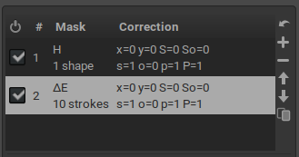
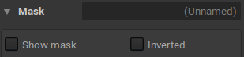
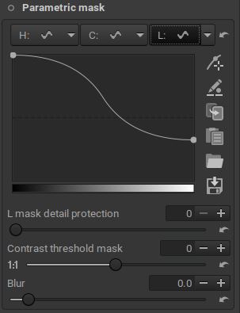
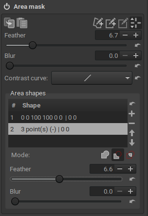
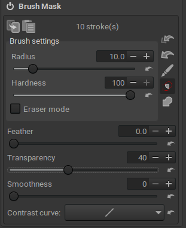

<!--  -->

## Local Editing with Layers and Masks
*(contributed by Barry Thomas)*

All tools in the **Local editing** group (**Color Correction**, **Smoothing**, **Local Contrast** and **Texture Boost**) work by applying their effects using one or more *adjustment layers*.

    
* Each adjustment layer operates independently of any other.

* The effect of multiple adjustment layers is cumulative. 

* Adjustment layers apply an effect to the whole image **unless** the effect is constrained by one or more masks. 

  

* There are four types of mask.

* Any adjustment layer can use any or all of the four types, but only **one of each type** of mask can be used in each adjustment layer. 

    - *Parametric mask*: Select pixels according to their Hue, Chromaticity and Lightness (independently), and/or according to their contrast wrt. the neighboring pixels.

      

    - *Color similarity mask*: Select pixels accoring to how similar their color is to a reference color (expressed by Hue, Chromaticity and Lightness), using the [CIE DeltaE 2000 metric](https://en.wikipedia.org/wiki/Color_difference#CIEDE2000). 

      

    - *Area mask*: Allows a number of user-drawn shapes to be applied which constrain the effect of the adjustment layer. The contrast, feather and blur of each area mask can be adjusted. 

        * Any number of shapes may be used. 

        * Shapes may be separate or overlapping.

        * Overlapping shapes may be set to **add** (the shapes are added together to make one combined shape), **subtract** (one shape cuts a section from all shapes it overlaps) or **intersect** (the effect applies only to pixels covered by this and all other shapes).

      

    - *Brush mask*: A mask is built from one or more brush strokes. Each stroke may be added using various settings. Other controls allow the adjustment of the style of all strokes.

      

* For each adjustment layer, the mask is computed as follows:

    1. compute a parametric mask
    2. compute a color similarity mask, *independently* from the mask 1.
    3. compute an area mask, *independently* from the mask 1 and 2. This is computed by combining the various shapes according to their mode, as follows:
        - start from an empty mask
        - for each shape in the list of shapes, from top to bottom:
            - for each pixel in the image:
            - if pixel inside shape: add to the mask if mode is ADD, subtract from the mask if mode is SUBTRACT
            - if pixel not inside shape, and mode is INTERSETCT, then remove from the mask

    4. create an intermediate mask by intersecting 1, 2, and 3.
    5. process the brush mask as follows:
        - if mode is INTERSECT, compute an *independent* brush mask, and intersect with 4.
        - if mode is ADD, paint over (meaning add or erase, accoring to the brush mode) the mask computed in 4.

    6. finally, if "invert mask" is set, invert the whole mask (computed in 5).
