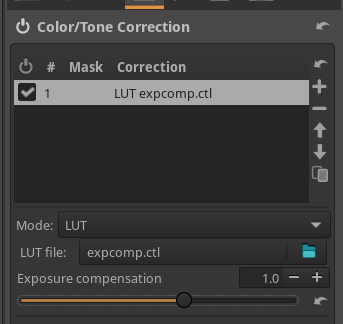
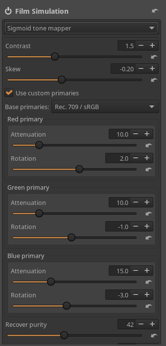
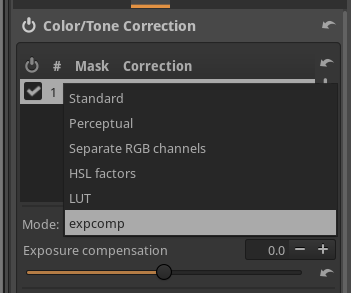
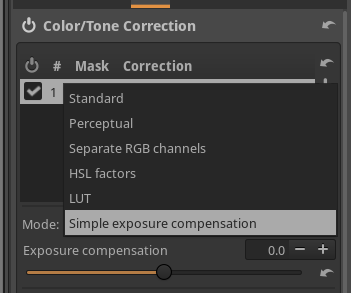

# Working with LUTs

ART has inherited from RawTherapee the support for creative 3D LUTs in the form of [Hald CLUTS](http://www.quelsolaar.com/technology/clut.html), 
available in the [Film Simulation tool](https://rawpedia.rawtherapee.com/Film_Simulation). 
Starting from version 1.16, however, the support for LUTs has been significantly enhanced. 

In particular, now ART supports two new kinds of LUTs 
which can be used to encode various powerful and flexible pixel-level operations:

- [ACES CLF LUTs](https://docs.acescentral.com/specifications/clf/), thanks to the use of [OpenColorIO v2](https://opencolorio.org/) (OCIO for short);

- Scripts written in the [Color Transformation Language (CTL)](https://acescentral.com/knowledge-base-2/ctl/), thanks to the use of the [ACES CTL interpreter](https://github.com/ampas/CTL) (since version 1.21).

Both kinds of LUTs must be enabled at compile time, by setting respectively `ENABLE_OCIO` and `ENABLE_CTL` to `True` in CMake. 
When available, they can be used in both the "Film Simulation" and in the the "Color/Tone Corrections" modules.


## CLF LUTs

Despite the name, CLF LUTs are not simply look-up tables, 
but can encode a sequence of different pixel-level operations, 
including matrix multiplications, ASC CDL operations, and per-channel transfer functions. 
What this means is that they are well suited to be applied in a scene-referred workflow, 
e.g. to implement "look transforms" or also "output transforms" 
(i.e. tone mapping operations from scene to display/output). 
For example, now it is possible to apply [ACES](https://acescentral.com/) output transforms directly in ART, 
or even color grade pictures using look+output LUTs developed for high-end professional cinema cameras.

The only thing needed is to convert such LUTs to CLF and combine them with the appropriate color space conversions to/from [ACES 2065-1](https://en.wikipedia.org/wiki/Academy_Color_Encoding_System#ACES2065-1) (which is the color space used by ART to apply CLF LUTs), 
all of which can be done with OCIO tools and a little bit of scripting.

### Generating ART-compatible CLF LUTs

The OCIO distribution comes with [`ociomakeclf`](https://docs.acescentral.com/guides/clf/#ociomakeclf), a command-line tool to convert many LUT formats to CLF. Conveniently, `ociomakeclf` can also perform color space conversions from the space required by the LUT to ACES 2065-1, which is what ART assumes, via the `--csc` parameter.

For many "creative-type" LUTs, which do not change the color space of the input image, invoking `ociomakeclf` with the appropriate value for `--csc` is all that is needed.
For example, converting one of the [ARRI Look LUTs](https://www.arri.com/en/learn-help/learn-help-camera-system/alexa-35-workflows/look-files) in LogC3 space to CLF in ACES 2065-1 can be done by using `--csc ARRI_ALEXA-LOGC-EI800-AWG`, whereas for [RED Creative LUTs](https://support.red.com/hc/en-us/articles/360041467533-RED-LUT-Downloads), instead, `--csc RED_LOG3G10-RWG` should be used.

The process is a bit more involved for LUTs that also perform color space conversions of their inputs, 
such as the LUTs used to implement output transforms in various scene-referred pipelines typically used in video editing such as ACES.
In this case, the steps needed are as follows:

1. Generate a CLF LUT for converting from ACES 2065-1 to the input format expected by the LUT;
2. Convert the LUT to CLF via `ociomakeclf`, but without any color space conversion;
3. Generate a CLF LUT for converting from the output format produced by the LUT;
4. Combine the three LUTs above into a single one.

For example, the [current output transform candidates for ACESv2](https://github.com/ampas/ACES_ODT_Candidates/tree/main/OCIO/luts/ACES2_Candidates_rev060) take as input an image encoded in [ACEScct](https://docs.acescentral.com/specifications/acescct/). Therefore, in step 1. we need to convert from linear ACES AP0 (i.e. ACES 2065-1) to ACEScct, which can be done with the following CLF LUT (let's call it `ACES-2065-1_to_ACEScct.clf`):

    <?xml version="1.0" encoding="UTF-8"?>
    <ProcessList compCLFversion="3" id="1">
      <!-- convert from linear AP0 to linear AP1 -->
      <Matrix inBitDepth="32f" outBitDepth="32f" >
        <Array dim="3 3">
           1.4517959  -0.23689421 -0.21493762
           -0.07658145  1.17624678 -0.09967593
           0.00831917 -0.006041    0.99810067
        </Array>
      </Matrix>
      <!-- convert from linear AP1 to ACEScct -->
      <Log inBitDepth="32f" outBitDepth="32f" style="cameraLinToLog">
        <LogParams base="2" linSideSlope="1" linSideOffset="0" logSideSlope="0.0570776255707763" logSideOffset="0.554794520547945" linSideBreak="0.0078125" />
      </Log>
    </ProcessList>
    
For step 3, assuming we want to use the "Rec.709" version of the output transforms (which is suitable for a standard SDR display), we can use the following CLF to convert from Rec.709 with a 2.4 gamma to ACES 2065-1 (let's call it `Rec709_to_ACES-2065-1.clf`):

    <?xml version="1.0" encoding="UTF-8"?>
    <ProcessList compCLFversion="3" id="3">
        <Exponent inBitDepth="32f" outBitDepth="32f" style="basicFwd">
          <!-- rec1886 EOTF -->
          <ExponentParams exponent="2.4"/>
        </Exponent>
        <Matrix inBitDepth="32f" outBitDepth="32f" >
          <!-- Linear Rec.709 to ACES AP0-->
          <Array dim="3 3">
            0.43392843 0.3762503  0.18982151
            0.088802   0.81526168 0.09593625
            0.01775005 0.10944762 0.87280228
          </Array>
        </Matrix>
    </ProcessList>

Finally, for step 4, we can use [this simple Python script](resources/combine_clf_luts.py) to obtain our final result (`RESULT.clf`):

```
  $ python combine_clf_luts.py ACES-2065-1_to_ACEScct.clf LUT.clf Rec709_to_ACES-2065-1.clf -o RESULT.clf
```

If you want to save space, you can also compress `RESULT.clf` using gzip, and then rename the file to `RESULT.clfz`:

```
  $ gzip RESULT.clf && mv RESULT.clf.gz RESULT.clfz
```

Alternatively, you can also pass the `-c` flag to `combine_clf_luts.py` to generate a compressed LUT directly.
Note though that supporting gzip compression is an ART extension, so the compressed LUTs will probably not work with other OCIO-based apps.


### Useful tools

Here are links to some useful tools for working with CLF LUTs.

- [`ociomakeclf` binary for Windows](resources/ociomakeclf.zip)

- [`ociomakeclf` binary for Linux x86-64](resources/ociomakeclf.gz)

- [`combine_clf_luts.py` Python script (cross-platform)](resources/combine_clf_luts.py)


## CTL scripts

[CTL (the Color Transformation Language)](https://acescentral.com/knowledge-base-2/ctl/) is a scripting language designed to create custom pixel-level image transformation operations.
LUTs expressed as CTL scripts are even more powerful and flexible than CLF LUTs,
allowing to define complex image manipulation operations 
as programs in a language similar to C or C++.

Importantly, CTL scripts in ART can be *parametric*: 
by using specially-formatted comments in the script, users can declare that some arguments of the main function of the script are parameters 
that can be changed directly from the ART GUI 
(and whose values are stored in `.arp` sidecar files). 
This provides a simple but powerful way of extending ART with user-written filters.

### Writing ART-compatible CTL scripts

In order to be usable within ART, a CTL script must define a function called `ART_main`, 
which is the entry point called by ART.
The function should take 3 `varying` input arguments of type `float`
and 3 corresponding `varying` output arguments, again of type `float`.
Such arguments correspond to the red, green and blue components of each pixel of the image being processed.
Specifically, the function will be called for every pixel of the input image,
which is in RGB format and normalized so that the SDR tonal range corresponds
to the `[0, 1]` interval (though the data might exceed such range both in
input and in output).
By default, the RGB values are encoded in the [ACES 2065-1](https://en.wikipedia.org/wiki/Academy_Color_Encoding_System#ACES2065-1) color space, 
but this can be overridden by inserting in the scritp an *ART color space tag* in the following form:

```
 // @ART-colorspace: "<colorspace>"
```

where `<colorspace>` can be `ACES2065-1` (default), `ACEScg`, `Rec2020`, `Rec709`, `ProPhoto`, or `AdobeRGB`.

Additionally, `ART_main` might take an arbitrary number of other `uniform` arguments of type `int`, `float`, `bool`, or arrays of `float`, 
which will be interpreted as *parameters* for the script.
Each such parameter must come with an
associated *ART parameter definition* in the CTL script. ART parameter
definitions are special comment lines of the following form:

```
 // @ART-param: <param-def>
```

where `<param-def>` is an array in [JSON](https://www.json.org/) format, whose content depends on the
parameter type. The array must be at least of size 2; the first element is
a string containing the name of the parameter (which must mach the name
used in `ART_main`), and the second element is its GUI label. The rest of the
array has the following structure:

- for `bool` parameters, the 3rd optional element specifies the default
  value; the optional 4th and 5th elements instead are respectively:
   
   - a "group name" for the GUI: if set, this will cause the control to appear
     under a collapsible panel with the given name in the GUI;
   - a tooltip string for the GUI: if set, the given string [in Pango markup format](https://docs.gtk.org/Pango/pango_markup.html) is used as a tooltip.

- for `float` parameters, the array size must be at least 4 and at most 8.
  The 3rd and 4th elements are the minimum and maximum values for the
  GUI slider. The optional 5th element is the default value, the optional
  6th element the precision to use in the GUI (e.g. 0.01 will use 2 decimal
  digits in the GUI), and the optional last two elements are the GUI group name and tooltip;

- for `int` parameters, the array size must be at least 3 and at most 7.
  If the 3rd parameter is an array of strings, it is interpreted as a list
  of options in a choice menu, with values corresponding to their index in
  the array (i.e. the 1st option will give a value of 0, the 2nd a value of
  1, etc.). In this case, the array can contain at most 3 other elements,
  which are respectively the default value and the optional GUI group name and tooltip.  
  If the 3rd parameter is not an array of strings, then the array size must
  be at least 4, with the 3rd and 4th elements corresponding to the minimum
  and maximum values for the GUI slider. The optional 5th element is the
  default value, and the optional last two elements are the GUI group name and tooltip.

- arrays of `float` are used to represent curves as 1D LUTs. Both curve
  types supported by ART (i.e. "diagonal" and "flat") are available,
  depending on the parameter definition. The array size of the parameter
  definition must be at least 2 and at most 8. The 3rd parameter indicates
  the curve type: 0 for diagonal, 1 for flat, and 2 for periodic flat
  (e.g. like a hue curve in ART). If not given, it defaults to 0. The 4th
  parameter, if given, specifies the default value for the curve. This can
  either be 0 (i.e. an identity curve), or an array of floats defining the
  type of curve and its control points, in the format used by .rtc curve
  files. The 5th and 6th parameters can be used to define the gradients
  appearing at the bottom and left of the curves in the GUI. Finally, as
  for other parameter types, the last two optional elements are the GUI
  group name and tooltip string.

If default values are not given in the ART parameter definition, they are
taken from the definition of the `ART_main` function. If no default is given,
zero is used.

Here is an example of parameter definitions for each of the supported types.
For `param_float`, besides the required minimum and maximum values, we also specify the default and the GUI precision;
for `param_int`, only the required elements are provided;
for `param_bool`, a default value of `true` is given; 
finally, for `param_choice`, all the possible elements are provided.

```C
// @ART-param: ["param_float", "A float slider", -1.0, 1.0, 0.5, 0.1]
// @ART-param: ["param_int", "An int slider", -10, 10]
// @ART-param: ["param_bool", "A checkbox", true]
// @ART-param: ["param_choice", "A combo box", ["Option A", "Option B"], 1, "Choice group", "Tooltip <b>using markup</b>!"]

void ART_main(varying float r, varying float g, varying float b,
              output varying float r_out, output varying float g_out, output varying float b_out,
              float param_float, int param_int, bool param_bool, int param_choice)
{
   // ...
}
```

Finally, using the `@ART-lut` tag it is possible to specify whether the CTL script should be applied to every pixel of the input image, or whether it should be used to precompute a 3dLUT that is then applied to the image. 

Using `@ART-lut` can significantly improve performance, but it might cause
artifacts for scripts that compute functions that are hard to approximate with
a look-up table. By default, if no tag is present, ART will apply the CTL
script to each pixel of the image on export, and it will use intermediate
3dLUTs of suitable size during the editing preview (this behaviour can be changed by setting the related flag in "Preferences -> Performance").

The format for the parameter is the following:

```
 // @ART-lut: <lut-dim>
```

where `<lut-dim>` is an integer specifying the dimension of the intermediate
3dLUT. The special value `-1` means that 3dLUTs are never used for this
script, neither on export nor for previews.


## Example

Here is a simple ART-compatible CTL script to perform exposure compensation.
The script takes one parameter that gives the Ev value of the exposure correction to apply. The CTL code looks like this:

```C
// @ART-param: ["expcomp", "Exposure compensation", -5.0, 5.0, 0, 0.1]

void ART_main(varying float r, varying float g, varying float b,
              output varying float r_out, output varying float g_out, output varying float b_out,
              float expcomp)
{
   const float scale = pow(2, expcomp);
   r_out = r * scale;
   g_out = g * scale;
   b_out = b * scale;
}
```

The corresponding GUI when loaded in ART (in the "Color/Tone Correction" tool) looks like this:




## More complex examples

Starting from version 1.21, ART ships with a (slightly simplified) implementation of the Sigmoid tone mapper of [darktable](http://www.darktable.org) as a CTL script. 
This can be used as an alternative tone mapper for ART, 
and it is automatically available in the "Film Simulation" module 
(if CTL support was enabled at compile time):



A collection of other examples are available [in this repository](https://github.com/artpixls/ART-ctlscripts/).

## Making CTL scripts automatically available

CTL scripts placed in the `ctlscripts` subdirectory of the ART config folder 
(typically `$HOME/.config/ART` on Linux and `%LOCALAPPDATA%\ART` on Windows)
are loaded automatically by ART upon startup, 
and available as additional operation modes in the "Color/Tone Correction" tool.

For example, by putting our `expcomp.ctl` example in `$HOME/.config/ART/ctlscripts`, we have it as an additional mode:



By default, the name of the file (without the `.ctl` extension) is used as mode name.
This can be customized by adding an *ART label tag* to the CTL script,
with the following format:

```
// @ART-label: "<toolname>"
```

For example, by adding:

```
// @ART-label: "Simple exposure compensation"
```

to `expcomp.ctl`, we now get a nicer name in the GUI:


