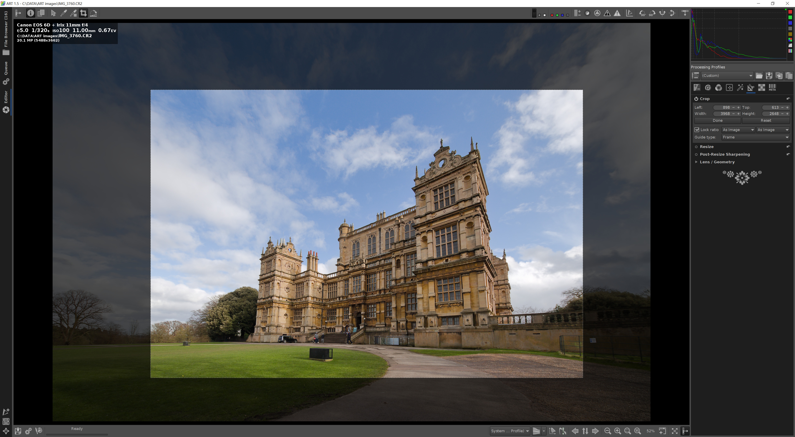

# ART Quick Start
*(contributed by Barry Thomas)*

## Quick Start

When you first open ART, you see the *File Browser* screen:

The display is divided into three main areas:

-   The left pane, to navigate to your images
-   The middle pane, to view thumbnails of images in the current folder
-   The right pane, to filter the thumbnails by various settings - file
    types, dates and so on.

### Find some files

In the left pane, the top area shows drives, the lower area shows
folders on the current drive.

Navigate to a folder containing some of your RAW images:

ART displays all common image types – RAW, JPEG and others. The
thumbnails are sorted in file name order.

By default each thumbnail is captioned with the file name, date, f-stop,
ISO and lens focal length.

### Filter your images

The right hand pane has two modes – *Filter* and *Inspect*. These are
selected using the two vertical tabs at the top right of the screen.

First try out the filter. My images were taken with three different
lenses, a 16-35mm, a 24-105mm and an 11mm. I want to just see the images
from the 11mm wide angle:

-   At the top of the *Filter* pane, check the **Enable metadata
    filters** box
-   Half way down the []{#anchor}*Filter* pane, check the **Lens** box.
    At first all lenses are highlighted. You can use click, control
    click and shift click to select one or more lenses. I'll just click
    on Irix 11mm f/4 and just those image thumbnails will be shown in
    the the middle pane:

With your images, try selecting and deselecting the options in the
filter panes to show and unshow images with particular camera settings.

To reset the view so all image thumbnails are shown, uncheck the
**Enable metadata filters** box at the top of the filter pane.

### Inspect your images

The right hand pane has a second mode – Inspect. Select this by clicking
the Inspect tab at the top right of the screen:

The middle and right pane are replaced with a scrollable pane of
thumbnails and a quick image viewer. Click on any thumbnail to see a
preview of the image:

At the bottom right of the *Inspect* pane there are some buttons which
let you choose how the quick preview is displayed:

These controls include:

-   View the RAW file's embedded JPEG
-   View a fast RAW rendering with linear tone curve
-   View a fast RAW rendering with a film-like tone curve
-   View a fast RAW rendering with a shadow-boosting tone curve
-   View a monochrome version of the image showing clipped pixels
    highlighted in colour
-   Fit the current image to the screen
-   View the image in 1:1 pixel size.

### Open an image

Double-click on a thumbnail image from either *Filter* pane or the
*Inspect* pane, to see the *Editor* screen:

This RAW image (of Wollaton Hall in Nottinghamshire, UK, by Barry
Thomas) is public domain and is available to download [here](resources/IMG_3760.CR2) so
you can match these descriptions with the steps you take on your own
computer.

The *Editor* screen offers a range of new tools and controls, but they
are grouped into three main panes, the *Navigator and History* at the
left, the ‘*Film-strip*' across the top and the *Processing Tools *on
the right.

These three panes can be closed and opened, to leave more room for the
main image. There are three buttons which do this:

Click each of these buttons – the panels collapse out
of sight, leaving just the image currently loaded in the editor. Now
click each one again to reopen the three panels.

The arrow on each button shows the direction of the panel will move when
the button is clicked.

### The Navigator and History panel

#### Navigator

The top of this panel shows a thumbnail of the current image with basic
RGB, LCH and lab colour figures. When you have zoomed into the image in
the main editing panel, a red line is overlaid on the thumbnail showing
the extent of the image currently in view in the main panel. This red
overlay can be moved by clicking and dragging, to move the image around
the main panel.

#### History

In each editing session, every processing change you make is listed
here, so if you want to go back to a specific point in the sequence of
steps, just click on one of the items in the list. You will see this in
action later when we make a number of changes to an image.

#### Snapshots

At the bottom of the left hand panel is the *Snapshots* pane. When you
reach a point in processing that you would like to keep for later you
can save a snapshot. You can make as many as you like and they are all
stored alongside the RAW image for later. You will see this in action
later when we make a long sequence of processing changes on one file.

### The Film-strip panel

Above the main image pane is a row of thumbnails of the images in the
current folder. You can browse left and right using the arrow keys or
the horizontal scollbar. The current image is highlighted in the ‘film
strip'.

### The Processing Tools panel

Before we look at some simple processing steps, let's just make a bit
more screen room for the image itself.

Click the panel buttons at top left and top right to close the
*Navigator / History* panel and the *Film-strip*:

The screen now looks like this, showing the image and the processing
tools panel:

I haven't zoomed the image in or out, so it is just at it's default
size, which filled the image pane when the other panels were visible.

At the bottom right there are some controls to help you zoom to the
right level:

From left to right they are *zoom in*, *zoom out*, *fit to screen* and
*1:1 pixel view*.

You can also change the zoom level by scrolling your mouse wheel.

Click the *fit to screen* button to fill the image pane with the image
(**Tip**: the keyboard shortcut for this button is \[f\]):

### Some simple processing steps

Here are some simple edits to help you get started using the controls in
the processing tools pane on the right.

At the top right there are eight buttons for the various main tool
groups. Initially the first one is highlighted with a blue underline,
this is the *Exposure* group:

Each tool group is divided into sub-groups, in *Exposure* they are:

-   Exposure
-   Tone Equalizer
-   Tone Curves
-   Dynamic Range Compression
-   Log Tone Mapping

All of the tool groups and sub-groups are descibed elsewhere in the
documentation, but for now we will look at the *Tone Equalizer* group:

Next to the name of each tool sub-group there is an **On/Off** switch to
enable the tools:

The arrow button at the right allows you to reset all controls in this
sub-group to their default values.

Each of the control sub-groups can be collapsed, so the controls look
less busy. Just click on the name of the subgroup to collapse or reopen
that panel of tools.

Switch on the *Tone Equalizer* sub-group, so it looks like this:

The image of the building is reasonably well exposed, but the near face
is in shade, so we'll lighten the shadows a little.

Click and drag the **Shadows** control to the left and right to see the
effect. There is a slight lag as the computer processes the image from
the camera's RAW data. The bottom left of the screen shows a progress
bar:

I settled on +30 as a good value to lift the shadows in the image.

The clouds at the top right are a little over-exposed, so we can pull
that brightness down by sliding the **Highlights** control to the left.
I settled on a value of -50 for the highlights, so we can see some
detail in the lightest part of the clouds. The screen now looks like
this:

The second processing tool group is *Detail*:

The tool subgroups are:

-   Spot Removal
-   Sharpening
-   Noise Reduction
-   Impulse Noise Reduction
-   Defringe

We'll use the *Sharpening* tool to sharpen this image. Click on the
**On/Off** switch next to the name of the *Sharpening* subgroup to
enable this tool.

To make the screen less busy, click on the names of the other subgroups
to collapse them, leaving just *Sharpening* open. (**Tip**: Right click
on the name of a subgroup and that one is opened, while all other
subgroups are closed):

The tool panel looks like this:

There are two methods for sharpening the image, **RL Deconvolution** and
**Unsharp Mask**. I'll use **Unsharp Mask** for this image, so click the
**Method** dropdown and select **Unsharp Mask**, so the tool panel looks
like this:

So we can see in detail the effects of the *Sharpening* tool, we'll zoom
in. Click on the *1:1* button at the bottom right of the screen so we
see actual 1:1 pixels, or 100% zoom:

Depending on the resolution of your monitor you'll see more or less of
the image. If you have a lower resolution screen you might see just the
middle of the front of the building.

When we switched on the *Sharpening* tool, some default values were set,
so the image you see now has had some sharpening applied. I'd like to
increase the effect though, to really pull out the detail in the ornate
stone work, so I'll change the **Radius** value to 0.70 and the
**Amount** value to 260:

Here is a zoomed in view of the middle of the image:

#### Transform tools

Zooming back out to fit the image to the screen (Shortcut \[f\]), we can
see that because the image was taken with a very wide angle lens, the
verticals converge heavily towards the top.

We can adjust that to make the building look less distorted and then
crop the image a little to remove some of the foreground and sky.

The sixth processing tool group is *Transform*:

Click on the *Transform* button to open that tool group. The tool
subgroups are:

-   Crop
-   Resize
-   Post-Resize Sharpening
-   Lens / Geometry

##### Adjust the verticals

First we'll adjust the verticals in the image using the *Lens /
Geometry* subgroup. Right click on the name of the *Lens / Geometry*
subgroup to open it and close all the others. This subgroup is always
**On** so there is no **On/Off** switch at the left of the name, just a
drop-down arrow to open the subgroup.

We'll use the second pane down, *Perspective Correction*:

These are default values when the tool is switched on - no correction is
applied using these values.

We want to make the image appear wider at the top, so we will use the
**Vertical** perspective slider. Try sliding the control to the right to
a value of around +30:

This reduces the converging verticals a little. You might like to use
more or less of this correction, according to taste.

At the top of the *Lens / Geometry* tool subgroup, there is a checkbox
for **Auto-fill**, which by default is checked. This automatically crops
the image to remove the edges where the change to the geometry becomes
visible. Try unchecking this box and re-checking it to see the effect.

##### Crop the image

At the top of the *Transform* tool group, right click on the **Crop**
tool to open it and close the other tools, **but don't switch the tool
on yet**.

The **Crop** tool group looks like this:

The control shows the start of the cropped area by the left/top corner -
by default, 0, 0 - and the width and height of the crop - by default the
full width and height of the image – so no cropping has taken place yet.

There are two ways to change this and start to crop the image – switch
the tool on and use the +/- controls to change those numbers, which is
highly accurate but quite slow, or use click and drag on the image.

At the top left of the screen is a row of tool buttons:

We are just going to look at two of these for now. The first is the
**arrow** button, which allows you to drag the image around the screen,
whatever the current zoom level.

The button we will use now is the **Crop** button, second from the
right:

Click on the **Crop** button, the **Crop** tool is switched on and you
can click and drag slowly across the image to select an area for the
crop, something like this:

You will notice that the area of the crop is constrained to the
proportions of the original image, but we can change this.

In the **Crop** tool there is a checkbox labelled **Lock ratio**.
Uncheck this box and now you can change the shape of the cropped area by
clicking and dragging an edge or a corner, perhaps to something like
this:

We have now made some simple edits to the image, so we can now carry out
the conversion from our original RAW file, using these changes, to make
a JPEG file.

### Conversion to JPEG

At the top left of the screen are three tabs, *File
Browser*, *Queue* and *Editor*.

We started in the *File Browser* tab where we selected the file to edit.
This dropped us into the *Editor* tab where we made the changes
described above. Now we'll have a quick look at the *Queue* tab.

**ART is a non-destructive RAW processor, so your RAW files are
unchanged by the edits you make. The program takes the RAW file, records
the edits as a list of commands in a ‘*****side-car*****' file, stored
alongside the RAW file, and when you are ready, you can export an edited
version of the original as a JPEG file.**

You can edit several files one after the other, close the program, come
back later, carry on editing the same files or others – and all of these
edits are saved automatically in sidecar files.

When you are ready to export your images to JPEG files you can do one at
a time or several together. When you start the export process, the files
are processed in turn in a *queue*.

Click on the *Queue* tab at the top left and take a look at the queue:

There are some controls at the top, but the queue itself is empty – we
have not sent any files to the queue yet.

For now we will use the default settings for the queue, which means the
exported JPEG file will be created in a new sub-folder in the folder
where the original RAW file is saved.

Click on the *Editor* tab at the top left to return to the image:

At the bottom left of the screen are three buttons, which allow you to
Save (export) the current image right now, to add the current image to
the queue and to edit the current image in an external image editor:

Click the middle button to add the current image to the queue, **then
immediately click on the *****Queue***** tab at the top left of the
screen** and you should see the thumbnail of the image as the one and
only item in the queue:

When processing is complete, the thumbnail disappears and the queue is
empty again:

The JPEG has been created in the folder below the source image's
location, and it should look something like this:

