# ART Reference Manual
*(By Len Philpot -- With part of the contents taken from [RawPedia](http://rawpedia.rawtherapee.com/), licensed under [CC BY-SA](http://creativecommons.org/licenses/by-sa/3.0/))*

ART is, not surprisingly, very similar to RawTherapee.
Therefore there is no attempt to document every detail.
For more information including meta-topics related to raw image processing in general, please see RawPedia.
Bear in mind, of course, there are nonetheless numerous differences between ART and RawTherapee.

This reference is a combination of (sometimes lightly edited) RawPedia content, ART user forum posts and other sources. *Some* attributions and / or sources are referenced, others are unknown.

- [RawPedia](http://rawpedia.rawtherapee.com/Main_Page)
- [ART user forum at PIXLS.US](https://discuss.pixls.us/c/software/art/)
- [Other ART documentation](Home) (scroll down to "Documentation")

The File Browser and Queue information below is rather brief. More complete information on these topics can be found in the ART [Quick Start Guide](Quickstart).

Len Philpot (`@lphilpot` on the ART user forum)

# Contents

- [File Browser](#markdown-header-file-browser)
- [Queue](#markdown-header-queue)
- Editor Tools
  - [Exposure tab](#markdown-header-exposure-tab)
  - [Detail tab](#markdown-header-detail-tab)
  - [Color tab](#markdown-header-color-tab)
  - [Local editing tab](#markdown-header-local-editing-tab)
  - [Special effects tab](#markdown-header-special-effects-tab)
  - [Transform tab](#markdown-header-transform-tab)
  - [Raw tab](#markdown-header-raw-tab)
  - [Metadata tab](#markdown-header-metadata-tab)

# 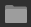 File Browser

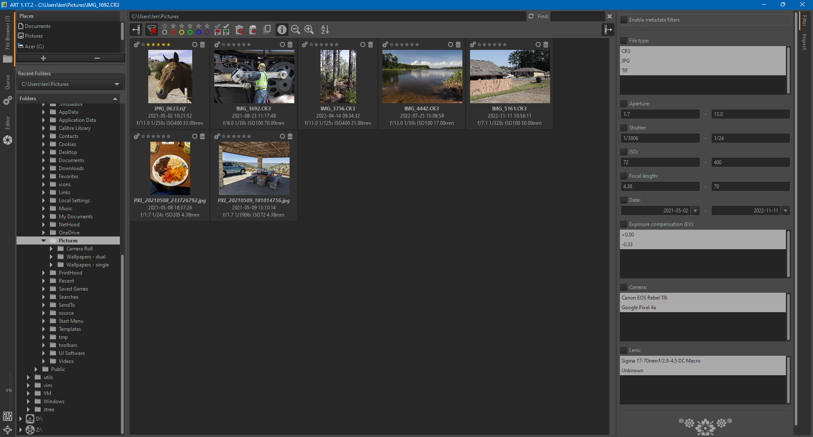

Briefly, the File Browser has three primary sections - A directory / file tree pane on the left, a Filter / Inspect pane on the right and the thumbnail display pane in the center.
You can hide the individual panels using the "Show/Hide the left panel " and "Show/Hide the right panel" buttons.

- Note - These screen shots were taken on Microsoft™ Windows™, so the GUI details will reflect the OS on which ART is running.

## File tree and favorites pane

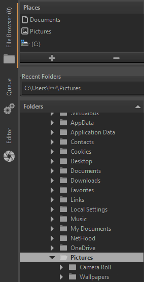

The folder structure revealed in the bottom of the left pane reflects the contents of the Place chosen at the top.
It functions like any standard directory browser tree.
Any matching image files in the selected directory will be shown as thumbnails in the center pane. Please note only files with their extension types enabled will be displayed (Preferences | File Browser | Parsed Extensions).
If the Show Only Original Images button on the thumbnail toolbar is enabled and if multiple images of the same name but different extension (e.g., `image.CR3`, `image.tif`, etc.) are present, the "original" -- i.e., displayed -- image will be the one whose extension is nearest the top of the Parsed Extensions list.
The up / down arrow buttons at the bottom of the list can be used to customize the sort order.

Clicking the plus (+) or minus (-) buttons immediately above the Recent Folders list will add or remove, respectively, the currently selected folder from the Places list.
Clicking on one of entries in this list will immediately jump to and select that directory in the tree.
The tree can be sorted ascending or descending by clicking the arrow on the Folders area header bar. There is also setting to select a folder by either single- or double-clicking it (Preferences | File Browser | Single-click activation of file browser folders).

## Thumbnails

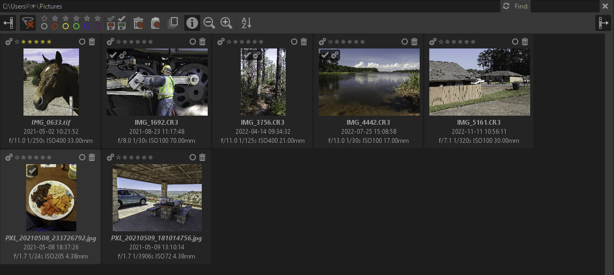

Images shown as thumbnails can be ranked with ratings, selected individually or en masse for bulk operations, copied, pasted, reset, deleted, etc. Additionally, custom [user commands](Usercommands.html) can be defined.
Right-click on a thumbnail for more options.
Double-click a thumbnail to open that image in the Editor.

### Filter

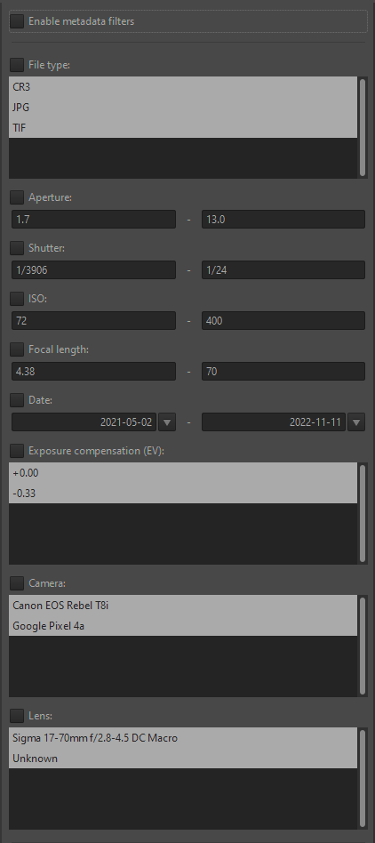

By selecting / entering specific filter terms in the appropriate field(s), the thumbnail list will be limited to displaying only those images matching the specified filter terms.
The Enable metadata filters checkbox must be checked for filter terms to influence thumbnail display.

### Inspect

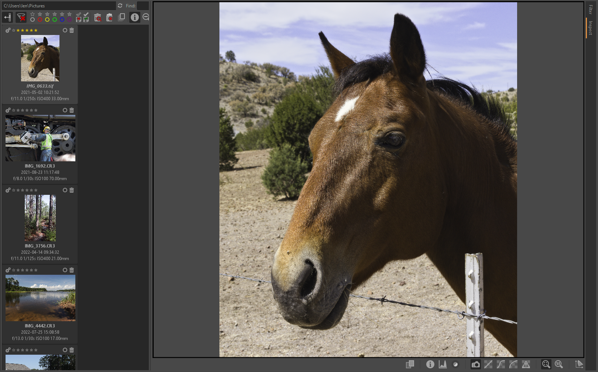

The Inspect tab is a quick way to review images at a greater detail level than simply as small thumbnails.
There are buttons under the large preview window to display a split-window view of two images simultaneously, image information, histogram, focus mask, embedded preview and several quick RAW-conversion views both at fit-to-window and 100% zoom levels.
Select a thumbnail to the left to change the selected image in the Inspect window.

#  Queue

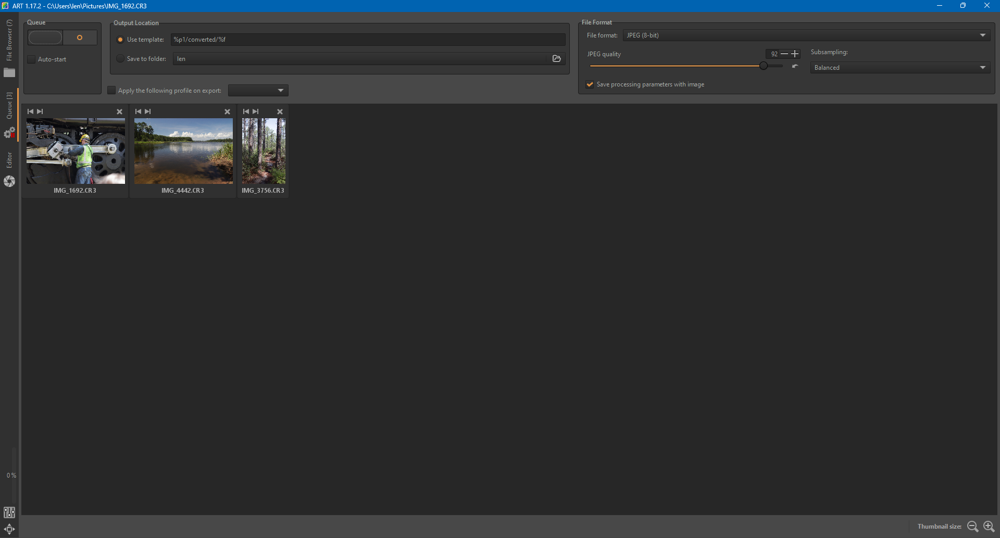

Saving images from ART can be done in several ways, the two most common of which are either saving the image immediately from the Editor tab, or adding it to the batch processing queue which resides in the Queue tab.

The Queue has several settings, such as the output file format and destination.
These settings take effect in all cases except when you use the "Save current image" button, select "Put to the head/tail of the processing queue" and enable the "Force saving options" checkbox.
In this case, the settings seen in the "Save" window will be used, and the ones from the Queue tab ignored.

Two things are worth pointing out:

- "Save processing parameters with image" will save a sidecar file alongside the output file, with the same filename as the output image but with a ".arp" extension. This is useful when you want to save multiple copies of the same photo, each one tweaked a bit differently.
- The destination folder can be set by selecting "Save to folder", but if you need to dynamically customize the destination folder and filename then select "Use template" instead. Hover your mouse over the Use template input box and a tooltip with an explanation will pop up.

In the top-left corner of the Queue tab you will find an "On/Off" switch, and an "Auto-start" checkbox.

1.  If Auto-start is enabled, processing will start as soon as an image is sent to the queue.
Usually you will not want this, as this will use your CPU for processing the photos in the queue leaving very little CPU time for allowing ART to be responsive while you tweak other photos.
2.  If Auto-start is not checked, you will have to activate the queue manually by hitting the "On/Off" switch.

You can pause the queue by hitting the "On/Off" switch - ART will first finish processing the current photo.

You can remove a specific image from the queue by clicking the small "Cancel job" button in the corner of each thumbnail.
You can clear the whole queue right-clicking on a thumbnail and clicking "Select all" and "Cancel job", or by using the ^ Ctrl + a keyboard shortcut to select all thumbnails and then hitting the Delete key on the keyboard.

#  Editor Tools

##  Exposure tab

### Exposure

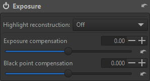

Adjust the overall exposure level of the image with the Exposure tool.

- Highlight reconstruction - This slider can be used to recover the highlights in overexposed areas of a photo by, by trying to extrapolate the partial information available in the surroundings of the clipped pixels. There are four methods:
    - Off - No highlight reconstruction is attempted.
    - Blend - Attempts to guess clipped color channels by filling in their values from the closest match from unclipped highlight regions nearby. 
    - Color propagation - This is the most powerful recovery method. In addition to restoring luminosity, Color Propagation tries to restore color information by 'bleeding' the surrounding known color into the missing clipped area.
    - Balanced - This method is a bit less aggressive than color propagation in propagating color (letting more pixels to go full white), which sometimes helps in avoiding artifacts.
- Exposure compensation - This slider most directly affects the global luminance level of the image.
This is a multiplication of each pixel (as a vector *\[r,g,b\]* *) by* *2value*, done in linear space, with no clipping.
Exposure compensation shifts the entire histogram in the direction of the slider (left or right), effectively moving the black and white points in the opposite direction. Units are in f-stops.
- Black point compensation - This slider effectively raises or lowers the relative black point of the histogram (zero exposure) causing an according inverse adjustment to shadow exposure.
As the black point rises, shadows darken relatively; as it lowers, they lighten.

### Tone Equalizer

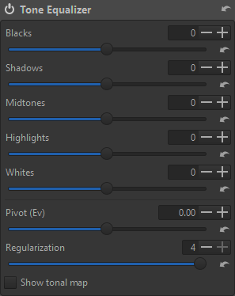

The Tone Equalizer provides tone control constrained to specific luminance zones.
At a high level, this is a parametric tone curve that tries to preserve local contrast.
There are sliders to adjust levels of blacks, shadows, midtones, highlights and whites.

- Pivot (Ev) - defines what is considered to be part of the "midtones". This allows to shift the tonal zones on which the equaliser bands operate, to better position the bands relative to the image contents. The effect can be easily visualized by adjusting the value while "Show tonal map" (see below) is turned on.
- Regularization - This slider tries to smooth the transitions among the different bands of the equalizer, to avoid unwanted effects such as loss of local contrast.
The best way to visualize the effect is to activate "show tonal map" and play with the slider to see how the affected areas change.
- Show tonal map - Enabling this will assign a false color to each of the five zones and display the zonal distribution on the preview, in those colors.
This is a convenient method to more directly view the effects of the Regularization and Pivot slider.

### Tone Curves

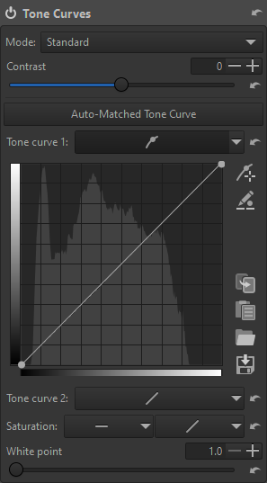

Here you can construct your own tone curves.
They operate on all three R, G and B channels concurrently, so for example you can't work on the R channel only.

The histogram displayed as the curve's background shows you the levels of the data as it flows into the curve at that point in the processing pipeline.
You will notice that it differs from the main histogram which shows you the levels of the final image, at the very end of the pipeline.

- Saturation - A flat curve equalizer and a standard curve are provided to allow fine tuning of saturation.
The equalizer will allow more specific targeting of adjustments, while the standard curve is more global and blended.
Both can be used to control in particular the saturation of (near) blacks and whites.
- White point - Controls the clipping point and the range of tones affected by the tone curve. For more information, see [the specific page on generating HDR output](Hdroutput).

The top button on the side allows you to pick a color value by Ctrl+click on the preview.
Then if desired you can adjust the curve up or down by continuing to hold the mouse button down (you can release the Ctrl key) and dragging up or down.
The button immediately below allows direct edit of in / out values.
You can copy, paste, save and load curves using the four buttons on the lower side of the curve.

While you are free to use only one tone curve to make your adjustments, you can gain much finer tonal control if you use two curves at once.
The typical use of both curves is to lower values using the first curve, and to raise values using the second one.
It is similar to creating an S curve in one of them, but you should be able to make finer adjustments by using both without entering too fast in the "danger zone" where your colors become unrealistic.

#### Curve types

- Standard - A classic cubic spline curve.
It can be potentially difficult to edit nodes in complete isolation, without affecting other nodes on the curve.
- Flexible - This type is like Standard but the nodes are more easily edited in an independent manner.
- Parametric - This curve presents four sliders and three control points.
The sliders are used to control highlights, lights, darks and shadows respectively (shadows mean deep darks here).
The control points determine what point of the curve will be affected when moving the sliders.
Parametric curves can be shaped in a well controlled manner.
- Control cage - The control points operate like Bezier curve handles often found in graphics software.
Instead of dragging the curve directly by its nodes, the curve is adjusted by moving the handles, which are connected to nodes.
Straight sections can be created by Shift+dragging a node, which will keep that node on a straight line between the previous and next nodes on the curve.

#### Curve editing

- To delete a node, drag it entirely out of the curve widget.
- Shift+dragging a node snaps to key positions on the curve: Max, min, middle, next, previous.
- Ctrl+drag slows down the dragging movement for more precision.

#### Curve modes

- Neutral - After applying the same curve to the individual channels of the picture (like the "Standard" mode below), performs a gamut compression and highlights desaturation step to mitigate hue shifts and ensure that highlighs follow a more predictable ["path to white"](https://chrisbrejon.com/articles/ocio-display-transforms-and-misconceptions/#s-curves-and-path-to-white).
- Standard - The same curve is applied to all channels and color shifts can occur.
In general an S-curve will increase separation of the channels and thus increase saturation.
- Weighted Standard - You can use this method to limit the color shift of the standard curve, even if it won't suppress it entirely.
- Film-like - This curve provides a result highly similar to the standard type, but the RGB-HSV hue is kept constant - that is, there are less color-shift problems.
This curve type was designed by Adobe as a part of DNG and is thus the one used by Adobe Camera Raw and Lightroom.
- Saturation and Value Blending - This mode is typically better suited for high-key shots, but can be used for creative effect in other photos as well.
The result is highly similar to a luminance curve in Lab space (that is change contrast without affecting hue or saturation).
For contrast-increasing curves the look will typically be slightly desaturated.
- Luminance - Color and saturation is kept stable, that is, the result is very true to the original color.
However contrast-increasing curves can still lead to a slightly desaturated look.
- Perceptual - This mode will keep the original color appearance concerning hue and saturation, that is, if you for example apply an S-curve the image will indeed get increased contrast, but the hues will stay the same and the image doesn't look more or less saturated than the original.
It's specifically useful to establish a pleasing baseline contrast without distorting the colors provided by a camera profile which doesn't apply a curve itself.
Due to the many components in the algorithm it's considerably slower than the other curve modes so refresh rate may suffer.

### Dynamic Range Compression

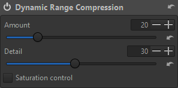

In the case of a very high dynamic range image (i.e., both very bright and very dark areas) it may be necessary to reduce the range between shadows and highlights.
The Dynamic Range Compression tool can achieve this reduction, effectively compressing the histogram from left and right.

- Amount - Sets the strength of the compression.
Higher values lead to a narrower dynamic range (you can easily see the effect by observing the histogram).
- Detail - Sets how much local contrast is preserved.
Positive values reduce the compression in favor of more contrast, negative values reduce the contrast.
- Saturation control - Mitigate the perceived increase in saturation in highlights that might result from the compression.

### Log Tone Mapping

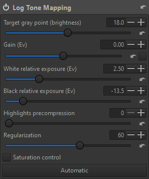

The Log Tone Mapping tool provides a way to compress the dynamic range of a picture, i.e. to pull highlights and / or push shadows.
It's similar in purpose to the "dynamic range compression" tool, or to some extent to the tone equalizer.

- Target gray point (brightness) - Defines where the input mid gray value (always fixed to be 0.18) is mapped to in output. Can be used to control the overall brightness of the image after the tone mapping.
- Gain (Ev) - Amount of exposure compensation to apply before the tone mapping.
- White relative exposure (Ev) - Defines the input white point (in Ev stops above mid gray) which will be mapped to 1.0
- Black relative exposure (Ev) - Defines the input black point (in Ev stops below mid gray) which will be mapped to 0.0
- Highlights precompression - This compresses the right end of histogram before applying the tone mapping.
- Regularization - Amount of local contrast preservation to apply. Higher values will better preserve fine details, but might introduce halos.
- Saturation control - Mitigate the perceived increase in saturation in highlights that might result from the compression.
- Automatic - This button will set values to a calculated starting point. The sliders can still be adjusted.

##  Detail tab

### Spot Removal

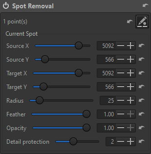

The Spot Removal tool can remove (hide, actually) image "spots" by effectively "copying and pasting" other image information over them.
However, the edit can be modified and even removed prior to output, conceptually somewhat like using a raster editor's clone tool but on a non-destructive adjustment layer.

Click the edit (pencil) button at the upper right to create, edit or remove spots.

- To add a spot, Ctrl+click on a source location (i.e., what you want to "paste" over the target) then drag and release over the target location (i.e., where you want to paste it).
You don't have to keep Ctrl held down. 
    
- To edit a existing spot, hover the white mark locating an edited area, making the editing geometry appear.
    
- To move the source or destination spot, hover its center then drag it.
    
- To remove a spot (display it first if necessary) and right-click it.
    
- The inner circle (maximum effect area) and the "feather" circle can be resized by hovering them (the circle becomes orange) and dragging it (the circle becomes red).
    
- When the changes are done, right click outside any spot to end the Spot editing mode, or click the edit button again.
    
- Spot parameters can also be adjusted using the sliders in the tool panel.
    
- Detail protection - Controls the amount of protection of the original details in the target location. A value of zero will simply clone the source to the target, whereas higher values will blend the source and the target, similarly to GIMP's "heal selection" brush.
    

### Sharpening

The ART sharpening tool offers two basic methods: Unsharp Mask and Richardson-Lucy Deconvolution (with a custom RL Deconvolution option).

#### Unsharp Mask

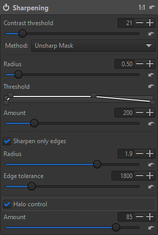

- Contrast threshold - This slider allows you to control a mask that decides which areas are affected by sharpening and which are left untouched.
Activate the "preview the sharpening contrast mask" button (in the toolbar above the main preview) to see this mask.
Moving the slider to the right means that details will have to have higher contrast before they are sharpened.
Higher Contrast Threshold values also reduce the amount of sharpening applied to noise, which tends to have lower detail contrast.
- Radius - The Radius determines the size of the details being amplified and, consequently, relates to the width of the sharpening halo.
In general the quality of sharpening is best if the sharpening radius is smaller.
For low ISO images that are in focus and without motion blur a value of 0.5-0.7 is satisfactory.
- Threshold - The Threshold tool helps to suppress noise amplification and haloing and to confine sharpening to a desired tonal range.
The Threshold tool allows one to create a curve via which the sharpening is applied.
The vertical axis corresponds to opacity: 0% at the bottom (transparent, sharpening not visible), 100% at the top (opaque, sharpening visible).
The horizontal axis corresponds to luminosity: select the tonal range that will get sharpened - the darkest tones are on the left, progressing to white tones on the right.
When moving the right pair of sliders to the left side, sharpening is reduced in the highlights.
When moving the left pair of sliders to the right side, sharpening is reduced in the shadows and minimizes amplification of dark noise.
- Amount - This parameter controls the strength of the sharpening.
- Sharpen only edges - If checked, uniform areas will not be sharpened.
This is useful when sharpening noisy photos.
    - Radius - This is used for noise detection.
If the noise is low, a lower radius can be used, and vice-versa.
A higher radius slows down the image processing.
    - Edge tolerance - This parameter determines how much a pixel has to differ from its neighbor to be considered as an edge and not as noise.
It is very similar to the USM Threshold parameter and has a high impact on the visual quality.
For low ISO (low noise) images use 1000 or less, for high ISO images use 2500-3000 or even more.
- Halo control - This is used to avoid halo effects around light objects when sharpening too aggressively.
    - Amount - At 100 it works at maximum, reducing the visual impact of the Unsharp Mask filter.

#### RL Deconvolution

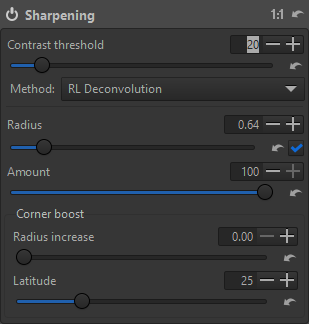

- Contrast threshold - This slider allows you to control a mask that decides which areas are affected by sharpening and which are left untouched.
Activate the "preview the sharpening contrast mask" button (in the toolbar above the main preview) to see this mask.
Moving the slider to the right means that details will have to have higher contrast before they are sharpened.
Higher Contrast Threshold values also reduce the amount of sharpening applied to noise, which tends to have lower detail contrast.

- Radius - The radius defines the standard deviation (sigma) of the Gaussian blur in the image.
There is an automatic setting where ART will try to automatically guess the radius that will counteract the inherent blurring from the camera.
You can also choose to adjust the radius yourself, but don't forget that you are only trying to undo the in-camera blurring.
Find the right value through trial and error.
 
    - If the value is too low, there will not be enough sharpening

    - If it is too high, it will lead to strong haloing on the edges.

- Amount - Controls the blend factor between the unsharpened image and the sharpened one.

- Corner boost - Often images are softer or more blurred in the corners than in the center.

    - Radius increase - This slider allows you to compensate for this by increasing or decreasing the radius in these areas.
Moving it to the right increases the sharpening in the outer areas and sliding it to the left will reduce the sharpening.

    - Latitude - This slider affects the extent of "corner boost", and it determines how much of the image is considered to be corners.
But if corner boost is zero, then it doesn't have any effect.

The number of iterations is automatically calculated and can't be changed by the user.
To get the best out of this tool, the camera white level needs to be correct, especially if the image has sharp transitions between clipped and non-clipped highlights.

##### Custom RL Deconvolution

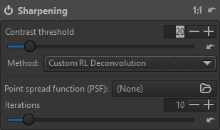

**TODO**

### Noise Reduction

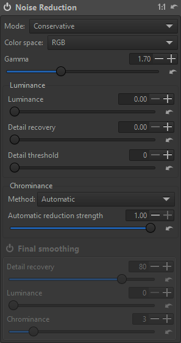

**TODO**

### Impulse Noise Reduction

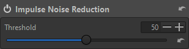

This tool suppresses salt-and-pepper noise - Sudden white and black pixels, which remind one of salt and pepper sprinkled over a photo.
This is done after demosaicing.
Whereas salt-and-pepper noise is typically just white or black, hot pixels can be of a pure, saturated color, while dead pixels are black.
Hot and dead pixels occur for a very different reason than salt-and-pepper noise and should be handled using the Hot / Dead Pixel Filter (in the Preprocessing tool on the Raw tab), which works before demosaicing.

Threshold - This slider adjusts the threshold which must be exceeded for the suppression to be applied.

### Defringe

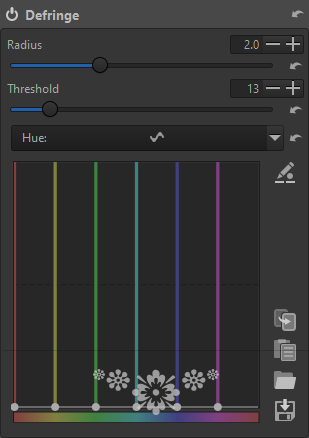

Colored fringes can often appear along high-contrast edges, typically due to incorrect focus, lack of true achromaticism and other optical flaws.
The Defringe tool can be used to reduce, if not eliminate, most of these aberrations.

- Radius - Strong chromatic edge fringes are suppressed by averaging over a neighborhood of the specified radius.
- Threshold - Sets a threshold for the application of defringing.

You can use the Hue equalizer to specify which colors Defringe should target.
The horizontal axis represents the range of colors, and the vertical axis the strength of fringe removal.

##  Color tab

### White Balance

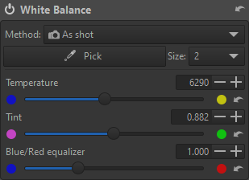

Digital images generally consist of a mixture of the three primary colors: red, green and blue.
For various reasons the red, green and blue values which serve as the starting point in any raw photo development program need to be corrected before they resemble the photographed scene.
One of these corrections is performed by adjusting the white balance.
This helps ensure that neutral-colored (white) objects in the photographed scene still appear neutral on the photograph.
Adjusting the white balance affects all colors, though it is easiest to discern whether the white balance is correct if an object you know to be of a neutral (white, gray) color looks non-neutral.

Note - The White Balance Tool should be used to properly neutralize RGB relationships, not for artistic alterations.
Set white balance correctly, then if desired use other tools for deliberate color alterations, e.g., Channel Mixer, Color Equalizer, RGB Curves, etc.

#### Methods

- As shot - As set by the camera at the time of exposure.
- Auto - Estimates channel coefficients automatically by analysing the image data.
- Custom temperature - Set your own temperature and tint by moving the two sliders and / or using the pipette tool via the Pick button. 
The size of the sampled area can be selected from the Size dropdown list.
Picking a reference point will automatically change the method to Custom temperature.
- Custom multipliers - You can directly set the multiplier values for each channel by using the three RGB sliders.

Blue/Red equalizer - This allows to deviate from the normal behavior of "white balance", via increase or decrease of the ratio between red and blue.
This can be useful when shooting conditions are far from the standard illuminant, e.g. underwater, or are far from conditions where calibrations were performed, for which the color matrices in the input profile are unsuitable.
Note this slider is not available when Method is set to Custom multipliers.

### Saturation / Vibrance

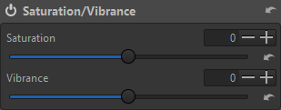

With this tool it's possible to adjust the level of hue intensity.

- Saturation - This increases apparent hue intensity across all colors.
- Vibrance - This increases the saturation of less-saturated colors more than already-saturated colors.

### Channel Mixer

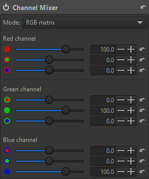

The Channel Mixer is divided into three sections: Red, Green and Blue.
Those sections represent the three available color output channels in a RGB image.
All values shown here are percentages.
For each channel, the Channel Mixer makes a new channel from the specified percentages of the existing R, G, and B channels.

There are two modes of operation -

- RGB matrix - Each channel is presented with sliders to set the relative levels of red, green and blue components to that channel's color.
Values are ±500 percent.
This is the conventional presentation of a channel mixer.
- Primaries correction - Each RGB primary has correction sliders to adjust hue relatively toward either adjacent secondary color and to adjust saturation intensity.
Values are ±100.

### Color Equalizer

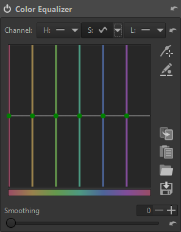

Use the Color Equalizer to target and change specific hue, saturation and / or luminance values wherever they occur in the image.
Using the flat curve of the Color Equalizer, targeted hues can be shifted, saturation levels intensified or reduced and luminosity ranges raised or lowered.
Multiple targets can be defined and adjusted.
The Hue, Saturation and Luminance channels' adjustments are independent of each other and are accessed through the H, S and L buttons at the top.

- Smoothing - This slider blurs the edge of affected areas

### RGB Curves

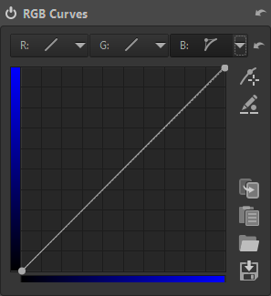

RGB Curves provide the ability to apply a tone curve adjustment individually to each of the RGB channels.
Pressing the top button on the side allows you to pick a color value by Ctrl+clicking on the preview.
Then if desired you can adjust the curve up or down by continuing to hold the mouse button down (you can release the Ctrl key) and dragging up or down on the preview.
The button immediately below allows direct edit of in / out values.
You can copy, paste, save and load curves using the four buttons on the lower side of the curve.

### L\*a\*b* Adjustments

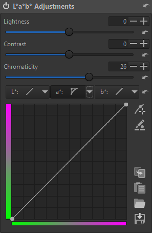

Operations in the L\*a\*b* (Luminosity, a: green-magenta and b: blue-yellow) color model can often be accomplished with fewer side-effects – such as unexpected luminance and color shifts – than if using the RGB color model.
That's because luminosity and color are handled separately in L\*a\*b* color.

- Lightness - This slider applies a tone curve to the L-channel of the Lab color space.
As with the brightness slider in the Exposure section above, the black point and the white point do not move.
- Contrast - This slider increases or decreases the contrast of the photo, again applied to the L-channel.
Positive values lift tonalities above the average and lower tonalities below the average (increased dynamic range).
Negative values do the reverse: lower tonalities above the average and lift tonalities below the average (decreased dynamic range).
- Chromaticity - This slider increases or decreases the chromaticity of the image by applying a contrast curve to the a- and b-channels of Lab space.
Setting this slider to -100 removes all color, making the image black and white.
However, the recommended method to convert an image to black-and-white is to use the Black-and-White tool on the Special effects tab.
- L\*a\*b* curves - Use these to make specific targeted changes in luminosity, a- and / or b-channel values wherever they occur in the image.

### Color Management

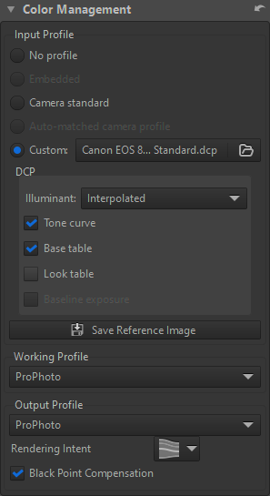

Color management is the process of adjusting / presenting colors in such a way that they're consistent and predictable, from raw file input to final output, across hardware output devices.
The topic is vast and far more than can be covered here.
Please refer to RawPedia as a starting point for more information.

The various options of the Color Management tool are explained below.

#### Input Profile

- No profile - No color conversion will take place and a unit transform of the image data is applied.
Do not use this for regular editing.
- Embedded - Use the color profile embedded in the input image, if available.
- Camera standard - Use a simple predefined [compromise matrix](http://www.strollswithmydog.com/color-from-capture-to-eye/) dependent on the camera model.
- Auto-matched camera profile - ART includes multiple high-quality, custom-made, general-purpose DCP profiles that can be automatically matched when an image from a supported camera is opened.
Matching only works on the exact name of the camera (case-sensitive) as is present in the image metadata.
- Custom - Specify a custom DCP or ICC camera input profile when an automatic match is not available, or if you want to override the standard or matched profile.

#### DCP (Adobe DNG Camera Profile)

- Illuminant
    - 2850K - Tungsten
    - 6500K - Daylight
    - Interpolated - Calculated based on the selected white balance if it's in-between both illuminants, otherwise the closest is picked.
This is the default mode and there's usually no need to change it.
- Tone curve - Some DCPs contain a tone curve which may be used to add contrast and brightness to provide a film-like look.
This is mainly used for profiles simulating camera maker settings.
The tone curve checkbox will be disabled for profiles which do not contain a tone curve.
If you want to see exactly how the profile designer intended the colors to look you should enable the tone curve.
- Base table - This enables the DCP "HueSatMap" lookup table which is used to add non-linear corrections on top of the basic matrix.
This is an advanced user setting and unless you want only the pure matrix result should leave it on.
It's grayed out if the loaded profile lacks a HueSatMap table.
- Look table - This enables the DCP "LookTable" lookup table which is intended to add a subjective look on top generally together with an embedded tone curve.
Disabling individual DCP elements are considered advanced user settings, normally you would leave this on.
- Baseline exposure - The DCP may indicate an exposure offset that corresponds to an offset of the exposure slider.
The purpose of this is typically to make the brightness of the image match the brightness of the camera's own JPEGs, which can be useful if you're shooting with auto-exposure.
Currently this offset is applied "under the surface" so you don't see it on the exposure slider.

Clicking the "Save Reference Image" button saves a linear TIFF image before the input profile is applied.
This file can then be used for profiling, i.e.
creating a camera input profile.
You can use the open-source ArgyllCMS program to create ICC profiles, and DCamProf to create ICC or DCP profiles.

#### Color Profiles

Working profiles are bundled with ART and read from the installation directory structure.
Output profiles are read from the directory specified in Preferences | Color Management | Directory containing output color profiles.
Any additional ICC profiles should be kept in this directory.

- Working Profile - The default working profile is [Linear Rec.2020](https://www.itu.int/rec/R-REC-BT.2020/en).
- Output Profile - Specify the output color profile; the saved image will be transformed into this color space and the profile will be embedded in the metadata.
There are two types: Ones compatible with ICC v2, and ones with v4.
The v4 versions should be compatible with most modern software.
The legacy v2 versions are supplied as a fallback.

#### Rendering Intent

- Perceptual - The source color space is scaled (usually down) to fit the target color space.
No colors are clipped but all colors are shifted when the gamut is compressed – although inter-color relationships are preserved.
- Relative Colorimetric - The colors common to both source and target color space are preserved unchanged, but those out-of-gamut in the target color space are lost.
However, if the (potentially) clipped colors don't exist in the source image, it's not a factor.
- Saturation - This is very similar to perceptual except that saturation is subtly boosted to compensate for the change.
- Absolute Colorimetric - Absolute colorimetric intent is used for calibration purposes and should not be used in photographic editing.

Black Point Compensation - This should be enabled to avoid clipping.
It adjusts the source tonal range to the destination tonal range by aligning the black point.

##  Local editing tab

### Masking

Local editing tools include Color / Tone Correction, Smoothing, Local Contrast and Texture Boost.
Each tool uses masks to control where its localized edits take effect and these masks operate in the same manner for all local editing tools.
Therefore, mask operations will be described only once, rather than per-tool.

For further reading on ART's masking and local editing tools, see these resources:

- [Area masks: Creating polygonal shapes](Shapes.html)
- [Local Editing with Layers and Masks](Localediting.html)
- [Editing an existing mask (from the ART forum)](https://discuss.pixls.us/t/how-to-subtract-from-a-color-simularity-mask/32673/2)

#### Mask precautions

- When using area and brush masks - The local adjustments tools are all located after the geometrical image corrections.
So if you happen to apply a geometrical correction after generation of area mask or brush mask, those masks will be messed up.
So apply "coarse rotation and flip", transform / "Rotate, Perspective Correction, Profiled Lens Correction, Distortion correction" before generating area and brush masks.
- When using parametric and Color Similarity masks - As local adjustments are located near the end of pipeline, all adjustments should be done before defining the masks except the following, which can be done after mask definition:
    - For local contrast - Film simulation, Black and white, film grain
    - For color correction - Smoothing, texture boost: Log encoding, saturation / vibrance, tone curve, RGB curve, LAB adjustments soft light, Film simulation, Black and white, Film Grain

#### Mask creation

Masks are created on layers which can be individually enabled or disabled, independently of the parent tool itself.
Unchecking the box on a layer will hide the effects of the mask(s) on that layer.
Each mask can be given a name, which will be displayed on that mask's layer.

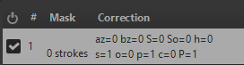

Keep in mind that mask processing is done in order from top to bottom of the layer stack, which can potentially affect the final adjustment outcome.

Mask visibility can be toggled by selecting the Show mask check box or by using the keyboard shortcut `Ctrl+m`. For the keyboard shortcut to work, the tool panel must have focus.

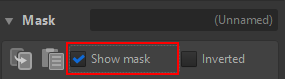

#### Mask types

##### Parametric mask

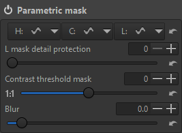

A Parametric mask will determine its coverage based on the restrictions of the hue, chromaticity and / or luminosity parameters specified in each equalizer. For example, with a highly targeted Hue curve and a Chroma curve to refine the selection it's possible to accurately select this red-brown door from its surrounding context:

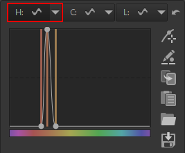&nbsp;&nbsp;&nbsp;&nbsp;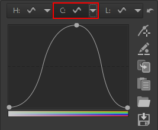

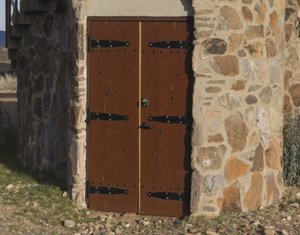&nbsp;&nbsp;&nbsp;&nbsp;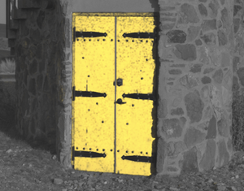

##### Color similarity mask

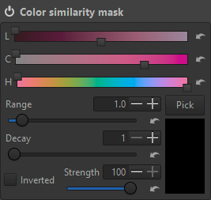

A Color similarity mask will, as the name implies, provide mask coverage according to a comparison color.
There are several means to refine and adjust how closely the mask coverage "follows" the comparison color.

This annotated screen shot is in regard to subsequent notes:

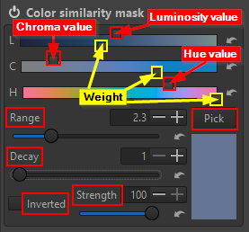

- Each top slider – highlighted in red – indicates a specific Luminosity, Chroma and Hue value per the slider's position along its spectrum indicator.
- Each bottom Luminosity, Chroma or Hue slider – highlighted in yellow – gives a 'weight' (or level of importance) that should be given to its top slider's value when calculating mask coverage.
I.e., how far pixels from the indicated values should be masked or not.
Left will be more inclusive (potentially more coverage) and right will be more restrictive (potentially less coverage).
- *In other words, the LCH widgets are functionally mask-limiting constraints. Each top slider specifies its constraining factor value and its bottom slider makes that value more (rightward) or less (leftward) a part of mask calculations*.
The relative brightness of each LCH spectrum indicator is a visual reference to that factor's weight.
For example, here Chroma's weight has been completely reduced (its bottom slider is fully leftward) so that it's not a factor in calculating mask coverage at all.
You can see the formerly blue-colored bar is now colorless.
    - 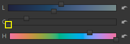
- Range - Increasing this value will raise the limit of consideration (potentially more coverage), while decreasing it will lower the limit (potentially less coverage).
- Decay - Increasing this value will reduce the transition area (a steeper slope) between masked and non-masked areas, making it more abrupt.
Decreasing it will provide a larger transition area (a flatter slope), making it smoother.
- Strength - Basically opacity. 100 is fully opaque (full masking) and 0 is fully transparent (no masking).
- Inverted - Simply reverses (inverts) mask coverage.
This can also be done with the Inverted checkbox on the parent Mask widget.

A useful approach is to click the Pick button, choose a starting point on the preview with the pipette and then using the sliders modify mask coverage as needed.

##### Area mask

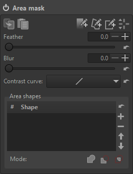

An area mask can be drawn as a gradient, polygon or rectangular shape then modified for feathering and blur.

  - Feathering: blends the edges of the mask in response to the tonal characteristics of the underlying image
  - Blur: applies a Gaussian blur to the mask
  - Contrast curve: modifies the mask with one of four curve types if desired

Please refer to the [area mask resource](Shapes.html) for more information and a brief tutorial on creating area masks.

##### Brush mask

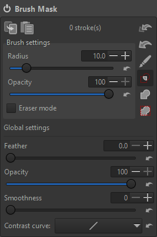

A Brush mask can be drawn on the preview using the mouse or pen / tablet.
It can interact with existing masks in the following ways.
Note the three Venn-type icons below the brush button – In order from top to bottom they are:

- Intersect with other masks
- Add the mask on top of other masks
- Add the mask on top of other masks, but only within the active area mask

The brush can also erase from an existing mask by enabling the Eraser mode checkbox before painting with the brush.
Also, to erase the interaction type should be set to "Add the mask on top of other masks" (bottom icon) before painting.

The adjustments made in the Brush settings area (Radius, Opacity and Eraser mode) affect brush strokes yet to be made, i.e., changes will apply to subsequent strokes. Adjustments made in the Global settings area (Feather, Opacity, Smoothness and Contrast curve) affect existing brush-masked areas.

Holding down the `Ctrl` key while brushing will cause the strokes to be cumulative (i.e., built up). Softer and more subtle effects can be achieved by starting with a less opaque and/or more feathered brush, then applying multiple strokes until the desired effect is achieved.

#### Mask post-processing

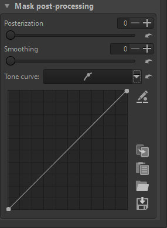

You can refine the tonal characteristics of the mask with this tool.

- Posterization - Increasing this value will progressively reduce the smoothness of gradient areas in the mask, introducing banding. The maximum value of six will reduce the tonal range to two values, the minimum and the maximum, with a hard transition between them.
- Smoothing - Increasing this value will progressively blend the hard edges between the areas introduced by the Posterization slider. It has no effect if Posterization is set to zero.
- Tone curve - You can use this to apply a tone curve directly to the mask.

### Color / Tone Correction

<!-- 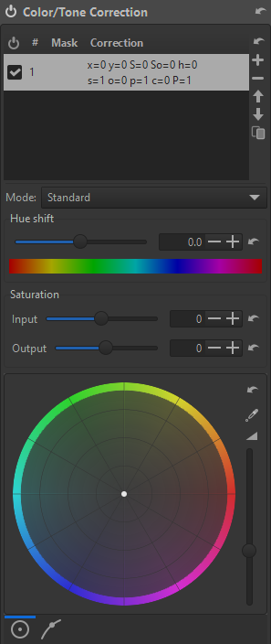 -->

<!-- 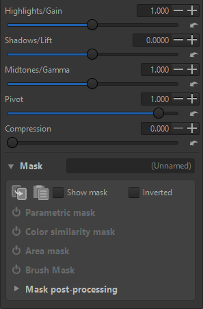 -->

As the name implies, this tool can adjust localized (mask-constrained) hue, saturation and luminosity specifically for highlights, shadows and / or midtones.

The available sliders and controls depend on the selected operating mode. The available modes are:

- **Standard** and **Perceptual**: the RGB components of each pixel are divided
  into a "luminance" (i.e. "brightness") and "chrominance" (i.e. "colour") and
  manipulated independently.
  Both modes offer an identical interface, and they only differ in the actual formulas used to derive the luminance/chrominance decomposition: 
  *standard* applies a simple linear transformation of the RGB coordinates, 
  whereas *perceptual* applies a more  complex transformation that uses a perceptually-uniform space. 
  (For further information, see e.g. [Wikipedia](https://en.wikipedia.org/wiki/Color_appearance_model)).
  The following controls are available:
  
  - *Hue shift:*  
    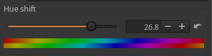  
    Shifts the colors of the input pixels by rotating the hues of the given amount (in degrees), preserving saturation and luminance.
  - *Input and output saturation:*  
    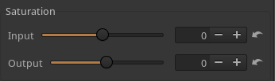  
    Change the saturation of the input pixels of the given amount. Input saturation acts before the other controls (hue shift, color wheel, and tone sliders), whereas output saturation is applied after the other controls.
  - *Color wheel:*  
    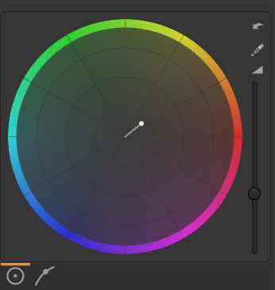  
    Adds the given colour (expressed in terms of hue and saturation) to the input pixels.
  - *Tone sliders (highlights, shadows, midtones, pivot, compression):*  
    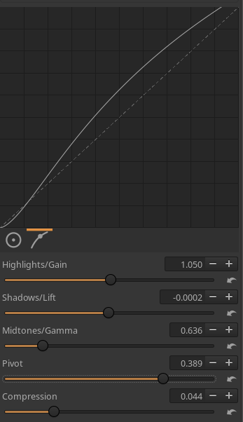  
    These sliders allow to define a tone curve that is then applied to the luminance component of the input pixels.

- **Separate RGB channels**:  
  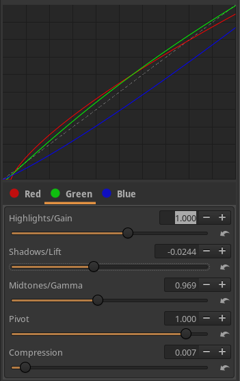  
  in this mode, each channel (Red, Green, Blue) of
  the input pixels is manipulated separately, using sliders to define
  parametric tone curves for R, G, and B.  
  If the *luminance mode* option is selected, the tone curve is used to alter
  the luminance of the pixels by changing the contribution of the RGB channels to it,
  while preserving the keeping the color unchanged.

- **HSL factors**:  
  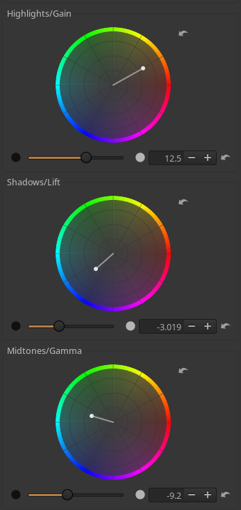  
  This mode provides an interface to manipulate tone and color 
  using three separate color wheels for shadows, midtones and highlights, 
  similarly to what can be found in popular video editors 
  and commercial image processors.

- **LUT**:  
  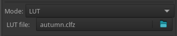  
  This mode applies a [LUT file](Luts) to the input pixels.

Finally, in addition to the predefined modes, additional tools can be added to the above list by defining suitable CTL scripts, [as explained in the dedicated page](Luts#markdown-header-ctl-scripts).

### Smoothing

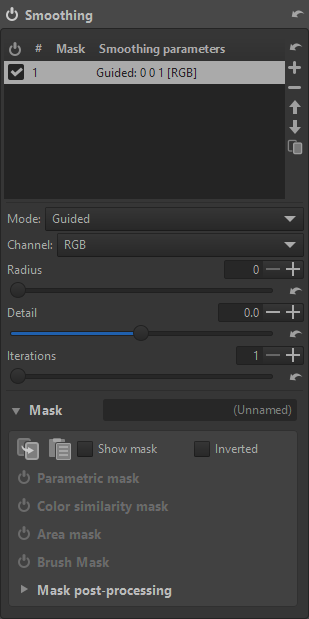

This tool applies spatial transformations to the image, 
in which each pixel value is computed as a function of its surroundings. 
The tool can be used to perform denoising or for special/artistic effects, 
such as emulating film grain, halation, or glowing highlights.

The tool provides the following operating modes:

- **Guided**:
  applies a [guided filter](https://en.wikipedia.org/wiki/Guided_filter), 
  an edge-preserving blur operation. This is controlled by the following sliders:

    - *Radius*: amount of blur;
    - *Detail*: degree of detail/edge preservation; 
    - *Iterations*: number of iterations.

- **Gaussian**:
  applies a standard [Gaussian blurring](https://en.wikipedia.org/wiki/Gaussian_blur). 
  Available sliders:

    - *Radius*: amount of blur;
    - *Iterations*: number of iterations.

- **Glow**:
  applies a glowing effect to the image, targeting mostly highlights. 
  Available sliders:

    - *Radius*: controls the amount of the glow;
    - *Iterations*: controls the diffusion of the glowing effect;
    - *Falloff*: how abruptly the glowing effect decays.

- **Non-local means**:
  performs image denoising with the [non-local means](https://en.wikipedia.org/wiki/Non-local_means) algorithm. 
  Available sliders:

    - *Strength*: amount of denoising;
    - *Detail*: level of detail preservation;
    - *Iterations*: number of iterations.

- **Motion blur**:
  Emulates the effect of camera [motion blur](https://en.wikipedia.org/wiki/Motion_blur). 
  Available sliders:

    - *Radius*: amount of blur;
    - *Angle*: direction of motion;
    - *Curvature*: degree of curvature of the motion;
    - *Offset*: displacement of the motion effect wrt. the pixel position.

- **Lens blur**:
  Emulates an [out-of-focus blur](https://en.wikipedia.org/wiki/Defocus_aberration) effect of an idealized lens.
  Available sliders:

    - *Radius*: amount of blur;
    - *Blades*: number of aperture blades of the emulated lens;
    - *Angle*: rotation of the aperture blades.

- **Add noise**:
  Emulates the effect of adding [shot noise](https://en.wikipedia.org/wiki/Shot_noise) to the image. 
  Available sliders:

    - *Strength*: amount of noise to add;
    - *Coarseness*: coarseness of the added noise.

- **Halation**:
  Emulates the [halation effect](https://en.wikipedia.org/wiki/Film_emulation) of film photography.
  Available sliders:
  
    - *Strength*: intensity of the effect;
    - *Tint*: hue of the added glow.

Most modes can be applied to the luminance channel 
(targeting pixel brightness -- so details/edges -- and leaving colour untouched),
chrominance channel (targeting colour information but leaving brightness untouched), 
or to the RGB components.

### Local contrast

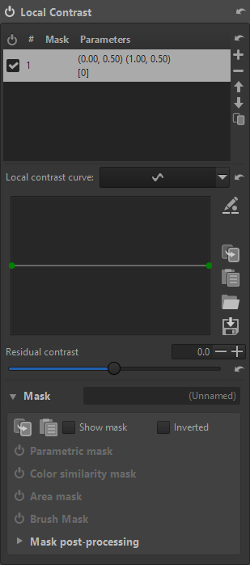

Local contrast applies a wavelet decomposition in L\*a\*b\* space and manipulates the contrast of the different levels by using the curve, with leftmost points correspond to finer detail scales. By pulling the curve below the mid point, negative local contrast can be applied.

The local contrast (LC) curve works this way on image detail:

### Texture boost

Texture boost is somewhat similar to doing sharpening or local contrast with unsharp masks, as described e.g. in [Local Contrast Enhancement 12](https://www.cambridgeincolour.com/tutorials/local-contrast-enhancement.htm).
Main differences:

- This is done with a guided filter, which is edge-aware, rather than with Gaussian blur
- It uses two levels of details rather than a single one
- This is applied in linear RGB space

Conceptually, texture boost is also similar to local contrast, the main differences being the methods for doing the extraction of the different detail levels and their amplification/dampening, the working space, and the position in the pipeline.

##  Special effects tab

### Black-and-White

The Black-and-White tool's sliders are provided to vary the relative mix of RGB channels that make up the B&W conversion.
Value range is from -100 to +200 percent.
To avoid clipped highlights the total of all three channels should not exceed 100% but special effects can be created with nominally out-of-bound settings.
The Presets dropdown list pre-adjusts the sliders to a number of common settings:

|     |     |     |     |
| --- | --- | --- | --- |
| **Preset** | **Red (%)** | **Green (%)** | **Blue (%)** |
| Normal Contrast | 40.6 | 31.1 | 28.3 |
| High Contrast | 29.9 | 25.4 | 44.8 |
| Luminance | 30.0 | 59.0 | 11.0 |
| Landscape | 66.0 | 24.0 | 10.0 |
| Portrait | 49.1 | 40.0 | 10.9 |
| Low Sensitivity | 27.0 | 27.0 | 46.0 |
| High Sensitivity | 30.0 | 28.0 | 42.0 |
| Panchromatic | 33.3 | 33.3 | 33.3 |
| Hyper Panchromatic | 41.0 | 25.0 | 34.0 |
| Orthochromatic | 0.0 | 42.0 | 58.0 |
| Absolute RGB | 0.0 | 42.0 | 58.0 |
| Relative RGB | 0.0 | 42.0 | 58.0 |
| Infrared | -28.0 | 139.9 | -11.9 |

- Color Filter - This dropdown list will add the effect of a color filter.
It is not available after selecting the Infrared preset, but if the channel sliders are adjusted it will reappear.
- Gamma Correction - These sliders are available for each channel to adjust mid-grey points if needed.
- Tint - A pair of spectrum sliders can be used to apply a tine to the B&W conversion.
The top slider selects the tint's hue while the bottom slider adjusts it from 0% to 100% intensity.

### Film Simulation

The Film Simulation tool allows to apply a [3D Look-Up Table (LUT)](https://en.wikipedia.org/wiki/3D_lookup_table) to the picture.
The LUT can be selected from the dropdown list, after having configured the LUT directory in "Preferences -> Image Processing -> Directories".
After a restart ART will populate the dropdown list with the LUTs found.

- Strength - This slider controls the opacity with which the LUT is applied to the original image.
- More information on LUTs in ART is available [in the dedicated page](Luts).

### Soft Light

The Soft Light tool emulates the effect of blending an image with a copy of itself using the "soft-light" layer blend mode in GIMP.
The resulting image has a little extra contrast and saturation, which is usually visually pleasing.

Strength - This slider controls the opacity by which the soft light effect replaces the original image.

### Vignette Filter

The Vignette Filter is intended for adding artistic vignetting to your image.

- Strength - The amount of darkening the filter will apply, in stops.
The full strength is reached in the corners of the image.
If you apply a negative amount the corners will be brightened instead of darkened.
- Feather - The feather slider controls the width of the feathering.
If at 0 only the corners will be feathered and the rest of the image will not be affected by the filter.
At 50 the feather reaches halfway to center and the rest is unaffected, and at 100 the feather reaches all the way into the center.
- Roundness - The roundness slider controls the geometry of the filter.
At 0 the shape is rectangular (with rounded corners), at 50 it is a fitted ellipse, and at 100 it's circular.
Note that if your image is square the fitted ellipse will of course be a circle, so the shape will then not change in the range 50 to 100.
- Center X, Center Y - This vignetting filter is placed relative to the crop, if cropping is used, but its position can be adjusted by these sliders.

Note the center position of the vignette can also be adjusted directly on the preview by displaying (via the button at top left) then dragging the reticle.

For correcting vignetting caused by the lens light fall-off (as opposed to this filter which is not for correction but for artistic effect), use the Vignetting Correction filter in the Transform tab, in the Lens/Geometry tool.
Even better, use the Flat Field tool.

### Graduated Filter

The Graduated Filter tool simulates a real neutral density graduated filter.
These can be used used in for example landscape photography to limit the brightness of the sky.
It applies an exposure adjustment in the form of a gradient.

- Strength - The strength of the filter, in stops.
- Angle - The angle slider allows to rotate the direction in which gradient is applied.
- Feather - The feather slider controls the width of the filter's feather (gradient).
At 0 there is no feathering, just a sharp edge which can be useful as a temporary setting when choosing position and angle of the filter.
The slider value (0 - 100) specifies the width of the feather as percent of the image diagonal.
- Center X, Center Y - These adjustments moves the center of the filter's feather (i.e.
the rotation anchor point) horizontally and vertically respectively.

Note, the position, angle and feather of the gradient can also be adjusted directly on the preview by displaying the reticle (via the button at top left):

- Drag the center circle to position the gradient
- Drag the vertical or horizontal center lines to rotate the gradient
- Drag the upper or lower horizontal limit line to adjust the feather

### Haze Removal

The Haze Removal tool reduces distant haze as the curve is raised.
The tool isn't at zero by default when the Strength equalizer is enabled.
It's set to remove some haze evenly across all luminance ranges (note the default elevated curve position).
The default is a "straight curve" approximately 2/3 up the Y axis.
By pulling the curve below the mid point, simulated haze can be added to the image.

The Mode will affect the level of added saturation.
For example, note the difference in the far mountains' saturation in Luminance mode versus RGB mode (curve exaggerated for illustration).

#### Luminance mode:

#### RGB mode:

### Film Grain

The Film Grain tool adds granular noise to the image that approximates the appearance of film grain, as specified by the Coarseness (ISO) and Strength sliders.

### Film Negative

The Film Negative tool makes developing raw photos of negatives simple.
In the negative image, each channel value is proportional to a power of the reciprocal of the corresponding channel in the original exposure.
Each channel value is raised to a different exponent, depending on the film type, age and possibly other factors, such as shooting conditions.
These exponents can be specified in order to better adapt the correction process to the characteristics of each film.
To simplify manual tweaking, these three R,G,B exponents are specified as one "reference" exponent (which gets applied to the Green channel), and two ratios of the Red and Blue exponents to the reference.

##  Transform tab

### Crop

The Crop tool in ART does not discard the cropped-off area, it just hides it by drawing a crop frame and zooming in to fit the frame to the available screen space.
You can still see the cropped-off area in the preview by activating the Crop tool and pressing the Select button.
The cropped-off area will of course not appear in the saved image.
To return to the cropped view without making any changes, press the Select button again.

Activate crop-placing mode by clicking the "Select Crop" button in the tool panel, the button in the Editor's top toolbar, or the appropriate keyboard shortcut, then create the crop by clicking and dragging over the preview with your mouse.
Use the mouse to move (pan) the crop over the image.
Resize a crop by placing the mouse on one of the sides or corners.
To clear the crop, activate crop-placing mode again (via the keyboard shortcut or either of the buttons mentioned above), and click anywhere in the preview without dragging.

Fields are available to manually specify originating (top-left) corner coordinates as well as width and height (all units are pixels).
If the Lock ratio checkbox is enabled, the aspect ratio will be constrained to the limitations of the selections made in the two dropdown lists to the right of the checkbox.
There is also a dropdown list of several available visual guides that may be displayed.

### Resize

The Resize tool will scale the output image by the values entered here.

#### Applies to

- Cropped Area - Crop the output image to the active bounding box, scaled to the specified size.
- Full Image - Scale the entire image to the specified size.

#### Specify

- Scale - Uniformly scale the image by a factor.
Ranges from 0.01 (100 times smaller) to 16 (16 times bigger).
The minimum output size is 32x32 pixels.
- Width, Height - Set the desired absolute width or height in pixels, regardless of the image orientation.
The other dimension is updated according to the aspect ratio.
- Bounding Box - Resize to fit the image within a box of certain width and height in pixels, regardless of the image orientation.
The image aspect ratio is kept and the image will be scale to fit undistorted within the box dimensions.

The scaling unit can be chosen (pixels, centimeters or inches) as well as the pixels per inch (PPI).
The displayed final dimensions will be updated to reflect the specified values.
Although entering a width or height greater than the native image dimensions will generate no error, the image will not be upscaled unless the Allow Upscaling box is checked.

### Output Sharpening

Applies sharpening at the end of the processing pipeline, after resizing. Refer to the Sharpening tool on the Detail tab for operational information, as this tool functions in the same manner.

### Geometry

Auto-fill - This option will upscale or downscale the photo to the extent that the whole image fits within the image boundaries with no black borders visible.

Auto-Crop - This is available only when "Auto-fill" is disabled.
When activated, it will not cause image interpolation but instead will crop away the empty space left by the distortion correction or image rotation.

### Rotate

The Rotate tool rotates the image between -45° and +45°.
Use the "Select Straight Line" button to set either a vertical or a horizontal image alignment.
Use the mouse to draw this line - click and hold mouse to start, move to draw a new vertical or horizontal axis and release to engage image rotation.

### Perspective Correction

The Perspective Correction tool offers manual correction adjustments and a powerful auto correction mode taken from [darktable](https://www.darktable.org).
Try the automated mode first, as when it works it's the easiest and most accurate.
Click on the "automatic" buttons for correcting horizontal, vertical or both perspectives.
Revert to manual adjustments if these automatic adjustments fail.

- Horizontal, Vertical - Use these to shift the image until the resulting image's center lines up with the optical center.
This is usually not necessary unless you've used the shift function of a tilt-shift lens or are editing an image that has already been post-processed with an off-center crop.
Units are in percent of the image width/height.
- Shear - Use this slider to correct for diagonal distortion
- Angle - This slider will rotate the image while respecting the Auto-fill / Auto-Crop settings.
- Aspect adjustment - Make non-skewed aspect ratio changes with this slider
- Focal length - Set this to the lens' physical focal length in millimeters.
Automatically set from the image metadata if present.
- Crop factor - Set this to the image's crop factor (the camera crop factor and any additional cropping such as digital zoom).
It is automatically set from the image metadata if present.
This tool really only needs to know the field of view, so the "Focal length" and "Crop factor" sliders are for convenience.
You can use any equivalent combination of focal length and crop factor.
For example, if you only know the 35mm equivalent focal length, use that for "Focal length" and set "Crop factor" to 1.

### Auto correction

Automatic correction finds likely parallel lines in the image and corrects the perspective automatically.
The camera data (focal length, crop factor, and shifts) must be properly set for this to work correctly.

- Horizontal: automatically sets Rotation and Horizontal Correction.
Vertical correction must be properly set because the camera's pitch determines how the camera is rotated to represent yaw.
- Vertical: automatically sets Rotation and Vertical correction.
- Both: automatically sets Rotation, Vertical, and Horizontal correction.

(What should actually be) horizontal and / or vertical control lines may be drawn to assist auto correction.
Indeed, they may be necessary with some images if there are no suitable lines in the image itself.
Click the pencil button and Ctrl+drag to define the start and end points of each line on the preview.
Drag on a line end to move it.
Delete a line by right-clicking on it or delete all lines by clicking the Delete all button (trash can).
Click the checkmark button to apply the correction.

### Profiled Lens Correction

By reading lens information from metadata, the Profile Lens Correction tool can automatically adjust for imperfections in geometric distortion, vignetting and chromatic aberration.

#### Lens profile

Select one of these options to determine the method for retrieving lens correction data:

- Embedded in metadata - If the lens correction parameters are available from the image metadata this option will available for selection.
- Automatic from database - If selected, ART will attempt to find a match for the lens name (as read from metadata) in the bundled lensfun database and apply the available corrections.
- Manual from database - If your lens is not automatically matched, but is in the lensfun database you can use this option to find and choose it.
- LCP file - An Adobe-style Lens Correction Profile (LCP) file can be loaded from this option.
You must have the correct LCP file to apply the proper corrections.

#### Distortions to correct

Enable the desired corrections by selecting one or more of the Geometric, Vignetting and / or Chromatic aberration checkboxes.
If one or more of these corrections is not available its checkbox will be disabled ("greyed-out").

### Distortion Correction

The Distortion Correction tool corrects lens distortion.
A negative number corrects barrel distortion, a positive value will correct pincushion distortion.
You can place a grid over the image by activating Crop (without cropping) and using "Guide Type > Grid".
This may serve as a guide to correct lens distortion.

The "Automatic" button only works if your camera corrected the distortion of the JPEG image embedded in the raw file.
If the JPEG was corrected, it tries to fix distortion in the raw image by making it match the JPEG image.
There are two limitations:

- If the JPEG image was not distortion-corrected by your camera, this button will have no effect.
- If the JPEG image is insufficiently corrected or over-corrected, so will the results be, but as the computed correction will be shown on the Amount slider, you can further refine it manually.

### Chromatic Aberration Correction

Note - This Chromatic Aberration Correction tool (on the Transform tab) works on the image *after* demosaicing, while the Chromatic Aberration Correction tool in the sensor group on the Raw tab works on the image *before* demosaicing.

Chromatic aberration can be corrected by using the "Red" and "Blue" sliders.
Normally you won't see any chromatic aberration in the fit-to-screen preview, therefore it is highly recommended to open a detail window or to zoom the main preview in to 100% or more when you attempt this kind of correction.
While moderate chromatic aberration can be corrected, there's a limit to what's possible – Remember: "garbage in, garbage out".

### Vignetting Correction

Note - The Vignetting Correction tool is meant to correct vignetting caused by the lens.
For artistic vignetting use the Vignette Filter tool on the Special effects tab.

- Amount - Setting the "Amount" slider to a positive value brightens the four edges of the images to correct the classical vignetting.
Setting it to a negative value darkens them.
- Radius - Influences how much of the image beginning from the edges will be brightened or darkened.
Lower values: area of darkening is bigger; higher values: area of darkening is smaller.
- Strength - Amplifies the settings of the "Amount" and "Radius" sliders.
Set "Amount" to -100, "Radius" to 50 and move "Strength" from 1 to 100 to see how this works.
- Center X, Center Y - These sliders determine the center of the vignetting correction.

##  Raw tab

### Demosaicing

Note - The effects of this tool are only visible at a preview scale of 1:1 or more.
Use a detail window (click on the icon under the main preview panel) to inspect a part of the image or zoom the main preview to 100% (also called 1:1).

ART offers several demosaicing algorithms, each with its own characteristics.
The differences between them can be subtle - one might need to zoom in to 100% or more to discern them.
However, as the demosaiced image constitutes the foundation upon which all other tools work, the choice of demosaicing algorithm can have a visually significant effect on the end result, particularly when viewed up close.
The most visible effects of the choice of demosaicing algorithm include the rendering quality of fine detail and the visibility of artifacts in the form of maze-like patterns.

#### Method

- For images from Bayer matrix sensors
    - AMaZE - AMaZE (Aliasing Minimization and Zipper Elimination) is the default demosaicing method, as it yields the best results in most cases.
    - RCD - RCD (Ratio Corrected Demosaicing) does an excellent job for round edges, for example stars in astrophotography, while preserving almost the same level of detail as AMaZE.
    - LMMSE and IGV - These are recommended when working with very noisy, high ISO images, in conjunction with the Noise Reduction tool.
They will prevent false maze patterns from appearing, and prevent the image from looking washed-out due to heavy noise reduction.
IGV is also quite effective at mitigating moiré patterns.
    - AMaZE+Bilinear - **TODO**
    - RCD+Bilinear - **TODO**
    - VNG4 - If you use a medium format technical camera with near-symmetrical wide angle lenses such as the Schneider Digitar 28mm or 35mm it's likely that the image captured by your sensor will contain some crosstalk between photosites.
This is especially likely if the lens is shifted (due to the low angle of incoming light from these lenses some light leaks over to the next pixel on the sensor).
In this case you can get mazing artifacts with AMaZE and DCB because of the green channel separation caused by the crosstalk.
Also if you combine a mirrorless camera using an adapter with a wide angle lens designed for film, you may also get crosstalk.
It can then be better to use the VNG4 algorithm (Variable Number of Gradients), which handles this situation well, at the cost of some fine detail.
    - Fast - Very fast but simple and low quality demosaicing method, not recommended.
    - Mono - Only useful for users of monochrome cameras, or cameras with the color filter array removed.
    - Pixel Shift - Some Pentax and Sony cameras support shooting in Pixel Shift mode, which shoots four frames with the sensor offset one pixel at a time in a circular direction, and then stores all four frames in one large raw file.
ART can combine all frames into one image while automatically masking-out moving objects, thereby reducing the level of noise and increasing the image sharpness.
    - None (Shows sensor pattern) - No demosaicing is performed.
This can be useful for diagnostics, but you would not use it for photography.
- For images from Fujifilm X-Trans sensors
    - 3-pass - This algorithm  runs three passes over the image which leads to sharper results though you can only see this on low ISO photos.
It is slower than 1-Pass.
    - 1-pass - This algorithm is faster than the 3-pass method but slightly inferior in quality, though this difference is only visible in low ISO shots.
If speed is an issue, you can use this method on high ISO shots with no visual difference in quality.

Border - Most raw converters crop off a few rows and columns from around the image periphery to avoid demosaicing artifacts, as does ART by default.
However, you can override this cropping by manipulating the "border" value.
Setting it to "0" means no cropping occurs, and ART will do what it can to demosaic the border pixels, though artifacts may appear.
You should generally change this value to 0 only if and when absolutely needed, for example when processing 1080p raw DNG frames where you need to preserve the 1920x1080 pixel count.

False color suppression steps - This slider sets the number of median filter passes applied to suppress demosaicing artifacts when applying the demosaicing algorithm.
False colors (speckles) could be introduced during the demosaicing phase where very fine detail is resolved.
False color suppression is similar to color smoothing.
The luminance channel is not affected by this suppression.
False colors are generally more apparent in images from cameras without anti-aliasing filters.

### Raw Black Points

It is unlikely you will ever need to use the Raw Black Points tool other than for diagnostic purposes.

### Preprocessing

The Preprocessing tool in the sensor group on the Raw tab can address some autofocus and green channel CFA issues encountered with specific cameras.

- Line noise filter - Line noise appears as horizontal or vertical banding most visible in noisy images.
It is caused by noise in the sensor electronics which read the value of each photosite row by row or column by column.
- Direction - Select the appropriate option for the artifacts in your image.
- Green equilibration - This slider can be used to remove artifacts resulting from slight color differences in the two green channels of the CFA on a camera sensor. Set the value high enough for the mazing to disappear but no higher.
The DCB demosaicing algorithm is very sensitive to green split so it is good to use while trying to find the best value.
Green equilibration can also be used to equalize green split caused by crosstalk.
- PDAF lines filter - Cameras with Phase Detection Auto Focus (PDAF) are susceptible to producing line striping artifacts when photographing backlit scenes with visible flare.
Enable the PDAF lines filter to attempt to fix these artifacts.
- Dynamic row noise filter - Enable this to correct dynamic row noise. The raw file must contain some columns that are not exposed (which are used to measure ‘optical black’).

### Chromatic Aberration Correction

**TODO**

### Raw Gain / White Point

It is unlikely you will ever need to use the Raw Gain / White Point tool other than for diagnostic purposes.

### Preprocessing

This Preprocessing tool suppresses hot and dead pixels by replacing them with a neighborhood average.
Processing of each type can be individually selected with the appropriate checkbox.

Threshold - This controls the sensitivity of hot and dead pixel determination.

### Dark Frame

The Dark Frame tool allows loading a dark frame for thermal, dark-current and fixed-pattern noise-reduction purposes in long-exposure images.
You can manually select a dark frame by clicking the File button.
If the path specified in Preferences | Image Processing | Dark-frames directory contains an appropriate dark frame image for the camera which took the image being processed, clicking the Auto-selection button will cause ART to try to load the dark frame automatically.

### Flat Field

The Flat-field tool enables correction used to compensate for the non-uniformity characteristics of the camera and lens combination.
Manual correction of these effects in post-production is quite difficult, especially when needed to be reproduced on a series of images captured under various conditions, and would rarely be perfect.
The "Flat-Field" correction tool in ART allows both automated and user-guided modes.
Flat-field correction is performed only on linear raw data in the beginning of the imaging pipeline and does not introduce gamma-induced shifts.
Thus in ART flat-field correction can be applied to raw files only.

- Blur type
    - Area - The default and generally most useful setting to apply blur action equally in all directions.
Works well for correcting vignetting and lens cast.
    - Vertical - Blurs the flat-field vertically to compensate for vertical non-uniformities.
This is useful if the vertical sensor readout has variation between columns.
    - Horizontal - Blurs the flat-field horizontally to compensate for horizontal non-uniformities.
This is useful if the horizontal sensor readout has variation between rows.
    - Vertical - Horizontal - Blurs the flat-field sequentially horizontally and then vertically to compensate for both vertical and horizontal non-uniformities.
- Blur radius - The "Blur Radius" slider controls the degree of blurring of the flat-field data.
The default value of 32 is usually sufficient to get rid of localized variations of raw data due to noise.
Setting the blur radius to 0 skips the blurring process and allows to correct for dust and other debris on the sensor.
- Clip control - Applying a flat-field image can cause nearly-overexposed areas in the image to become overexposed due to the correction. Activating the Clip Control option will keep the flat-field image from clipping the actual image. Areas in the actual image which were already clipped before the application of the flat-field image may acquire a color cast, therefore as a rule of thumb, if your photo contains overexposed areas it is better to not use Clip Control.

As with the Dark-Frame tool, the path to flat-field images can be specified in Preferences and clicking the Auto-selection button will attempt to automatically load the appropriate flat-field image.

##  Metadata tab

### Exif / IPTC

The metadata tab displays Exif and IPTC information retrieved from the image file. ART offer three options for managing metadata when saving an image:

- Copy Unchanged - The saved image's metadata will resemble the input image's metadata as closely as possible. None of the metadata changes you make will have any effect.
- Apply Modifications - The changes you make will be included in the saved image.
- Strip All Metadata - All metadata will be removed from the saved image. You might want to use this for privacy reasons, e.g. to remove GPS info.
