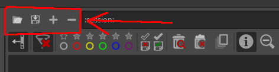
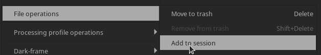

<!--  ->

## Session Mode

Since version 1.18, the ART file browser supports the concept of *session*,
i.e. a user-defined temporary collection of files not necessarily on the same
folder in the file system. 
Sessions are meant to ease the integration with external DAM tools such as [Digikam](http://digikam.org).

### The ART Session

The places browser now includes a new predefined place, called *Session*:

Selecting it will activate the session mode of the file browser. 
Initially, the session will be empty. 
Files can be added and removed by using the buttons that appear to the left of the address bar:

Specifically:

- New files can be added to the session with the add button (); the same can be done also by selecting the "File operations -> Add to session" entry of the right-click menu of the file browser:
  
  

- The selected files can be removed from the session with the remove button ();

- The current session can be saved to a file with the save button ();

- Finally, a previously-saved session can be loaded with the load button (). The file format for loading/saving a session is a plain text file, with one file name per line, encoded in utf-8.

### Interaction from the command line

The session of the current running instance of ART can be manipulated also from the command line. Here are the relevant options:

    -S <file> Start with session from file. If no file is given, 
              start with the last session
    -Sc Clear the session
    -Sa <file1> [... <fileN>] Add the files to the session
    -Sr <file1> [... <fileN>] Remove the files from the session

This allows a simple integration with external DAM/image browser tools. 
As an example, here is a plugin to add files to the ART session from [Geeqie](http://www.geeqie.org):

     [Desktop Entry]
     Version=1.0
     Type=Application
     Name=ART session/Add
     Exec=ART -Sa %F
     Categories=X-Geeqie;
     OnlyShowIn=X-Geeqie;
