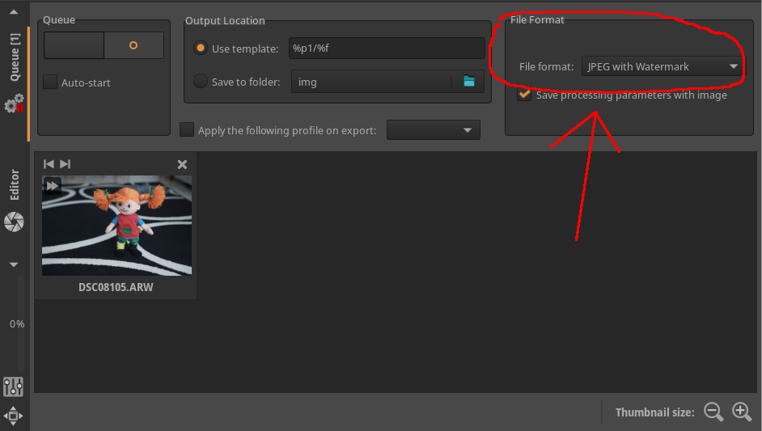

# Adding watermarks on export

Although ART has no built-in module to add watermarks to picture, 
a simple way of doing this is to exploit the capability of [adding custom image formats](Customformats). 
Specifically, using custom formats, 
we can instruct ART to automatically call a script to add watermarks 
when a given output format is selected.

From the user interface point of view, we will define an additional output format that will be available from the batch queue and the file save dialog:



## Defining the watermark picture

In this simple example, we will use a fixed watermark image. More elaborate solutions are possible, e.g. to support watermarks that depends on the image metadata, but they are beyond the scope of this tutorial.

We can create a png image with our watermark text and a transparent background using your favourite image editor, e.g. GIMP:


We create a watermark that is big enough to be applied to full-size pictures. In this example, we assume that the above watermark is suitable for 24Mpix pictures, i.e. about 6000 pixels wide.
The watermark will then be automatically resized by our injection script defined below, based on the output image size.

## The watermark injection script

The bulk of the work is performed by the following `watermark.py` Python script, using [Pillow](https://pillow.readthedocs.io/en/stable/) to perform the image operations and [PyExiv2](https://pypi.org/project/pyexiv2/) to handle metadata and ICC profiles.

The script takes the following arguments:

  - `image`: the input image
  - `output`: the output image
  - `-w`/`--watermark` `filename`: the watermark to add
  - `-s`/`--size` `sz`: the size for which the watermark image was defined. In our example above, this will be 6000, because when we created the watermark we did it for a 6000px wide image. This paramter will be used to automatically resize the watermark in case the input image is smaller
  - `-p`/`--pos` `p`: the position of the watermark relative to the image. Possible values are `nw` (north-west), `n` (north), `ne` (north-east), `e` (east), `se` (south-east), `s` (south), `sw` (south-west) and `w` (west).

```python
#!/usr/bin/env python3

from PIL import Image
import pyexiv2
import argparse


def getopts():
    p = argparse.ArgumentParser()
    p.add_argument('image')
    p.add_argument('-w', '--watermark', required=True)
    p.add_argument('output')
    p.add_argument('-p', '--pos',
                   choices=['nw', 'n', 'ne', 'e', 'se', 's', 'sw', 'w'],
                   default='se')
    p.add_argument('-s', '--size', type=int)
    return p.parse_args()


def main():
    opts = getopts()
    src = Image.open(opts.image)
    wm = Image.open(opts.watermark)
    if opts.size:
        dim = max(src.width, src.height)
        scale = float(opts.size) / dim
        wm = wm.resize((int(round(wm.width / scale)),
                        int(round(wm.height / scale))), Image.Resampling.LANCZOS)
    img = src.convert('RGBA')
    x1 = img.width - wm.width
    x2 = int(round(x1 / 2))
    y1 = img.height - wm.height
    y2 = int(round(y1 / 2))
    offset = {
        'nw' : (0, 0),
        'n' : (x2, 0),
        'ne' : (x1, 0),
        'e' : (x1, y2),
        'se' : (x1, y1),
        's' : (x2, y1),
        'sw' : (0, y1),
        'w' : (0, y2),
        }[opts.pos]
    img.alpha_composite(wm, offset)
    img = img.convert('RGB')
    img.save(opts.output, 'JPEG', quality=95)

    md1 = pyexiv2.Image(opts.image)
    with pyexiv2.Image(opts.output) as md2:
        md2.modify_icc(md1.read_icc())
        md2.modify_exif(md1.read_exif())
        md2.modify_iptc(md1.read_iptc())
        md2.modify_xmp(md1.read_xmp())


if __name__ == '__main__':
    main()
```


## Connection to ART

Finally, we can make ART call our script automatically by making it available as an additional output format.
We do that by defining the following handler `jpeg-watermark.txt`, putting in in `$HOME/.config/ART/imageio` (creating the directory if it doesn't exist):

```txt
[ART ImageIO]
# this will produce Jpeg files
Extension=jpg

# this is a unique identifier for this save format
SaveFormat=jpgwatermark

# the command to execute. We add the watermark.png picture, and put it in the
# bottom-left corner (sw), informing the script that the original png is meant
# for a 6000px-wide picture. If you want to change the position of the
# watermark, just change the -p option. Note that we do not specify the input
# and output images as they will be added by ART when invoking the command
WriteCommand=python3 watermark.py -w watermark.png -s 6000 -p sw

# the script expects a Tiff on input
Format=tiff

# this is the label visible in the GUI
Label=JPEG with Watermark
```

We also put our Python script (`watermark.py`) and our watermark image (`watermark.png`) above in the same directory (`$HOME/.config/ART/imageio` on Linux), and restart ART.
If everything works correctly, we can now select "JPEG with Watermark" as an additional output format as shown in the screenshot above.
